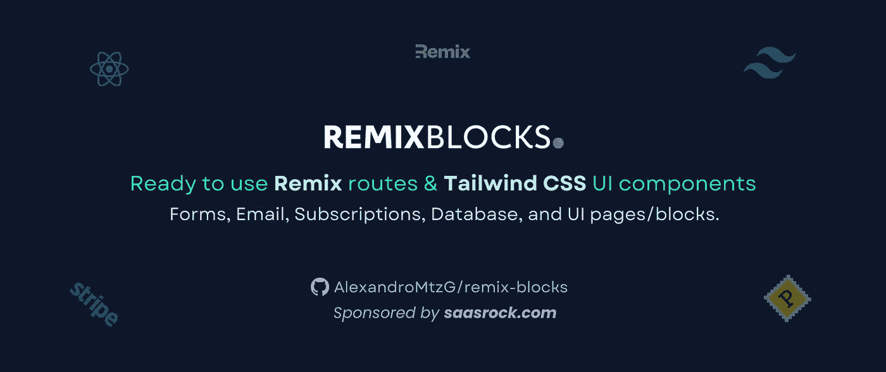
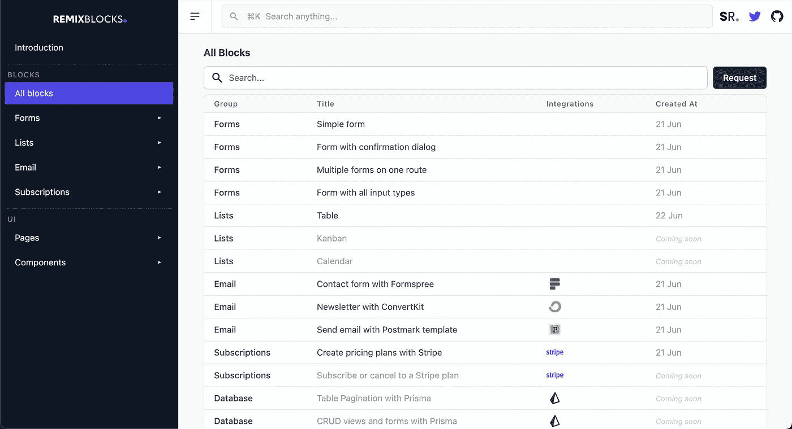

# RemixBlocks:现成的 Remix + Tailwind CSS 路线和 UI 块

> 原文：<https://javascript.plainenglish.io/remixblocks-ready-to-use-remix-tailwind-css-routes-and-ui-blocks-470a6db70915?source=collection_archive---------11----------------------->

[https://remixblocks.com](https://remixblocks.com/)

下载区块:[https://github.com/AlexandroMtzG/remix-blocks](https://github.com/AlexandroMtzG/remix-blocks)

# 什么是[混音](https://github.com/AlexandroMtzG/remix-blocks)？

现成的[混音](https://remix.run/) + [顺风 CSS](https://tailwindcss.com/) 路线，以及 [UI 组件](https://remixblocks.com/components)，所有模块:

*   都是[全栈](https://alexandro.dev/7-things-i-ve-learned-using-remix-for-1-month)路线。
*   是相互独立的。
*   有代码供你复制粘贴。
*   可以有一个[加载器](https://remix.run/docs/en/v1/guides/data-loading)、[动作](https://remix.run/docs/en/v1/guides/data-writes)、[元函数](https://remix.run/docs/en/v1/api/conventions#meta)，以及一个使用[类型脚本](https://www.typescriptlang.org/) + [Tailwind CSS](https://tailwindcss.com/) 的 React 组件。

# 第一组块

截至 6 月 23 日，您可以复制粘贴或下载已完成的 9 个模块:

# 你想建造你自己的 SaaS 吗？

查看 [SaasRock](http://saasrock.com/) ，一个用于构建 SaaS 应用的多租户框架，所有这些模块都来自 SaasRock。

# 支持

如果你喜欢这个项目，[明星它](https://github.com/AlexandroMtzG/remix-blocks) ⭐，[支持我](https://github.com/sponsors/AlexandroMtzG)😊或者订阅 [SaasRock](https://alexandromg.gumroad.com/l/SaasRock) 了解更多🚀。

# 新街区？

订阅 Twitter 上的[时事通讯](https://saasrock.com/newsletter)或[关注我](https://twitter.com/AlexandroMtzG)，以便在添加新区块时获得通知。

*更多内容请看*[***plain English . io***](https://plainenglish.io/)*。报名参加我们的* [***免费周报***](http://newsletter.plainenglish.io/) *。关注我们关于*[***Twitter***](https://twitter.com/inPlainEngHQ)*和*[***LinkedIn***](https://www.linkedin.com/company/inplainenglish/)*。查看我们的* [***社区不和谐***](https://discord.gg/GtDtUAvyhW) *加入我们的* [***人才集体***](https://inplainenglish.pallet.com/talent/welcome) *。*