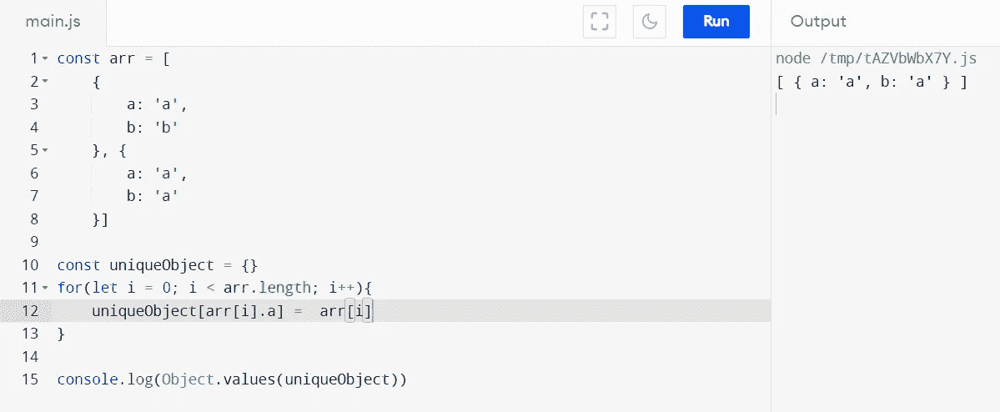

# 如何在 JavaScript 中删除数组中的重复项

> 原文：<https://javascript.plainenglish.io/remove-duplicates-from-array-in-javascript-fca6a10cd0ea?source=collection_archive---------5----------------------->

## 使用 set、filter 和 objects 从数组中删除重复项。


Photo by [Greg Rakozy](https://unsplash.com/@grakozy?utm_source=medium&utm_medium=referral) on [Unsplash](https://unsplash.com?utm_source=medium&utm_medium=referral)

**今天的话题对读者来说非常基础和方便。我们将学习如何从数组中删除重复的值。**

# 使用`Set`从数组中删除重复项

从数组中移除项目的一种流行方法是使用 Set。Set 是 JavaScript 中保存值的现有对象。集合的一般定义是保持类型的唯一值，而不管原始或非原始数据类型。

```
let anyRandomArray = ['A', 'B', 'A', 'C', 'B']; 
let uniqueChars = [...new Set(anyRandomArray)];console.log(uniqueChars);
```

输出如下所示:

```
['A', 'B', 'C']
```

# 使用`indexOf()`和`filter()`方法从数组中删除重复项

下一种方法是使用 indexOf()和 filter()方法来获得想要的输出。首先，我们将检查索引，如果索引与 indexOf()不匹配，那么我们将忽略该结果。

对于同一个程序，以下内容可用于输出:

```
let anyRandomArray = ['A', 'B', 'A', 'C', 'B'];let uniqueChars = chars.filter(
    (c, index) => {     
       return chars.indexOf(c) === index; }
     );
```

# 缺点

但是这些方法在用于对象时有一个限制，对于内部引用它们会失败。举个例子，

```
const arr = [{a: 'A'}, {a: 'B'}]
```

对于这个例子，我们需要使用**来应用一些变通方法。map()** 或者**。**方法过滤()。

新构建的程序应该是这样的:

```
const newArr = 
[...new Set(arr.map(a => JSON.stringify(a)))].map(a => JSON.parse(a))
```

这种方法在外观和工作方面有点讨厌，对吗？

# 使用对象来存储

解决这个问题的另一种方法是使用对象。对象是键值对的，我们也可以使用它们的基本原理来存储我们唯一的数组。



example for object

在本例中，我们将重复的键名称存储到对象条目中，并根据该键映射整个对象，因此覆盖了最后一个条目，并使新数组在该字段上是唯一的。

# 但是什么是最好的解决方案呢？

在分析了这些方法之后，我想到我们可能应该使用一个本地循环来创建一个新的数组，当它是在一个对象数组的印象下，或者甚至是在嵌套的层次上，但是我们可以使用任何方法，或者根据程序的需要创建我们自己的方法

我们就此结束，我希望你喜欢这篇文章。

感谢和问候。

*更多内容请看*[***plain English . io***](https://plainenglish.io/)*。报名参加我们的* [***免费周报***](http://newsletter.plainenglish.io/) *。关注我们关于*[***Twitter***](https://twitter.com/inPlainEngHQ)*和*[***LinkedIn***](https://www.linkedin.com/company/inplainenglish/)*。查看我们的* [***社区不和谐***](https://discord.gg/GtDtUAvyhW) *加入我们的* [***人才集体***](https://inplainenglish.pallet.com/talent/welcome) *。*