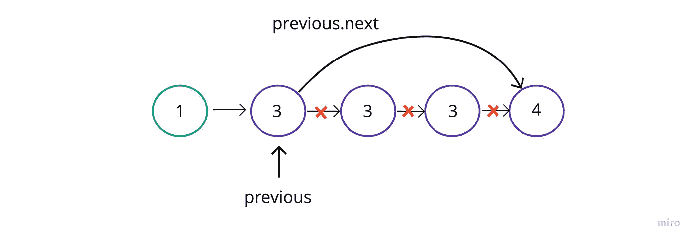
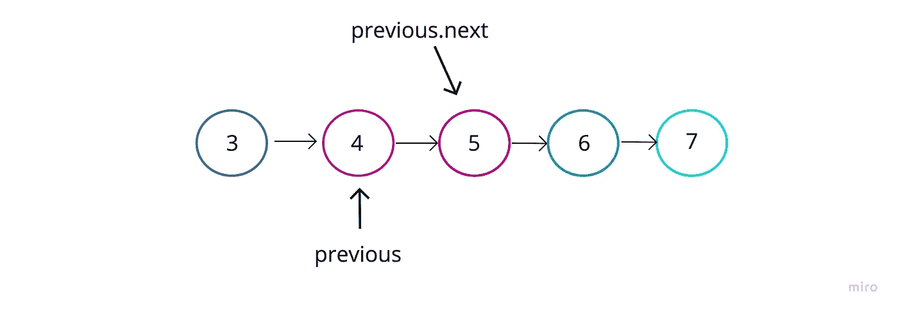

# 从链接列表中删除重复项

> 原文：<https://javascript.plainenglish.io/remove-duplicates-from-linked-list-89058d2db216?source=collection_archive---------11----------------------->

## 用 JavaScript 从链表中删除重复项的教程。

*   AlgoExpert — JavaScript

好吧，今天帖子的目的是快速覆盖一个简单的链表问题。对我来说，链表可能具有欺骗性，因为它们的简单性经常让我相信“是的，我明白了。”我不需要再研究它们了。

但是后来，当我重新进入它们的时候，有时我仍然会对如何在抽象空间中准确地处理它们而不失去我在列表中的位置或者以某种我不打算的方式改变它感到措手不及。

让我们跳进来吧！

正如标题所提到的，我们将创建一个函数，可以从链表中删除重复项，然后返回相同的(修改过的)链表。

**深思熟虑**

因此，在较高的伪代码级别，我想这样处理:

1.  开始迭代列表，同时跟踪我的当前和以前的节点。
2.  如果当前节点值等于上一个节点值，那么我将使我的 previous.next 值指向行中的下一个节点(有效地将当前节点从列表中移除，但仍然保持链接)。
3.  然而，如果这两个值不相等，我会将“上一个”更改为当前节点，并在列表中向前移动。
4.  到达终点后—返回列表

**编码出来**

正如我们通常看到的，这将是列表类:

现在的方法是:

我想递归地做这个，只是为了把它弄混一点。通常，我会看到链表遍历的循环，但是谁不能使用这个练习呢？

我认为这是一个相当简单的方法，不需要太多的解释。

让我惊讶的是如何处理一行中多个重复的节点值。这就是为什么除非没有匹配，否则“先前”永远不会前进。这样，如果我遇到三个匹配的节点值，“上一个”会跟在第一个后面，我们只需移动它的“下一个”指针，直到我们可以删除整个重复部分。

在这一点上，我移动到当前位置…

就这样！

酷的东西！

*更多内容请看*[***plain English . io***](https://plainenglish.io/)*。报名参加我们的* [***免费周报***](http://newsletter.plainenglish.io/) *。关注我们关于*[***Twitter***](https://twitter.com/inPlainEngHQ)[***LinkedIn***](https://www.linkedin.com/company/inplainenglish/)*[***YouTube***](https://www.youtube.com/channel/UCtipWUghju290NWcn8jhyAw)*[***不和***](https://discord.gg/GtDtUAvyhW) *。***