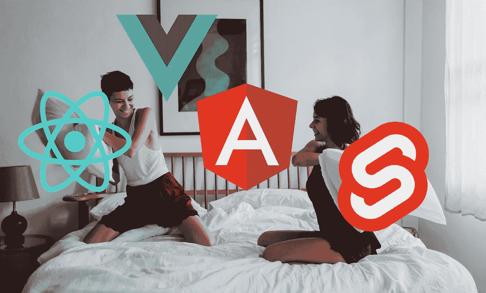
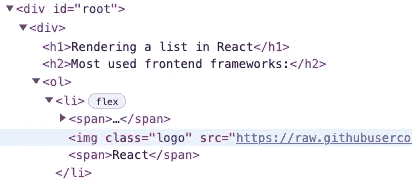

# 如何在 React，Angular，Vue 和 Svelte 中呈现列表

> 原文：<https://javascript.plainenglish.io/rendering-a-list-in-react-angular-vue-and-svelte-a2ea987f0c21?source=collection_archive---------5----------------------->

## 哪种方法是最好的？



Photo by [Ketut Subiyanto](https://www.pexels.com/de-de/@ketut-subiyanto?utm_content=attributionCopyText&utm_medium=referral&utm_source=pexels) on [Pexels](https://www.pexels.com/de-de/foto/liebe-menschen-frau-frauen-4760126/?utm_content=attributionCopyText&utm_medium=referral&utm_source=pexels)

在本文中，我们将比较[四个最常用的前端框架](https://2021.stateofjs.com/en-US/libraries/front-end-frameworks) ( **React、Angular、Vue.js 和 Svelte** )来分析它们呈现列表的方法。我将为每个框架提供一个带有运动场的代码示例，以指出相似性和特殊性。最后，我会在每个解决方案中加入我个人的看法。你最喜欢的方法是什么？请随意发表评论😊

***免责声明:*** *我知道 React 是一个库而不是一个框架，但出于本文的目的，我将它称为框架。*

# 介绍

你可能听人说过，如果你非常了解一种编程语言，那么学习其他语言是很简单的。许多编程结构在许多语言中都以相同的方式使用(循环、条件、数组、函数、类)，所以您只需要记住语法，就有了一个良好的开端。如果你是一个前端 web 开发人员，你可能已经意识到这同样适用于前端框架。主要概念总是相同的。总是有解决方案来**呈现元素列表**，有条件地呈现元素，传递属性，处理状态，对生命周期事件做出反应，以及更多的概念。

在我们的例子中，我们将保持我们的列表非常简单。我们迭代包含一个`name`和一个`logo`属性的对象数组。我们在有序列表中显示数据，并显示条目的当前索引。这就是我们的产品系列的样子:

[](https://medium.com/@mariusbongarts11/will-web-components-replace-frontend-frameworks-535891d779ba) [## Web 组件会取代前端框架吗？

### 它们是为解决不同的问题而构建的。

medium.com](https://medium.com/@mariusbongarts11/will-web-components-replace-frontend-frameworks-535891d779ba) 

# 反应

假设您熟悉 Javascript，React 呈现列表的方法非常简单。React 使您能够使用`map()`函数轻松地遍历数组。下面，我们遍历`items`数组并为每一项返回一个`<li>`元素。访问当前索引也很容易，因为我们可以利用`map()`函数的第二个参数。在元素中，我们可以将`item`的属性放在花括号`{` `}`中。此外，我们还添加了一个独特的`key`属性，以确保在我们想要让列表动态地删除或添加元素时有良好的性能。我们将更详细地了解这个属性。

List rendering in React

你可以在[的 Stackblitz](https://stackblitz.com/edit/react-ts-kynyaw?file=App.tsx) 上玩这个例子:

List rendering in React demo

## 特殊性

让我们看看 React 与其他框架的不同之处，以及在 React 中使用列表时需要考虑的问题。

**关键属性**

在 React 中，如果列表可以动态改变，您应该向每个条目传递一个`key`属性。数组中的键在其同级中必须是唯一的；否则，React 将抛出一个错误。然而，它们不需要是全球唯一的。我们将看到在所有框架中提供唯一键的概念，现在我将更详细地解释这个概念。它的主要思想也适用于所有其他框架。

> 该键只需在其同级中是唯一的，而不是全局唯一的。- [reactjs .或](https://reactjs.org/docs/reconciliation.html#recursing-on-children) g

请注意， ***key*** 属性仅作为反应的提示，但它们不会传递给组件。对于我们的例子，这意味着传递的键在 DOM 中不可见。如果您的组件中需要相同的值，请将其作为具有不同名称的 prop 显式传递。



DOM of the React list

**我们如何给每个元素分配一个唯一的键？**您显示的元素可能已经有了一个惟一的 ID，所以密钥可能只是来自您的数据。您也可以将当前索引作为一个`key`属性传递，但是 React 建议**而不是**这样做，如果条目的顺序可能改变的话。这可能会对性能产生负面影响，因为 React 需要弄清楚如何更新 UI 以有效地匹配最近的树。

> 最后，您可以将数组中某项的索引作为键传递。如果商品从来没有重新订购过，这种方法可以很好地工作，但是重新订购会很慢。—[reactjs.org](https://reactjs.org/docs/reconciliation.html#recursing-on-children)

我定期将元素的当前索引与其值相结合。这可以确保没有重复的键，并防止我影响 React 的性能。

## 个人观点

我喜欢 React 处理列表呈现的方式。使用基本的 Javascript 感觉很自然，因为你不需要理解新的语法。由于我使用了大量的 Javascript/Typescript、 [Web 组件](https://medium.com/@mariusbongarts11/will-web-components-replace-frontend-frameworks-535891d779ba)和 [Lit 库](/build-your-own-blog-portfolio-with-web-components-lit-library-2701dffc735f)，当我第一次使用 React 时，我觉得我不需要学习任何新的东西。

[](https://medium.com/@mariusbongarts11/share-code-between-react-client-and-express-server-5dc0977faa76) [## 在 React 客户端和 Express 服务器之间共享代码

### 用 yarn 工作空间建立一个 mono 存储库

medium.com](https://medium.com/@mariusbongarts11/share-code-between-react-client-and-express-server-5dc0977faa76) 

# 有角的

在 Angular 中，我们使用`*ngFor`指令来呈现列表。我们使用关键字`let`定义了一个名为`item`的循环变量。然后我们可以使用插值`{{` `}}`来访问模板中的对象属性。此外，我们使用一个**局部变量**来访问当前索引并提供一个`trackBy`函数，它是 React 中`key`属性的等价解决方案。我们的模板看起来是这样的:

你可以在 [Stackblitz](https://stackblitz.com/edit/angular-ivy-e9cqne?file=src/app/app.component.html) 的例子上玩一玩:

Angular playground

## 特殊性

让我们看看 Angular 与其他框架的不同之处，以及在 Angular 中使用列表时需要考虑的问题。

**跟踪功能**

`trackBy`函数的作用与 React 的`key`属性相同。它允许我们定义一个函数，为每个 iterable 元素返回一个惟一的标识符。

> 如果没有提供自定义`[TrackByFunction](https://angular.io/api/core/TrackByFunction)`，`[NgForOf](https://angular.io/api/common/NgForOf)`将使用项目的[对象标识](https://developer.mozilla.org/en-US/docs/Web/JavaScript/Reference/Global_Objects/Object/is)作为关键字。——[https://angular.io/api/common/NgForOf](https://angular.io/api/common/NgForOf)

如果我们没有传递一个自定义的 track by 函数，并且我们的列表数据发生了变化，Angular 就不能识别出发生变化的特定对象。这将导致整个列表的重新呈现，因为每个引用都被修改了。因此，每一个物体看起来都是新的。

`trackBy`函数将*索引*和*当前元素*作为参数，并返回该元素的唯一标识符。下面是我们的自定义函数在示例中的样子:

TrackBy function Angular

**局部变量**

Angular`s `*ngFor`指令导出一些可以作为局部变量别名的值。例如:

`*ngFor="let item of items; index as i, first as isFirst"`

然后可以在模板中使用变量`isFirst`,当 iterable 中的第一个项目时，该变量解析为 true。

以下导出值可以作为局部变量的别名:

*   `$implicit: T`:iterable(`[ngForOf](https://angular.io/api/common/NgForOf)`)中单个项目的值。
*   `[ngForOf](https://angular.io/api/common/NgForOf): [NgIterable](https://angular.io/api/core/NgIterable)<T>`:可迭代表达式的值。
*   `index: number`:iterable 中当前项的索引。
*   `count: number`:可迭代的长度。
*   `first: boolean`:当项目是 iterable 中的第一个项目时为 True。
*   `last: boolean`:当项目是 iterable 中的最后一个项目时为 True。
*   `even: boolean`:当 iterable 中项的索引为偶数时为真。
*   `odd: boolean`:当 iterable 中项的索引为奇数时为真。

**管道**

角度管道是[模板表达式](https://angular.io/guide/glossary#template-expression)中的简单函数，用于接受输入值并返回转换值。我们可以使用[管道](https://angular.io/guide/glossary#pipe)来转换字符串、货币金额、日期，例如，过滤一组项目。有很多内置管道。例如，其中最重要的一个是`AsyncPipe`，它使我们能够在模板中直接使用承诺和可观察值。

在我们的例子中，我们没有使用角形管道，但是它们是转换数组的好方法。让我们创建一个管道来过滤以字母*S*开头的所有项目:

并在我们的模板中使用它:

这将导致只显示苗条的条目。

## 个人观点

我不喜欢你需要学习新的框架语法。尽管我使用 Angular 已经很多年了，但有些时候还没有，我使用`ngFor`语法的第一直觉是错误的，因为我忘了把`*`放在它前面。

除此之外，Angular 的解决方案干净优雅。包含特殊**局部变量**的可能性是有用的。但是，它们中的许多都有点不必要，因为您只需使用`index`就可以轻松复制其中的大部分:

*   `first`与`index === 0`相同
*   `even`与`index % 2 === 0`相同

另外，我看不出提供`trackBy`功能有什么好处。传递一个`key`属性，就像我们在 React、Vue 和 Svelte 中做的那样，似乎容易得多。此外，我看不到通过析构对象来直接访问其属性的可能性。这是我通常喜欢做的事情。

可能听起来我不是 Angular 的粉丝，但我是。Angular 非常强大，尤其是在大型企业应用方面。使用 Rxjs 遵循反应式编程方法使得框架非常稳定。尽管如此，学习 Rxjs 对许多开发人员来说可能是一个障碍，因为学习曲线无疑是陡峭的。

[](https://medium.com/@mariusbongarts11/share-code-between-angular-client-and-express-server-110750d32e30) [## 在 Angular 客户端和 Express 服务器之间共享代码

### 使用 Yarn 3 工作空间设置 Monorepo

medium.com](https://medium.com/@mariusbongarts11/share-code-between-angular-client-and-express-server-110750d32e30) 

# 某视频剪辑软件

Vue 处理列表呈现的方式看起来很像 Angular 在做这件事。在 Vue 中，我们可以使用`v-for`指令来呈现基于数组的项目列表。我们遍历`items`数组，并为每个`item`返回一个`<li>`元素。在`v-for`范围内，模板表达式可以访问所有的父范围属性。此外，`v-for`还支持当前项目索引的可选第二别名，我们可以提供一个`key`属性。

List rendering in Vue

你可以用 [Stackblitz](https://stackblitz.com/edit/vue-gk7a6v?file=src/components/Items.vue) 上的例子进行试验:

Vue playground

## 特殊性

让我们看看 Vue 与其他框架的不同之处，以及在 Vue 中使用列表时需要考虑的问题。

`**v-for**` **用一个物体**

在 Vue 中，您还可以使用`v-for`来遍历对象的属性。我还没有在其他框架中看到过。但是，当然，在任何其他框架中使用 JavaScript 也可以达到同样的效果。它看起来是这样的:

`**v-for**` **带量程**

另一个具体的特性是你可以迭代一个整数。在这种情况下，它将根据`1...n`的范围多次重复模板。

```
<span v-for="n in 10">{{ n }}</span>
```

**关键属性**

除了 React，Vue 还提供了一个关键属性，这样它就可以跟踪每个节点的身份

> [建议](https://vuejs.org/style-guide/rules-essential.html#use-keyed-v-for)尽可能提供一个带有`v-for`的`key`属性—[vuejs.org](https://vuejs.org/guide/essentials/list.html#maintaining-state-with-key)

## 个人观点

我对这个的看法和我对 Angular 的看法很像。我总是喜欢使用简单的 Javascript `map()`函数来遍历我的列表。但是，与 Angular 相比，Vue 的解决方案在我看来更简单明了，也没那么复杂。

[](https://medium.com/@mariusbongarts11/showcase-your-medium-articles-with-web-components-part-1-basics-d2c6618e9482) [## 用 Web 组件构建自己的博客组合:基础

### 第 1 部分—定制元素、阴影 DOM 和 HTML 模板

medium.com](https://medium.com/@mariusbongarts11/showcase-your-medium-articles-with-web-components-part-1-basics-d2c6618e9482) 

# 苗条的

使用 Svelte，我们可以使用 each-block 来迭代我们的`items`数组。我们可以通过指定第二个参数来获取索引。为了唯一地标识每个列表项，我们在方括号`(` `)`中提供了一个关键表达式。

Svelte list rendering syntax

你可以在 [Stackblitz](https://stackblitz.com/edit/node-9derzq) 的例子上玩一玩:

Svelte playground

## 特殊性

让我们看看 Svelte 与其他框架的不同之处，以及在 Svelte 中使用列表时需要考虑的问题。

`**{:else}**` **条款**

在 Svelte 中一个方便的事情是，你还可以有一个`{:else}`子句，如果列表为空，就会呈现这个子句:

**关键属性**

像所有其他框架一样，Svelte 提供了唯一标识每个列表项的方法。为此，我们可以为`each`块指定一个惟一的标识符(或“键”)。这样，我们就告诉了 Svelte 如何在组件更新时确定要更改哪个 DOM 节点。

> 键可以是任何对象，但是建议使用字符串和数字，因为当对象本身发生变化时，它们允许身份保持不变。—【https://svelte.dev/docs#template-syntax-each 

## 个人观点

我需要习惯 Svelte 的语法。我喜欢在模板中添加一个`:else`块的可能性，因为这是你需要经常做的事情。我还喜欢你可以在`#each`块中自由使用析构和 rest 模式。

# 最后的想法

所有四个最常用的前端框架在呈现列表上都非常相似。它们有很多相似之处，比如可以为每个条目提供唯一的键来有效地更新 DOM。

你不能说一个框架有完美的解决方案。归根结底，这是一个品味问题。最重要的是，如果您知道如何在一个框架中呈现列表，您可以将您的知识应用到任何其他框架中。当掌握任何其他概念时，学习新的前端框架将很快到来。

我希望你喜欢阅读这篇文章。我总是很乐意回答问题，也乐于接受批评。请随时联系我😊

[**这里是无限制访问媒体上每一个内容的链接**](https://medium.com/@mariusbongarts/membership) **。如果你通过这个链接注册，我将免费为你赚一小笔钱。**

[](https://medium.com/@mariusbongarts/membership) [## 通过我的推荐链接加入 Medium-Marius bong arts

### 作为一个媒体会员，你的会员费的一部分会给你阅读的作家，你可以完全接触到每一个故事…

medium.com](https://medium.com/@mariusbongarts/membership) 

关注我，不要错过我的下一篇文章。我写了关于 Typescript、Web 组件、前端框架、软件设计模式、Chrome 扩展以及更多的主题！🙏

# 关于作者

Marius Bongarts 是埃森哲互动公司的软件工程分析师。他还创建了 [Web Highlights Chrome 扩展](https://chrome.google.com/webstore/detail/web-highlights-%20-bookmark/hldjnlbobkdkghfidgoecgmklcemanhm)，允许成千上万的用户在每个网站上创建文本亮点和书签。通过提供标签和目录，您可以在[web-highlights.com](https://web-highlights.com/home)上的相应 web 应用程序中轻松重新找到您的 web 研究。看看吧！

通过**[**LinkedIn**](https://www.linkedin.com/in/marius-bongarts-6b3638171/)**联系我或者在 [**Twitter**](https://twitter.com/MariusBongarts) 上关注我。****

****[](https://medium.com/@mariusbongarts11/will-web-components-replace-frontend-frameworks-535891d779ba) [## Web 组件会取代前端框架吗？

### 它们是为解决不同的问题而构建的。

medium.com](https://medium.com/@mariusbongarts11/will-web-components-replace-frontend-frameworks-535891d779ba) [](https://medium.com/@mariusbongarts11/when-you-should-duplicate-code-b0d747bc1c67) [## 何时应该复制代码

### 复制比错误的抽象要便宜得多

medium.com](https://medium.com/@mariusbongarts11/when-you-should-duplicate-code-b0d747bc1c67) 

*更多内容请看*[***plain English . io***](https://plainenglish.io/)*。报名参加我们的* [***免费周报***](http://newsletter.plainenglish.io/) *。关注我们关于*[***Twitter***](https://twitter.com/inPlainEngHQ)*和*[***LinkedIn***](https://www.linkedin.com/company/inplainenglish/)*。加入我们的* [***社区不和谐***](https://discord.gg/GtDtUAvyhW) *。*****