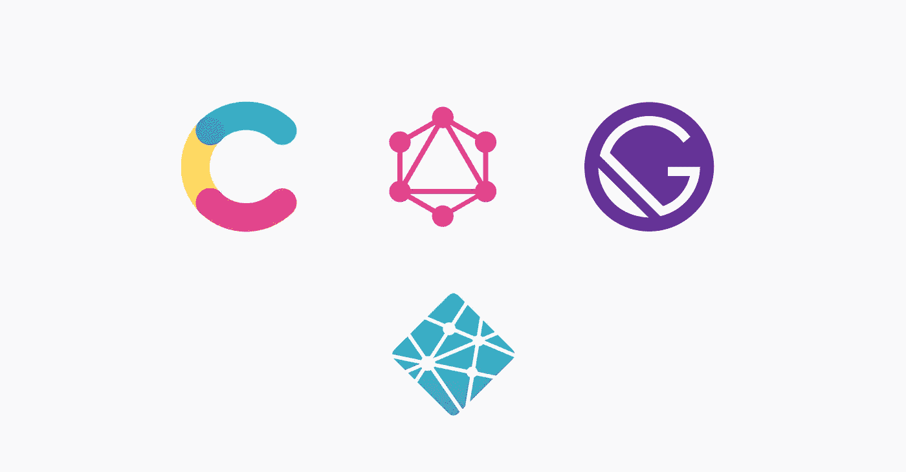

# 在《盖茨比》中呈现内容丰富的文本组件

> 原文：<https://javascript.plainenglish.io/rendering-contentful-rich-text-components-in-gatsby-4744d4940cea?source=collection_archive---------10----------------------->

## 修复了更新 Gatsby 和依赖项后的渲染



嘿，盖茨比迷！

我将跳过细枝末节，直奔主题。

几天前，我更新了盖茨比网站上的依赖项，大约一年没碰过它了。你知道这意味着什么，对吧？

可怕，可怕的混乱。所有东西都坏了，但是大多数错误在实际阅读错误文本后相对容易修复。

现在，最让我头疼的是在富文本组件中呈现图像，用 GraphQL 从 Contentful 查询。

我的旧代码看起来像这样:

```
export const pageQuery = graphql`
  query ContentfulBlogPost($slug: String!) {
    contentfulPost(slug: { eq: $slug }) {
      id
      title
      subtitle
      slug
      date(formatString: "Do MMMM, YYYY")
      excerpt
      content {
        json
      }
      description {
        description
        childMarkdownRemark {
          timeToRead
          html
          rawMarkdownBody
        }
      }
    }
    site {
      siteMetadata {
        title
        siteUrl
      }
    }
  }
`;
```

使用数据的 Gatsby 组件看起来是这样的——为了更容易理解，我删除了不相关的代码:

```
class BlogPostTemplate extends React.Component {
  render() {
    const post = this.props.data.contentfulPost;
    const siteTitle = this.props.data.site.siteMetadata.title;
    const blogContent = this.props.data.contentfulPost.content
      .json;
    const title = post.title;
    const image = post.featuredImage.fluid.src;
    const location = this.props.location;const Bold = ({ children }) => <b>{children}</b>;
    const Italic = ({ children }) => <i>{children}</i>;const options = {
      renderMark: {
        [MARKS.BOLD]: (text) => <Bold>{text}</Bold>,
        [MARKS.ITALIC]: (text) => <Italic>{text}</Italic>,
      },
      renderNode: {
        [BLOCKS.PARAGRAPH]: (node, children) => {
          return <TextMedium textMedium={children} />;
        },
        [BLOCKS.HEADING_2]: (node, children) => {
          return <Subtitle subtitle={children} />;
        },
        [BLOCKS.HEADING_3]: (node, children) => {
          return <Heading heading={children} />;
        },
        [BLOCKS.EMBEDDED_ASSET]: (node) => {
          const alt = node.data.target.fields.title["en-US"];
          const url = node.data.target.fields.file["en-US"].url;
          return ;
        },
        [INLINES.HYPERLINK]: (node, children) => {
          return (
            <a className="link" href={node.data.uri}>
              {node.content[0].value}
            </a>
          );
        },
      },
      blockquote: (node) => {
        return (
          <blockquote className="offer">
            {node.content}
          </blockquote>
        );
      },
      hyperlink: (node) => {
        const altText = node.content[0].value;
        const url = node.data.uri;
        return (
          <a className="link" href={url}>
            {altText}
          </a>
        );
      },
    };return (
      <Layout location={location} title={siteTitle}>
        <SEO
          title={title}
          description={post.excerpt}
          pathname={location.pathname}
          featuredImage={image}
        />
        <Row>
          <Breadcrumb>
            <li>
              <a href="/blog/">Blog home</a>
            </li>
            <li>
              <a href={`${post.slug}`}>{title}</a>
            </li>
          </Breadcrumb>
        </Row>
        <Section isCentered isNarrow>
          <Row isCentered wrap>
            <Title title={title} isCentered />
            <SubHeading subheading={post.subtitle} isCentered />
          </Row>
          <Row isCentered>
            <Column100>
              <BlogBody>
                {documentToReactComponents(blogContent, options)}
              </BlogBody>
              <ReturnLink
                isCentered
                anchortext="Return to all articles"
                href="/blog/"
              />
            </Column100>
          </Row>
          <Subscribe />
        </Section>
      </Layout>
    );
  }
}export default BlogPostTemplate;
```

使用 Contentful 富文本组件的 Gatsby 组件是<blogbody>，代码如下:</blogbody>

```
<BlogBody>
   {documentToReactComponents(blogContent, options)}
</BlogBody>
```

不再起作用的是:embedded_asset 块。我在这里显示了这两个选项，尽管我查询的是相同的数据。

```
[BLOCKS.EMBEDDED_ASSET]: (node) => {
          const alt = node.data.target.fields.title["en-US"];
          const url = node.data.target.fields.file["en-US"].url;
          return ;
        },OR:"embedded-asset-block": (node) => {
          const alt = node.data.target.fields.title["en-US"];
          const url = node.data.target.fields.file["en-US"].url;
          return ;
        },
```

重构版本—首先，查询的数据:

```
export const pageQuery = graphql`
  query ContentfulBlogPost($slug: String!) {
    contentfulPost(slug: { eq: $slug }) {
      id
      title
      subtitle
      slug
      date(formatString: "Do MMMM, YYYY")
      excerpt
      content {
        raw
        references {
          ... on ContentfulAsset {
            __typename
            contentful_id
            id
            title
            file {
              url
            }
          }
          gatsbyImageData(width: 400)
        }
      }
      description {
        childMarkdownRemark {
          timeToRead
          html
          rawMarkdownBody
        }
      }
    }
    site {
      siteMetadata {
        title
        siteUrl
      }
    }
  }
`;
```

这里的重要变化是,`content { json }`数据被替换为:

```
content {
        raw
        references {
          ... on ContentfulAsset {
            __typename
            contentful_id
            id
            title
            file {
              url
            }
          }
          gatsbyImageData(width: 400)
        }
      }
```

新的 Gatsby 组件看起来像这样——`embedded_asset`块:

```
[BLOCKS.EMBEDDED_ASSET]: node => {
          const url = node.data.target.file.url
          const alt = node.data.target.title
          return 
        },
```

而`<BlogBody>`的分量:

```
<BlogBody>
   {blogContent?.raw && renderRichText(blogContent, options)}
</BlogBody>
```

就是这样，现在可以用了:)

我忘了保存实际的错误文本，所以如果你得到了那个难看的错误，并且在谷歌搜索了几个小时、几天、几周之后找到了这篇文章，请在下面的评论中添加错误文本。

*更多内容看* [***说白了就是***](https://plainenglish.io/) *。报名参加我们的* [***免费周报***](http://newsletter.plainenglish.io/) *。关注我们关于*[***Twitter***](https://twitter.com/inPlainEngHQ)*和*[***LinkedIn***](https://www.linkedin.com/company/inplainenglish/)*。查看我们的* [***社区不和谐***](https://discord.gg/GtDtUAvyhW) *加入我们的* [***人才集体***](https://inplainenglish.pallet.com/talent/welcome) *。*