# 用 JavaScript 语言渲染房间

> 原文：<https://javascript.plainenglish.io/rendering-roguelike-rooms-with-javascript-8a2dc58f3b63?source=collection_archive---------11----------------------->

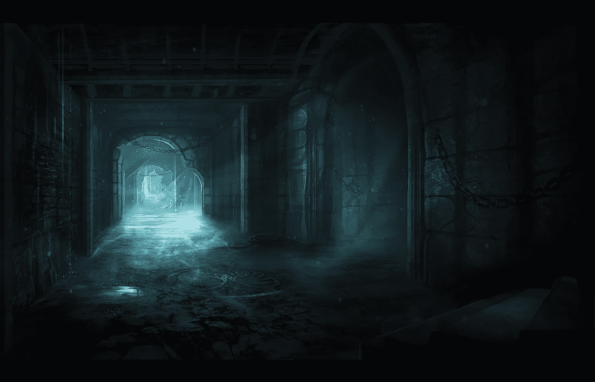

Image by [niltrace on DeviantArt](https://niltrace.deviantart.com)

自从 1980 年 [Rogue](https://en.wikipedia.org/wiki/Rogue_(video_game)) 诞生以来，类似的游戏，包括程序生成的基于瓷砖的关卡以及单生命系统，已经吸引了程序员和游戏玩家的想象力。这些游戏被称为 *Roguelikes* ，每次都呈现一个独特的探索环境，这有助于保持游戏体验的新鲜感。从开发的角度来看，编写一个始终如一地产生引人入胜的游戏环境的算法可能是一个挑战。

我最近用 JavaScript 构建了一个简单的 [Roguelike](https://codepen.io/nevkatz/pen/QWOmaGm) ，实现了随机漫步算法，这使得关卡看起来更像洞穴而不是地牢。

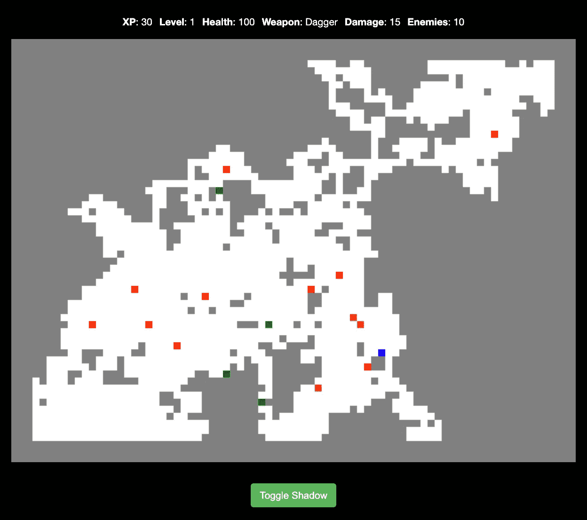

在完成洞穴游戏的教程后，我试着做了一个有房间和走廊的版本。

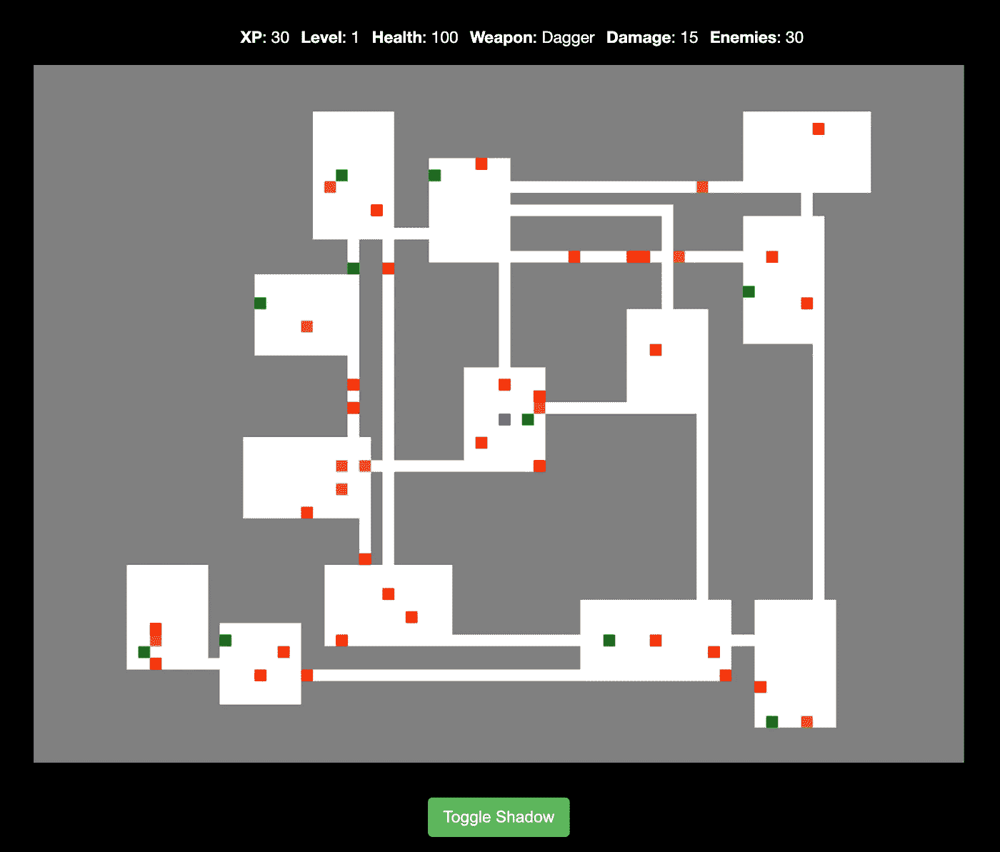

The same Roguelike with a rooms algorithm.

在这两个游戏中，穿蓝色衣服的玩家是由光标键控制的。你与红色的敌人战斗，收集绿色和橙色的健康药水和武器。如果你打败了所有的敌人，你就赢了；如果你耗尽了健康，游戏就结束了。赢了或输了之后，会出现一个新的地牢，游戏可以继续。

本文重点介绍我如何编写生成房间的逻辑，然后标记它们以便调试。它还包括一些建议的后续步骤，以建立完整的游戏。

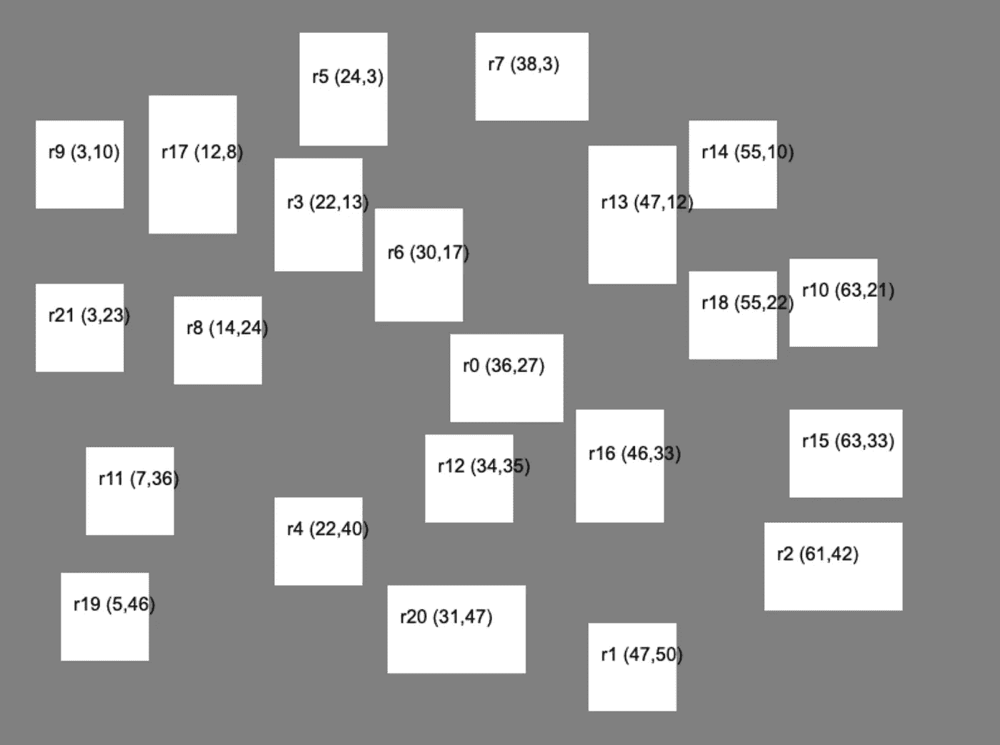

The output of a rooms generation program with debugging turned on.

如果你对构建房间生成逻辑感兴趣，有两个主要的选择:构建上面显示的演示或者开始构建完整的游戏。

## 选项 1:构建房间生成演示

这两个游戏的代码，以及房间生成演示的启动代码可以在 Github repo 的[游戏](https://github.com/nevkatz/js-roguelike-1/tree/main/games)目录中找到。要获得完整的代码库，点击*代码*，然后点击*下载 ZIP。*或者，您可以从命令行克隆它:

```
git clone [https://github.com/nevkatz/js-roguelike-1.git](https://github.com/nevkatz/js-roguelike-1.git)
```

本文的项目目录被命名为`tutorial-rooms`，并有一个`script.js`文件。

## 选项 2:构建完整游戏的第一阶段

如果你想尝试构建完整的游戏，你也可以下载完整的 roguelike 项目，它分为几个阶段，可以通过下面的命令克隆。

```
git clone [https://github.com/nevkatz/js-roguelike-rooms.git](https://github.com/nevkatz/js-roguelike-rooms.git)
```

本文涵盖了第 1 阶段。在下载的 repo 中，有一个结构如下的`phase-1-rooms`目录。

```
phase-1-rooms
  |
  *--index.html
  |
  *--css 
  |   |
  |   *--style.css
  |
  *--js 
      |
      *--script.js
      |
      *--game.js
      |
      *--room.js
      |
      *--path.js
```

除了在`script.js`中工作，你还将在`game.js`中为`Game`类编写代码，并在`room.js`中为`Room`类添加方法。

有了项目结构之后，现在让我们来看一下实现以下目标的方法:

*   房间和游戏课程
*   添加房间
*   检查重叠
*   用房间填充地图阵列
*   在

    <canvas>元素上绘制地图</canvas>

*   给房间贴标签

# 班级

## 房间

首先，我在构建房间时采用了面向对象的方法，并习惯于主类，从一个`Room`类开始。

The room class.

下面是对这些属性的快速解释。

*   `start`、`end`和`center`属性都是存储`x`和`y`坐标的对象。
*   `start`坐标是房间的左上角。
*   `end`坐标是房间的右下角。
*   `center`是房间的中心。这可以作为一种方法来计算，虽然我经常使用它，但把它作为一种属性很方便。
*   `id`是房间的唯一编号。
*   `neighbors`属性是房间直接连接到的`Room`对象的数组。这对于在房间之间建立连接变得非常有用。

## 游戏

我还创建了一个`Game`类，它的一个实例存储了游戏范围内的变量。

The game class.

*   属性存储了一个`room`对象列表，每个对象都有它们的位置、尺寸和`id`。
*   我添加了一个分配给每个新房间的`curRoomId`,并且每当一个新房间被添加到地图上时它就会增加。
*   这里有一个`map` 2D 数组，它将游戏地图的表示存储为 0 和 1
*   `canvas`是在其上绘制地图的 HTML 元素。
*   `context`是用于绘制`<canvas>`元素的 API 方法包。

`game`实例最初被声明为一个全局变量。

```
var game = null;
```

然后使用 Canvas API 在启动函数中初始化它。我们将很快讨论这在哪里发生。

```
game = new Game();
game.canvas = document.getElementById("grid");
game.context = game.canvas.getContext("2d");
```

# 添加房间

添加一个新房间会以三种方式影响`game`对象。

*   `room`对象被添加到游戏的`rooms`数组中。
*   一组`1`被添加到游戏的`map` 2D 数组中，其索引对应于房间的坐标。例如，如果一个 3x2 的房间被添加到一个 5x4 的地图的中心，那么`map`数组将如下所示:

```
[[0,0,0,0,0],
 [0,1,1,1,0],
 [0,1,1,1,0],
 [0,0,0,0,0]]
```

*   房间绘制在 DOM 中游戏对象的`<canvas>`元素上。

为了实现这一点，`addRoom`函数需要额外的助手来完成以下任务:

*   生成新房间的尺寸
*   生成新房间的中心和角坐标
*   创建一个`Room`对象并将其添加到`Game`类的`rooms`数组中
*   测试房间是否与其他房间重叠
*   更改游戏地图和房间列表

## 生成宽度和高度

我启动了一个名为`addRoom`的新功能。

```
function addRoom() {
}
```

这个函数要做的第一件事是生成一些新的房间尺寸，所以我编写了一个名为`genDim()`的助手函数，它返回一个具有`width`和`height`属性的对象。

The genDim function for generating room dimensions.

在`genDim`中是一个常数`BASE_DIM`，它代表最小可能的宽度和高度。

```
const BASE_DIM = 8;
```

我首先使用`BASE_DIM`来设置`width`和`height`彼此相等。

```
let width, height;width = height = BASE_DIM;
```

然后我添加了一个`EXTRA`常量，用来增加房间的宽度或高度。

```
const EXTRA = 5;
```

我将它设置为`5`，并用它来生成一个介于`0`和`4`之间的随机整数。

```
let additional = Math.round(Math.random() * EXTRA);
```

我写了一行代码来确定它是否会改变房间的宽度或高度。

```
let type = (Math.random() < 0.5) ? 'tall' : 'wide';
```

逻辑的下一位用生成的数字增加宽度或高度。

```
if (type == 'tall') {
      height += additional;
} else {
      width += additional;
}
```

然后，该函数将两个维度作为对象返回。

```
return {
    width,
    height
};
```

然后我把`genDim`加到了`addRoom`上。

```
function addRoom() { **let { width, height } = genDim();**}
```

## 2.生成房间中心坐标

`addRoom`函数还需要为房间的中心生成一组有效的坐标。要做到这一点，它需要地图的宽度和高度，我把它们放在文件的顶部。

```
// top of fileconst COLS = 80;
const ROWS = 60;
```

我计划用`COLS`、`ROWS`和`getDim().`的`width`和`height`来确定中心坐标

```
function addRoom() {
  let { width, height} = genDim(); ** let coords = {
      x: genCenterCoord(COLS, width),
      y: genCenterCoord(ROWS, height)
   }**
}
```

对于这一步，我启动了第二个助手函数:`genCenterCoord`，它有两个参数。

```
function genCenterCoord (numCells, dim) {}
```

*   如果生成一个`x`坐标，`numCells`为`COLS`，`dim`为`width.`
*   如果生成一个`y`坐标，`numCells`为`ROWS`，`dim`为`height`。

我首先需要找到房间中心离地图边缘有多近。为此，我初始化了一个新变量`minDist`，它被设置为中心到边缘的最小距离。

为了找到它，我使用了一个新的常量`OUTER_LIMIT`，它指定了一个图块与地图边缘的最近距离。

```
const OUTER_LIMIT = 3
```

然后我用`dim / 2`找到了房间一半的宽度或高度。

于是我在`Math.round(dim / 2)`上加了`OUTER_LIMIT`得到最小距离。

```
function genCenterCoord (numCells, dim) { let minDist = OUTER_LIMIT + Math.round(dim / 2);
}
```

然后我建立了`range`，它描述了我们可以放置瓷砖的区域的宽度或高度。例如，如果我们正在寻找`x`，而`numCells`(地图宽度)是`80`

```
let range = numCells - 2 * minDist;
```

为了获得实际的图块坐标，我将`range`中的一个随机整数加上了`minDist`。例如，如果`minDist`是`10`，范围是`60`，那么坐标将在`10`和`70`之间。

```
return minDist + Math.round(Math.random() * range);
```

下面是完整的`genCenterCoord`功能。

The function for getting one center coordinate.

## 3.生成房间对象

在获得房间尺寸和中心坐标后，我想根据这些值生成实际的房间。

```
function addRoom() { let { width, height } = genDim(); let coords = {
      x: genCenterCoord(COLS, width),
      y: genCenterCoord(ROWS, height)
   } **let room = generateRoom(coords, width, height);
}**
```

我是这样写`generateRoom`函数的:

我首先使用另一个新函数`setRoomCoords`确定房间的`start`和`end`坐标，稍后我将对此进行解释。

```
let { start, end} = setRoomCoords(center, width, height);
```

然后我声明了一个新的`room`对象。

```
let room = new Room(center, start, end);
```

然后，我根据变量`game`的`curRoomId`确定房间的`id`，并返回对象。

```
room.id = game.curRoomId;return room;
```

## 4.设置房间的角坐标

虽然我们有了中心坐标，但这种方法需要房间左上角和右下角的坐标来正确填充`map` 2D 数组。所以我写了下面的`setRoomCoords`帮助器，根据`center`、`width`和`height`找到这些坐标。

Setting the room coordinates.

首先，我获得了一半宽度和一半高度的值。

```
let halfW = Math.round(width / 2);
let halfH = Math.round(height / 2);
```

然后，通过从中心坐标的 x 和 y 属性中减去这些值，我找到了左上角的位置。

```
let start = {
      x: center.x - halfW,
      y: center.y - halfH
};
```

我通过添加找到了右下角的位置。

```
let end = {
      x: center.x + halfW,
      y: center.y + halfH
};
```

最后，我在一个对象中返回了这两个值。

```
return {
      start,
      end
};
```

这允许`generateRoom`用`start`、`end`和`center`坐标构建一个`room`对象。

```
let { start, end } = **setRoomCoords(center, width, height);**let room = new Room(center, start, end);
```

## 5.加还是不加？

一旦我生成了房间，我想在添加它之前确保它不与其他房间重叠。所以在`addRoom`中，我写了一个循环，遍历每个现有的房间。

```
let room = generateRoom(coords, width, height);**for (var gameRoom of game.rooms) {****}**
```

在这个循环中，我使用了一个新的方法`overlaps`，来检查这个房间是否与一个现有的房间重叠。如果是这样，我用`return`取消这个过程，房间永远不会被添加。

```
let room = generateRoom(coords, width, height);for (var gameRoom of game.rooms) {
      **if (room.overlaps(gameRoom, 1)) {
         return false;
      }** }
```

如果房间没有重叠，我继续前进，增加`curRoomId`。

```
game.curRoomId++;
```

然后我使用一种新的方法`carveRoom`，来填充游戏的 2D 地图数组。

```
game.carveRoom(room);
```

最后，我将新的`room`放入`game`对象的`rooms`数组中。

```
game.rooms.push(room);
```

然后我返回`true`来表示成功。

下面是整个`addRoom`功能。

## 6.添加多个房间

然后我写了`generateMap`，它在一个`for`循环中调用`addRoom`。

```
function generateMapRooms() { let maxRooms = 100; for (var i = 0; i < maxRooms; ++i) {
      addRoom();
   }
}
```

因为一个房间只有在不与其他房间重叠的情况下才会被添加，所以房间的数量会受到房间和地图尺寸的限制。当使用一个`while`循环来添加房间的确切数量时，这就成了一个问题，因为它有无限循环的风险。

```
let numRooms = 10;while (game.rooms.length < numRooms) {
   addRoom();}
```

如果你使用这种方法，确保你的地图上每次都有足够的空间来容纳房间的数量——否则，你的游戏会不断尝试添加剩余的房间，但没有用。

既然`addRoom`函数已经完成，我将向您展示`overlaps`和`carveRoom`方法。

# 检查重叠

我发现构建重叠方法最清晰的方式是首先从两个更简单的方法开始。

`overlapsHoriz`方法检查每个房间的结束边缘是否在另一个房间开始边缘的*右侧*。

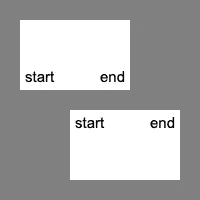

无论哪个房间更靠右，都应该是这种情况——房间的终点总是在另一个房间起点的右边。

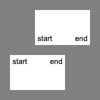

如果每个的结束边缘在另一个的开始边缘的右边，下面的代码返回`true`。`wall`变量指定房间之间的虚拟墙应该有多宽。

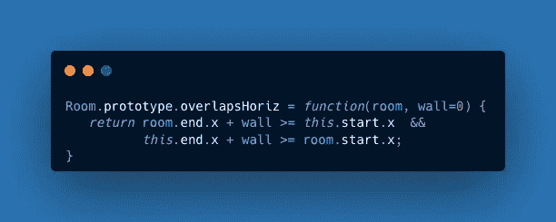

`overlapsVert`方法检查每个房间的下边缘是否低于另一个房间的上边缘，如下图所示。

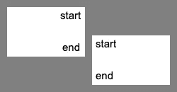

If there is vertical overlap, the bottom of one room is always below the top of another.

如果是这种情况，下面的代码返回`true`，并以同样的方式使用`wall`。

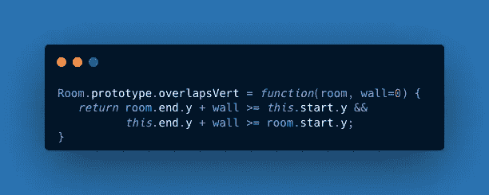

下面是使用`overlapsHoriz`和`overlapsVert`测试两种情况的`overlaps`方法。

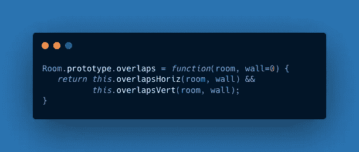

## 考虑壁厚

默认为`0`的`wall`变量允许我考虑房间之间的墙壁厚度，并更自由地定义重叠部分。考虑下面来自`addRoom`的代码。

```
if (room.overlaps(gameRoom, 1)) {
         return false;
      }
}
```

这里我使用了一个`1`的`wall`值，这导致了对重叠的更宽泛的定义。在`overlapsTop`的情况下，当前房间被视为高出一个瓷砖，这样可以防止房间靠得太近，如下图所示。

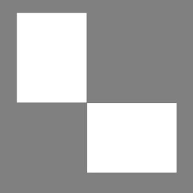

This could happen if the wall variable is set to 0.

下面是这三种方法的综合。

The three overlaps methods that are used to prevent rooms from landing on top of each other.

# 填充地图

当我试验添加房间和测试重叠的逻辑时，我使用 2D 数组填充结合一些画布渲染来检查结果。

2D 数组由`0`和`1`组成，分别是地板和瓷砖代码。顶部的两个常数让我可以让这些代码更易读。

```
const WALL_CODE = 0;
const FLOOR_CODE = 1;
```

下面是用一个房间填充 2D `map`数组的`carveRoom`方法。它是一个嵌套循环，将房间所包围的数组元素从`0`的`WALL_CODE`改变为`1`的`FLOOR_CODE`。

# 绘制地图

在我尝试绘制地图之前，我需要一块画布来作画——所以我写了一个`createDOM`函数来创建一个`<canvas>`元素。

然后我使用了一个`init`函数来调用`createDOM`并将`<canvas>`元素连接到`game`对象。

```
function init() { createDOM(); game = new Game();
   game.canvas = document.getElementById("grid");
   game.context = game.canvas.getContext("2d");
}
```

然后我添加了`generateMapRooms`，它通过多次调用`addRoom`在幕后填充我们的 2D 数组和`rooms`列表。

```
function init() {
   createDOM();
   game = new Game();
   game.canvas = document.getElementById("grid");
   game.context = game.canvas.getContext("2d"); **generateMapRooms();**
}
```

但是为了在画布上实际绘制，我编写了我的`drawMap`函数，它在`<canvas>`元素上呈现 2D 数组。

为了渲染地图，它遍历地图上的每个切片代码，一次绘制一个切片。

The drawMap function.

随着循环的每一次循环，`drawMap`在地图的当前索引处抓取`tileCode`，获取该代码的颜色，并使用它来调用一个新函数:`drawObject`。

```
let idx = game.map[row][col];let tileCode = TILE_COLORS[idx];

drawObject(col, row, tileCode);
```

然后，`drawObject`函数使用 Canvas API 在地图上绘制一个图块。

注意，瓷砖的实际位置是用`TILE_DIM`获得的，它是瓷砖的宽度和高度。

```
game.context.rect(x * TILE_DIM, y * TILE_DIM, TILE_DIM, TILE_DIM);
```

*   前两个参数是图块左上角的起始坐标:`x * TILE_DIM`和`y * TILE_DIM`。
*   宽度和高度参数都是`TILE_DIM`。

然后我将`drawMap`添加到我的`init`函数中，最后调用`init()`来测试它。

```
function init() {
   createDOM();
   game = new Game();
   game.canvas = document.getElementById("grid");
   game.context = game.canvas.getContext("2d"); generateMapRooms(); **drawMap(0, 0, COLS, ROWS);**
}
init();
```

当`maxRooms`在`100`时，我的地图看起来是这样的:

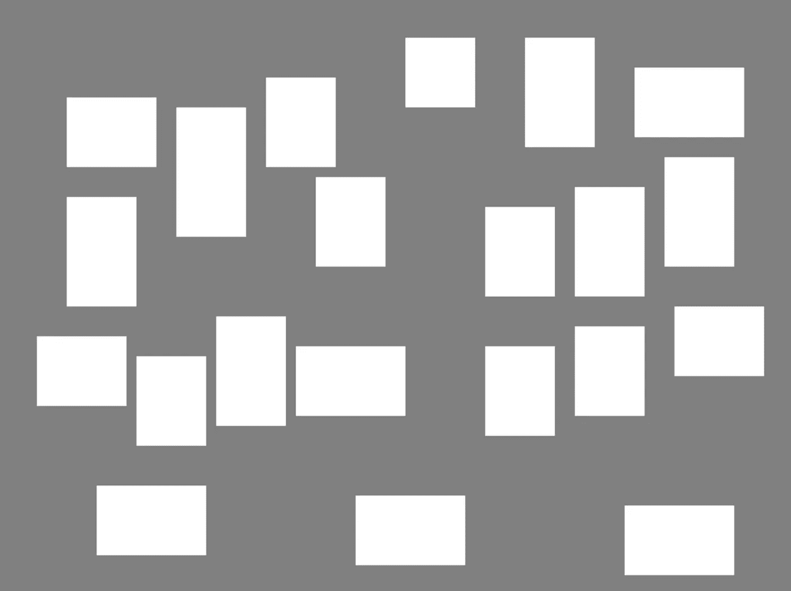

An unlabeled map of rooms

## 给房间贴标签

随着我更进一步，开始将房间与走廊连接起来，调试变得很困难，因为不知道哪个房间是哪个房间——所以我编写了用其`id`和左上角坐标标记每个房间的逻辑。这让我在调试时减少了很多猜测。

首先，我设置标签的颜色和字体大小。

```
game.context.fillStyle ='black';
game.context.font = '15px Arial';
```

然后，我遍历每个房间，并使用下面的`forEach`循环标记它。

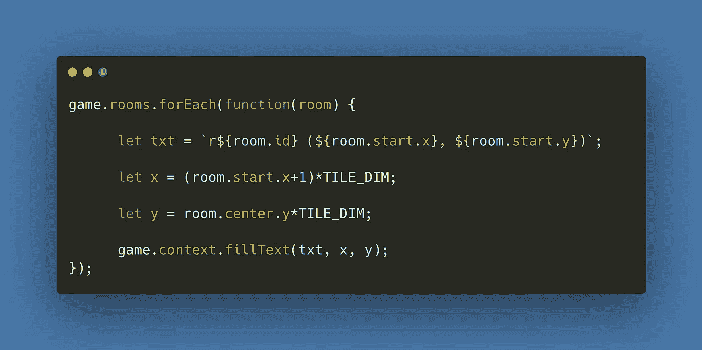

The logic for labeling the tiles.

下面是我用`labelRooms`完成的全部`init`功能。我通常在完成调试后将其注释掉一次。

T

如果您已经构建了自己的版本，这里有一个快速演示来进行比较。

The full room creation demo.

# 构建完整的游戏

如果您对创建完整的游戏感兴趣，那么在[可下载 Github 项目](https://github.com/nevkatz/js-roguelike-rooms)的`phase-1-rooms`目录中编写本文中的代码是一个很好的开端。

在你完成第一阶段后，教程的[部分将指导你编写房间连接逻辑，从而完成游戏。](https://www.linkedin.com/pulse/javascript-roguelike-series-nevin-katz)

如果您正在与我们一起构建，并且有兴趣继续，下面是第 2 阶段教程的链接。

[](/connecting-rooms-in-a-javascript-roguelike-8e6212c54c9) [## 用 JavaScript 语言连接房间

### 让我们用香草 JS 建造一些走廊。

javascript.plainenglish.io](/connecting-rooms-in-a-javascript-roguelike-8e6212c54c9) 

*无限制访问我的文章，考虑* [***报名中***](https://medium.com/@nevkatz/membership) ***。***

*更多内容请看* [***说白了就是***](https://plainenglish.io/) *。报名参加我们的* [***免费每周简讯***](http://newsletter.plainenglish.io/) *。关注我们*[***Twitter***](https://twitter.com/inPlainEngHQ)*和*[***LinkedIn***](https://www.linkedin.com/company/inplainenglish/)*。加入我们的* [***社区不和谐***](https://discord.gg/GtDtUAvyhW) *。*