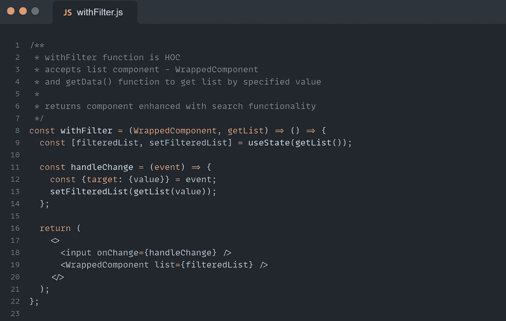
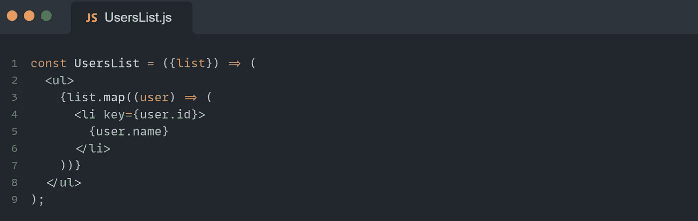
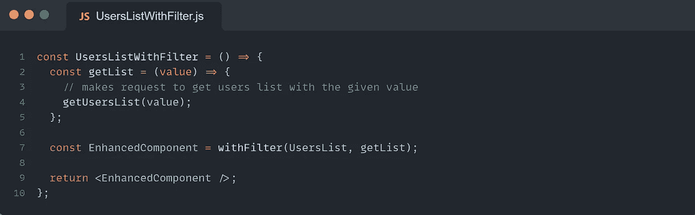
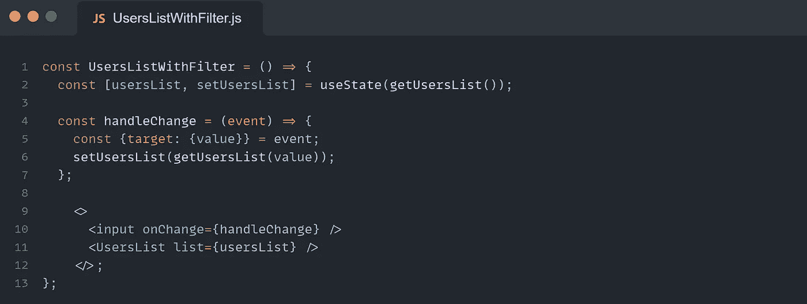
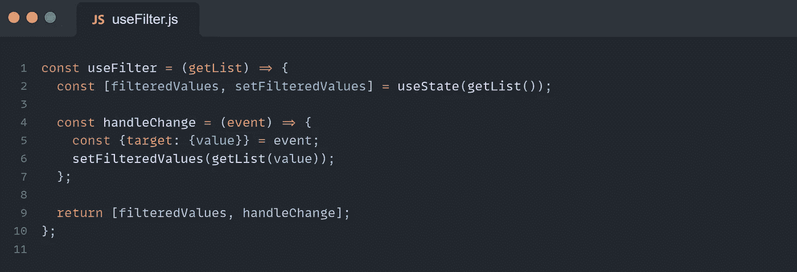
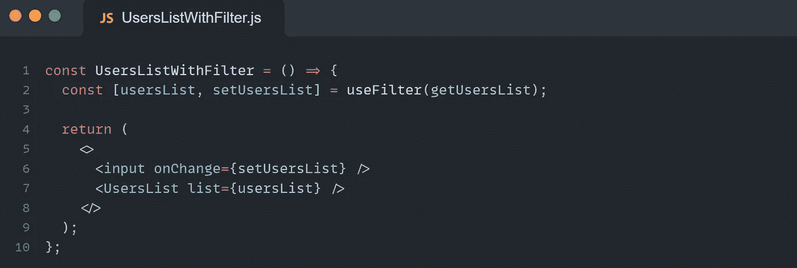

# 用钩子替换反作用 hoc

> 原文：<https://javascript.plainenglish.io/replace-react-hocs-with-hooks-401824eb7903?source=collection_archive---------3----------------------->

## 有必要吗？

React 实施了一种声明式编程范式，这使它变得如此强大和伟大。由于 React 与 DOM 的交互方式(我们只描述 JSX，React 呈现我们想要看到的内容)，应用这种范式也使 React 以快速著称。

## **高阶函数**

HOF 是函数式编程的一个重要概念。

在 JavaScript 中，函数是一级对象，这意味着它们可以赋给变量，可以作为参数传递给其他函数，并从它们返回。

*HOF 是一个以函数为参数和/或返回函数的函数(通常用特殊行为增强)。*

让我们看一个简单的例子:

正如我们在前面的代码中看到的，map()方法接受一个函数作为参数，因此它是一个高阶函数。同理，数组 filter()、find()、reduce()的内置函数都是高阶函数。

## **高阶元件**

*hoc 是纯函数，接受一个组件并返回一个新的增强组件。*

换句话说:如果我们将 HOF 概念应用于反应组件，我们将得到 HOC。

> “高阶组件(HOC)是 React 中重用组件逻辑的一种高级技术。本质上，hoc 不是 React API 的一部分。它们是从 React 的组合性质中显现出来的一种模式。~ reactjs.org

让我们深入一个现实世界的例子。假设我们在一个表和输入字段中列出了用户，其目的是查找具有指定值的用户。同样，我们的应用程序中也有带有搜索功能的工作和公司列表。

因此，我们有多个具有相同搜索功能的组件。

首先，我们必须创建一个函数，它接受一个列表组件作为参数，并用搜索功能增强它:

“用户列表”组件如下所示:

一旦 HOC 准备就绪，我们就可以将“UsersList”组件包装到“withFilter”函数中:

很好，现在我们可以用“CompaniesList”和“JobsList”组件做同样的事情了。

一个众所周知的例子是 Redux 的“连接”。

## **挂钩**

> *"* 钩子是 React 16.8 中新增的。它们让你不用写类就能使用状态和其他 React 特性。”~ reactjs.org

这是什么意思？

使用 React 钩子，我们可以添加一个本地状态，并在功能组件中使用生命周期特性。它们帮助我们避免对类使用 React，并且只遵循函数式编程风格。

React 钩子只是 JavaScript 函数。在前面的“with filter”HOC 示例中，我们已经体验了用于在本地状态中存储过滤列表的“useState”挂钩。

除了 React 内置钩子(useState、useEffect、…)之外，我们可以创建自己的定制钩子来在组件之间共享有状态逻辑。

现在，让我们在不使用 HOC 的情况下编写前面的示例:

正如我们所看到的，本地状态和输入字段及其 onChange 函数从 HOC 移到了组件中。如果我们对“JobsList”和“CompaniesList”组件做同样的事情，我们将开始在整个应用程序中复制代码。

让我们看看 React 钩子如何帮助我们避免这种情况。

太好了,“使用过滤器”挂钩准备好了。现在，让我们修改组件，如下所示:

不错！我们也可以在“JobsList”和“CompaniesList”组件中使用自定义挂钩。

到目前为止，我们看到了 React 钩子和 hoc 对于在组件之间共享有状态逻辑是如何有用的。但是当我们决定使用一种或另一种技术时，也有一些不同之处需要注意。例如:

*   HOC 是一个独立于 React 的模式，但是钩子是 React 的一部分。
*   我们可以像函数一样组合钩子，但是 React 钩子是不可组合的。
*   HOC 在组件层次结构中增加了一个组件(我们可以在 DevTools 中检查它)。

因此，在开始用 React 钩子替换所有 hoc 之前，我们必须回答下面的问题——这有必要吗？
首先，重要的是要清楚地了解每一个的利弊，找到最适合项目的最佳方案。

*作者 Mariam Kochumian。*

*更多内容尽在* [***说白了. io***](https://plainenglish.io/) *。报名参加我们的* [***免费周报***](http://newsletter.plainenglish.io/) *。关注我们关于* [***推特***](https://twitter.com/inPlainEngHQ) *和**[***LinkedIn***](https://www.linkedin.com/company/inplainenglish/)*。加入我们的* [***社区***](https://discord.gg/GtDtUAvyhW) *。**