# 如何使用 Axios 轻松管理请求

> 原文：<https://javascript.plainenglish.io/request-easily-with-axios-482adb0b0ea9?source=collection_archive---------4----------------------->

## 如何实现一个好的结构来管理 axios 的获取请求并处理服务器错误。

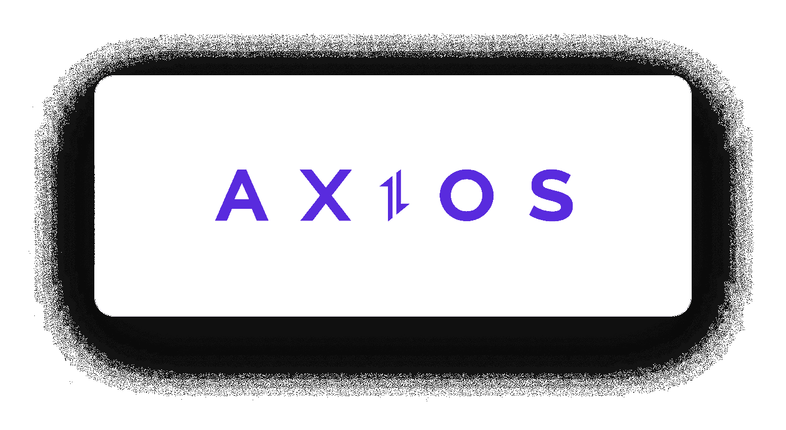

你厌倦了捕捉错误。抓法？
你厌倦了冗长的 API URLs 和每个请求重复的标题吗？
你是否厌倦了在 useEffect 清理中没有处理取取消的想法？
你是否厌倦了没有一个好的结构来管理你的请求？

看看谁来了！Axios 救世主…
通过使用这个可爱的库，你再也不需要 fetch()进行请求了，以上所有问题都将迎刃而解。

在本文中，我将使用 Axios 实现一个良好的结构来管理请求，当然，我将解释如何以及为什么。

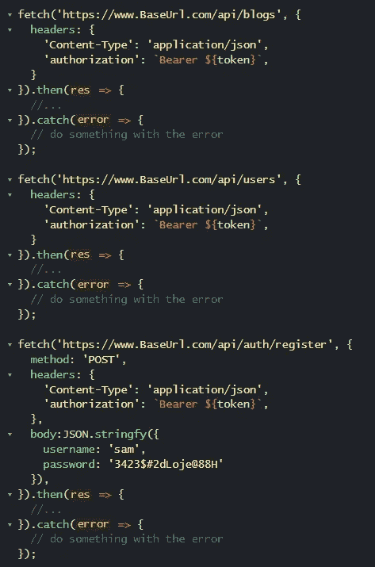

在上面的例子中，我已经使用了 fetch() 3 次。现在来看看我得到的问题:1。请求 URL 的大部分是相同的(基本 URL) 2。我重复了它们的标题，虽然它们完全相同。我对每个请求都使用 catch 方法，而不是对所有请求都使用一个 catch。如果我们为每个请求获得了实例 401，它们没有不同，那么为什么 catch 方法应该不同呢？

这是 Axios 出场的时候了。

# 1.Axios 安装

```
npm install axios 
```

或者

```
yarn add axios
```

# 2.在 src 文件夹中创建一个服务文件夹

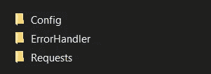

服务文件夹包含 3 个文件夹:

1.  包含一个 index.js 文件的 Config 文件夹，我把我的初始配置放在里面。

毫无疑问，我安装了 axios，但是如果我只是想不用任何配置就使用它，那是没有用的:

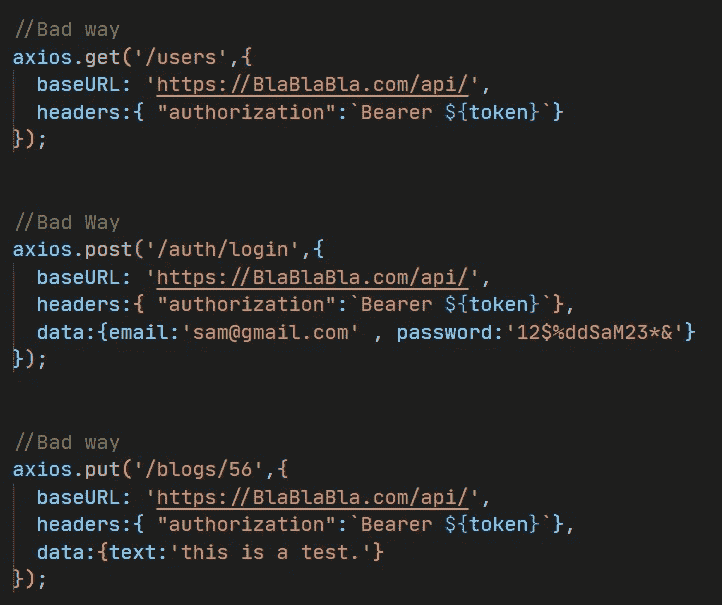

在上面的例子中，我使用了不带 config 的 axios，你可以看到我用 headers 和 baseUrls 重复了一遍。

现在，这是我放在 src/Services/Config/index.js 中的内容:

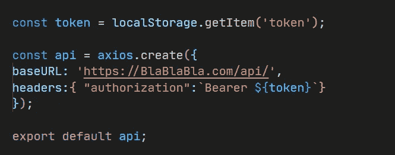

在上面的代码中，`axios.create()`创建了 axios 的一个新实例，我可以通过传递一个对象作为这个`create()`方法的参数来给它一个自定义配置。

这个配置将应用于从 API 实例发出的所有请求，当我用 API 发出请求时，我不必向每个请求传递头和基本 URL，也不必重复我自己。☺

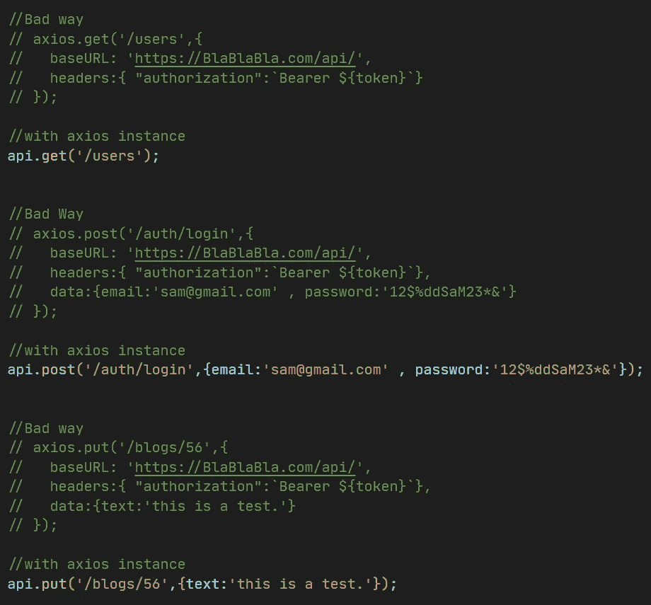

在上面的例子中，我注释掉了我以前的请求(没有配置的 axios ),并使用了我自己的名为“api”的实例，它做了完全相同的事情。


But Better :)

注意上面的代码示例:我传递给 post 和 put 方法的第二个参数是 body，我不能把它放在 config 中，因为你可以看到它们是不同的 body。

*提示:BaseURI 是附加到端点开头的地址，例如:如果基本 URL 是“https://www.baseurl.com/api”，那么 api('/users/')将变成 API(' https://www . base URL . com/API/users/')*

*提示:我在配置中使用的头有一个带有我的令牌值的授权密钥。我需要这样才能使用 api*

因此，现在我将使用 axios 的 API 实例和我的自定义配置，而不是 Axios 本身。

**2。包含 index.jsx 文件的 ErrorHandler 文件夹**

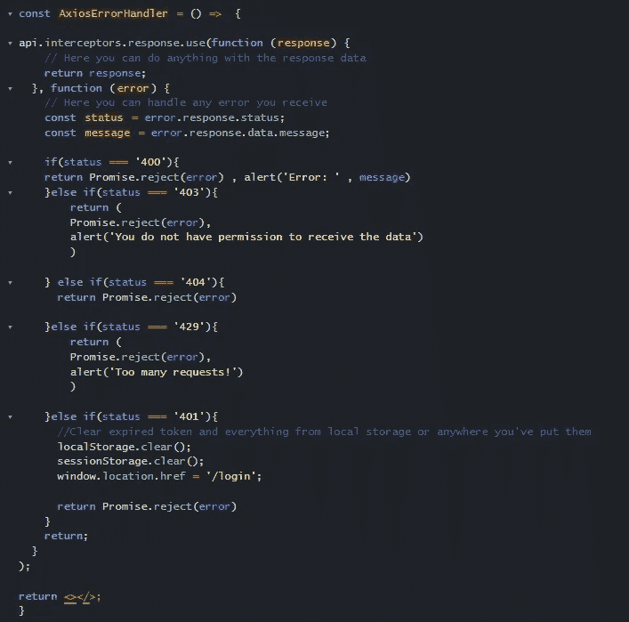

是啊！这个文件是一个 JSX 组件，但是，正如你所看到的，它不返回任何东西！

我们只需要上面的函数来帮助我们摆脱。每个请求的捕获(当然，您可以用不同的方式处理拦截器的 Axios 错误捕获，但是我将坚持我的方式。)

如果您不熟悉不同的错误状态，在研究上述代码之前，您可以阅读以下一些有用的提示:

*错误 400:表示由于被认为是客户端错误的原因(例如，格式错误的请求语法、无效的请求消息组帧或欺骗性的请求路由)，服务器不能或不会处理请求。*

*错误 401:我们需要一个令牌在 Axios 实例配置的头中设置为授权值，当用户登录/注册时，用户收到一个令牌，我们将其设置为 localStorage(或任何您想要的位置)，然后将其设置为头授权。它允许我们使用 API。但是，令牌有过期时间，当令牌过期时，或者如果我们根本没有为我们的授权设置令牌，我们将会收到错误 401，表示客户端向服务器发送的请求缺少有效的身份验证凭据。*

*错误 403:这意味着由于某种原因，访问你试图访问的页面或资源是绝对禁止的。*

错误 404:表示服务器无法找到所请求的内容。当服务器不愿意公开所请求的信息或内容已被删除时，也会出现此消息。

*错误 429:表示用户在给定的时间内发送了过多的请求。*

## 截击机

正如你在上面的例子中看到的，我们导入了我们的 axios 实例(名为 api ),并使用了名为拦截器的东西，其中有两个:第一个拦截器用于请求，它在我们将请求发送到服务器之前对我们的请求做一些事情，第二个拦截器用于响应，它在我们获得响应之前对响应做一些事情。然后()”和”。catch()"方法。

**请求**的“use()”方法需要两个回调:第一个是在发送请求之前触发的回调，第二个是在请求出错时触发的回调。

**响应**的“use()”方法需要两个回调:第一个是当我们的响应状态代码位于 2xx(已解决或已完成)范围内时触发的回调，第二个是当我们的响应状态代码超出 2xx(已拒绝)范围时触发的回调。

在上面的例子中，我们使用了 response“use()”方法，并传递了一个回调作为第一个参数，该参数不做任何特殊处理，只是返回从服务器获得的响应，没有任何更改。但是！，我们传递给“use()”方法的第二个回调处理错误，我们对不同的错误做了很多事情，而不是在。catch()”一遍又一遍。

响应错误状态代码通常是 400、401、403、404、429 和其他一些代码，我们将在本文中处理它们，但是您可以根据需要处理任意多的错误状态代码。:)

“use()”方法的第二个回调接收一个错误作为参数，这个错误参数有一个响应属性，它有一个我们需要的状态属性，还有其他属性，比如数据，它有一个我们需要的消息属性。

注意:我们在所有情况下都返回 Promise.reject，以便当响应经过这一步并到达。然后和。catch，系统知道该响应是被满足还是被拒绝来执行"。然后是“或者”。catch”方法。

在我们的例子中，我们说…

如果状态代码是 400，则拒绝，然后用响应本身的消息进行警告。

如果状态代码是 403，则拒绝，然后用消息“您没有权限…”进行警告

如果状态码是 404，就拒绝。

如果状态代码为 429，则拒绝，然后发出“请求太多”的消息。

如果状态代码是 401，我们显然没有有效的令牌(过期或根本没有设置)，所以我们从用户注册/登录时从用户接收的 localStorage 中清除全部信息。然后，我们将用户发送到登录页面进行登录，并设置一个能够使用 API 的新令牌。

注意:要知道你可以更有创造力，做更多的事情，而不仅仅是提醒。

现在，在每个文件中，您使用这个 AxiosErrorHandler 组件，拦截器关注该文件的 API 请求，我们不需要在。多次捕捉方法。

嗯，我将 AxiosErrorHandler 组件放在“src/index.js”中，以便关注我在整个项目中发出的所有 API 请求。

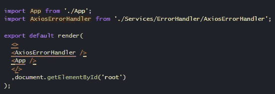

**3。请求文件夹包含我们在不同类别文件夹中的所有请求操作(请求的主题有不同的类别)，例如:**

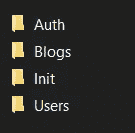

上图是 Requests 文件夹的内容，每个文件夹都有一个名为 index.js 的文件:Auth 文件夹的索引文件包含所有与身份验证相关的请求，如登录、注册、forgotPassword、resetPassword 等:

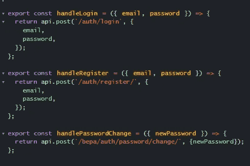

“Requests/Auth/index.js”

如您所见，我们为每个请求提供了不同的导出异步函数，为了使用它，我们只需导入并调用它。

*注意:记住这些都是异步函数，从服务器返回响应，所以我们必须异步使用它们，接收响应并做我们想做的任何事情。*

这是博客文件夹索引文件的另一个示例，正如您已经注意到的，它包含了与博客相关的所有请求:

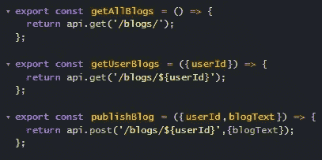

“Requests/Blogs/index.js”

## 提取取消

有时我们在 useEffect 中使用这些获取请求，但是有一些事情您应该知道，那就是 useEffect 每次调用请求操作，甚至当组件被卸载时，您就会看到这个警告:

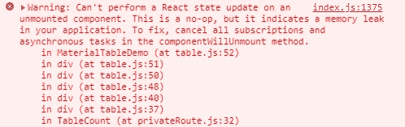

要解决这种警告，我们只需要在组件被卸载时清理我们的请求，我们在 useEffect 清理函数中执行此操作(useEffect 返回的函数是清理函数，正如您将在下面的示例中看到的那样),有几种方法可以在清理函数中取消获取请求，对于我们使用 axios 实例进行请求的情况，这非常简单:

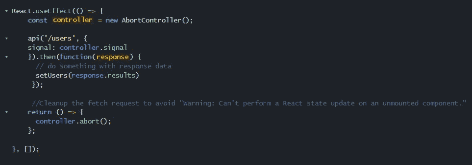

您只需要创建一个控制器实例，并传递一个带有名为 signal 的属性和 controller.signal 的值的对象作为 API 的第二个参数，然后在清理函数中，您所要做的就是调用控制器的 abort 方法，当组件被卸载时，它将取消请求。现在你不会收到那个警告，你的表现比以前更好了。

本文到此结束，希望您已经学会了如何使用这个可爱的库来尽可能好地管理您的请求。

再见，祝你好运🤞

*更多内容请看*[***plain English . io***](https://plainenglish.io/)*。报名参加我们的* [***免费周报***](http://newsletter.plainenglish.io/) *。关注我们关于*[***Twitter***](https://twitter.com/inPlainEngHQ)*和*[***LinkedIn***](https://www.linkedin.com/company/inplainenglish/)*。加入我们的* [***社区不和谐***](https://discord.gg/GtDtUAvyhW) *。*