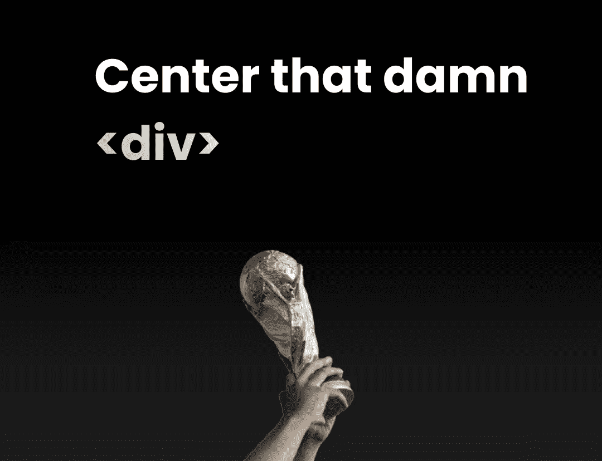
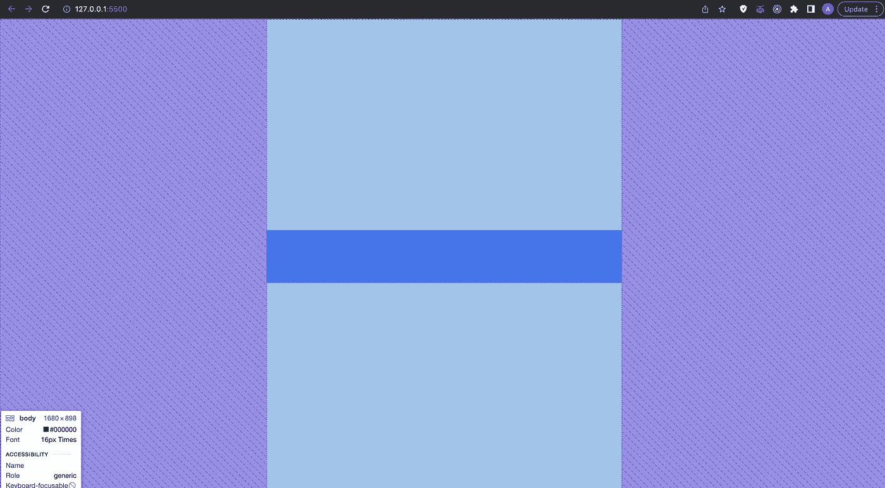
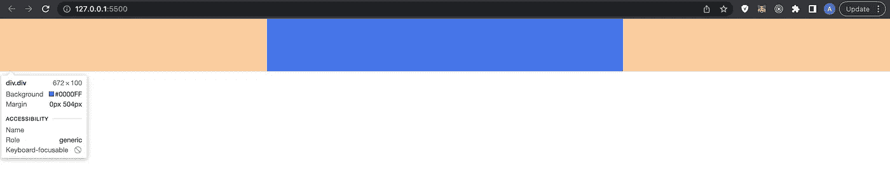
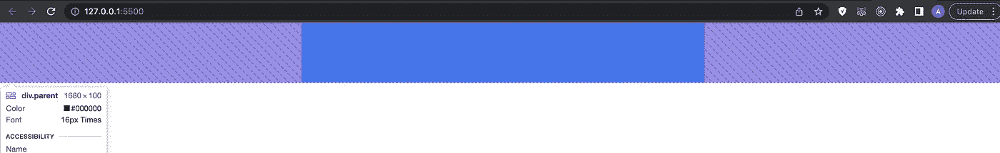
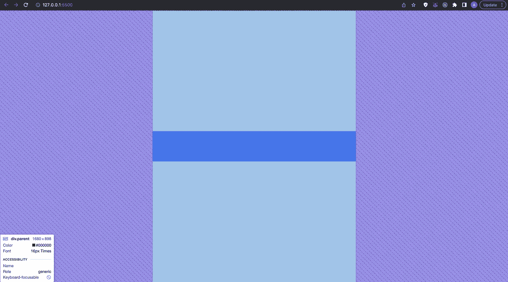
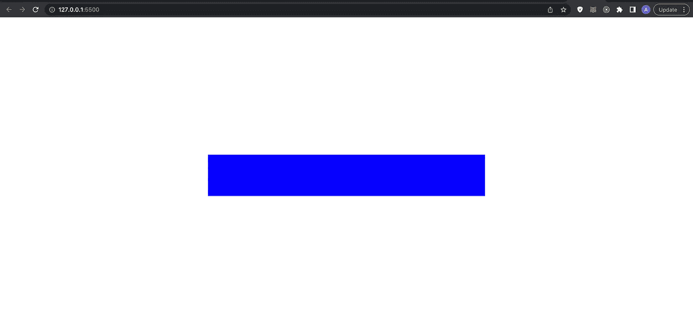

# Respectfully, Developers, This is How aIs Centered

> 原文：<https://javascript.plainenglish.io/respectfully-developers-this-is-how-a-div-is-centered-86a065c2c4a9?source=collection_archive---------4----------------------->

## 如何使一个 div 居中而不用整天在谷歌上花时间？



Image made by Author

**Pfft，如果你只想知道如何垂直和水平居中，这里有你需要知道的一切:**

```
body {
display: flex;
align-items: center;
justify-content: center;
}.div {
background-color: blue;
width: 40%;
height: 100px;
}//<div class="div"></div>
```

只需用 flex 特性将 div 包含在父元素中，就可以了。为成功地将一个 div 水平和垂直居中而感到自豪！😎向下滚动阅读更多内容！



Image made by Author

## **我有一个问题要问你:**

有多少次你对着电脑尖叫，试图将一个 div 居中？

我吗？**次数太多。**

尽管这很简单，但在尝试这样做时，它让开发人员很头疼🤣

尤其是新开发人员，但我见过很多有经验的人有这方面的问题，我也有过我似乎无法让它工作的时候，但我已经学会了所有的策略，并希望与你分享！

所以，如果你发现自己处于一种不知道如何集中注意力的情况，回到这个帖子上来看看吧！我将向你展示许多不同的方法来使一个 div 居中，包括我个人最喜欢的和我是如何做的！那么，你准备好最终掌握定心 div 了吗？我们开始吧！

# 方法 1:利润:自动

如果你有一个特定宽度的框，比如一个模态弹出框，你可以使用`margin-left: auto` & `margin-right: auto;`使它在页面上水平居中。当我需要将弹出模式、页面中间的按钮或其他任何东西居中时，我会一直使用这种方法。

但是请记住，`divs`是块元素，这意味着它们有 100%的可用水平空间宽度。要做到这一点，我们需要给 div 一个宽度，这样我们就可以使它居中。

**示例:**

```
.div {
width: 20%;
height: 100px;
margin: auto;
background-color: blue;}
// <div class="div"></div>
```



Image made by Author

如您所见，div 成功居中🔥

## 什么时候使用这种方法比较好？

例如，当您有一个必须居中的弹出窗口、按钮或文本片段，并且它周围有一个块元素时，您可以将一个按钮设置为 100 像素宽，并在其上使用`margin-left: auto` & `margin-right: auto;`，它将成功居中。

# 方法 2:显示器:flex

这是目前为止我最喜欢的物品居中方法！

我一直用它来显示按钮、文本、整个部分和其他东西。

那么，如何使用 flex 属性使 div 居中呢？

只需将 div 包装在父元素中，并在父元素上设置 flex 属性，您的 div 就会居中！

**我给你看看:**

```
.*parent* {
display: flex;
justify-content: center;
}.*div* {
background-color: blue;
width: 40%;
height: 100px;
}//  <div *class*="parent"><div *class*="div"></div></div>
```



Image made by Author

div 已经水平居中，但是您可能想知道它是否可以水平和垂直居中？当然，flex 也可以为我们做到这一点。

但是，为了做到这一点，父元素/几何体必须占据整个视口高度。

为此，将父元素/几何体的高度设置为`100vh`，这代表 100 的视口高度，然后将`align-items: center`添加到父元素。现在 div 水平和垂直居中！

**实现这个的代码:**

```
.*parent* {
display: flex;
justify-content: center;
align-items: center;
height: 100vh;
}.*div* {
background-color: blue;
width: 40%;
height: 100px;
}//  <div *class*="parent"><div *class*="div"></div></div>
```



Image made by Author

# 方法 3:位置:绝对

我不是这种输入方法的超级粉丝，除了在某些情况下这基本上是唯一的方法，但肯定有时它会有用。

为此，我们需要将父元素设置为`position: relative`，并将 div 设置为`position: absolute`的中心。

现在我们可以指定如何对齐 div，所以我这样做:

```
body {
margin: 0;
padding: 0;
height: 100vh;
position: relative;
}.*div* {
background-color: blue;
width: 40%;
height: 100px;
position: absolute;
top: 50%;
left: 50%;
transform: translate(-50%, -50%);
}
```



Image made by Author

本质上，我们将它设置为 50%从顶部开始，50%从左侧开始，然后变换它以确保它水平放置在中心。

你可以看到我为什么不喜欢这种方法，它太多的代码，而我们可以只使用 flex 或 margin。:D

我希望你现在已经对你的 div 居中能力有信心了！

最后一点，如果你自己也喜欢 Medium，请考虑**支持**我和所有其他作家，注册成为[](https://medium.com/@anton.franzen/membership)**会员，每月 5 美元，以保持独立写作的活力， [**在此注册；)**](https://medium.com/@anton.franzen/membership)**

**除了支持他人，Medium 还可以通过写作和在这里找到家的强大、积极参与的社区来支持你。**

# **你可能也会喜欢:**

**[](/stop-learning-from-react-tutorials-that-suck-5e2031d9bdc7) [## 停止从糟糕的 React 教程中学习

### 不受欢迎的观点

javascript.plainenglish.io](/stop-learning-from-react-tutorials-that-suck-5e2031d9bdc7) [](https://betterprogramming.pub/callbacks-vs-promises-vs-async-await-a-step-by-step-guide-f93d13447604) [## 回调 vs .承诺 vs .异步 Await:逐步指南

### 引擎盖下也有点。

better 编程. pub](https://betterprogramming.pub/callbacks-vs-promises-vs-async-await-a-step-by-step-guide-f93d13447604) 

*更多内容请看* [***说白了就是***](https://plainenglish.io/) *。报名参加我们的* [***免费每周简讯***](http://newsletter.plainenglish.io/) *。关注我们* [***推特***](https://twitter.com/inPlainEngHQ) *和*[***LinkedIn***](https://www.linkedin.com/company/inplainenglish/)*。加入我们的* [***社区不和谐***](https://discord.gg/GtDtUAvyhW) *。***