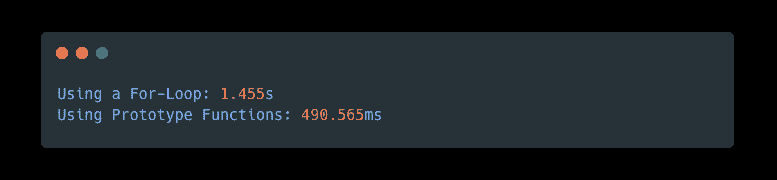

# 回应仇恨:停止使用 For 循环，使用迭代器

> 原文：<https://javascript.plainenglish.io/responding-to-the-hate-stop-using-for-loops-use-iterators-instead-eb2139c8ce51?source=collection_archive---------5----------------------->

## 一位评论者在评论中猛烈抨击了我在 Medium 上表现最好的文章。我会分解为什么我是对的，他们是错的。

我最近写了一篇文章，标题是 [*停止使用 For 循环，使用迭代器代替*](https://medium.com/javascript-in-plain-english/stop-using-for-loops-use-iterators-instead-javascript-62682c74427d) 。如果你还没有读过，请读一读。在这篇新文章中，我不打算打击任何开发者，因为 Medium 是一个互相学习的平台。

我并不完美，我自己也犯了很多错误。我从他们那里学习，相应地编辑和更新我的文章。我对以下内容反应良好:

*   建设性的批评
*   写作和编程技巧
*   我文章中的错误(这样我就可以修复它们)

我对以下内容反应不佳:

*   充满仇恨的评论
*   抨击我的文章
*   完全错误的信息

不多说了，下面是我对最不正确的评论的回应。

The comment made by Will K on my Medium article

我想澄清一下，我从来没有在 for-loops 上拉屎。我一直在我的代码中使用它们。我写的这篇文章只是概述了某些情况(这种情况经常发生),在这些情况下，for 循环并不是首选，而且很糟糕。

事实上，每个操作都是一个 for 循环，但是 JavaScript 执行起来更有效。唯一的区别是迭代是由 JavaScript 引擎本地执行的。我也多次提到数组方法使你的代码更容易阅读，因为每个函数的名字都提供了循环的意图。

此外，如果数组是用来存储数字的，就不应该有包含 nullish 值的数组。是的，循环可以在单个循环中完成多个任务，并提供早期救助。但是你错了。

我编写了一个程序来演示迭代器的强大功能:

Code to time a for-loop vs array prototype function for mapping an array.

结果应该不会让你吃惊:

The results of the timing code – pretty consistent with every trial

**但是他的另一点呢？**你确实可以更早地跳出 for 循环。但是您可以对原型函数做同样的事情。在最初的文章中，我介绍了作用于数组中每个元素的`every`函数。

如果您想在使用`forEach`时提前终止循环，您可以使用`every`功能。因为如果结果之一是`false`，函数`every`返回`false`，你应该意识到一旦返回第一个 false，它就终止:

Early bail-out from an array prototype function

但是如果你需要同时完成两件事呢？

使用`forEach`函数来`filter`和`map`，而不是将一个`filter`和`map`数组函数链接在一起。或者不要。没关系；无论你选择哪种方式，都将比`for-of`循环执行得更快，也更容易阅读。

感谢您的阅读，祝您编码愉快！🍻

 [## 停止使用 For 循环，改用迭代器

### For 循环不再是 JavaScript 中迭代数组的最佳方式。相反，使用数组迭代器函数。这里…

javascript.plainenglish.io](/stop-using-for-loops-use-iterators-instead-javascript-62682c74427d)  [## 来自经验丰富的开发人员的建议:继续使用隐含的 Else

### 不要接受媒体上任何人的编程建议。即使是经验丰富的专业人士有时也会给出糟糕的建议…

javascript.plainenglish.io](/advice-from-a-seasoned-dev-keep-using-the-implicit-else-3e1b7c4695ec)  [## 不，JavaScript 还没有结束

### 一个媒体作家如何因为自己一无所知的东西而毁掉自己的可信度。揭露谎言。

medium.com](https://medium.com/@thesoggywaffle/no-the-end-of-javascript-is-not-here-776a0c92c501) 

*更多内容看* [***说白了就是 io***](https://plainenglish.io/) *。报名参加我们的* [***免费周报***](http://newsletter.plainenglish.io/) *。关注我们关于*[***Twitter***](https://twitter.com/inPlainEngHQ)*和*[***LinkedIn***](https://www.linkedin.com/company/inplainenglish/)*。查看我们的* [***社区不和谐***](https://discord.gg/GtDtUAvyhW) *加入我们的* [***人才集体***](https://inplainenglish.pallet.com/talent/welcome) *。*