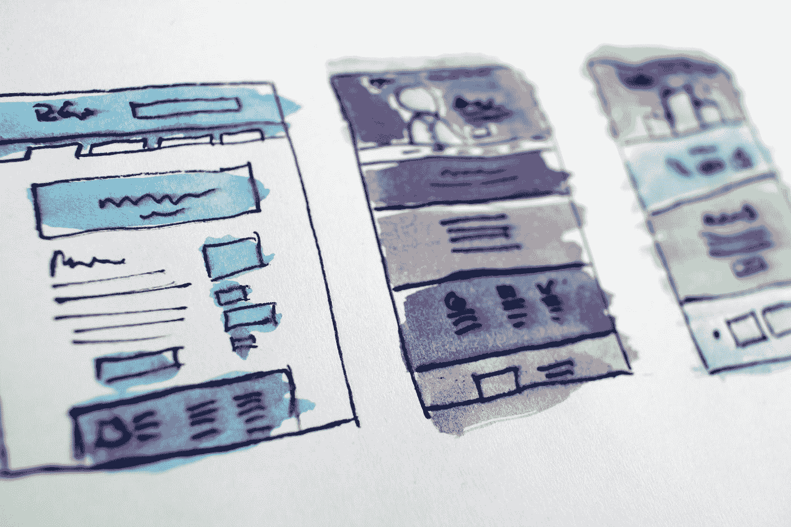
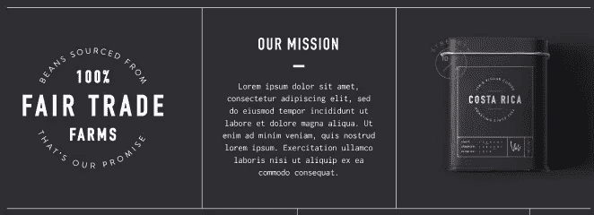
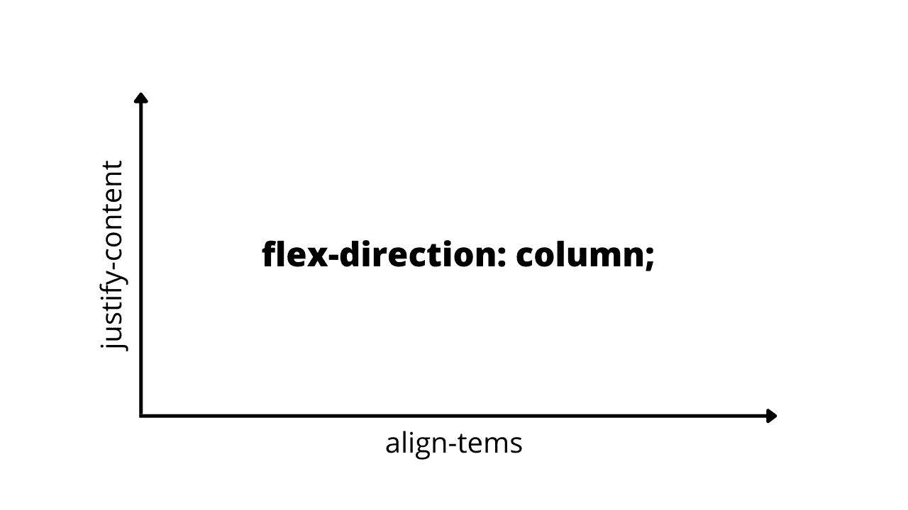
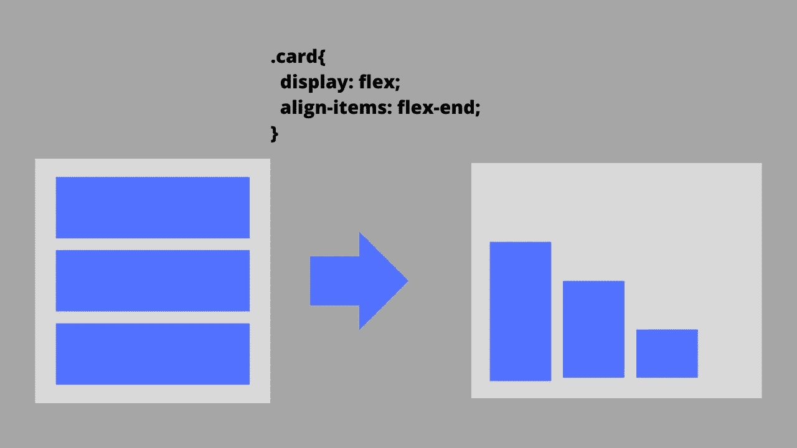
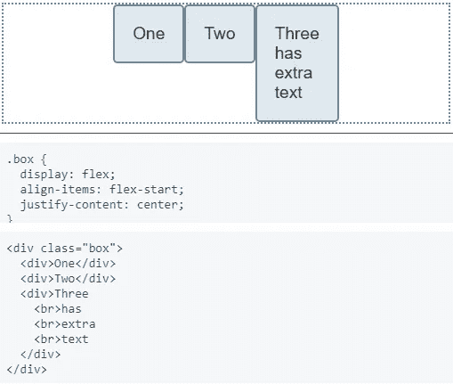
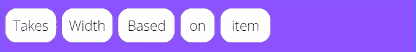
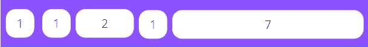
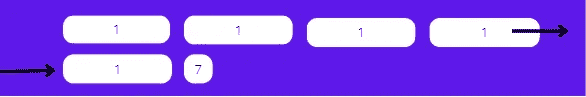
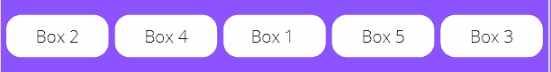

# 响应式网页设计——向一个 5 岁的孩子简单解释

> 原文：<https://javascript.plainenglish.io/responsive-web-design-explained-simply-to-a-5-year-old-45a98d4e0486?source=collection_archive---------11----------------------->

## 对每个人来说，这是一个简单而有价值的指南。



Photo by [Hal Gatewood](https://unsplash.com/@halacious?utm_source=medium&utm_medium=referral) on [Unsplash](https://unsplash.com?utm_source=medium&utm_medium=referral)

从代码中创建一个网站需要时间，你必须添加几个功能，使它更好，最重要的是它应该是响应性的。

现在，全球有超过 53.2 亿的独立移动用户，并且还在继续增加。显而易见，他们中的大多数将会使用互联网。

所以创建一个有响应的网站是必须的。几年来，我一直在创建响应式网站，我经常参加响应式设计的课程，这样我可以做得更好。

创建响应式设计需要以下概念方面的专业知识:

*   你如何处理一个布局
*   了解 Flexbox
*   学习相对 CSS 单位
*   处理字体
*   添加媒体查询

嗯，这些都是简单的步骤，你可以遵循，使您的网站响应更好。

让我们更深入地研究一下已定义的概念。

# 1.分析布局

布局可以是不同的类型，当你正确地分析它时，大部分工作就变得容易了。

让我给你举几个例子。在这里，我从 Pinterest 上上传的一个网站上截取了一些截图。



很简单，我们有一行，在那三列里面。

```
<div style="display:flex;">
  <div style="display:flex;flex-direction: column;"></div>
  <div style="display:flex;flex-direction: column;"></div>
  <div style="display:flex;flex-direction: column;"></div>
</div>
```

当然，你需要增加宽度和所有，但一般来说，上面的是语法。

你需要学习的只是行和列(甚至是我们将进一步学习的 flexbox)和一点点实践。

不要紧张，我会帮助你的。所以从这里，你可以学习我们所说的行和列。


现在让我们再练习一些布局。


现在变得有点困难了。

在一行中，有三列，在这之后，在第三列中，我们还有两行。

在 flexbox 的帮助下，可以很容易地进行布局，如下所示。如果您不熟悉 flexbox，也不用担心；我们会更深入地讨论它。

```
<div style="display:flex;">
  <div style="display:flex;flex-direction: column;"></div>
  <div style="display:flex;flex-direction: column;"></div>
  <div style="display:flex;flex-direction: column;"> 
    <div style="display:flex;"></div>
    <div style="display:flex;"></div>  
  </div>
</div>
```

最后，我们再举一个例子。


现在它变得更加难以分析。

这是你的家庭作业，如果你找到了方法，我们可以接近这个布局，只是评论给我。

# 2.学习 Flexbox

学习 flexbox 并经常使用它可以改进你的网站，而不需要你写更多的代码。即便如此，它也提高了你的网站的响应速度。

我们已经看过几个例子了。


这种布局是完全响应性的，可以使用 flexbox 快速创建。

让我们来了解一下 flexbox。

Flexbox 是一个 CSS 布局模型(或属性),允许您毫不费力地处理许多列和行。因此，您可以快速构建布局，使其响应迅速，并做各种其他事情。

```
display: flex;
```

您可以在其中构造一个父容器，拥有许多子容器，并使用 flex 属性根据您的需要设置许多特征。

首先，你必须提供一个方向；否则，它将只是一行。

例如，您甚至可以将方向定义为一行。

```
flex-direction: row;
```


类似地，您可以将方向定义为列，即

```
flex-direction: column;
```


让我再举一个例子。我从 Pinterest 上分享的一个网页上抓取了一个截图。


很直白吧？我们有一个单行，里面有三列。

```
<div style="display:flex;">
  <div style="display:flex;flex-direction: column;"></div>
  <div style="display:flex;flex-direction: column;"></div>
  <div style="display:flex;flex-direction: column;"></div>
</div>
```

没关系。

接下来，我们有两个更重要的属性:align-items 和 justify-content。


每当您将 flex-direction 指定为一行时，主轴(即 x 轴)已知为 justify-content，横轴(y 轴)已知为 align-items 属性。

如果你理解了，很好；如果没有，请允许我更轻松地教你。

justify-content 属性将水平应用，而 align-items 属性将垂直应用。

现在把弯曲方向的例子看作是柱。



类似地，如果 flex-direction 被指定为列，x 轴将用于对齐项目，y 轴将用于对齐内容。

是的，行和列的 align-items 和 justify-content 属性正好相反。

如果你没有掌握任何东西，不要担心，因为我们会再复习一遍。

让我们更好地定义一种方式。

## 对齐项目:


align-items: flex-start will place the items at the start.


align-items: center will place the items at the center.



align-items: flex-start will place the items at the end.

正如我在 x 和 y 轴图表中指出的，对齐的项目将垂直对齐(在伸缩方向上作为行)。

类似地，我们可以定义 justify-content 属性。

## 对齐-内容:间距


三个盒子之间有一个间隙，如你所见，即`justify-content: space-between`。

## 对齐内容:空格


`justify-content: space-around`会使左右两边的空间(相等)。

## 对齐-内容:空间均匀


`justify-content: space-evenly`会在左右两边均匀创造空间。

## 对齐-内容:居中



`justify-content: center`将物品放在中央。

## 弹性基础



它将根据内部内容计算宽度。当然，我们也可以指定宽度。

## 灵活增长



当 flex-grow 应用于某个项目时，它会相对于同一行中所有其他项目的平均大小进行缩放，这些大小会根据指定的值自动更改。

在本例中，该值设置为 1、2 和 7，并且它们被缩放以填充整个宽度。

## 弯曲收缩


flex-shrink 属性描述该项与同一容器中包含的其他灵活项目相比将如何收缩。

这里，第三个项目将比其余项目收缩 7 倍以上。

## 柔性包装



flex-wrap 属性确定灵活元素是否应该换行。

正如您所看到的，在几个项目之后，下一个项目被包装并放置在下面的行中。

这是因为柔性包装的属性为`flex-wrap: wrap`。

## 命令

Order 属性用于重新排列项目。

例如，如果我们这么说，

*   方框 1: `order 3`
*   方框 2: `order 1`
*   方框 3: `order 5`
*   方框 4: `order 2`
*   方框 5: `order 4`

然后将盒子放入容器中，如下所示:



# 3.使用相对 CSS 单位

刚开始学 web 开发的时候，最喜欢用像素。然而，当我需要创建一个响应式网站时，pixel 成了我的对手。

老实说，我不得不创建许多媒体查询来使我的网站响应迅速，这就是我发现相对 CSS 单位的地方。

它非常有效。多亏了相关的 CSS 单元，我甚至不必利用媒体对我的部分进行查询。

相对 CSS 单位与其他东西相关，例如父元素的字体大小或视口大小。

我使用的一些相对 CSS 单位是:

*   %:大小将是父元素的百分比。
*   em:这里元素的大小取决于父元素。
*   rem:这里元素的大小取决于根元素。
*   vw:视口宽度的 1%。
*   vh:视口高度的 1%。

[这里的](https://developer.mozilla.org/en-US/docs/Learn/CSS/Building_blocks/Values_and_units)是帮助你了解更多的综合资源。

# 4.处理字体

大多数网站需要使用字体、字符、单词等，有时不可能使用所有字体大小的像素。

如果你主要使用像素，你必须为不同的大小创建许多媒体查询。这只会浪费你的时间。

如果你的客户后来想要修改，你需要做一些修改。

最简单的方法是使用 rem 字体大小，但是，我也使用 vw。

并且，为了避免不得不改变它，尝试在变量中保留您的字体大小。

简单地说，你可以声明根元素，并将所有的变量赋给它。

```
:root{
 --fs-xl: 5rem;
 --fs-600: 2rem;
 --fs-400: 1rem;
}
```

你可以很容易地在其他标签中使用它。

```
h1{
 font-size: var(--fs-xl);
}
```

所以稍后，你只需要更新根元素。

此外，尝试使用 clamp()方法，该方法接受三个值，顺序为最小、首选和最大。

最低值是最小值。这是可能值的下限。如果首选值小于该值，将使用最小值。

只要结果介于最小值和最大值之间，就将应用其值的表达式是首选值。

如果首选值高于此上限，属性的值将被赋予最大值。

```
font-size: clamp(1rem, 2.5vw, 2rem);
```

# 5.添加媒体查询

如果你理解了我所解释的一切，你可能会使你的网站更具响应性，而不需要使用媒体询问。

然而，为了使你的网站真正响应，你还必须利用媒体查询。

就更简单了。

只需指定最小或最大屏幕尺寸以及您想要修改的 CSS 属性。

如果您希望将版面宽度调整到 600 像素以上，请使用最小宽度 600 像素。

```
@media (min-width: 600px) {
h1{
 font-size: 3rem;
}
p{
font-size: 1.5rem;
}
}
```

如果您希望修改低于 600 像素的布局，请将最大宽度设置为 600 像素。

```
@media (max-width: 600px) {
h1{
 font-size: 3rem;
}
p{
font-size: 1.5rem;
}
}
```

同样，您可以使用媒体查询来根据不同的屏幕大小调整您的网站。

希望你能学到新东西。

就这样——谢谢。

如果你愿意，你可以免费获得我的 side hustle [电子书](https://nitinfab.gumroad.com/l/programming-side-hustle-book)。

[*如果你喜欢看这样的故事，并想帮助我成为一名作家，可以考虑成为一名中等会员*](https://nitinfab.medium.com/membership) *。它每月花费 5 美元，给你* [*无限制访问媒体内容*](https://nitinfab.medium.com/membership) *。如果你通过我的链接注册，我会得到一点佣金。*

[](/11-stupidly-simple-side-hustles-to-earn-extra-money-as-a-programmer-23fd30ca5cda) [## 11 愚蠢的简单的一面，作为一个程序员赚取额外的钱

### 没有废话，请不要期待博客，YouTube，自由职业者，或媒体。

javascript.plainenglish.io](/11-stupidly-simple-side-hustles-to-earn-extra-money-as-a-programmer-23fd30ca5cda) 

*更多内容看* [***说白了就是***](https://plainenglish.io/) *。报名参加我们的* [***免费周报***](http://newsletter.plainenglish.io/) *。关注我们关于* [***推特***](https://twitter.com/inPlainEngHQ) ， [***领英***](https://www.linkedin.com/company/inplainenglish/) *和* [***不和***](https://discord.gg/GtDtUAvyhW) ***。***