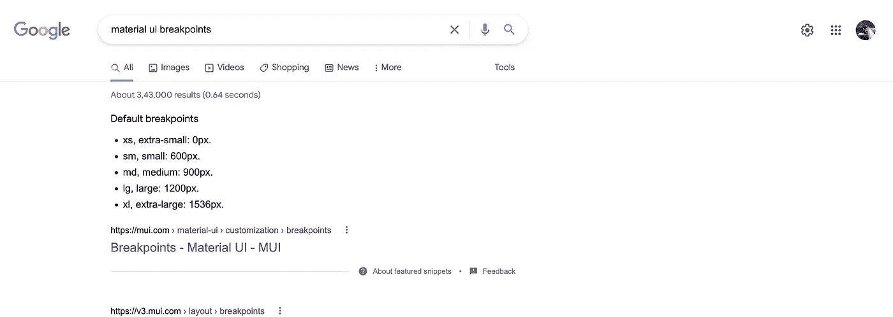

# 材料界面的响应度

> 原文：<https://javascript.plainenglish.io/responsiveness-in-material-ui-f34a87dce82f?source=collection_archive---------20----------------------->

## 爱/恨的故事



## 在后台

当我开始使用材质 UI 时，我成了它的粉丝。但是久而久之我发现材料用户界面不容易定制。好吧，如果你认为定制不是那么重要，我的朋友，你应该看看这个故事。

[](https://dev.to/shreyvijayvargiya/new-currency-in-software-development-jna) [## 软件开发中的新货币

### 软件开发发展非常快，我们总是有新的东西出现。在上个月，我…

开发到](https://dev.to/shreyvijayvargiya/new-currency-in-software-development-jna) 

回来，定制成为现有组件材料 UI 的一个相当大的瓶颈，但我们在 iHateReading 中设法解决了这个问题。直到我们遇到更大的问题，称为断点和响应。

我知道我们是新来的，问题可能看起来很容易，但每个人在第一次尝试和第一次学习时都会被卡住。

## 回应——恨与爱的故事

实际上，如果你问我个人，前面最无聊的部分是写 CSS 或者特别是处理响应。

当我进入 react-native 开发时，甚至 CSS 也没有离开我。在深入研究移动应用程序开发之前，我认为我们不需要处理很多响应性的边缘情况，但我在这一点上也错了。

仇恨的故事从我们的网站(iHateReading)开始，因为我们面临着各种设备的 UI 故障问题。

一些手机不能正确对齐，桌面和大屏幕都有一些或其他类型的 UI 或 CSS 故障。

我们用来解决问题的方法是一个一个地解决问题。


This was us for handling responsiveness

## 仇恨&更多的仇恨

我的意思是，我们试图添加媒体查询，边缘情况和 bla bla 什么的。但是如何在这里和那里一些种类的屏幕得到打破或不固定或一些设备是如此僵化，不能显示正确的用户界面预期。

## 爱情故事

因此，在忙碌了很长时间后，我们回到了基础。昨天，在改变我们的网站用户界面之前，我们想找到一个适当的响应解决方案。

**关键步骤** —我们最终再次阅读材料 UI 文档。

所以我谷歌出了素材 UI 断点。

我找到了关于它以及如何正确使用它的专用页面文档。早些时候，当我开始使用素材 UI 断点时，我们使用“向下”和“向上”方法为多个设备添加媒体查询。

这就是我们面临的无法处理所有 edge 案例的问题，因为有时卡组件在 Ipad 等手机和 MacBooks 等台式机上看起来相同或宽度相同。

这当然不是预期的行为，每个设计师为手机和台式机设计不同的组件。他们是兄弟姐妹的几率很小，或者说他们是双胞胎的几率很小。

因此，当我们设计手机和台式机的外观时，我们决定让它们成为兄弟姐妹，而不是双胞胎，并使用道具和媒体查询来改变它们的外观。

但是断点方法，例如用于材质 UI 的“向下”和“向上”太麻烦了。

## 砍

Material UI 提供了使用主题对象添加媒体查询的`makeStyles`方法。

举个例子，

看看上面代码中的根样式，我们为尺寸小于 600px 的设备添加了一个断点。

这是材质界面中每个道具的尺寸映射。


Material UI breakpoints dimensions

```
xs = 0px;
sm = 600px;
md = 900px;
lg = 1200px;
xl = 1500px
```

这很简单，那么我们为什么会面临问题呢？

该问题存在于 900 到 1200 px 之间，这是大多数桌面和设备存在的地方。

为此，我们使用另一个名为 between 的断点方法。这是在编写多个媒体查询时节省大量时间的最强大的方法。

现在，存在于 900 和 1200 px 之间的设备可以使用 between 方法获得 CSS。

看看下面的代码，我们没有添加最大宽度和最小宽度的媒体查询，而是简单地使用文本 sm，md，我们的响应将被处理。

Handling responsiveness like a PRO

## 结论

Material UI 提供了大量的组件，现在我们有了一种轻松处理响应的方法。关于定制的另一件事是 Material UI 发布了 mui base——使用 Material UI 的无头 UI 库或无样式的 Material UI 库。

这意味着我们将只使用 MUIBase UI 组件，并提供我们自己的主题系统或样式。根据设计高度定制。世界正朝着无头用户界面的方向发展，所以物质用户界面也在朝着同样的方向发展。

[](https://youtube.com/shorts/9-2D9DiQkGs) [## 无头 UI -前端 Web 开发中的新趋势概念#短片

### 无头 UI 是前端 web 开发中的新趋势概念，因为它具有高度的可定制性和可扩展性…

youtube.com](https://youtube.com/shorts/9-2D9DiQkGs) 

继续发展

*   shrey([T3)T5**)**](http://ihatereading.in)

*更多内容请看*[***plain English . io***](https://plainenglish.io/)*。报名参加我们的* [***免费周报***](http://newsletter.plainenglish.io/) *。关注我们关于*[***Twitter***](https://twitter.com/inPlainEngHQ)[***LinkedIn***](https://www.linkedin.com/company/inplainenglish/)*[***YouTube***](https://www.youtube.com/channel/UCtipWUghju290NWcn8jhyAw)***，以及****[***不和***](https://discord.gg/GtDtUAvyhW) **