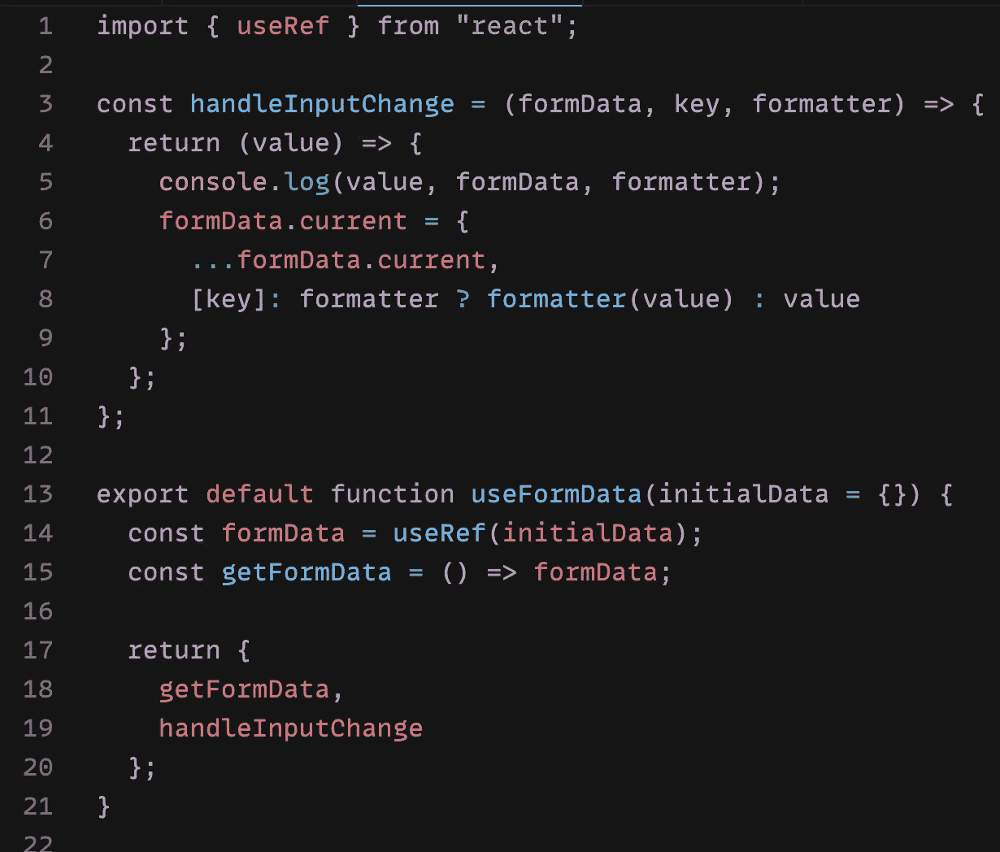
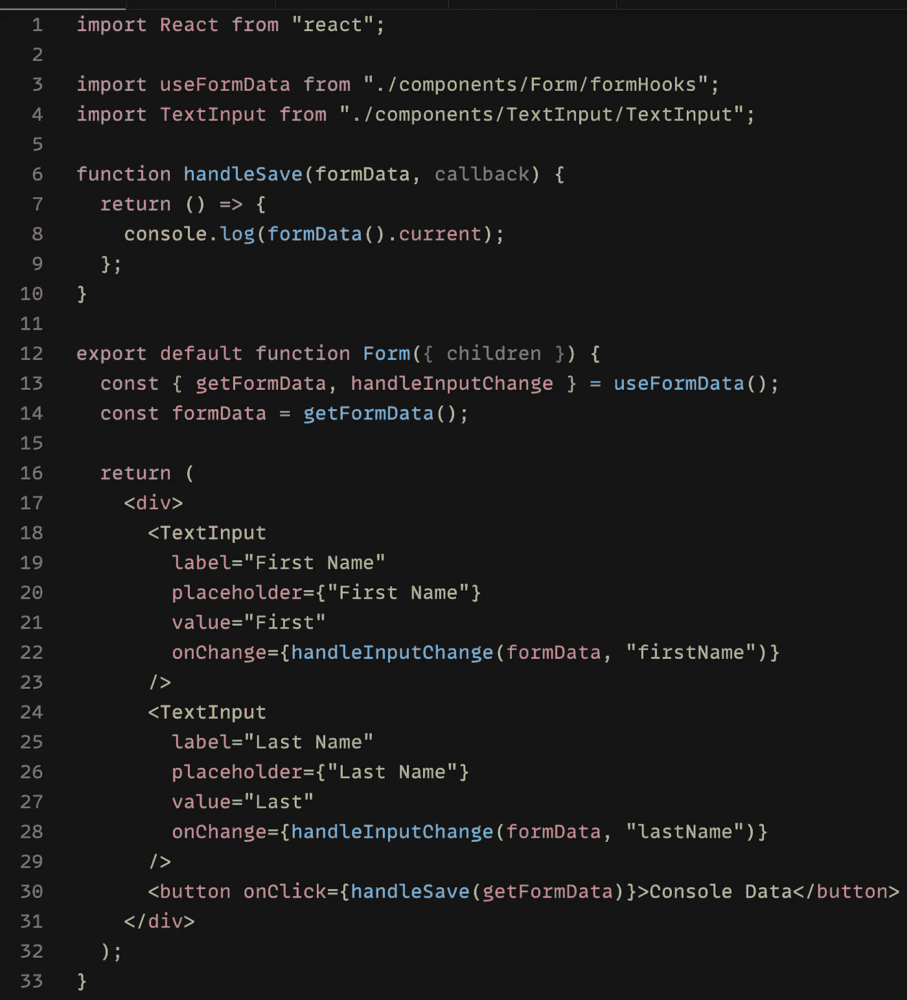

# 对 React 表单数据管理的再思考

> 原文：<https://javascript.plainenglish.io/rethinking-the-data-management-for-react-forms-de1a78fe328?source=collection_archive---------10----------------------->

## 这个简单的技术可以让你在一个表单中省去多次重新渲染。

## 当用户更新字段时，如何在表单中保存不必要的重新呈现。

Photo by [Patrick Tomasso](https://unsplash.com/@impatrickt?utm_source=medium&utm_medium=referral) on [Unsplash](https://unsplash.com?utm_source=medium&utm_medium=referral)

## 这是一个真实的故事

这篇文章描述的事件发生在现实生活中。作者想用假名来避免尴尬。但是后来他意识到他是无名之辈，没有人关心他在日常生活中经历了什么。

## 问题是

所以，我去年在 React 上写了一篇关于“[如何处理表单](/a-better-way-to-handle-forms-and-input-with-react-e01500ac73c)”的帖子。这是一个很好的技巧。但后来我意识到，我们是在一次字段更新中重新呈现所有内容。我意识到了这个问题，但我对这个问题视而不见，认为“这没什么大不了的。我的表单中永远不会有超过 10 个字段。但是时代变了，我加入了一个新的组织。现在，我要在一个表单中处理 50 多个字段。然后这个重新渲染对我们来说是一个很大的问题。

架构很简单:

*   表单组件像 HOC 一样，在其状态中存储所有字段的值。
*   特设公开其状态和通过上下文更新它的函数。
*   当用户更新时，输入字段调用公开的函数。

乍一看，这是一个干净的架构。但是，在一次字段更新中重新呈现所有内容是非常昂贵的。

## 解决中的问题

当然，解决这个问题有多种方法。我认为记忆输入字段是我的第一直觉。而且也没什么不好(至少我是这么想的)。但是后来我意识到我所有的输入组件都依赖于上下文。出于某种原因，如果我不传递上下文，整个系统就会崩溃。这是我书中的一个问题。另外，Memoizing 本身并不坏，但是在这里使用它并不是一个优雅的解决方案(是的，我说过)。就好像我仍然对糟糕的建筑问题视而不见。

那么，有什么更好的解决方案可以拯救我作为前端架构师的尊严呢？

## 解决方案

让我们回顾一下我们的理想解决方案应该是什么样的:

*   不应该在一次更新中重新呈现整个表单。
*   输入字段应该独立工作。如果这要求太高，那么至少它应该更优雅地处理错误场景(即没有上下文)。
*   不应该使用记忆，因为这不是我们情况下的解决方案。
*   表单组件应该管理顶层的所有数据。

有一天，我阅读了 Kent C Dodds 的一篇文章，文章中提到，应该让状态尽可能靠近使用它的组件。这有助于您节省一些重新渲染，并且您不必像一个无知的白痴一样通过多个组件传递状态。这在我脑海中引发了一个问题— *如果每个输入字段都处理自己的状态会怎么样？*它解决了我们一半的问题:

*   表单不会在每次更新时重新呈现。
*   输入字段将独立于上下文。即使没有任何特设，它仍然可以工作。
*   记忆化绝对是不可能的。

但是这里有一个巨大的问题。如果每个字段处理自己的状态，我们如何在一个点收集所有表单数据？现在，为什么我们需要所有的数据在一个地方？显而易见的答案是，我们需要将数据发送到服务器。假设我们将数据存储在表单组件的状态中，并公开一个函数(通过上下文)来更新状态。您可以在表单提交或任何需要的地方访问数据。一切看起来都很好(目前)，但是如果您需要根据一个字段的值更新另一个字段，该怎么办呢？你会说也公开表单状态，对吗？嗯，我也是这么想的。但是现在我们回到了最初的问题——状态更新，这反过来又他妈的重新渲染了一遍整个事情。有人，请杀了我吧。不不等等。有一个解决办法。

## 拯救世界的裁判

从事 React 工作的聪明人知道，有些情况下，即使数据更新了，你也不想更新 UI。所以他们创建了 Ref API。现在我们知道，当 Ref 更新时，组件不会重新呈现自己。

参考文献可能是我们潜在的解决方案。如果我们不使用状态，而是使用 Ref，并公开 Ref 和一个函数来更新它，会怎么样？它也解决了我们的最后一个问题——表单不会在 Ref 更新时重新呈现自己。而且我们在一个地方也有完整的表单数据，任何输入都可以访问整个表单数据。

## 说够了，给我们看些代码(WTF 你怎么了？)

好吧，我知道从文章一开始就只是说说而已。现在让我们快速看看如何适度地实现这种方法。

## **处理表单数据的钩子:**

A form data handler hook that takes care of everything.

在这里，我创建了一个自定义钩子:`useFormData`。您可以将初始的表单状态传递给钩子，它将返回一个函数`getFormData`来获取当前的表单数据。它还返回另一个函数`handleInputChange`，来更新存储表单数据的 Ref 对象。当用户更新输入时，我们需要调用这个函数。所以我们基本上保留了表单数据的副本。请注意，我们绝不会在上层操纵这些数据。只有输入字段可以(并且应该)改变数据。

## 使用钩子的表单组件:

The Form component

它是一个简单的表单组件，使用我们刚刚创建的钩子。它呈现两个文本输入字段。并将`handleInputChange`函数传递给每个文本字段。当用户更新字段值时，Input 将调用这个函数。

这里是一个完整的工作代码沙盒链接:

Fully working codesandbox

现在你知道如何以更好的方式处理表单了。我希望你在这里学到了新东西。

# 关于作者

Bharat 自 2011 年以来一直是前端开发人员。他对“前端开发经验”情有独钟。他喜欢学习和教授技术。

总的来说是个好人。在 [Twitter](https://twitter.com/iiisoni) 、 [Github](https://github.com/iiison) 、 [Linkedin](https://www.linkedin.com/in/iiison/) 上找到他。

*更多内容看* [***说白了就是 io***](http://plainenglish.io/) *。报名参加我们的* [***免费周报***](http://newsletter.plainenglish.io/) *。在我们的* [***社区获得独家访问写作机会和建议***](https://discord.gg/GtDtUAvyhW) *。*