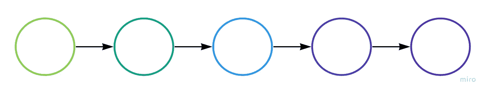
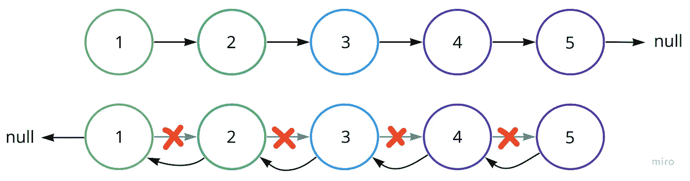

# 如何在 JavaScript 中反转链表

> 原文：<https://javascript.plainenglish.io/reverse-a-linked-list-2bafc23ecce5?source=collection_archive---------15----------------------->

## JavaScript 中反转链表的教程。

这是对 Leetcode 的#206 的一个解决方案，对我来说，这个问题真正让我对链表遍历中涉及的步骤有了一个透彻的理解。

当在抽象空间中(沿着链表)采取“步骤”时，都是关于三个中心问题:

1.  你去哪了？
2.  你现在在哪里？
3.  你要去哪里？

正是这种信息的存储和重组为这个问题提供了一个非常简单的解决方案。

给定我们的节点类…

这是我的方法:

我决定使用 while 循环，而不是递归，只是为了打破它，做一些新的事情。

充分跟踪我的前一个、当前和下一个值允许我根据需要中断和创建新的“下一个”指针，同时不会丢失列表的任何方面。

现在你知道了。感谢您的阅读。

*更多内容看* [***说白了。报名参加我们的***](https://plainenglish.io/) **[***免费周报***](http://newsletter.plainenglish.io/) *。关注我们关于* [***推特***](https://twitter.com/inPlainEngHQ) *和****[***LinkedIn***](https://www.linkedin.com/company/inplainenglish/)*。加入我们的* [***社区***](https://discord.gg/GtDtUAvyhW) *。**