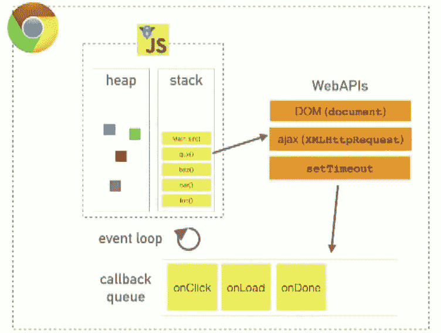

# 修订 2022 年的关键 JavaScript 概念

> 原文：<https://javascript.plainenglish.io/revise-key-javascript-concepts-for-2022-91ea149004f1?source=collection_archive---------4----------------------->


Photo by [Pankaj Patel](https://unsplash.com/@pankajpatel?utm_source=medium&utm_medium=referral) on [Unsplash](https://unsplash.com?utm_source=medium&utm_medium=referral)

嗨，伙计们！现在是 2022 年，我写这个故事仍然没有任何犹豫。每当我开始修改 JavaScript 时，我每次都能学到新的东西。

所以希望如此，我又开始修改了，非常欢迎你加入我！在这个简明扼要的故事中，我的重点是这门语言中一些最常用但又最重要的部分。

# JavaScript 是如何工作的？—发动机

JavaScript 遵循 JIT(即时)编译，也就是说，代码在执行时或执行前进行编译。这由一个 JS 引擎负责(比如 chrome 的 V8)。

典型的 JS 引擎有两个主要组件[参见 JS 中的[事件循环]:](https://developer.mozilla.org/en-US/docs/Web/JavaScript/EventLoop)

1.堆内存，内存分配是自动完成的。

2.调用堆栈，在那里代码执行，告诉哪一行代码正在执行。

JavaScript 可以一次处理一个任务(单线程)，但是我们可以利用 JS 的异步特性以非阻塞的方式执行并发任务。



for goosebumps :)

该引擎有两个主要阶段:编译和执行。

编译阶段包括创建作用域，解析程序的语法结构；创建抽象语法树(AST ),并最终将 AST 转换为可执行代码。

目前，虽然从程序上讲，我们不能在 JS 中触发垃圾收集，但是 JS 中有一个垃圾收集机制，当不再需要时，它会自动释放分配的内存。

# JavaScript 中的范围

JS**T3 中声明的范围可以是词法的，也可以是动态的。词法范围由声明函数/代码的位置定义(作者时)。动态范围是在运行时确定的，它涉及函数/代码在哪里被调用来执行。**

JS 中的词法默认作用域是窗口/全局作用域。当一个变量被定义在某些边界之间时，一个局部作用域就被创建了。

在 JS 中，声明被移动到它们作用域的顶部，从而确保我们可以在它们的声明之前使用变量/函数。JS 的这种行为叫做**吊装**。

```
*function getName() { 
 name = 'JS';
 var name;
}**console.log(name);* 
// Reference Error as 'name' is not declared in global scope
```

# JavaScript 中的闭包

```
*function outer() { 
 var m = 5;
 function inner() { 
  console.log(m);
  }
 return inner;
}**var myClosure = outer();
myClosure(); // 5*
```

让我们把下一行读 2-3 遍，以便更好地复习闭包。当一个函数能够记住并访问它的词法作用域(写它的时间和位置)时，即使这个函数在它的词法作用域之外执行，闭包也会被创建。在上面的例子中，inner()能够做到这一点。
JavaScript 闭包可以用来实现[节流和去抖](https://dev.to/iyashsoni/javascript-debounce-vs-throttle-392i)功能。

# *JavaScript 中的‘this’*

[*这个*](https://developer.mozilla.org/en-US/docs/Web/JavaScript/Reference/Operators/this) 关键字是指它所绑定的对象/范围。*这个*告诉一个对象的上下文。因此，了解对象的绑定变得很重要。值得注意的是*这个*指的不是词法而是运行时绑定。这意味着，我们所指的实际上下文是在运行时为 *this 决定的执行上下文。<对象>。*

在非严格模式下，这个的默认绑定是窗口/全局上下文。

```
*var n = 10;
console.log(this.n);* // 10
```

我们来看看*这个*是怎么指执行范围的:

```
*function getName() { 
  console.log(this.name); 
}

const obj = {  
  name: 'name one',
  getName: getName,
  innerObj: {
    name: 'name two',
    getName: getName
  }
}**obj.getName();* // name one
*obj.innerObj.getName();* // name two
```

# 在 JavaScript 中绑定、调用和应用方法

*绑定*方法用于将 *this* 关键字设置为提供的值。

```
*this.name = 'Hundred';   
const obj = {
  name: 'One',
  getName: function() { return this.name; }
};

obj.getName();*
//  returns 'One'

*const retrieveName = obj.getName;
retrieveName();*
//  returns 'Hundred'; the function gets invoked at the global scope

*const boundGetName = retrieveName.bind(obj);
boundGetName();*
//  returns 'One'
```

使用*调用*方法，我们可以编写一次方法，然后在另一个对象中继承它，而不必为新对象重写它。

*调用*方法使用给定的 *this* 值和单独提供的参数调用函数。

```
*var n = 10;
function numb() { 
 console.log(this.n)
}
var obj = { n: 77 }**numb();* // 10
*numb.call(obj);* // 77
```

*apply* 方法使用给定的 *this* 值和作为数组或类数组对象提供的参数调用函数。

```
// conventionally
*console.log(Math.max(5, 6, 1, 9, 2))* // 9;// using apply
*var numbs = [5, 6, 1, 9, 2];
var max = Math.max.apply(null, numbs);
console.log(max);* // 9
```

# JavaScript 中的生活

JS 中的立即调用函数表达式(IIFE)是一个匿名函数，一旦被定义就被调用。使用 IIFE 的主要目的是数据隐私，因为它内部的声明不能在全局范围内使用。

```
*(function(a, b){         
     console.log(a+b); 
})(5,10);*// 15
```

如果我们想在浏览器加载 JS 文件时立即执行一些代码，我们也可以这样做。

# JavaScript 中的 Currying

curry 函数的结果是一个包装函数。下面是 JS 中一个基本的 currying 示例:

```
*const sumCurryFunc =(a) => {
    return (b)=>{
        return (c)=>{
            return a+b+c;
        }
    }
}**console.log(sumCurryFunc(2)(3)(5));* // 10
```

这个例子展示了操纵 DOM 的 currying 用法。

# JavaScript 中的记忆化

记忆是一种记忆/存储先前计算结果的优化技术。我们也可以称之为缓存，它可以确保函数不会因为相同的计算而被再次执行，从而提高性能。高阶函数(接受另一个函数作为自变量或返回一个函数的函数)和闭包是实现记忆化的基础。

```
// factorial of a number
*const factorial = num => {
  if (!factorial.cache) factorial.cache = {};

  if (factorial.cache[num] !== undefined) {
    console.log(num + 'is cached')
    return factorial.cache[num];
  } else console.log(num + ' is not cached');

  factorial.cache[num] = num === 0 ? 1 : num * factorial(num - 1)
  return factorial.cache[num]
}*console.log(fact(5));
console.log(fact(2));
console.log(fact(5)); // 5 is cached; 120
```

# ES6 功能

为了提醒我们，下面列出了 ES6 的一些重要功能:

*   let 和 const:块级范围；`function() {const name='JS'; let greet; greet='good morning';}`
*   [箭头功能](https://developer.mozilla.org/en-US/docs/Web/JavaScript/Reference/Functions/Arrow_functions)
*   模板文字:`const name="JS”; `Hello ${name}``
*   默认参数:`function(name='') {}`
*   对象分解:`const obj={ name: 'JS'}; const { name } = obj; console.log(name);`
*   [班级](https://developer.mozilla.org/en-US/docs/Web/JavaScript/Reference/Classes)
*   [模块](https://developer.mozilla.org/en-US/docs/Web/JavaScript/Guide/Modules)

# JavaScript 中的承诺

在 JavaScript 中，还可以将函数作为参数传递给函数。作为参数传递的函数称为**回调**函数。回调函数在前一个函数完成执行后执行。

```
*function hasCallback(text, callback) {
  setTimeout(function() {
    callback(text);
  }, 2000);
}**hasCallback('hello', function(v){ console.log(v) });*
// after 2 seconds, 'hello' is printed
```

在 JS 中，承诺用于处理异步逻辑。一旦承诺得到回应，它要么*解决*(成功)，要么*拒绝*(错误)*。*这两种情况我们都可以分别用 *then* 或者 *catch* 来处理，同时调用一个承诺。

```
*var promise = new Promise(function(resolve, reject){
     if (condition) { resolve('success'); }
     else { reject(''fails); }
});**promise
  .then(function() {* // handle success *})
  .catch(function(error)) {* // handle failure *}*// using async await *try {
    const response = await promise;
    console.log(response)
 }
 catch(error) {
    console.log(error)
 }*
```

# JavaScript 数组方法

让我们来看看开发人员日常生活中常用的一些数组方法:

```
*const res=['tax', 'limit', 'elite'].****filter****(word => word.length < 4);
console.log(res);*
// ["tax"]*const mapArr = [1, 4, 9, 16].****map****(x => x * 2);
console.log(mapArr);*
// [2, 8, 18, 32]*['a', 'b', 'c'].****forEach****(element => console.log(element));* // "a" "b" "c"*console.log([2, 1, 4].****includes****(1));*
// true*const sumWithInitial = [1, 2, 3, 4].****reduce****(
  (previousValue, currentValue) => previousValue + currentValue,
  0
);
console.log(sumWithInitial);*
// 10*console.log(['camel', 'duck', 'elephant'].****slice****(1));*
// ["duck", "elephant"]*console.log(['camel', 'duck', 'elephant'].****splice****(1, 0, 'ant'));*
// ['camel', 'ant', 'duck', 'elephant']*console.log([0, 1, 2, [3, 4]].****flat****());*
// [0, 1, 2, 3, 4]
```

# JS 中的生成器

在[生成器](https://developer.mozilla.org/en-US/docs/Web/JavaScript/Guide/Iterators_and_Generators)的帮助下，(使用*声明为生成器)我们可以暂停一个函数的执行，并且可以从它停止的地方继续。

```
*function * fun() {
    yield 10;
    yield 20;
    yield 30;    
 }

var gen = fun();*
*console.log(gen.next().value);* // 10 *console.log(gen.next().value);* // 20 *console.log(gen.next().value);* // 30
```

# JavaScript 中最新最酷的特性

1.  可选链接:帮助访问深度嵌套的对象属性，而不用担心属性是否存在。

```
*const obj = { name: 'JS', level: 7 }*
*console.log(obj?.name);* // JS
*console.log(obj?.age);* // undefined
*console.log(obj?.name?.firstName);* // undefined
```

2.**无效合并:**检查一个变量是否是真正意义上的无效:)

```
*console.log(false ?? '');*
// false*console.log(false || '');*
// ''
```

3. **Promise.allSettled:** 接受一组承诺，只有当所有承诺都被结算时才进行结算。

```
*const promise1 = Promise.resolve(3);
const promise2 = new Promise((resolve, reject) => setTimeout(reject, 100, 'example'));**Promise.allSettled([promise1, promise2]).
  then((res) => res.forEach((r) => console.log(r.status)));*// fulfilled
// rejected
```

JavaScript 一直在发展，是最流行的编程语言之一。让我们看看它接下来会有什么。到那时，快乐的编码和感谢阅读！

*更多内容请看*[***plain English . io***](https://plainenglish.io/)*。报名参加我们的* [***免费周报***](http://newsletter.plainenglish.io/) *。关注我们关于*[***Twitter***](https://twitter.com/inPlainEngHQ)*和*[***LinkedIn***](https://www.linkedin.com/company/inplainenglish/)*。加入我们的* [***社区不和谐***](https://discord.gg/GtDtUAvyhW) *。*