# 滑稽可笑的编程迷因让每个开发人员开怀大笑

> 原文：<https://javascript.plainenglish.io/ridiculously-funny-programming-memes-to-make-every-developer-laugh-out-loud-cbee16f25e33?source=collection_archive---------0----------------------->

## 2022 年最佳编程模因汇编

Photo by [Tim Mossholder](https://unsplash.com/@timmossholder?utm_source=medium&utm_medium=referral) on [Unsplash](https://unsplash.com?utm_source=medium&utm_medium=referral)

新的一年，新的开始。作为你的微笑专家，我想再写一篇文章，收集社交媒体上流行的编程笑话。

这些笑话的目的是让你发笑，改善你的心情。因为:

**“笑是人机最好的刷新按钮”**

让我们沉浸在笑声中…

# 当我去寻找答案的时候…

Picture Credit: [https://www.monkeyuser.com/](https://www.monkeyuser.com/)

# 如何生成随机字符串？

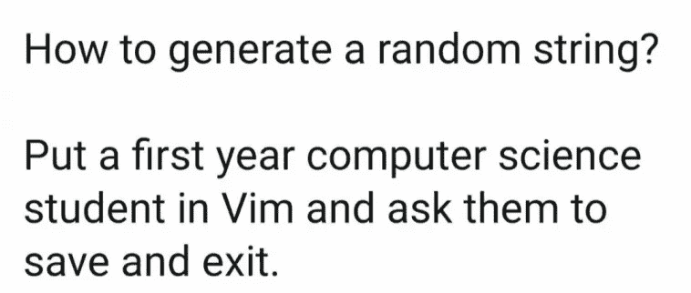

Picture Credit: [https://programmerhumor.io/programming-memes](https://programmerhumor.io/programming-memes)

# 当没有饭桶的时候…

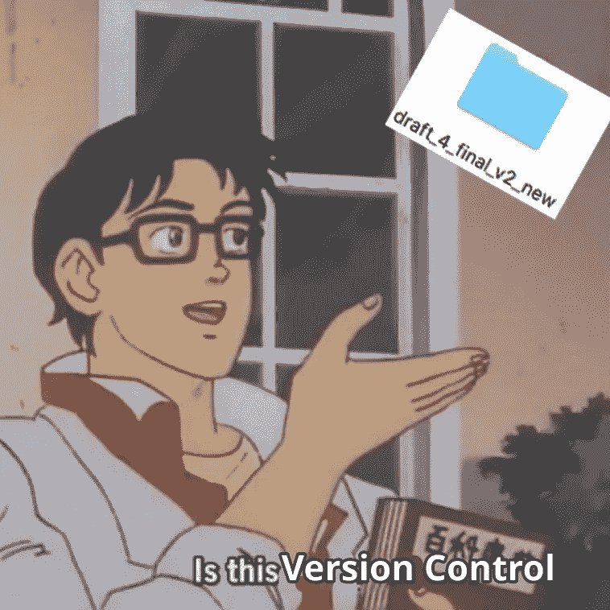

Picture Credit: [https://programmerhumor.io/programming-memes](https://programmerhumor.io/programming-memes)

# 职业道路…教程在这里…

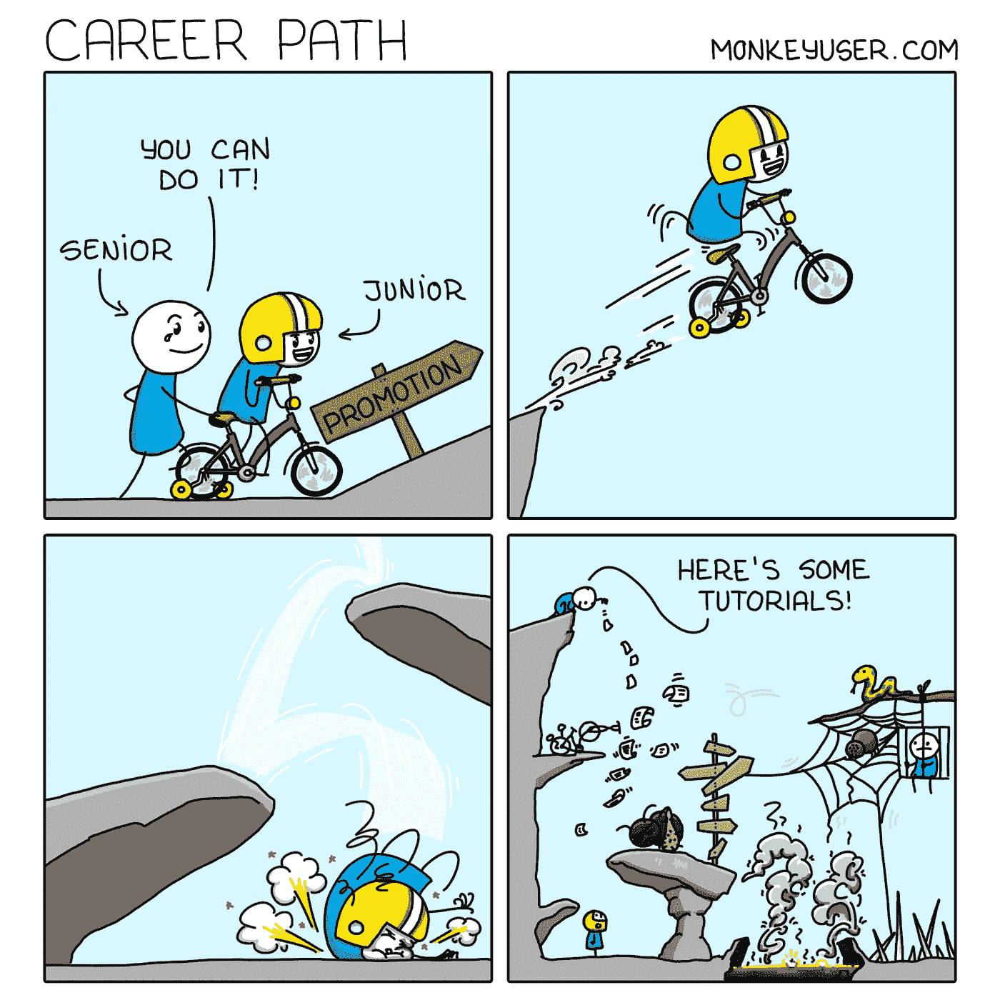

Picture Credit: [https://www.monkeyuser.com/](https://www.monkeyuser.com/)

# 你喜欢哪一个？

Picture Credit: [https://programmerhumor.io/programming-memes](https://programmerhumor.io/programming-memes)

# 嗯…现在一切都没问题了…

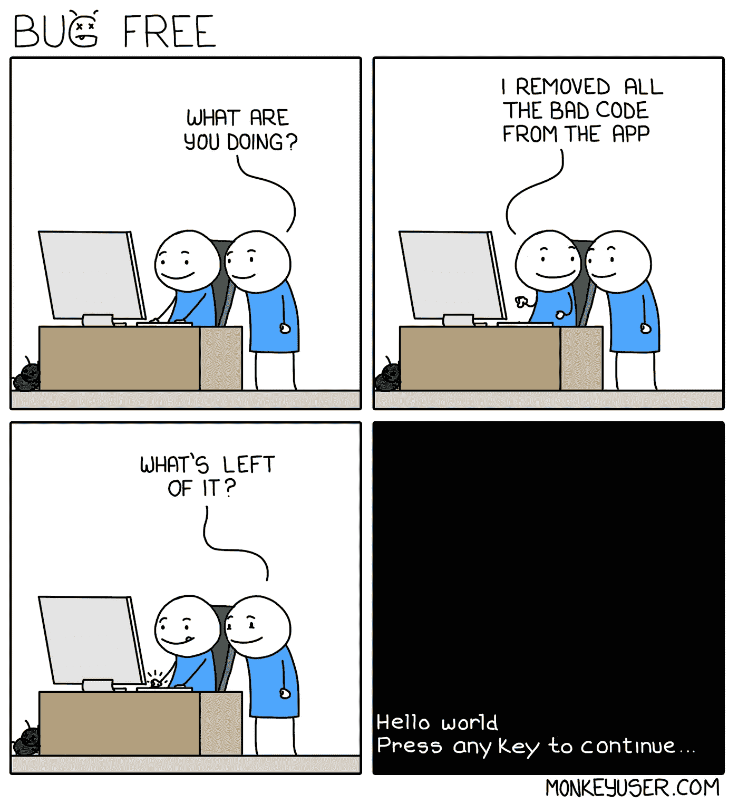

Picture Credit:Picture Credit: [https://www.monkeyuser.com/](https://www.monkeyuser.com/)

# 你有 CS 背景吗？

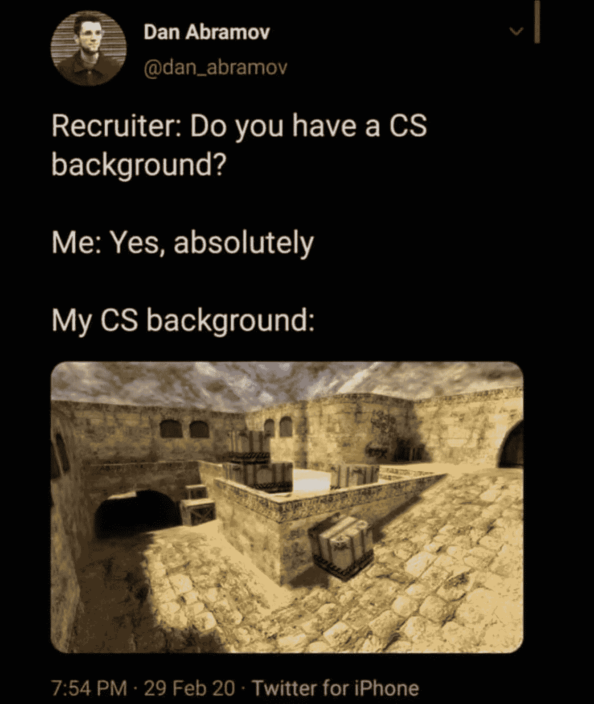

Picture Credit: [https://www.facebook.com/javascriptJS](https://www.facebook.com/javascriptJS)

# 项目增长…以植物为例…

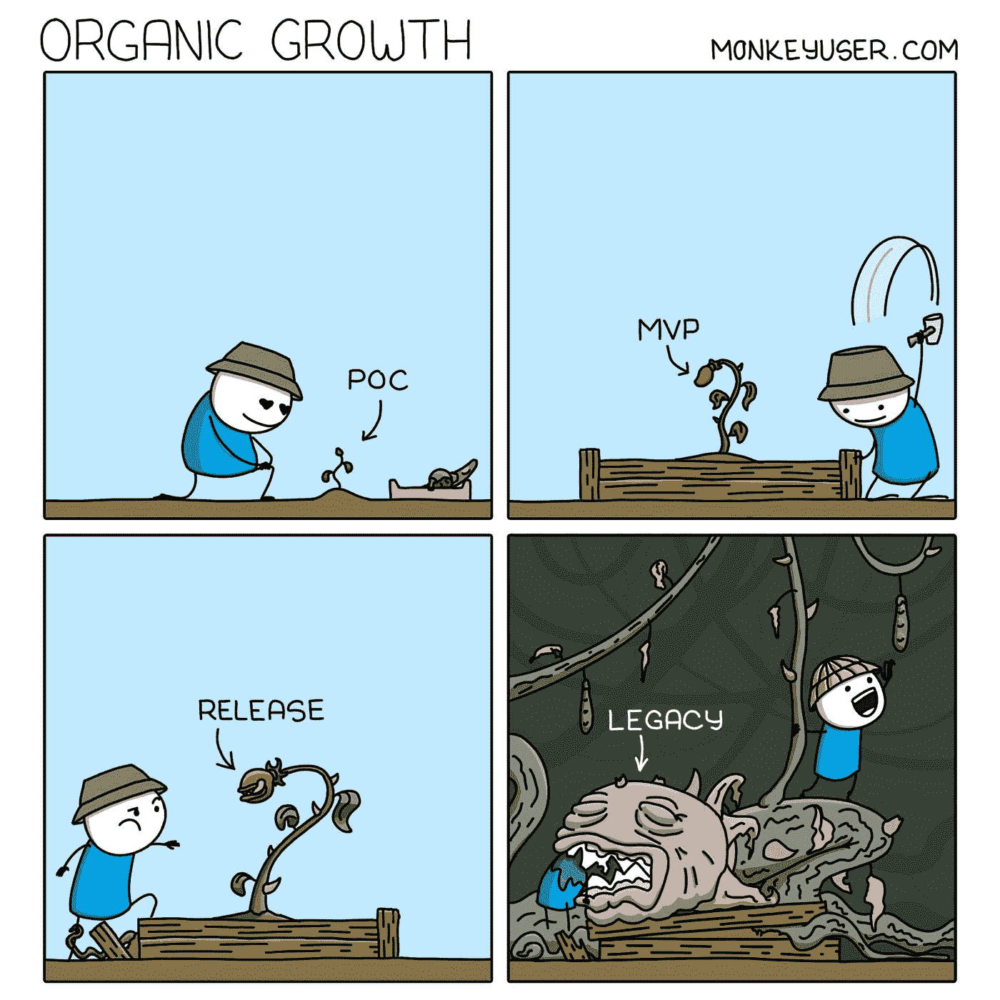

Picture Credit:Picture Credit: [https://www.monkeyuser.com/](https://www.monkeyuser.com/)

# 我们将重构这个方法…

Picture Credit:[https://www.reddit.com/r/ProgrammerHumor](https://www.reddit.com/r/ProgrammerHumor)

# 我的最佳实践…

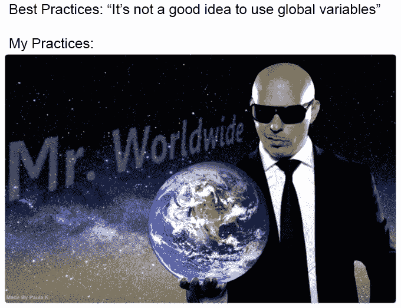

Picture Credit:[https://programmerhumor.io/programming-memes](https://programmerhumor.io/programming-memes)

# 对敏捷的需求？

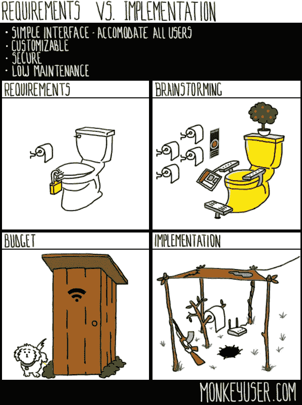

Picture Credit:[https://www.monkeyuser.com/2016/requirements-vs-implementation](https://www.monkeyuser.com/2016/requirements-vs-implementation)

# 那种感觉更爽…

Picture Credit:[https://programmerhumor.io/programming-memes](https://programmerhumor.io/programming-memes)

# 这里有些可疑…

Picture Credit:[https://www.facebook.com/yuva.krishna.memes](https://www.facebook.com/yuva.krishna.memes)

# 最佳建议…

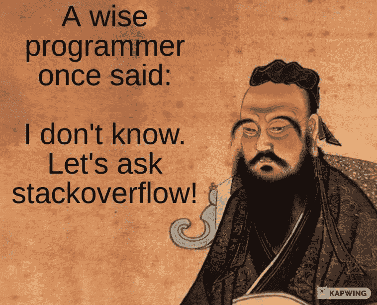

Picture Credit:[https://programmerhumor.io/programming-memes](https://programmerhumor.io/programming-memes)

# 当他们扩展他们的需求时…

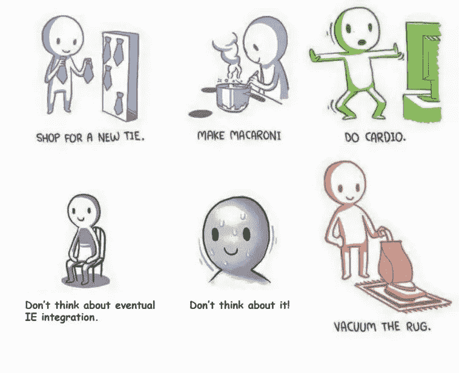

Picture Credit: [https://programmerhumor.io/programming-memes](https://programmerhumor.io/programming-memes)

> 一些额外的剂量

# 我不需要你…让我放下你，伙计…

[https://www.reddit.com/r/ProgrammerHumor/comments/oo16aa/im_sorry_dear_data/](https://www.reddit.com/r/ProgrammerHumor/comments/oo16aa/im_sorry_dear_data/)

# 不要教我写了什么…哈哈

[https://www.reddit.com/r/ProgrammerHumor/comments/oo4ttu/perplexed_obama/](https://www.reddit.com/r/ProgrammerHumor/comments/oo4ttu/perplexed_obama/)

# 需要经历几个阶段？

[https://www.monkeyuser.com/2017/code-review-stages/?sc=true&dir=random](https://www.monkeyuser.com/2017/code-review-stages/?sc=true&dir=random)

# 希望我的周期到达那里…但是如何？

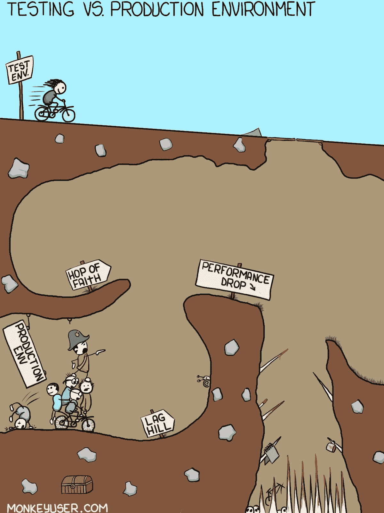

[https://www.monkeyuser.com/2017/testing-vs-prod-env/?sc=true&dir=random](https://www.monkeyuser.com/2017/testing-vs-prod-env/?sc=true&dir=random)

# 我靠编程挣钱…

[https://www.facebook.com/photo/?fbid=349251050087280&set=gm.1262598024177843](https://www.facebook.com/photo/?fbid=349251050087280&set=gm.1262598024177843)

# 一切皆有可能…

[https://www.facebook.com/techwithcodex/photos/a.137007467972178/331986501807606/](https://www.facebook.com/techwithcodex/photos/a.137007467972178/331986501807606/)

# 不要和我眼神接触…我是最棒的…哈哈

[https://twitter.com/MayaShavin/status/1414659230833971205/photo/1](https://twitter.com/MayaShavin/status/1414659230833971205/photo/1)

# 没有布尔怎么有主见？

[https://twitter.com/realColinMac/status/1375360353442295811/photo/1](https://twitter.com/realColinMac/status/1375360353442295811/photo/1)

# 同辈压力？他会让我们的周末变得很糟糕…

[https://imgur.com/t/funny/Mk5F6E1](https://imgur.com/t/funny/Mk5F6E1)

# 最喜欢的诗？让我们做一个迷因。英雄联盟

[https://www.reddit.com/r/ProgrammerHumor/comments/ooi4ov/haha/](https://www.reddit.com/r/ProgrammerHumor/comments/ooi4ov/haha/)

# 我可以做任何事…我喜欢在压力下工作…等等…

[https://www.reddit.com/r/ProgrammerHumor/comments/oorx87/halp/](https://www.reddit.com/r/ProgrammerHumor/comments/oorx87/halp/)

# 让我们完成这个简单的问题，不会花太多时间…

[https://www.reddit.com/r/ProgrammerHumor/comments/oog2m0/in_and_out_20_minute_adventure/](https://www.reddit.com/r/ProgrammerHumor/comments/oog2m0/in_and_out_20_minute_adventure/)

# 选谁？如此多的选择…

[https://www.reddit.com/r/ProgrammerHumor/comments/oorx87/halp/](https://www.reddit.com/r/ProgrammerHumor/comments/oorx87/halp/)

# 我知道怎么解决问题..因为我知道如何搜索…

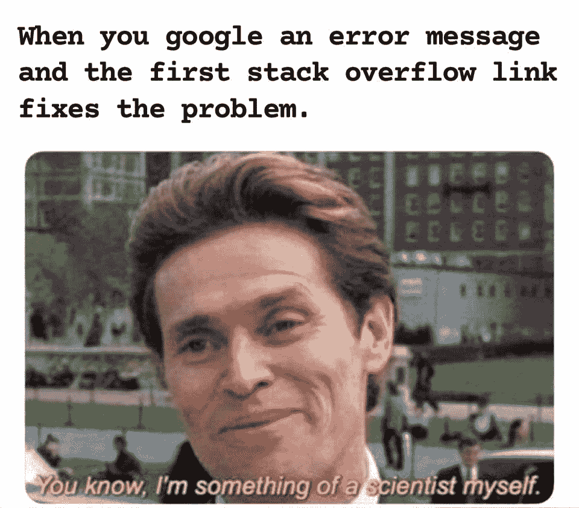

[https://www.reddit.com/r/ProgrammerHumor/comments/ooiodh/my_job_in_a_nutshell/](https://www.reddit.com/r/ProgrammerHumor/comments/ooiodh/my_job_in_a_nutshell/)

# 让我们一步一步来解决这个问题

[https://www.monkeyuser.com/2017/step-by-step-debugging/?sc=true&dir=random](https://www.monkeyuser.com/2017/step-by-step-debugging/?sc=true&dir=random)

# 为什么代码中有这么多问题？因为你不听我们的…

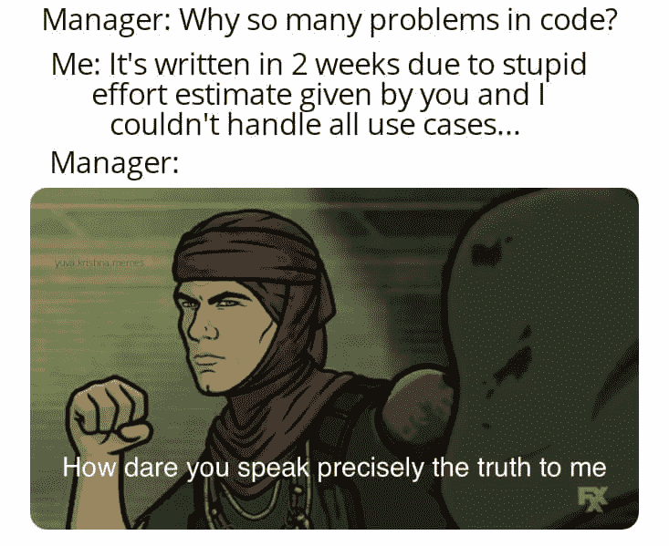

[https://www.facebook.com/yuva.krishna.memes/photos/a.105527467815845/376691704032752/](https://www.facebook.com/yuva.krishna.memes/photos/a.105527467815845/376691704032752/)

# 一旦你发出通知..没人关心你…

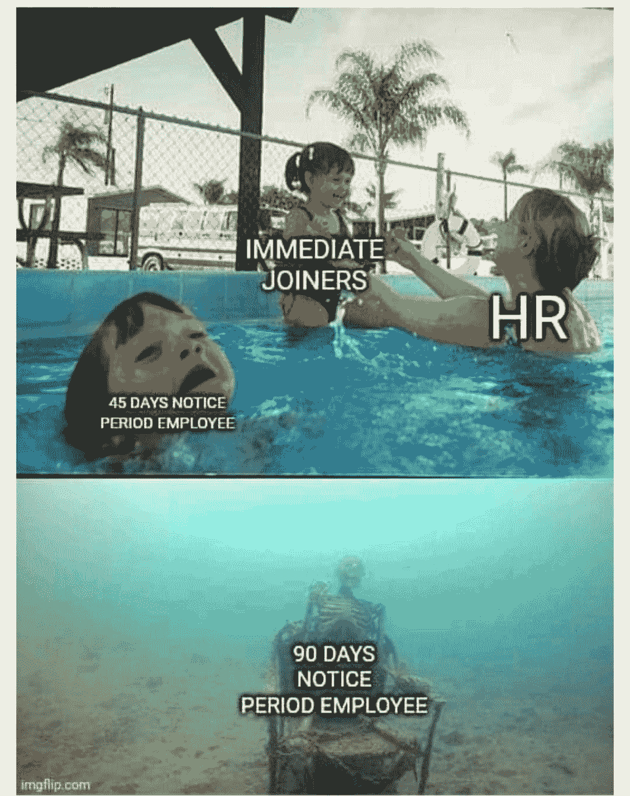

[https://www.facebook.com/MyTechUpdatez/photos/a.1538993499579197/2517427421735795/](https://www.facebook.com/MyTechUpdatez/photos/a.1538993499579197/2517427421735795/)

# 为什么介绍得太多了？

[https://www.facebook.com/photo/?fbid=884349669091127&set=gm.6440648632627533](https://www.facebook.com/photo/?fbid=884349669091127&set=gm.6440648632627533)

***希望你玩得开心。下一篇文章再见。在那之前，继续笑吧。***

*更多内容看* [***说白了就是 io***](http://plainenglish.io/) *。报名参加我们的* [***免费周报***](http://newsletter.plainenglish.io/) *。在我们的* [***社区获得独家访问写作机会和建议***](https://discord.gg/GtDtUAvyhW) *。*