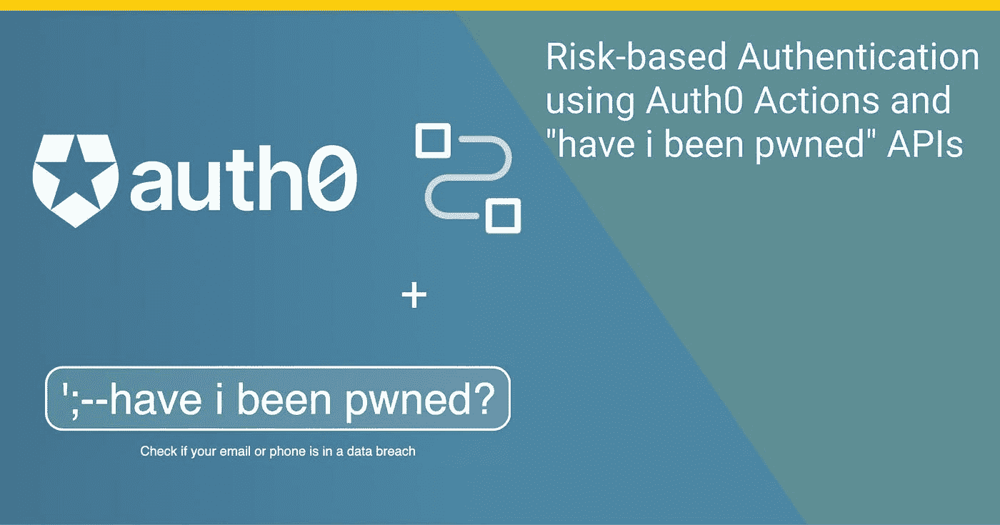
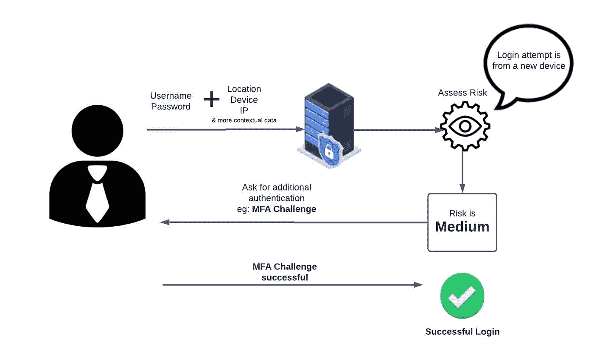
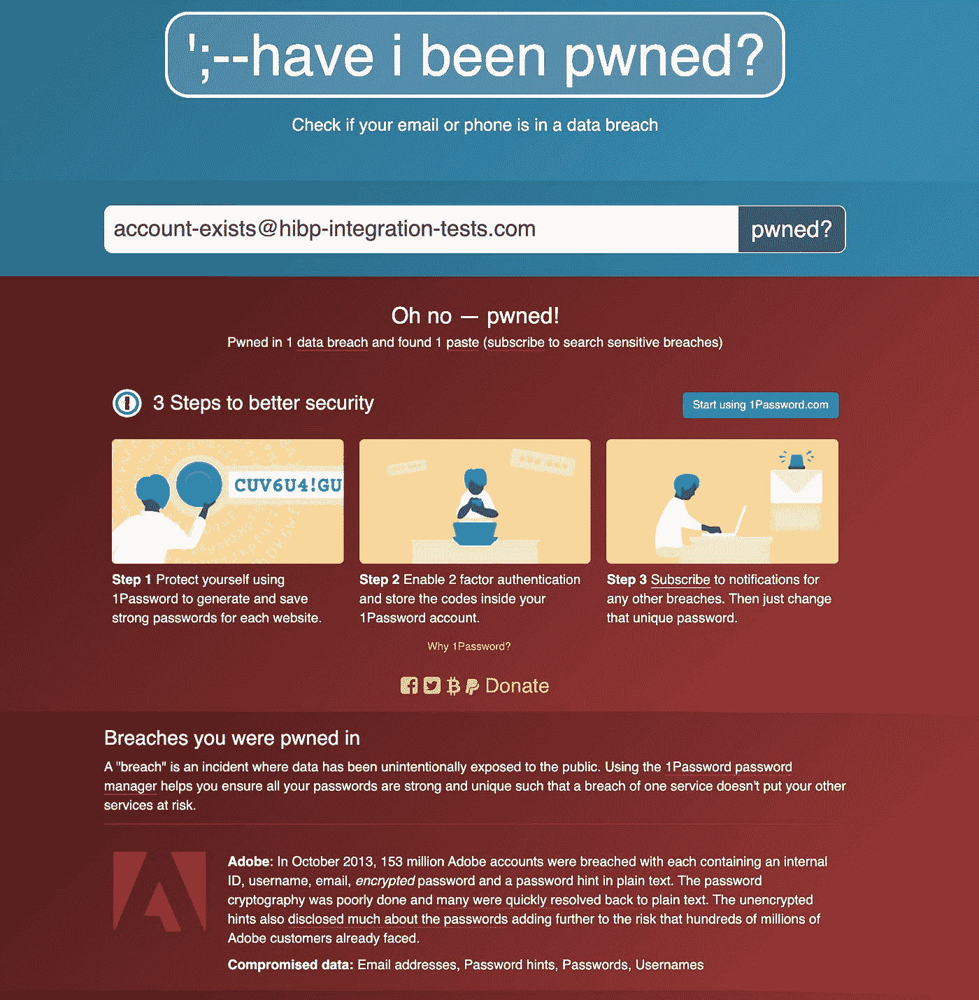
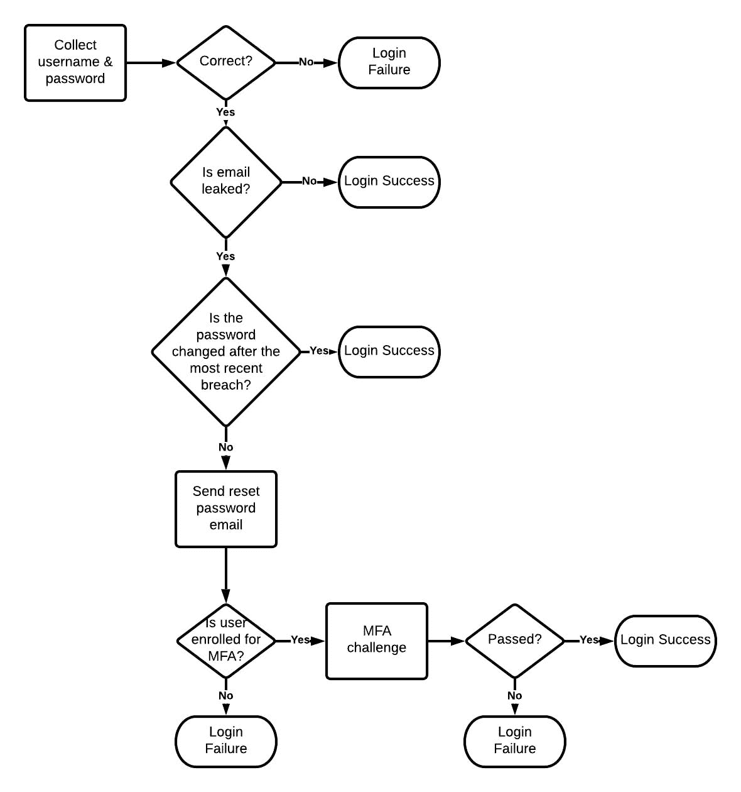
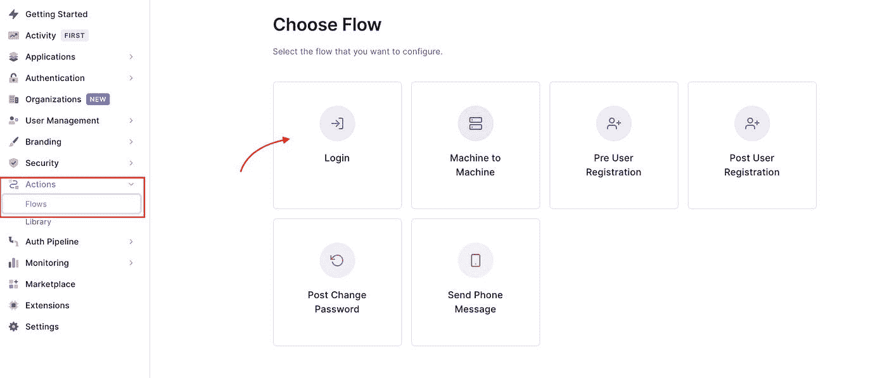
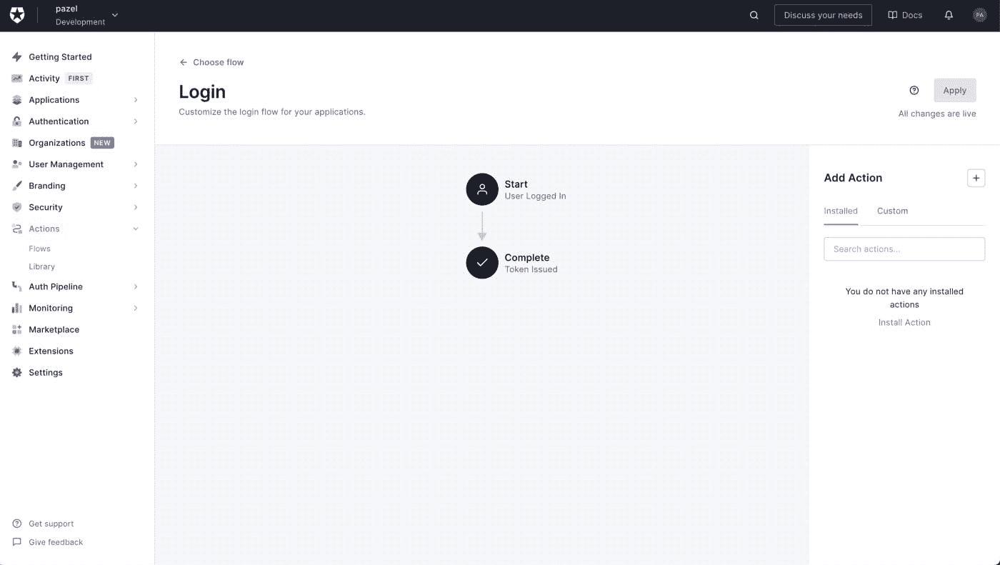
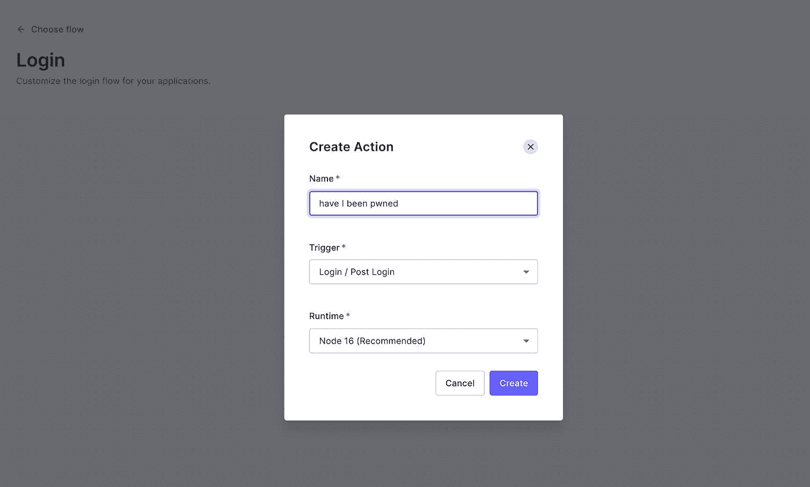
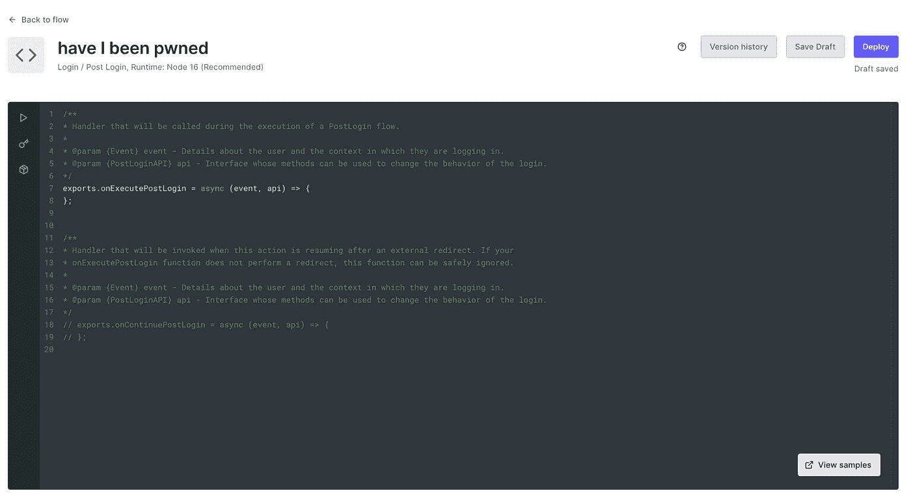
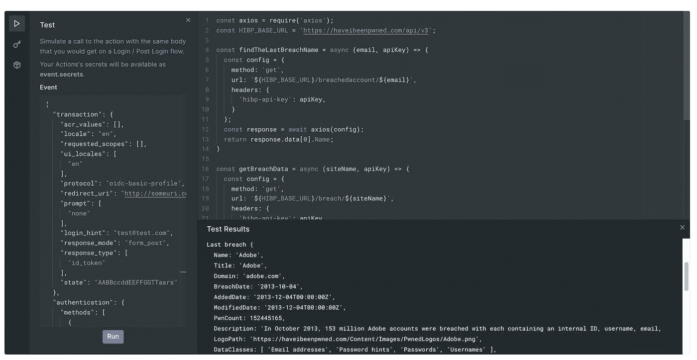
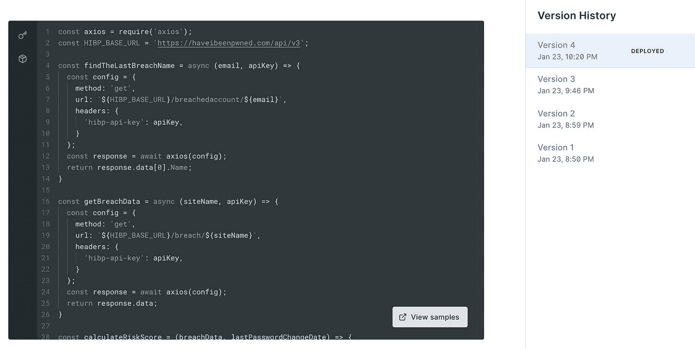

# 使用 Auth0 操作的基于风险的身份验证以及我是否已被 Pwned APIs

> 原文：<https://javascript.plainenglish.io/risk-based-authentication-using-auth0-actions-and-have-i-been-pwned-apis-fd3cb65c040a?source=collection_archive---------11----------------------->



在本文中，我们将研究如何通过实现基于风险的身份验证来提高系统的安全性。为了实现这一点，我们将使用 Auth0 动作将[](https://haveibeenpwned.com/)*API 集成到我们的登录流中。*

# *什么是基于风险的身份认证？*

*简而言之，基于风险的身份认证(RBA)使用关于用户的实时情报来决定他们的活动是正常的(低风险)还是可疑的(高风险)。*

*RBA 根据登录行为估计风险分值。对于任何给定的访问尝试，通常会根据一组预定义的规则实时计算风险分值。然后为用户提供适合该风险级别的身份验证选项。*

*在评估登录活动的风险时，需要考虑许多因素。例如:*

*   *用户的位置*
*   *设备/浏览器*
*   *IP 和网络信息*
*   *尝试登录的次数*

*或者与用户及其环境相关的因素。例如，在凌晨 2 点尝试登录公司的人力资源系统会被认为是可疑的(高风险)。*

*以及更多在特定环境下可能有意义的因素。*

**

*大多数身份验证提供程序都支持 RBA。*

*下面是几个例子的链接， [Auth0](https://auth0.com/docs/secure/multi-factor-authentication/adaptive-mfa) ， [Okta](https://help.okta.com/en/prod/Content/Topics/Security/behavior-detection/faq-behavior-detection.htm) ， [Azure AD](https://docs.microsoft.com/en-us/azure/active-directory/authentication/tutorial-risk-based-sspr-mfa) ， [AWS Cognito](https://docs.aws.amazon.com/cognito/latest/developerguide/cognito-user-pool-settings-adaptive-authentication.html) 和 [Google](https://support.google.com/a/answer/6002699?hl=en) 支持 RBA。*

*使用 RBA，您不需要总是强制实施 MFA，仅当根据风险分值需要时，您才可以要求额外的身份认证。这有助于改善登录流的用户体验，并使低风险登录更容易发生，摩擦更少。*

# *基于风险的身份验证的内置 Auth0 功能*

*幸运的是，Auth0 有一些特性支持您*

*   *[自适应 MFA](https://auth0.com/docs/secure/multi-factor-authentication/adaptive-mfa) —此功能会触发 MFA，并在置信度较低时要求用户完成 MFA 质询(活动具有高风险)。*

*Auth0 还提供了一系列与 RBA 齐头并进的[攻击保护](https://auth0.com/docs/secure/attack-protection)功能。*

*   *[密码泄露检测](https://auth0.com/docs/secure/attack-protection/breached-password-detection) — Auth0 跟踪主要第三方网站上发生的重大安全漏洞。如果用户密码因数据泄露而泄露，他们将会收到通知，并且可能会被阻止登录。*
*   *[Bot Detection](https://auth0.com/docs/secure/attack-protection/bot-detection)—Bot Detection 通过检测请求何时可能来自 Bot 并提供验证码挑战来阻止 Bot 攻击，从而减少脚本攻击。*

*这些功能支持基于风险的身份认证的大多数典型场景，您可以进一步定制它们，以最大限度地满足您的使用需求。*

# *什么是[我被 pwn 了吗](https://haveibeenpwned.com/)它有什么帮助？*

*由安全专家 [Troy Hunt](https://en.wikipedia.org/wiki/Troy_Hunt) 、[*when I be pwned*](https://haveibeenpwned.com/)是一个允许互联网用户检查他们的数据是否因数据泄露而受损的网站。*

*作为用户，你可以访问这个网站，输入你的电子邮件地址，获得一份你的电子邮件地址所涉及的数据泄露清单。*

**

*[](https://haveibeenpwned.com/)*也提供了 REST APIs，您可以使用它们通过代码进行同样的查询。**

**例如，这是一个 API 的响应，它返回一个电子邮件地址的数据违规列表。**

**请求:**

```
**[https://haveibeenpwned.com/api/v3/breachedaccount/{account}?truncateResponse=false](https://haveibeenpwned.com/api/v3/breachedaccount/{account}?truncateResponse=false)**
```

**回应:**

```
**[
    {
        "Name": "XYZ",
        "Title": "XYZ",
        "Domain": "xyz.com",
        "BreachDate": "2020-03-22",
        "AddedDate": "2020-11-15T00:59:50Z",
        "ModifiedDate": "2020-11-15T01:07:10Z",
        "Description": "In March 2020, the stock photo site .....",
        "LogoPath": ".img/PwnedLogos/xyz.png",
        "DataClasses": [
            "Email addresses",
            "IP addresses",
            "Names",
            "Passwords",
            "Phone numbers",
            "Physical addresses",
            "Usernames"
        ],
        "IsVerified": true,
        "IsFabricated": false,
        "IsSensitive": false,
        "IsRetired": false,
        "IsSpamList": false,
        "IsMalware": false
    },
...
]**
```

**我想你现在应该能猜到我要说什么了。我想在登录流程中使用[](https://haveibeenpwned.com/)*REST API 来检测用户名(电子邮件)是否出现数据泄露，并根据风险因素做出适当反应。***

***例如，如果用户(电子邮件地址)在最近的数据泄露中列出，我将向用户发送一封更改(重置)密码的电子邮件，并要求他们完成 MFA 质询。我将在本文的剩余部分进一步描述登录流程。***

***要使用 API，您需要购买 API 密钥。请阅读[这些说明](https://haveibeenpwned.com/API/Key)以获取您的 HIBP API 密钥。***

# ***使用 Auth0 操作扩展基于风险的身份验证***

***如前所述，Auth0 内置特性已经为基于风险的身份认证提供了坚实的基础，但根据您的业务需求，您可能需要考虑更多因素作为风险评估的一部分。***

***这就是 Auth0 操作的亮点，它让您可以将 Auth0 的功能扩展到已定义的范围之外。***

***[](https://haveibeenpwned.com/)*为[数据泄露](https://haveibeenpwned.com/FAQs)提供数据，同时[粘贴](https://haveibeenpwned.com/Pastes)，通常在其他来源之前拥有数据。因此，它是保护您的系统的一个很好的辅助资源。****

***然而，使用[](https://haveibeenpwned.com/)*REST API 只是一个示例，展示了如何使用其他数据源来增强您的风险评估。因此，在采用这个数据源之前，请做好您的研究。****

# ***什么是 Auth0 操作？***

> ***Auth0 操作是在 Node.js 中编写的安全、特定于租户的版本化函数，在 Auth0 运行时的特定时间点执行。动作用于通过自定义逻辑自定义和扩展 Auth0 的功能。[auth0.com/docs/customize/actions](http://auth0.com/docs/customize/actions)***

***因此，这种集成的想法是使用一个登录操作并编写一个 Node.js 函数来:***

*   ***调用 [*我是否被 pwned 过*](https://haveibeenpwned.com/)REST API 来判断电子邮件地址(用户名)是否被列在数据泄露中。***
*   **[*我被 pwn 了吗*](https://haveibeenpwned.com/) 响应会给我一个给定电子邮件地址的数据泄露列表。**
*   **我会选择最近的漏洞。**
*   **然后，我检查用户在最近一次数据泄露后是否更改了密码。**
*   **如果是这样，用户无需额外身份验证即可登录。**
*   **如果没有，用户需要完成 MFA 质询，他们会收到一封电子邮件来更改(重置)他们的密码。**

**该流程图显示了新的登录流程，如下所示。**

****

> **注意:使用[社交](https://auth0.com/docs/authenticate/identity-providers/social-identity-providers)或[企业](https://auth0.com/docs/authenticate/identity-providers/enterprise-identity-providers)连接登录的用户必须向身份提供商(如谷歌或脸书)重置密码。**

**对于社交用户，您可能希望限制他们对系统中敏感数据的访问，或者警告他们有违规行为。因此他们可以采取任何必要的行动。(不在本例的范围内)**

**您可以做的其他事情包括:**

*   **如果您正在处理高风险活动，请完全阻止用户访问。例如，如果泄露的帐户属于可以进行高价值货币交易的公司财务部门员工。在这种情况下，你可能会采取更激烈的措施，包括亲自恢复帐户或使用 [KYC](https://en.wikipedia.org/wiki/Know_your_customer) 服务，如 [Onfido](https://onfido.com/) 来确保用户身份。**

**为了这篇博客，我们将坚持使用一个更简单的 REST API 集成示例。**

# **[创建你的第一个行动](https://auth0.com/docs/customize/actions/write-your-first-action)**

**要开始，您需要一个 Auth0 帐户。如果你还没有，请按照这些说明[来设置一个。](https://auth0.com/docs/get-started)**

**登录到您的 Auth0 帐户后，单击操作>流>登录以创建登录操作。**

****

**这创建了一个作为登录流的一部分运行的`[post-login](https://auth0.com/docs/customize/actions/triggers/post-login)`触发器。它在用户登录后和请求刷新令牌时执行。**

****

**单击添加操作中的+按钮，并选择构建自定义。称之为*我被 pwn 了吗*剩下的就这样吧。**

****

**创建完成后，您将进入编辑屏幕。在这里，您可以为您的操作编写代码，测试并部署它。**

**接下来，我们编写逻辑来调用 [*我是否被 pwned*](https://haveibeenpwned.com/)API 来检查用户电子邮件地址是否涉及数据泄露。**

****

**我们将使用 *onExecutePostLogin* 函数，这是一个在执行 [PostLogin 流](https://auth0.com/docs/customize/actions/triggers/post-login)期间将被调用的处理程序。**

***onExecutePostLogin* 函数接收两个参数， *API* (类型 [PostLoginApi](https://auth0.com/docs/customize/actions/triggers/post-login/api-object) )和*事件*(类型[事件](https://auth0.com/docs/customize/actions/triggers/post-login/event-object))**

**对于这个例子，我们将使用`event.user`来查找用户的电子邮件地址。`event.user`包含代表当前交易发起的用户的信息，如`email`、`identities`等。**

**我们还使用`event.client`来获取客户端 id。知道客户端 id 后，我们可以向用户发送一封重置密码的电子邮件。**

**您可以在 [Auth0 文档](https://auth0.com/docs/customize/actions/triggers/post-login)中了解更多关于`api`和`event`的完整功能。**

**我们将使用来自 [*的两个 API:*](https://haveibeenpwned.com/)**

*   **获取电子邮件地址的数据泄露列表。这将返回一个已经按日期排序的违规名称数组。所以列表上的第一项是最近的违规。**
*   **获取特定违规的详细信息。我们将使用前面列表中第一个违规的名称来获取详细信息。这包括`BreachDate`。**

**你可以在这里阅读*我被 pwn 了吗*API[的功能](https://haveibeenpwned.com/API/v3)**

# **登录操作的代码**

# **测试您的行动**

**在动作编辑器的左侧，您还有 3 个选项。看起来像播放按钮的那个是测试。如果你点击它，会给你一个登录有效负载的例子，一旦你点击 run，它会模拟一个动作调用，调用的主体与你在登录/后登录流程中得到的相同。**

**您可以随意编辑有效负载。比如我把邮箱地址改成了`account-exists@hibp-integration-tests.com`。**

**这是一个在 [*中提供的测试电子邮件地址，我是否已经被 pwn 过*](https://haveibeenpwned.com/) API 文档，用于用户数据泄露的场景。**

**运行操作后，您可以在右下方的面板中看到结果。**

**这是我测试中的一个例子。**

****

**您可以使用`console.log`来查看函数调用中每一步的结果。**

**动作编辑器自动保存你的代码，一旦你满意了，你可以点击部署按钮。**

**现在，当用户尝试登录时，他们将通过我们的登录操作，并需要成功通过我们增强的基于风险的身份认证，然后才能成功登录。**

# **动作的其他特征**

**行动可以提供更多。你得到一个秘密管理器，一个包管理器(对于 npm 包)和内置代码的版本历史。**

**这弥补了更好的开发者体验。**

****

# **动作限制**

**动作给了你一个定制和扩展 Auth0 功能的好方法，但是有一些限制。例如，流的每次执行必须在 10 秒或更短时间内完成，否则处理将在错误中结束。**

**其中一些限制是为了确保当您添加更多代码和功能时，用户体验保持平稳。**

**开始前，确保检查这些[限制](https://auth0.com/docs/customize/actions/limitations)。**

# **结论**

**Auth0 Actions 为开发团队提供了一种简单的方法来实现基于他们独特需求的认证和授权，并为许多可能性打开了大门。**

**对于这个登录动作示例，我们只触及了皮毛。行动提供了更多的挂钩，每种挂钩都有大量的例子。我们的风险计算功能也是如此。例如，我们可以利用漏洞的类型(例如:电子邮件、密码……)以及在[](https://haveibeenpwned.com/API/v3)*中提供的更多数据来进行更有意义的风险计算。***

***如果这看起来像是你一直在寻找的东西，我鼓励你阅读 Actions [文档](https://auth0.com/docs/customize/actions)来了解更多关于不同动作的能力并找到更多的例子。***

***感谢阅读这篇文章。如果您有任何反馈或问题，请联系此处或在 [Twitter](https://twitter.com/_pazel) 上联系。***

# ***参考***

*   ***[授权 0 行动文件](https://auth0.com/docs/customize/actions)***
*   ***[我被 pwn 了吗](https://haveibeenpwned.com/API/v3)***

****更多内容看* [***说白了就是***](http://plainenglish.io/) *。报名参加我们的* [***免费周报***](http://newsletter.plainenglish.io/) *。在我们的* [***社区不和谐***](https://discord.gg/GtDtUAvyhW) *获得独家获取写作机会和建议。****