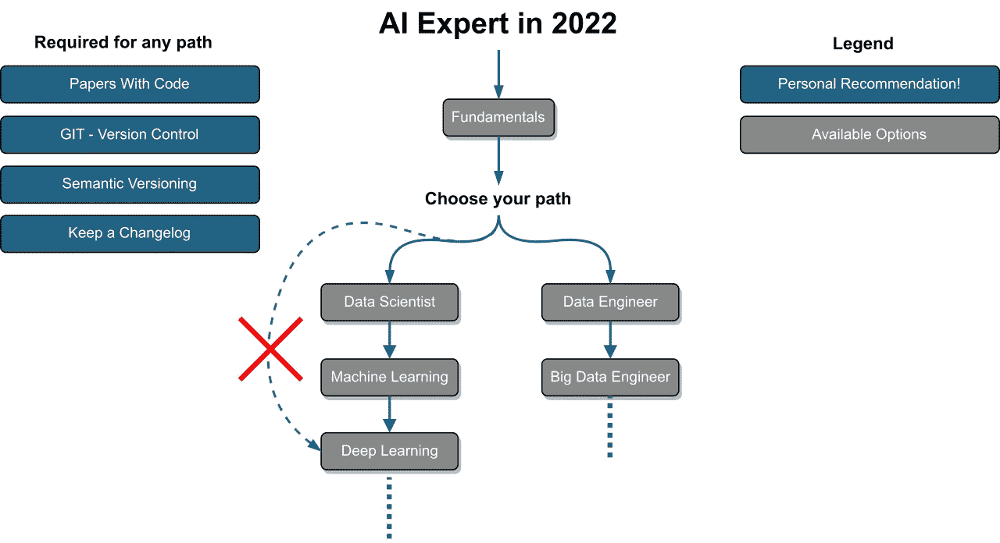
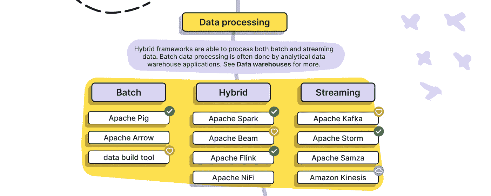
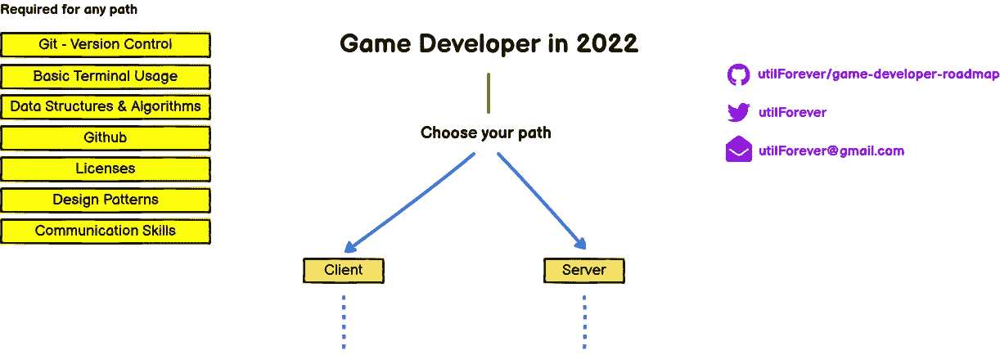
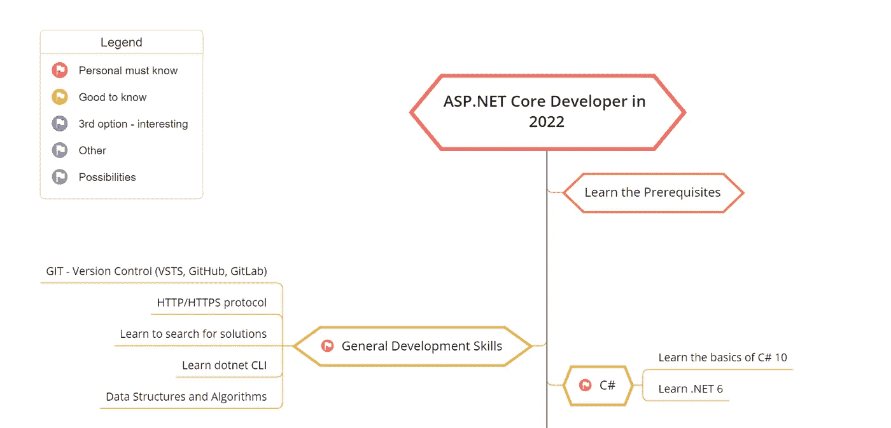
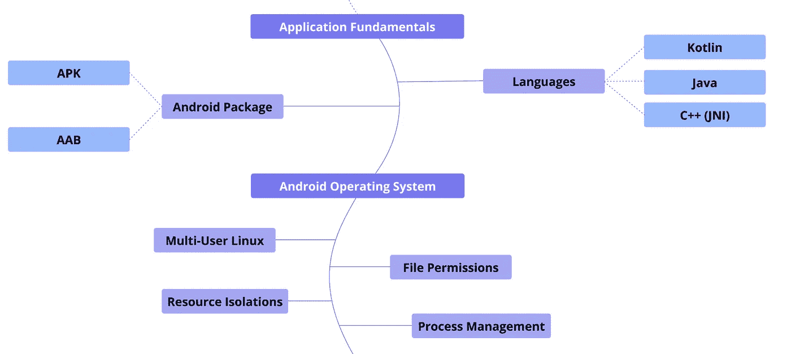
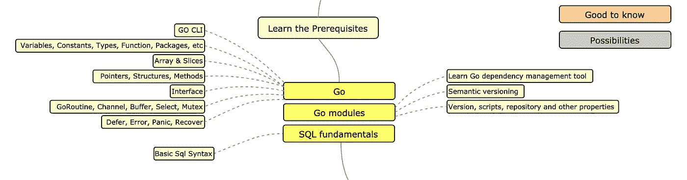
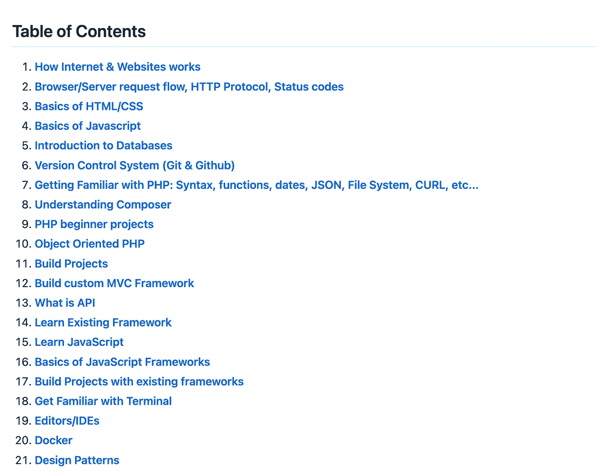

# 成为您想成为的开发人员的路线图

> 原文：<https://javascript.plainenglish.io/roadmap-to-becoming-the-developer-you-want-to-be-5f53ad2871a0?source=collection_archive---------10----------------------->

## 成为你想要的开发者。

Photo by [Arif Riyanto](https://unsplash.com/@arifriyanto?utm_source=medium&utm_medium=referral) on [Unsplash](https://unsplash.com?utm_source=medium&utm_medium=referral)

网络是一个广阔的地方。它充满了资源，很容易迷失自我。如果你恰当地利用资源，你可以成为你想要的人。软件开发是你可以选择的伟大职业。有各种类型的开发和技术堆栈。所以，很明显，你需要一个指导方针。

在这里，我整理了 7 个资源，它们将为你成为你想要的开发者提供一个路线图。

# 1.人工智能专家路线图

这是星级最高的 Github 库之一，拥有超过 19k 的星级和 1.5k 的分支。它包含的图表显示了你可以选择的不同道路，以及成为数据科学家、机器学习专家或人工智能专家所需的技术。这些路线图的目的是给你一种景观感，并在你不确定下一步该学什么的时候为你提供指导，而不是鼓励你选择流行的东西。你也可以在这里 找到互动版 [**。**](https://i.am.ai/roadmap/)

 [## GitHub-AMAI-GmbH/AI-Expert-Roadmap:2022 年成为人工智能专家路线图

### 2022 年成为人工智能专家的路线图下面是一组展示路径的图表…

github.com](https://github.com/AMAI-GmbH/AI-Expert-Roadmap) 

# 2.数据工程师路线图

数据工程是你现在可以选择的最热门的职业道路之一。该路线图旨在提供现代数据工程前景的全面概述，并作为有抱负的数据工程师的学习指南。它在 GitHub 上有超过 9.5k 颗星。

 [## GitHub-datastacktv/data-engineer-Roadmap:2021 年成为数据工程师的路线图

### 2021 年成为数据工程师的路线图该路线图旨在全面展示现代数据工程…

github.com](https://github.com/datastacktv/data-engineer-roadmap) 

# 3.游戏开发商路线图

这个存储库包含一组图表，显示了您可以选择的各种途径以及成为游戏开发者应该使用的技术。它在 GitHub 上有超过 3k 颗星。

 [## GitHub-utilForever/游戏开发者路线图:2022 年成为游戏开发者的路线图

### 受开发者路线图启发，2022 年成为游戏开发者路线图。下面是一组图表…

github.com](https://github.com/utilForever/game-developer-roadmap) 

# 4.AspNetCore-开发人员-路线图

顾名思义，这个路线图是为 ASP.NET 核心开发人员设计的。这个路线图是一个图表，显示了您可以选择的不同途径，以及成为 ASP.NET 核心开发人员应该学习的库。这个存储库回答了这个问题，“作为 ASP.NET 核心开发人员，我接下来应该学习什么？”。它在 GitHub 上有大约 11k 颗星星。

 [## GitHub-MoienTajik/AspNetCore-开发者路线图:成为 ASP.NET 核心开发者的路线图…

### 2022 年成为 ASP.NET 核心开发人员的路线图:下面的图表展示了您可以…

github.com](https://github.com/MoienTajik/AspNetCore-Developer-Roadmap) 

# 5.Android 开发者路线图

这个路线图建议了 Android 开发的学习路径。你可以沿着地图中间的线条路径阅读路线图。每个节点代表 Android 系统概念、Android SDK 和常用库。它在 Github 上有超过 3k 颗星。

 [## GitHub-skydoves/Android-开发者路线图:🗺2022 年 Android 开发者路线图建议…

### Android 开发者路线图 2022 提出了理解 Android 开发的学习途径。您可以阅读路线图…

github.com](https://github.com/skydoves/android-developer-roadmap) 

# 6.golang-开发者路线图

这也是另一个星级最高的 Github 库，拥有超过 14k 星级和 1.5k 分支。它包括一个图表，展示了成为 Go 开发者的各种途径，以及应该学习的库。这个知识库回答了这个问题，“作为一个 Go 开发者，我接下来应该学习什么？”。

 [## GitHub-alik hll/golang-开发者路线图:2020 年成为 Go 开发者的路线图

### 2021 年成为 Go 开发者的路线图:下面你可以找到一个图表，展示了你可以采取的途径和…

github.com](https://github.com/Alikhll/golang-developer-roadmap) 

# 7.PHP-开发者路线图

顾名思义，如果你想成为一名 PHP 开发人员，这是一个路线图。在处理 Youtube 视频时会创建存储库。你可以在这里 查看 [**。它在 GitHub 上有超过 1.5k 颗星。**](https://www.youtube.com/watch?v=r9ndOH0tyfA)

 [## GitHub-the codeholic/php-Developer-Roadmap:这是 PHP 开发者路线图

### 这是 PHP 开发者路线图。遵循这条道路将保证成为一名优秀的 PHP 开发人员。存储库是…

github.com](https://github.com/thecodeholic/php-developer-roadmap) 

今天到此为止。我相信这些路线图会帮助你成为你想要的开发者。

如果你知道任何其他美丽的路线图，请在评论中分享。直到我们再次相遇。干杯！

***想要连接？***

*如果你愿意，可以在*[***Twitter***](https://twitter.com/FarhanT99598254)**或*[***LinkedIn***](https://www.linkedin.com/in/farhan-tanvir-b08520151/)***上与我联系。****

**更多内容请看*[***plain English . io***](https://plainenglish.io/)*。报名参加我们的* [***免费周报***](http://newsletter.plainenglish.io/) *。关注我们关于*[***Twitter***](https://twitter.com/inPlainEngHQ)*和*[***LinkedIn***](https://www.linkedin.com/company/inplainenglish/)*。查看我们的* [***社区不和谐***](https://discord.gg/GtDtUAvyhW) *加入我们的* [***人才集体***](https://inplainenglish.pallet.com/talent/welcome) *。**