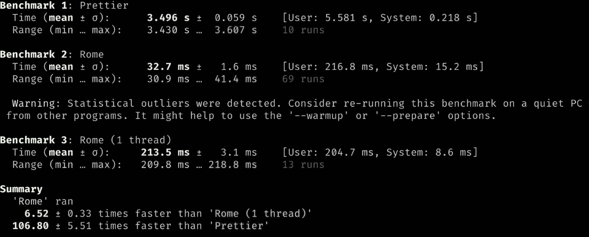
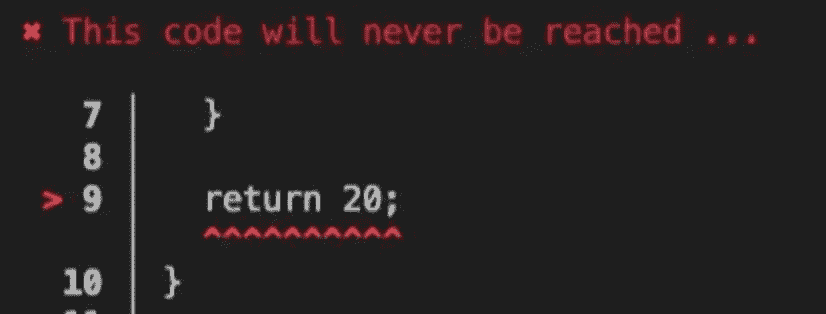
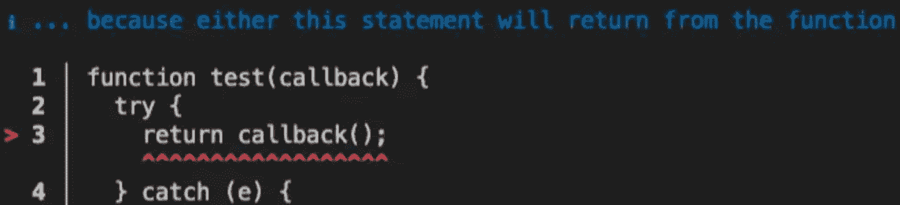
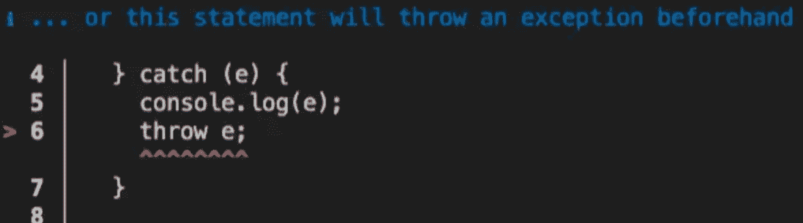

# 罗马 V10 诞生，会统一前端吗？

> 原文：<https://javascript.plainenglish.io/rome-v10-is-born-will-it-unify-the-front-end-cb2fa5dea624?source=collection_archive---------3----------------------->


我们很激动地宣布**罗马 v10** ，这是自 [Rust 重写](https://rome.tools/blog/2021/09/21/rome-will-be-rewritten-in-rust.html)开始以来的第一个稳定版本。罗马是一个雄心勃勃的项目，旨在将几十种前端语言工具统一成一个简单易用的工具。

从名字中，我们可以窥探出一点线索，看看其他工具

*   `vite` **(法语中的**意为快)
*   `turbopack`(英文意为**涡轮增压器**)，

再看看他——这个故事告诉我们罗马不是一天建成的。

`Rome`团队花了一年半的时间终于推出了第一个稳定版的[罗马 v10](https://rome.tools/blog/2022/11/08/rome-10/) 。

作为前端工具链工具，它`Rome`与我们熟悉的工具(如`vite`、`eslint`、`CRA`)有什么区别？他以后会称霸前端吗？

今天我们就来聊聊这个话题。

# 罗马是什么

罗马的创造者是前队的**塞巴斯蒂安·麦肯齐** `Babel`，以后我就叫他小马。

5 月 21 日，Pony 在获得 2 笔风险投资的 450w 投资后，成立了罗马工具公司。

公司的目标是实现一站式前端工程解决方案，替代现有的各种前端工具。

当前的前端工程解决方案存在许多问题，例如:

# 2.工具太多，学习成本高

对于项目中常用的一些工具，如:

*   代码格式化工具:`Prettier`，`dprint`
*   线头工具:`ESLint`，`StyleLint`
*   测试工具:`Vitest`，`jest`
*   编译器:`babel`，`SWC`
*   包装工具:`webpack`、`vite`、`rollup`

熟练使用它们并不容易，因为:

1.  需要了解不同工具是如何配置的
2.  需要考虑如何将这些工具集成到项目中

最终，项目往往充满了各种配置文件。以至于复杂的项目通常会有一个特殊的职位——**web pack 配置工程师。**

很多搭建工具(比如`create-react-app`)就是为了解决这个问题而诞生的，但是它们的缺陷也是显而易见的。

它们只是提供了一层胶水来隔离这些工具的复杂性，但是开发者如果有个性化的需求，还是要正面面对这些问题。

对于`Rome`驱动的项目，将只有一个`rome.json`配置文件和开箱即用的最佳实践。

# 3.性能浪费

前端工具链中的许多工具都可以访问需求，但很多时候它们是分离的。

比如处理代码降级时会产生巴别塔，在`eslint`审核代码`AST`时也会产生`AST`，造成性能浪费。

另一方面，`Rust`前端工具的重写已经成为一种趋势。

用`Rust`实现这些工具，尽可能减少不必要的解析，可以显著提高工具性能。

罗马的基本理念是这样的。根据 Pony 的计算，`Rome`格式化代码比`Prettier`快 100 多倍。



# 4.提示对开发人员不友好

目前很多前端工具是由不同的团队和个人开发的，所以提示信息的准确性和体验各不相同。

`Rome`在**提示信息中投入了大量的精力，比如下面的代码:**

另存为`a.js`，执行以下检查命令:

```
npx rome check a.js 
```

控制台将输出三个段落。

第一段，告诉你`return 20`要并且永远不要执行:



最后两段将告诉你为什么它不执行:

*   如果不是因为`return callback();`



*   如果不是因为`throw e;`



与提示信息相比，`Rome`的提示信息确实更友好。

将来，这样的友好提示会出现在`Rome`工具链的每一个环节，例如:

*   关于包装代码的信息
*   皮棉信息
*   测试信息

# 罗马会统治前端吗？

目前`Rome`只提供了两个工具`linter`(对标`eslint`)和`formatter`(对标`prettier`)，可以通过以下命令体验:

```
# fomat
npx rome format <path>

# lint
npx rome check <path>
```

有关更详细的命令，请参考[官方文档](https://docs.rome.tools/guides/getting-started/)。

如果未来`Rome`实现了他的目标，对前端开发者来说一定是一个很有吸引力的选择。

然而，实现这样一个庞大而全面的解决方案不会一蹴而就。

在前端领域，新技术、新框架总是层出不穷。

同样是公司级开源产品，虽然`vercel`开发`next.js`选择了`Rome`不同的方向(以前端框架为切入点)，但两者的功能点总有重合的一天。

从发展道路来看，对于`next.js`:

*   当前:`next.js`依赖`webpack`封装
*   下一步:`vercel`投资`turbopack`，`next.js`靠`turbopack`包装
*   下一步:`turbopack`为了最大化其速度优势，有可能用`Rust`重写其他工具链工具

对于`Rome`:

*   电流:主`linter`、`formatter`
*   下一步:开发其他工具链工具

当两个产品拥有相同功能的工具时，即使`Rome`开发体验更好(假设)，在`Next.js`技术栈中已经深度耦合的开发者也不可能切换底层工具链工具。

不仅是那个`vercel`，还有`Vue`队、`Remix`队等等。都是`Rome`的潜在竞争对手。

以上是未来`Rome`成熟体与其他竞品的竞争。目前推广一个`linter`和`formatter`，`Rome`也是阻力重重。

相对于`eslint`这样的`prettier`纯开源血统的开源项目，`Rome`大视野让那些用户量大的工具根本不考虑接入`Rome`。

类似的行为比如——为什么`Next.js`不是由`Vite`原生支持的？当然，别人会说这都是技术上的考虑，与业务无关。


# 最后

你对`Rome`的未来有什么看法？

**感谢阅读**。期待您的关注，阅读更多高质量的文章。


[omgzui](https://medium.com/@omgzui?source=post_page-----cb2fa5dea624--------------------------------)

## 更好的编程

[View list](https://medium.com/@omgzui/list/better-programing-9b4c9bb174aa?source=post_page-----cb2fa5dea624--------------------------------)109 stories

[omgzui](https://medium.com/@omgzui?source=post_page-----cb2fa5dea624--------------------------------)

## Java Script 语言

[View list](https://medium.com/@omgzui/list/javascript-48bfc7b5f93c?source=post_page-----cb2fa5dea624--------------------------------)57 stories

[omgzui](https://medium.com/@omgzui?source=post_page-----cb2fa5dea624--------------------------------)

## 新闻

[View list](https://medium.com/@omgzui/list/news-67ec0a972660?source=post_page-----cb2fa5dea624--------------------------------)23 stories

*更多内容看* [***说白了。报名参加我们的***](https://plainenglish.io/) **[***免费周报***](http://newsletter.plainenglish.io/) *。关注我们关于* [***推特***](https://twitter.com/inPlainEngHQ) ， [***领英***](https://www.linkedin.com/company/inplainenglish/) ***，***[***YouTube***](https://www.youtube.com/channel/UCtipWUghju290NWcn8jhyAw)***和****[***不和***](https://discord.gg/GtDtUAvyhW)*** *对成长黑客感兴趣？检查出* [***电路***](https://circuit.ooo/) ***。***