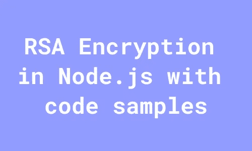

# Node.js 中的 RSA 加密及代码示例

> 原文：<https://javascript.plainenglish.io/rsa-encryption-in-nodejs-with-code-samples-86bb829718e0?source=collection_archive---------0----------------------->

## Node.js 中的 RSA 加密指南及代码示例。



Node.js 附带了一个“crypto”模块，可以帮助您创建公钥和私钥对来使用公钥加密。

## 公钥密码学解释说:

这是我看到的一篇很好的文章，很好地解释了这个问题:

[](https://www.sohamkamani.com/nodejs/rsa-encryption/) [## Node.js 中的 RSA 加密、解密和签名(Javascript) -示例

### 这篇文章将解释 RSA 算法，以及我们如何在 Node.js 中实现 RSA 加密、解密和签名…

www.sohamkamani.com](https://www.sohamkamani.com/nodejs/rsa-encryption/) 

*(请务必阅读这篇文章，因为我不会在帖子中涉及此事)*

对我来说，崩溃的地方实际上是实现，因为创建的密钥是在内存中的，并且是短暂的。我用代码示例来写这篇文章，您可以运行到:

1.  创建公钥/私钥对
2.  将其导出，并写入您的文件系统(作为 public.pem 和 private.pem 文件)
3.  创建一些样本数据进行加密(这是我们的秘密，我们不想让其他人知道)
4.  加密所说的数据，保存在一个文件中，这样我们就可以看到它看起来像什么
5.  解密这些加密数据得到我们的原始秘密数据

**这里是 Github 库:**

 [## GitHub - nkhil/node-crypto

### 此时您不能执行该操作。您已使用另一个标签页或窗口登录。您已在另一个选项卡中注销，或者…

github.com](https://github.com/nkhil/node-crypto) 

您不需要`npm i`，因为没有依赖关系，并且`crypto`模块与 node 一起提供。

1.  **要创建一些要加密的数据，运行这个命令**

```
npm run create-data
```

你现在应该在项目根目录下有一个名为`data_to_encrypt.txt`的文件。这是一些使用 Node.js 的加密模块创建的任意数据。有兴趣的话可以看看这里:[https://github . com/nkhil/node-crypto/blob/master/src/RSA/create-data-to-encrypt . js](https://github.com/nkhil/node-crypto/blob/master/src/rsa/create-data-to-encrypt.js)

好了，现在我们有一些秘密数据要加密了🎉

为了加密它，我们需要首先创建我们的公钥-私钥对。在现实世界中，我们将公开我们的公钥，任何人都可以使用公钥加密数据，将其发送给我们，并且只有我们能够读取该数据(使用只有我们拥有的私钥)。

**旁注**:这是一个很棒的小漫画，解释了公共-私有密钥:

[](https://howhttps.works/the-keys/) [## HTTPS 是如何运作的

### 在这种情况下，只有一个密钥来加密和解密消息。在向 BrowserBird 发送消息之前，我…

howhttps.works](https://howhttps.works/the-keys/) 

## 创建我们的公钥-私钥对

下面是我们将如何创建我们的公钥-私钥对，导出它并将其写入文件。

**2。要创建公钥/私钥对，可以运行:**

```
npm run create-keys
```

注意我们把它写到项目根，命名为`private.pem`和`public.pem`。

## 加密一些数据

下面是我们将如何加密在步骤 1 中创建的名为`data_to_encrypt.txt`的文件中的数据(我只对您将使用的命令进行了编号)

**3。要加密** `**data_to_encrypt.txt**` **(我们在上面的步骤 1 中创建的)中的数据，使用**

```
npm run encrypt-data
```

一旦您运行这个^，您应该在您的项目根目录中有一个名为`encrypted_data.txt`的文件。请随意打开这个文件，这是我们数据的乱码版本。

## 解密数据

这是解密数据的代码

您的解密数据应该与文件`data_to_encrypt.txt`的内容相同。

恭喜您，您刚刚使用 RSA 加密使用公钥加密了一些数据，然后使用附带的私钥解密和读取这些信息。

## 一些笔记

请注意，在现实世界中，您可能不会将密钥作为文件，而是作为仅在您的应用程序中可用的安全环境变量。我使用文件作为能够更好地理解 RSA 加密的一种方式。

您需要确保您的私钥是安全的，因为任何能够访问您的私钥的人都可以读取所有的加密信息。

我见过使用 AWS S3 存储桶(或 GCP 存储桶)这样的存储解决方案安全地保存私钥，并使其只有具有适当 IAM 角色的应用程序才能访问桶中的文件。这种资源创建通常由 Terraform 管理，但我们不会深入讨论。

请注意，使用 RSA 加密可以加密的数据大小是有限制的。当我尝试加密一个 128 字节的字符串时，我得到以下错误:

```
Error: error:0409A06E:rsa routines:RSA_padding_add_PKCS1_OAEP_mgf1:data too large for key size
```

请看[这个栈溢出讨论](https://stackoverflow.com/questions/34124795/getting-error-data-too-large-for-key-size-with-crypto-node-js)了解更多信息。

*更多内容看* [***说白了。报名参加我们的***](http://plainenglish.io/) **[***免费周报***](http://newsletter.plainenglish.io/) *。在我们的* [***社区不和谐***](https://discord.gg/GtDtUAvyhW) *获得独家获取写作机会和建议。***