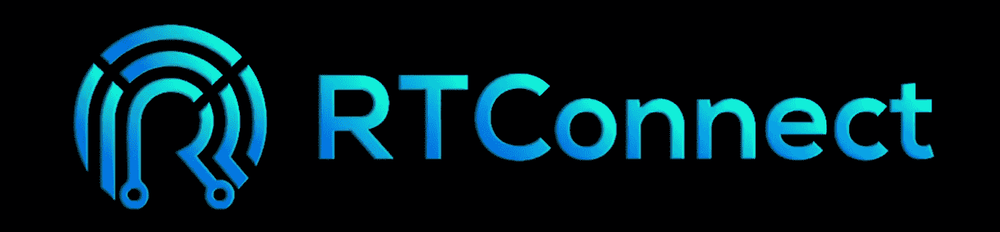
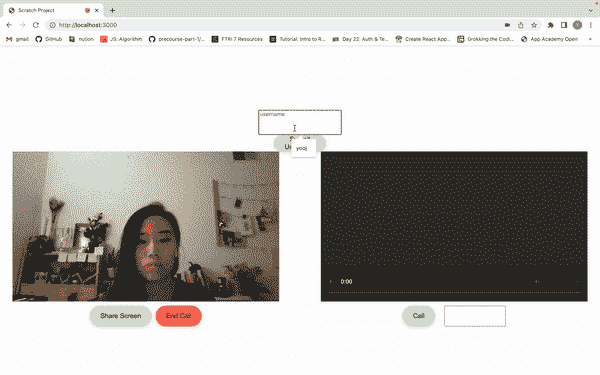

# 使用 RTConnect 将实时视频通话整合到 React 应用中

> 原文：<https://javascript.plainenglish.io/rtconnect-an-easy-to-use-react-library-to-set-up-peer-to-peer-video-conferencing-video-calls-94a93d113272?source=collection_archive---------7----------------------->

## 关于使用 React 组件库 RTConnect 在 React 应用中实现实时视频通话的教程。

*与* [合著*张幼津*](https://medium.com/u/a10b2c9b3314?source=post_page-----94a93d113272--------------------------------)*[*安东尼金*](https://medium.com/u/3d273c739cd4?source=post_page-----94a93d113272--------------------------------) *，以及* [*路易迪森*](https://medium.com/u/b42ab1bbc605?source=post_page-----94a93d113272--------------------------------)*

**想开始使用 RTConnect 与他人连接吗？有兴趣参与我们的开源项目吗？头像转到我们 Github 上的* [*资源库*](https://github.com/oslabs-beta/RTConnect/blob/dev/README.md) *！此外，查看我们的* [*网站*](http://rtconnect.org/) *以获取更深入的文档！**

*[跳转到如何使用 RTConnect 的视频通话](#82c4) [组件](#82c4)的说明*

# *【RTConnect 解决的问题*

## *背景*

*自谷歌于 2011 年首次开源 WebRTC(网络实时通信)以来，它已被内置到超过 20 亿个浏览器中，仅浏览器通信一项，每周就有超过 10 亿分钟和超过 500 的数据通过 WebRTC 传输。在新冠肺炎疫情开始后，随着各种远程通信模式越来越成为世界各地的人们、职业和企业的生活和运作的一部分，WebRTC 越来越受欢迎。*

*WebRTC 是标准、协议和 JavaScript APIs 的组合，它利用浏览器之间的对等连接来实现近乎实时的数据交换，所有这些都不需要任何第三方软件或插件。截至 2022 年，WebRTC 由谷歌和其他公司(如苹果、谷歌和微软)维护，原则是其 API 应开源、免费、标准化，并内置于所有主要的 web 浏览器中。*

*WebRTC 的主要吸引力之一是，开发人员可以利用它将实时视频直接嵌入到他们基于浏览器的应用程序中，以便为他们的观众创建引人入胜的交互式流媒体体验，而不必担心数据或视频传输的延迟。*

**WebRTC 是目前延迟最低的流媒体格式，视频传输速度低于 500 毫秒。**

## *“问题”*

*现在您可能在想，WebRTC 听起来很棒，那么问题可能是什么呢？*

*尽管 WebRTC 是许多应用程序和网站的基本底层技术，但 WebRTC 有着众所周知的陡峭的学习曲线。根据多年来的各种调查，开发人员不断反馈他们想要更简单的 WebRTC APIs。甚至 WebRTC 网站本身也提到，对于新开发人员和不熟悉 WebRTC 的开发人员来说，创建一个基于 WebRTC 技术的应用程序可能是[压倒性的](https://webrtc.org/getting-started/overview)并且难以实现。*

**甚至 WebRTC 网站本身也提到，对于新开发人员和不熟悉 WebRTC 的开发人员来说，创建一个基于 WebRTC 技术的应用程序可能会*[](https://webrtc.org/getting-started/overview)**难以实现。***

**使用 WebRTC 的一些困难源于实现多层对等连接逻辑的异步特性，这是建立双向通信所必需的。**

**此外，开发人员需要创建自己的信令服务器，以便处理 SDP 提供/应答交换、实现信令和协商最佳通信标准。这个过程通常需要对实时通信有深入细致的理解。**

**此外，由于 WebRTC 通常不能在没有后端开发参与的情况下实现，许多纯前端开发人员会发现将 WebRTC 实现到他们现有的代码库中太困难或令人畏惧。我们的团队决定接受挑战，让那些希望使用 WebRTC 技术并利用点对点连接在现有 React 代码库中实现实时视频通信的开发人员更容易访问 WebRTC。**

> **我们的团队决定接受挑战，让那些希望使用 WebRTC 技术并利用点对点连接在现有 React 代码库中实现实时视频通信的开发人员更容易访问 WebRTC。**

**这种愿望在我们的团队设计和创建 React 组件库时达到了顶点…RTConnect！**

# **RTConnect 简介**

****

**RTConnect: A React component library that leverages WebRTC’s MediaStream API and RTCPeerConnection API with a WebSocket-based Signaling Channel**

> **rt connect:React 组件库，利用 WebRTC 的 MediaStream 和 RTCPeerConnection APIs 以及基于 WebSocket 的信令通道**

**RTConnect 是一个易于使用的轻量级 React 组件库，允许开发人员使用对等协议在不同计算机上的两个对等方之间快速实现实时视频会议/视频呼叫。**

**我们开发 RTConnect 的目标是通过降低对在其应用中实现对等通信感兴趣但不熟悉 WebRTC 技术的开发人员的准入门槛来改善开发人员的体验。**

# **RTConnect 的核心特性**

**RTConnect 简化并加速了设置 WebRTC 对等连接逻辑和实现信令通道的过程，所有这些都在前端的 React 组件和后端的可导入信令通道模块的功能范围内。**

****

**RTConnect in action — 2 people on separate laptops are able to video call and communicate with each other in real-time**

**RTConnect 利用 Websockets 的低延迟数据传输来共享用户媒体和建立对等连接。此外，RTConnect 为开发人员提供了建立更安全连接的选项，即利用 HTTPS 服务器和 WebSocket 安全(WSS)连接，而不是 HTTP 服务器和 WebSocket 连接。**

## **使用 RTConnect 的 VideoCall 组件实现实时视频通话**

**通过实施以下步骤来使用 RTConnect VideoCall 组件，开发人员将能够将实时视频呼叫整合到他们的 React 代码库中，并能够对导航到同一端点的其他用户进行视频呼叫:**

1.  **安装 RTConnect npm 包， [RTConnect](https://www.npmjs.com/package/rtconnect)**

```
**npm install rtconnect**
```

**2.创建您的服务器—您可以选择使用 HTTP 服务器或通过实现 HTTPS 服务器来设置更安全的连接，以便设置 WebSocket 安全(WSS)连接。**

**(*注意*:设置一个 HTTPS 服务器需要一些额外的步骤，说明将在本文末尾。)**

**3.导入 RTConnect **信令** **通道** **类/模块**和实例化 RTConnect 信令通道。将您的 HTTP 或 HTTPS 服务器作为参数传入。**

**4.调用 RTConnect 信令通道方法，initializeConnection()。**

```
**// server.js fileconst path = require('path');
const express = require('express');
const app = express();
const PORT = 3000;// import the RTConnect Signaling Channel class
const { SignalingChannel } = require('rtconnect');app**.**use(express**.**json());
app**.**use(express**.**urlencoded({extended : true}));
app**.**use('/build', express**.**static(path**.**join(__dirname, '../build')));app.get('/', (req, res) => {
 res.status(200).sendFile(path.resolve(__dirname, '../index.html'));
});const server **=** app**.**listen(PORT, () **=>** {
 console.log('Listening on port', PORT);
});// instantiate the RTConnect SignalingChannel
const SignalChannel = new SignalingChannel(server);// invoke initializeConnection() method
SignalChannel.initializeConnection();**
```

**5.将 RTConnect VideoCall 组件导入到您所需的。jsx 文件。**

**6.最后，像使用任何其他 React 组件一样使用 RTConnect VideoCall 组件，传入**ws://localhost:<PORT>**作为 **URL 属性**以及**可选的 mediaOptions 属性。****

*   **URL={ 'ws://localhost: <port>'}</port>**
*   ***media options*={ { controls:true，style: { width: '640px '，height: '480px' }}**

**(*注意*:如果你使用的是 **HTTPS** 服务器，那么传入**WSS://localhost:<PORT>'**作为 **URL 属性**)。**

```
**// App.jsx fileimport React from 'react';
import VideoCall from 'rtconnect';const App = () => {
  return (
    <VideoCall 
      URL={'ws://localhost:3000'}
      *mediaOptions***=**{{ controls: true, style: { width: '640px',    height: '480px'}}}
    />
  )
}export default App**
```

**您准备好使用 RTConnect 与他人联系了吗？或者您愿意为我们的开源项目做出贡献吗？前往我们在 Github 上的[仓库！此外，查看我们的](https://github.com/oslabs-beta/RTConnect/blob/dev/README.md)[网站](http://rtconnect.org)以获取更深入的文档！**

**** [关于如何设置](https://adamtheautomator.com/https-nodejs/) [HTTPS](https://adamtheautomator.com/https-nodejs/) [服务器](https://adamtheautomator.com/https-nodejs/)的说明**

# **联系 RTConnect 工程师和联合创始人[👋](https://emojipedia.org/waving-hand/)**

*   **安东尼·金:[Github](https://github.com/thecapedcrusader)|[LinkedIn](https://www.linkedin.com/in/aking97/)**
*   **F.raisa Iftekher:[Github](https://github.com/fraisai)|[LinkedIn](https://www.linkedin.com/in/fraisa/)**
*   **路易·迪森:[Github](https://github.com/LouisDisen)|[LinkedIn](https://www.linkedin.com/in/louis-disen/)**
*   **YooJin Chang:[Github](https://github.com/ychang49265)|[LinkedIn](https://www.linkedin.com/in/yoojin-chang-32a75892/)**

***更多内容请看*[***plain English . io***](https://plainenglish.io/)*。报名参加我们的* [***免费周报***](http://newsletter.plainenglish.io/) *。关注我们关于*[***Twitter***](https://twitter.com/inPlainEngHQ)**和*[***LinkedIn***](https://www.linkedin.com/company/inplainenglish/)*。查看我们的* [***社区不和谐***](https://discord.gg/GtDtUAvyhW) *加入我们的* [***人才集体***](https://inplainenglish.pallet.com/talent/welcome) *。****