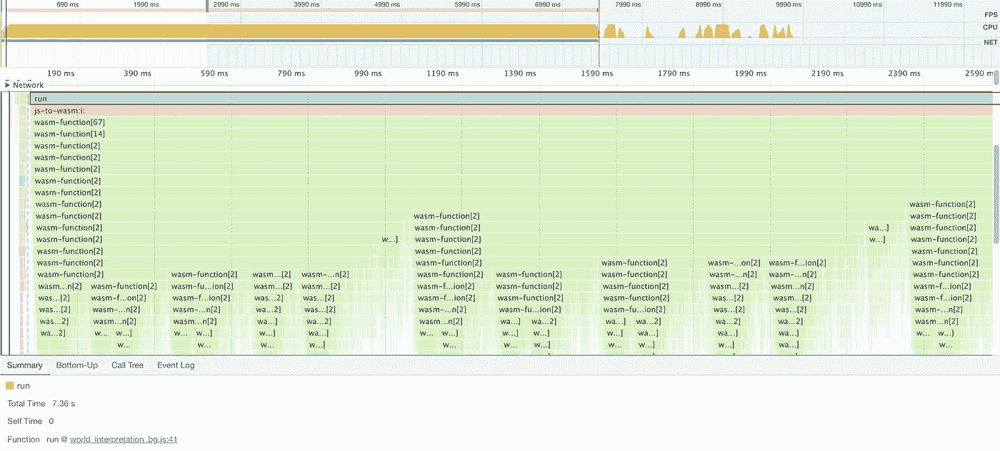

# 使用 WebAssembly 将 JavaScript 代码运行速度提高一个数量级

> 原文：<https://javascript.plainenglish.io/run-javascript-code-one-magnitude-faster-using-webassembly-448d470eb77d?source=collection_archive---------1----------------------->

## *耗时 50 秒的 JavaScript* 代码在 *Rust* 中被重新编码，并转换成 *WebAssembly* 注入回 *JavaScript 中，在 7 秒内运行。*


Photo by [Mohammad Rahmani](https://unsplash.com/@afgprogrammer?utm_source=medium&utm_medium=referral) on [Unsplash](https://unsplash.com?utm_source=medium&utm_medium=referral)

我以为我永远不会把 *JavaScript* 和*汇编*联系起来。我想，当然。因为在我看来， *JavaScript* 是一种脚本语言，现在它确实运行得很快，但是我还没有把它用在比 web 开发更重要的事情上。最近在研究一些路径查找问题时，我遇到了一种情况，一段 JavaScript 代码可能要运行 50 秒才能找到解决方案。这个问题的结构相当复杂，而且是面向算法的，但是我将在下面几行中分享代码的基本结构:

```
const **buildMaze** = (data) => {
  ...  
  return { maze, startPos, numKeys }
}const **findMazeKeys** = (maze, srcPos, keysTaken) => {
  ...  
  return dests
}const **findMazeSteps** = (maze, startPos, numKeys) => {
  const **minMazeSteps** = (srcPos, keysTaken) => { 
    ...
    return memo[memoKey]
  }

  let memo = {}, usage = 0, actual = 0
  return **minMazeSteps**(startPos, [])
}function World(data) {
  const { maze, startPos, numKeys } = **buildMaze**(data)
  return **findMazeSteps**(maze, startPos, numKeys)
}
```

在上面的代码中，我在突出显示函数名的同时省略了所有的细节。其中一个函数`minMazeSteps`在另一个函数的闭包内递归使用。运行时间主要花在函数`findMazeKeys`上，这是一个普通的基于迭代的函数。

## 使用的低级语言，*铁锈*

由于缺乏更好的词来描述我的基本原理，我首先想看看一种更低级的语言，如 *C++* 能否做到，在这种情况下，我选择了 *Rust* ，因为它最近引起了很多关注。我不得不承认我对此没有多少经验。翻译这段代码花了我不少时间。这么说吧，我重写了它，而不是移植它，因为我真的不知道如何将 JavaScript 移植到 Rust。

```
use std::collections::HashMap;#[derive(Debug,Hash,PartialEq,Eq,Copy,Clone)]
struct **Pos**(i8, i8);type **CharMat** = Vec<Vec<char>>;
type **MemoHash** = HashMap<String, usize>;struct **Maze** {
  mat: CharMat,
  origin: Pos,
  keys_len: usize,
  memo: MemoHash,
  usage: usize,
  actual: usize
}impl **Maze** {
  fn **new**(strs: &str) -> Maze {
    ...      
    Maze {
      mat,
      origin,
      keys_len,
      memo: HashMap::new(),
      usage: 0,
      actual: 0
    }
  }

  fn **locate_keys**(
    &self, p: &Pos, keys: &Vec<char>
  ) -> Vec<(char, Pos, usize)> {
    ...
    dest
  }

  fn **min_steps**(
    &mut self, p: &Pos, keys: &Vec<char>
  ) -> usize { 
    ...
    steps
  }

  fn **solve**(&mut self) -> usize {
    let o = self.origin.clone();
    self.**min_steps**(&o, &vec![]);
  }
}
```

Rust 版本相对来说更加结构化，因为它有定义明确的类型，比如 T2。所有的函数都是围绕 struct `Maze`实现的简单的类方法。没有涉及到闭包，因为我不能像 JavaScript 那样成功地实现它。最后，我得出结论，两种语言中的闭包只是不同，所以我放弃了这个端口。

如果你一直关注这篇文章，我会告诉你第一个发现。令人震惊的是***Rust*版本的代码耗时 5 秒而不是 *JavaScript* 版本**的 50 秒，因此有大约一个数量级的差异。对我来说，生锈的版本更难写。

## 加速高级语言 JavaScript

虽然我对结果感到震惊，但我也很兴奋地看到是否有任何地方我可以改进我的 *JavaScript* 以提高性能。实际上我很兴奋，因为我认为我找到了一个金蛋来帮助我提高 JavaScript 技能。

我走了几个方向: **a)** 闭包 **b)** 递归 **c)** 向量分配。信不信由你，我在消除闭包、递归以及向量过度分配的基础上重写了几次 JavaScript 版本。毫无疑问，我还可以尝试更多的东西，但是我越是尝试，就越是发现我写的初始代码在性能方面相当不错。经过上述优化后，我可以将它从 50 秒提高到 40 秒，但仅此而已。我根本推不进 30 秒范畴！

总之 NodeJS 引擎真的很快。**如果循环的幅度小于** `**100,000**` **，你写代码的方式没多大关系。**引擎优化应该能很好的覆盖你。当经营规模超过`100,000`时，肯定会有明显的不同。我对速度很满意，虽然我想看看我是否能让它跑得更快。这也解释了为什么我现在看不到 JavaScript 有那么慢，因为它没那么慢。考虑到我可以用来公式化和编码算法的速度， *JavaScript* 绝对不在慢的范畴。经过这次练习，我确信这一点。

## 满足 50 年代和 5s 之间的差距，WebAssembly

我有点痴迷于我自己的`Maze`。为了继续寻找差距，我去了不同的方向，而不是证明为什么 *Rust* 版本快。如果组装更快，那么我会选择组装。于是我挑了几本书，发现有个叫 *WebAssembly* 的东西，可以让你把汇编代码注入 *JavaScript* 。事实证明 *Rust* 支持一个构建目标`wasm32`。我跟着一个网上的[教程](https://rustwasm.github.io/book/introduction.html)，把*锈*版本抄了过来。然后调用 *JavaScript* `index.js`文件中导入的方法:

```
import * as wasm from "world-interpretation"
console.log(wasm.**run**())
```

Wola， *JavaScript* 版本现在在 7 秒内运行。虽然不像纯*锈*那样 5 秒，但也差不多了。此外，导入的组装函数与基本函数一样简单，只是所有的子函数都被命名为类似于`wasm-function[2]` ( **min_steps** )的名称。在我们的例子中，这个函数是高度递归的，正如您在 performance 选项卡中看到的，花费了 1.6 秒。最昂贵的函数`wasm-function[48]` ( **locate_keys** )现在只需要 2.3 秒，而最初的 *JavaScript* 版本需要 16 秒。



# 摘要

一段耗时约 50 秒的 *JavaScript* 代码在 *Rust* 中被重新编码，并转换成一个 *WebAssembly* 注入回 *JavaScript* 。在浏览器中运行的最终版本需要 7 秒，因此在这个繁重的练习中获得了一个数量级的差异。

*更多内容看* [*说白了就是*](http://plainenglish.io/) *。报名参加我们的* [*免费每周简讯*](http://newsletter.plainenglish.io/) *。在我们的* [*社区不和谐*](https://discord.gg/GtDtUAvyhW) *获得独家获取写作机会和建议。*