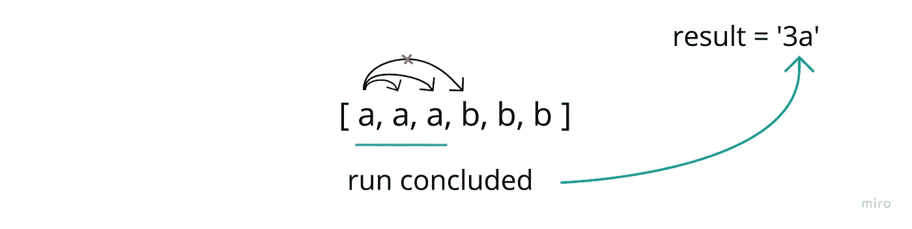
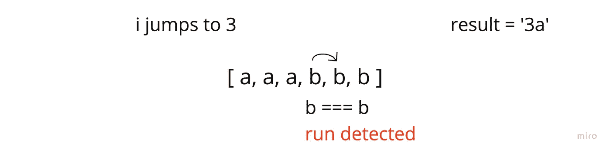
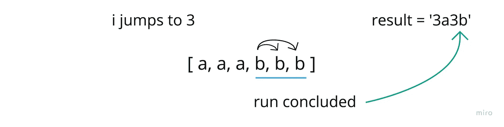

# 用 JavaScript 进行游程编码

> 原文：<https://javascript.plainenglish.io/run-length-encoding-21241e00fcbb?source=collection_archive---------8----------------------->

## 如何用 JavaScript 执行游程编码(RLE)

因此，就简单问题而言，我已经接近 AlgoExpert 系列的尾声，并对转向中等问题感到兴奋。

我已经看到了之前每个简单问题的一些变体，但是这个有点不同(而且很有趣)。

# 问题是

来自维基百科:

***游程编码****(****【RLE】****)是* [*无损数据压缩的一种形式*](https://en.wikipedia.org/wiki/Lossless_data_compression) *其中数据的游程(相同数据值出现在许多连续数据元素中的序列)被存储为单个数据值和计数，而不是原始游程。*

所以，简而言之，“aaaaa”可以转换成“5a”，既节省空间又不丢失数据。

同样的，“aaabbb”会是“3a3b”

然而，一个额外的复杂性是我们的计数只能达到 9。所以，当给定“aaaaaaaaaaaaa”时，我们会以“9a4a”结束。

本质上就是这样。

今天，我将创建处理这种压缩的函数。

# 仔细想想…

我必须承认，这立即让我感到惊讶，因为我属于那种非常简单但包含一些需要解决的固有的笨拙逻辑的特殊算法。

我想在构建结果时，在字符串的单次迭代的上下文中处理这个问题。

那么我该怎么做呢？

1.  我将开始对整个字符串进行迭代
2.  我将对照当前值检查下一个值，以检测运行的开始。
3.  如果我遇到一次运行，我将开始嵌套迭代，对运行进行编目，然后将相应的数字/字母添加到我的结果字符串中。

我还没有解决的一件事是我将如何处理运行长度超过 9 的情况。我会用代码解决这个问题。

# **用图表表示出来……**

我将从简单的字符串输入开始

从这里，我将开始我的外部迭代，并为重复做好准备

现在我已经找到了重复值(运行的开始)，我将开始嵌套迭代，直到找到它的结尾。一旦我找到了运行的终点，我会将适当的数字/字母组合添加到结果中…

…让我跳到运行结束后的索引处。然后我将通过字符串继续我的外部迭代。

然后对新检测到的运行重复嵌套迭代过程。

# **编码出来**

首先，我概述了我的基本策略。

我有一个空字符串，我将在其中添加我的运行段，我的计数变量跟踪一次运行中有多少字符，然后我的外部迭代处理输入字符串。

从这里，我想开始构建我的迭代块…

在第 7 行，我建立了一个索引(在 j 处),用来比较这个值和我的当前值(在 I 处)。

如果这两个相等，那么我的 while 循环(在第 8 行)将运行。现在，我让它保持空白，过一会儿我会解决这个问题。

在第 9 行，在我的 while 循环结束后，count 应该对运行的长度是准确的，我可以在我的结果中添加必要的数字和字母。

在第 10 行，现在我想重置 count，并(在第 11 行)将 I 向上移动到最后一次运行之后。

## ***现在为 while 循环***

**(全解)**

在 while 循环中:

*   首先，我将增加计数
*   然后，如果 count 已经是 9(我们的极限)，我将增加 j 继续向前运行，然后也中断 while 循环。既然 while 循环已经停止，我将把“9 +字母”添加到我的结果中，向上移动 I 并继续完成运行。
*   然而，如果我还没到 9 岁，那么这个看起来就有点不同了。在这种情况下，我只需要增加 j 来继续运行。

Done 和 *done！*

*更多内容看* [***说白了。报名参加我们的***](https://plainenglish.io/) **[***免费周报***](http://newsletter.plainenglish.io/) *。关注我们关于* [***推特***](https://twitter.com/inPlainEngHQ) ，[***LinkedIn***](https://www.linkedin.com/company/inplainenglish/)*，*[***YouTube***](https://www.youtube.com/channel/UCtipWUghju290NWcn8jhyAw)*，以及* [***不和***](https://discord.gg/GtDtUAvyhW) *。***