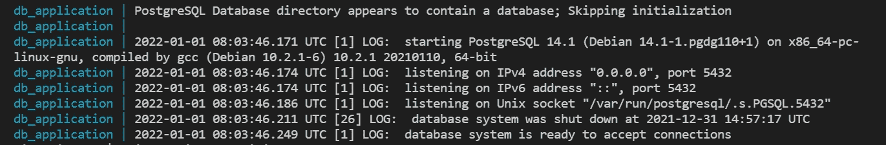
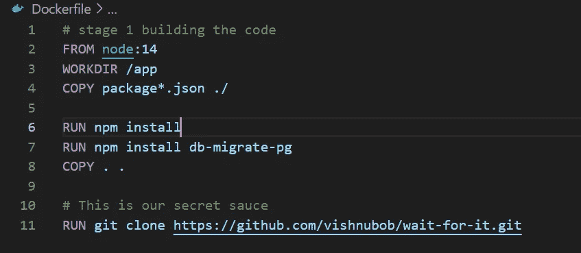
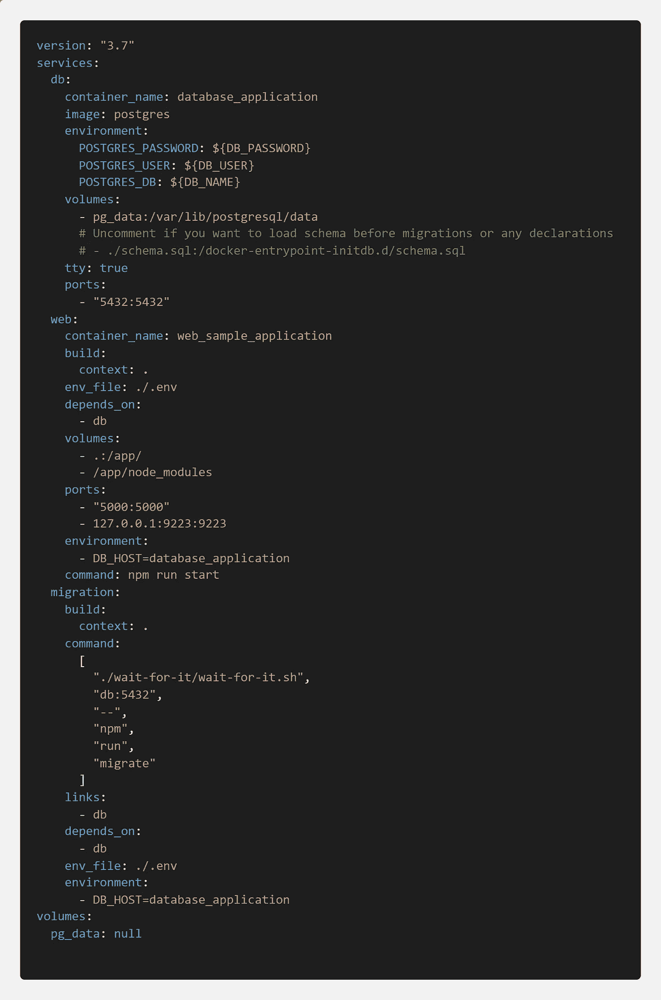
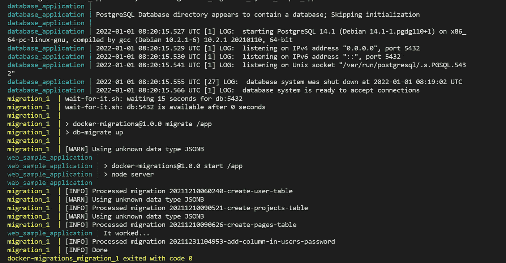

# 使用 Node.js 和 PostgreSQL 中的 Docker 运行迁移

> 原文：<https://javascript.plainenglish.io/run-migrations-using-docker-in-node-and-pg-c6d80e7cd578?source=collection_archive---------0----------------------->


Photo by [Ian Taylor](https://unsplash.com/@carrier_lost?utm_source=medium&utm_medium=referral) on [Unsplash](https://unsplash.com?utm_source=medium&utm_medium=referral)

如今，Docker 正成为创建任何类型的 web 应用程序的必备工具。它隔离你的应用程序，你可以在任何你需要的地方运行。

如果你不熟悉 docker，我会推荐以下链接，你可以从那里开始。

*   [https://docs.docker.com/](https://docs.docker.com/)
*   [https://www . digital ocean . com/community/tutorials/getting-started-with-docker](https://www.digitalocean.com/community/tutorials/getting-started-with-docker)
*   [https://docker-curriculum.com/](https://docker-curriculum.com/)

你可以在 docker 上找到大量的其他资源，这是你应该知道的。我假设你至少对 docker 和 docker-compose 有初步的了解，你可以从这篇文章开始。

# 在开始之前

有些事情你应该明白，当运行任何容器时，都有一段时间容器需要花费时间来构建。在此之前，任何依赖于此的进程都需要暂停。

在我们的例子中，我们应该等到数据库启动并连接了卷，然后只有我们能够运行我们的迁移，对吗？

如果我具体说一下，那么在 PostgreSQL 中，当我们打开数据库容器时，下面是它执行的一些操作。



您可以跳过这些内容，我只是想让您知道，即使数据库正在启动，也不意味着它在启动后就可用，所以您可能需要等待一段时间才能开始。

Bdw，如果你想跳过理论，可以从[这里](https://github.com/Piyush-Use-Personal/migration-in-docker)获取源代码。

# 我们开始吧

我将开门见山，您将有一个执行迁移的命令。在我的例子中，我有一个`package.json`文件和一个名为`npm run migrate`的命令，它将运行我所有的迁移。

现在让我们创建一个名为`Dockerfile`的文件，并在那里放一些内容。



Dockerfile

现在，让我们了解一下除了传统的 Dockerfile 文件之外，我们还写了什么。您将只看到一行

```
RUN git clone https://github.com/vishnubob/wait-for-it.git
```

这将制作一个 wait-it repo 的克隆，并使用它的命令行方法来获得我们想要的东西。

> 你应该去看看 github repo 上正在运行的等待程序

除此之外，我们还在外部安装了一个额外的依赖项`db-migrate-pg`，这是可选的，它是需要安装的包，所以以这种方式安装。

现在让我们再创建一个名为`docker-compose.yml`的文件，它将处理我们的 up、down、pull 和 build 操作。首先，让我们了解一下结构。

我们将有 3 个应用程序:

*   数据库
*   web(根据您的需要选择任何其他方式)
*   迁移(将迁移到您的项目)

在这里，web 和迁移都将依赖于数据库应用程序，在它运行后，它们将开始执行。



docker-compose.yml

**数据库服务**

我们从 env 获取值，并向它附加一个列，从它公开一个端口 5432，这很残忍，因为我们需要照顾端口。

**网络服务**

让我们从`Dockerfile`的上下文中构建它，并将卷和端口连接到它。如果您注意到，我们将主机公开为依赖于数据库服务的数据库应用程序名称。

**迁移**

该服务将类似于 web 服务，但是如果您看到的是一个有点不同的命令，它等待数据库在端口 5432 上启动，就像在数据库服务上公开它，然后运行迁移命令一样。

# 最後的

为了测试一切是否正常，让 write 命令`docker-compose up`首先构建映像，然后执行所有操作。以下是您可以在终端上看到的输出。



output

太好了！现在看来，这种方法非常有效。你可以在这里找到源代码[。](https://github.com/Piyush-Use-Personal/migration-in-docker)

我希望你今天学到了一些新东西；如果你喜欢我的内容，请考虑在这里订阅我的简讯。

谢谢！

*更多内容请看*[*plain English . io*](http://plainenglish.io/)*。报名参加我们的* [*免费周报*](http://newsletter.plainenglish.io/) *。在我们的* [*社区不和谐*](https://discord.gg/GtDtUAvyhW) *获得独家获得写作机会和建议。*