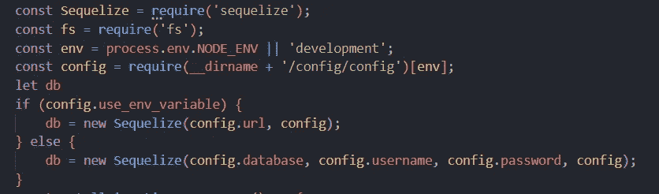
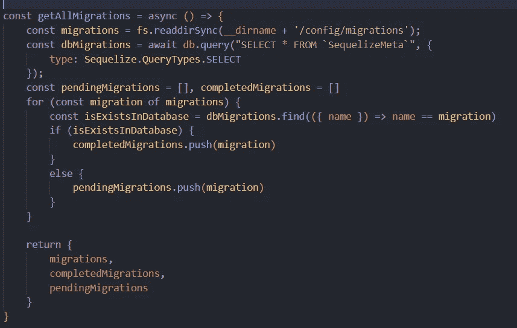
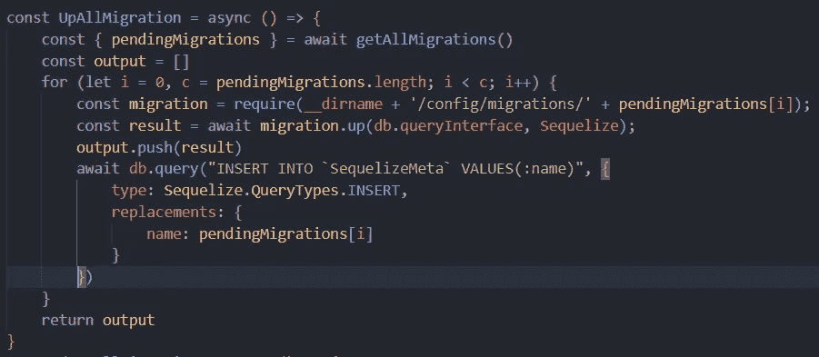
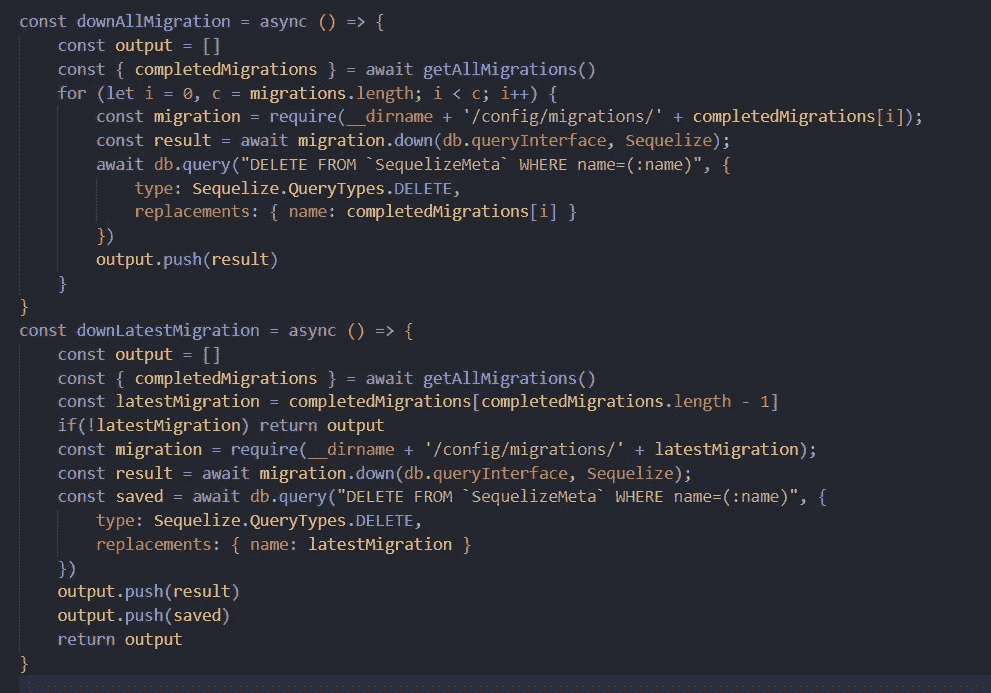

# 如何以编程方式运行顺序迁移

> 原文：<https://javascript.plainenglish.io/run-sequelize-migration-programmatically-1b048d5dff0a?source=collection_archive---------0----------------------->

## 如何以编程方式运行迁移的指南。

Photo by [Florian Olivo](https://unsplash.com/@florianolv?utm_source=medium&utm_medium=referral) on [Unsplash](https://unsplash.com?utm_source=medium&utm_medium=referral)

# 在没有任何外部依赖的情况下运行顺序迁移

Sequelize 是一个著名的基于 promise 的 Node.js ORM，用于关系数据库，包括 PostgreSQL、MySQL 等。今天，我们将讨论如何以编程方式运行迁移。

我们不会使用任何其他外部依赖项，比如[子进程](https://www.npmjs.com/package/childprocess)或 [umzug](https://www.npmjs.com/package/umzug) ，而是完全以编程方式完成。

## 开始

背后的想法是，我们将利用`SequelizeMeta`表来跟踪所有已完成的迁移，我们将基于此执行操作。首先，我们将把文件系统中的所有活动文件放到某个关联的文件夹中，然后搜索每个文件并获取它们的状态，以检查哪些文件是挂起的，哪些是完成的。根据状态，我们将获取 JavaScript 文件并运行`up`或`down`方法来完成迁移。

## 关系

就像传统的序列定义一样，我们将创建一个保存序列实例的 db 变量。

Declaration and imports

## 获取所有迁移

现在，我们已经创建了一个 Sequelize 实例，接下来我们需要做的是获取所有迁移，并根据每个迁移来决定它们是挂起还是完成。

这里，我们使用 SequelizeMeta 表来获取该表中存在的所有迁移。该表仅包含两列`id`和`name`，因此我们将使用该名称进行操作。

以下方法将以单独的条目返回所有迁移，包括待定和已完成的迁移:

## 移动

现在我们已经有了基于类型的所有迁移，我们将为所有文件运行()方法，但是我们需要传递 Sequelize 类实例和实际类，这样我们就可以使用我们之前创建的实例来传递所有方法。

Run all the migrations sequentially

这里，我们循环所有未完成的迁移并运行它们的 up 方法，因为 JavaScript 提供了类本身的实例。迁移成功完成后，我们将在 SequelizeMeta 表中为该特定迁移创建一个新条目，这样它就不会被重新提取。

这就是我们需要理解的全部。同样，我们也可以创建 downLatest 和 downAll 方法实现。

Down latest and down all implementations

这种方法只有两个变化。首先，我们使用 down 方法而不是 up 方法；其次，我们删除条目而不是 insertion 方法，以便在重新运行迁移时获取这些条目。

## 结论

对于本文，我已经创建了两个迁移和一个没有任何配置的小型无服务器应用程序。你可以在这个 GitHub [库](https://github.com/Piyush-Use-Personal/sequelize-programtic-migrations)上找到完整的源代码。

我希望这篇文章对你有用。

编码快乐！

*更多内容看* [***说白了。报名参加我们的***](https://plainenglish.io/) **[***免费周报***](http://newsletter.plainenglish.io/) *。关注我们关于* [***推特***](https://twitter.com/inPlainEngHQ)**和*[***LinkedIn***](https://www.linkedin.com/company/inplainenglish/)*。查看我们的* [***社区不和谐***](https://discord.gg/GtDtUAvyhW) *加入我们的* [***人才集体***](https://inplainenglish.pallet.com/talent/welcome) *。****