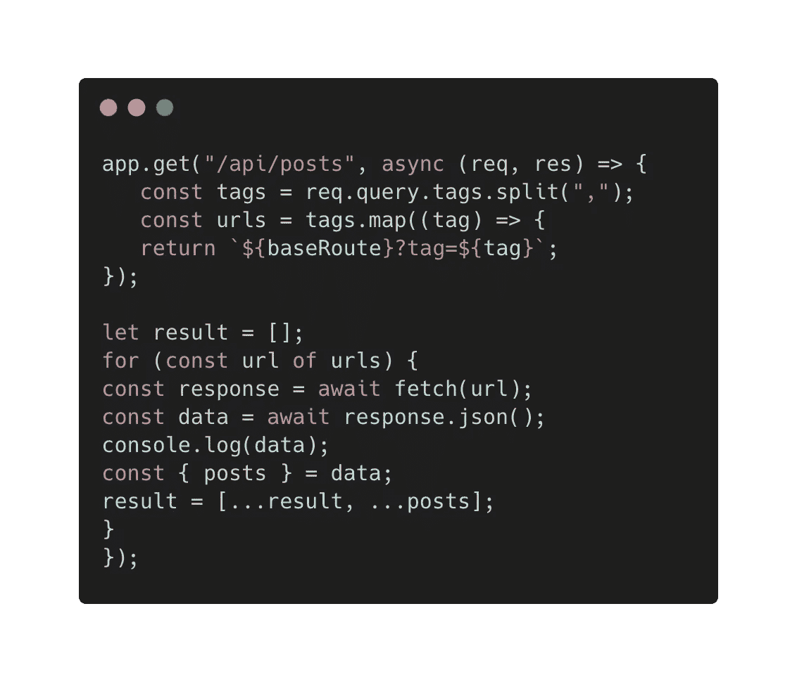
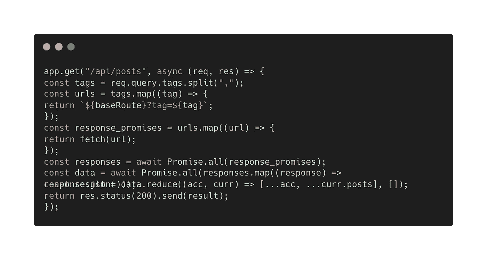

# 使用 Async/Await 和 Promise.all 运行多个请求

> 原文：<https://javascript.plainenglish.io/running-multiple-requests-with-async-await-and-promise-all-e178ae318654?source=collection_archive---------8----------------------->

## 使用 async/await 和 Promise.all 运行多个请求的教程

我有一个任务是从 API 调用多个请求。当用户输入由逗号分隔的多个查询时，我必须向 API 发出相应的请求。

例如，如果 URL 是*localhost:3000/API/posts/tags = tech，history，health，*我将不得不发出 3 个请求！

所以我从下面的代码开始:

正如你所看到的，我首先使用了一个 for 循环来获取第一个 API，然后是第二个，最后是第三个 API。虽然这种方法有效，并且已经完成了我想要实现的目标，但是使用 for 循环时，性能并不好。想象一下，如果我正在做一个有大量数据的大型项目，使用 for 循环会对可伸缩性不利。

因此，我试图同时获取多个 API。我们知道承诺提供了一种异步编程的方式，比如执行和编写异步任务，以及消费 API，这正是我们正在做的。在这里，使用 Promise.all()，我们可以并行地、单独地获取 API，而不会相互依赖！

我希望你喜欢这篇文章。

*更多内容看* [***说白了。报名参加我们的***](https://plainenglish.io/) **[***免费周报***](http://newsletter.plainenglish.io/) *。关注我们关于*[***Twitter***](https://twitter.com/inPlainEngHQ)*和*[***LinkedIn***](https://www.linkedin.com/company/inplainenglish/)*。查看我们的* [***社区不和谐***](https://discord.gg/GtDtUAvyhW) *，加入我们的* [***人才集体***](https://inplainenglish.pallet.com/talent/welcome) *。***