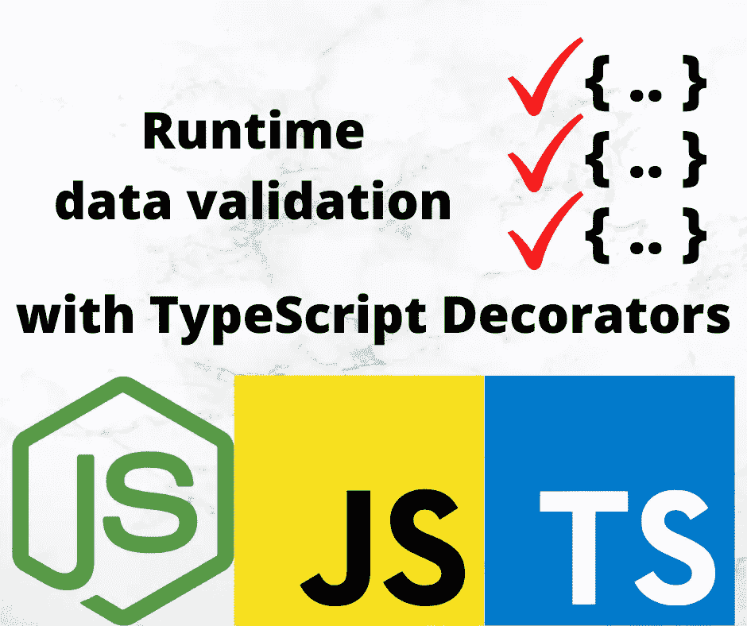

# 使用装饰器和反射元数据在 TypeScript 中进行运行时数据验证

> 原文：<https://javascript.plainenglish.io/runtime-data-validation-in-typescript-using-decorators-and-reflection-metadata-3219fdf5dfb5?source=collection_archive---------16----------------------->

## 运行时数据的自动、简单、验证变得容易



Image by Author using logos from corresponding projects

TypeScript decorators 允许我们拦截对访问函数和方法的调用。这让我们可以监视传递给任一类型函数的数据，甚至为任何缺失的数据提供默认值。这种方法的一个实际用途是自动验证到达访问器或方法的数据。通过检测这些函数，验证包可以充当看门人，确保对象中的数据总是正确的。

在本文中，我们将探索使用 TypeScript decorators 实现自动数据验证。结果将是对象，我们将在其中为属性或调用方法分配数据，验证数据，如果提供了无效值，将抛出异常。TypeScript 为 JavaScript 带来了编译时类型检查和验证，但在运行时没有这样的行为。

我们知道很多人会提出异议。也就是说，普遍认为运行时数据验证会由于额外的代码而导致膨胀，并降低执行速度，因为每个数据访问都是经过验证的。让我们从一开始就解决这个问题。

显然，这是一个合理的担忧。数据验证需要执行额外的代码来检查数据值，需要更多的代码内存和执行时间。但是，考虑三件事:

1.  *防御性编码*，包括编写函数的输入端，以正确处理任何坏的或不可信的数据。
2.  *类型守卫函数*是由 TypeScript 团队推荐的一种实现防御性编码的方法。建议为每种类型创建这些函数，用它们来检查传入的数据。
3.  通过*选择关键路径*进行数据验证，我们可以最小化开销。

类型保护函数是我们被警告的开销或膨胀的一个例子。通过开发类型保护函数，我们可以在使用数据之前对其进行验证，这将减少应用程序中的错误并提高稳定性。但是，每种类型保护都会增加要维护的代码量、运行进程的内存大小和执行时间。

这就是刚才提到的权衡。类型保护功能增加了代码大小和执行时间，同时提高了应用程序的质量。

通过智能地选择哪些代码路径将使用或不使用数据验证，可以减少开销。

# 防御性编码的好处

我第一次听说*防御性编码*的概念是在经典编程书《Kernighan 和 Plauger 的编程风格的*元素》中。在这种情况下，Kernighan 就是帮助开发了 *C* 编程语言和 *UNIX* 操作系统的同一个人。第 5 章，*输入和输出*，以一篇新闻文章开始，描述了一个在印第安纳州 Woonsocket 的城市雇员如何犯了一个“键入”(又名数据输入)错误，使该市损失了 29 万美元的税收。在那个时间段，1972 年，数据是通过穿孔卡片上的按键输入的，这当然是你们大多数人没有经历过的遥远的记忆。真正的问题是检测数据输入错误，并认识到数据输入问题在今天和那时一样可能存在。*

我们中有多少人写过因为输入验证失败而导致错误的应用程序？

如果我们的应用程序由于输入验证失败而做出疯狂的事情，对我们自己或我们的业务(因此对我们的工作)有什么潜在的成本？

要正确看待这个问题，请看:https://xkcd.com/327/被人们称为博比·博比·博比。

使用防御性编码，在使用输入数据之前对其进行检查和验证，是一个非常好的想法。类型保护函数是防御性编码的优秀工具。guard 函数可以编写一次并使用一千次，而不是到处重新实现数据验证。开发人员必须记住在任何需要的地方调用类型保护。开发人员可能会忘记在关键路径上使用类型保护，再次冒着由于验证数据失败而导致疯狂行为的风险。

考虑一个类

```
class CarLicense {
     #make: string; set make(nt: string) { this.#make = nt; }
     get make() { return this.#make; } #model: string; set model(nm: string) { this.#model = nm; }
     get model() { return this.#model; } #year: number; set year(ny: number) { this.#year = ny; }
     get year() { return this.#year; } #vin: string; set vin(nv: string) { this.#vin = nv; }
     get vin() { return this.#vin; } #license: string; set license(nl: string) { this.#license = nl; }
     get license() { return this.#license; } 
}
```

这些是汽车的一些重要属性。正确识别汽车的所有属性非常重要。这些属性中的大多数都有已知的值——制造商名称、型号名称、VIN 号码格式和牌照格式。核实这些事情很容易。但是目前的代码没有验证任何东西。这意味着这个类的一个实例可能持有不正确的数据，而应用程序无法知道。

我的建议是，在这些属性的`set`端，安装数据验证。使用装饰函数，我们可以可靠地覆盖`set`方法，因此知道分配给这些字段的每个值都是正确的。因为数据存储在 JavaScript 私有属性中，赋予它新值的唯一途径是通过`set`方法。因此，安装在该方法上的验证将确保只存储正确的、经过验证的数据。

换句话说，如果验证可以像在访问器函数中添加相应的装饰器一样简单，那会怎么样呢？像`@IsIn([ 'Ford', 'GM', 'Chevy', 'Tesla', ... ])`这样的装饰者可以在已知名称列表中验证汽车制造商名称，或者使用`@IsIntRange(1920, 2030)`验证车型年份。

在本文中，我们将展示如何使用 TypeScript decorators 实现运行时数据验证。验证将自动在访问器函数的`set`端执行，并将参数传递给类方法。只有附加了验证修饰符的访问器或方法才会进行验证。

本文是系列文章的一部分:

*   [装修工介绍](/deep-introduction-to-using-and-implementing-typescript-decorators-a9e876ad0d43)
*   [类装修工](https://itnext.io/deep-introduction-to-class-decorators-in-typescript-23005ea5d035)
*   [物业装修工](/a-deep-introduction-to-property-decorators-in-typescript-8ef011169ec)
*   [访问器装饰器](/typescript-accessor-decorators-in-depth-take-control-over-get-and-set-accessor-methods-8b85c95124f9)
*   [参数装饰器](/introduction-to-parameter-decorators-in-typescript-b0042b5474ed)
*   [方法装饰者](/a-deep-introduction-to-method-decorators-in-typescript-6045d52e10a6)
*   [混合装修工](/implement-hybrid-decorator-functions-in-typescript-f6d24bc5abb0)
*   [反射和带装饰器的反射 API](/using-the-reflection-and-reflection-metadata-apis-with-typescript-decorators-c56ba9c690c7)
*   **运行时数据验证在 TypeScript 中使用装饰器和反射元数据** *本文*

要使用 decorator，必须在 TypeScript 中启用两个特性，所以请务必阅读本系列的 decorator 介绍文章。

# 检查访问器、方法和参数修饰符

所需的核心技术是覆盖附加到 PropertyDescriptor 对象的函数。访问器装饰函数和方法装饰函数都提供与被装饰对象相关的属性描述符。在这两种情况下，对象都有函数，我们可以用自己的函数替换它们。具体来说:

*   访问器装饰器在`get`和`set`字段中有函数。为了处理数据验证，我们用一个执行数据验证的函数覆盖了`set`函数。参见[TypeScript](/deep-introduction-to-using-and-implementing-typescript-decorators-a9e876ad0d43)中对访问器装饰器的深入介绍
*   方法装饰者在`value`字段中有一个函数。要处理数据验证，用一个扫描参数的函数覆盖它，验证任何已经给定了验证装饰器的参数。参见[对 TypeScript](/a-deep-introduction-to-method-decorators-in-typescript-6045d52e10a6) 中方法装饰器的深入介绍

这需要三组装饰函数:

*   可以附加到访问函数或方法参数的验证装饰器。这些描述了它们附加到的对象所需的验证
*   `@ValidateAccessor<type>()` -附加到访问器上，也就是附加覆盖函数的部分，覆盖函数反过来执行验证
*   `@ValidateParams` -附加到方法上，也就是附加覆盖函数的部分，覆盖函数反过来执行验证

作为参考，在[对 TypeScript](/typescript-accessor-decorators-in-depth-take-control-over-get-and-set-accessor-methods-8b85c95124f9) 中的访问器装饰器的深入介绍中有一个简单的数据验证示例

最后要考虑的是让验证装饰器能够附加到`set`访问器或方法参数上。我们在[在 TypeScript 中实现混合装饰函数](/implement-hybrid-decorator-functions-in-typescript-f6d24bc5abb0)中讨论了实现技术

# 运行时数据验证的状态

有几个处理运行时数据验证的包。其中包括[乔伊](https://www.npmjs.com/package/joi)、 [AJV](https://www.npmjs.com/package/ajv) 和[佐德](https://www.npmjs.com/package/zod)。all 的一个问题是我前面提到的，程序员必须记得添加数据验证，但可能会忘记这样做。

`[class-validator](https://www.npmjs.com/package/class-validator)`包使用附加到属性的装饰器。在开发下述软件包时，该软件包是一个灵感来源。然而，程序员必须记得调用它的`validate`或`validateOrReject`方法。

一个包`[validator](https://www.npmjs.com/package/validator)`，有一个很长的验证函数列表。`class-validator`包使用了这个包中的验证函数。下面将要描述的包也是如此。

本文描述了一个不同的包，`[runtime-data-validation](https://www.npmjs.com/package/runtime-data-validation)`。它包含了一长串数据验证装饰器，并支持在使用类属性和方法的正常过程中自动执行数据验证。

# 测试类

我们将使用这个类定义作为测试用例:

```
class ValidateExample {
     #year: number; @ValidateAccessor<number>()
     @IsIntRange(1990, 2050)
     @IsInt()
     set year(ny: number | string) {
         this.#year = ToInt(ny);
     }
     get year() { return this.#year; } @ValidateParams
     area(
         @IsFloatRange(0, 1000) width: number | string,
         @IsFloatRange(0, 1000) height: number | string
     ) {
         return ToFloat(width) * ToFloat(height);
     }
}
```

有一个访问器对覆盖了`year`属性。我们把它定义为 1990 年到 2050 年之间的一个整数。还有一个名为`area`的函数，它使用`width`和`height`来计算面积。两者都被定义为`0`和`1000`之间的浮点值。

我们将参数定义为`number | string`，因为我们经常从可能包含数字的字符串表示的数据源中读取数据。验证装饰者必须注意识别这两种格式的数字。此外，我们使用`ToInt`和`ToFloat`将可能的字符串值转换为数字。

`@ValidateParams`装饰器将寻找附属于参数的装饰器。同样的，`@ValidateAccessor` decorator 将寻找附加到访问器的其他 decorator。在这两种情况下，它将覆盖 PropertyDescriptor 中的正确函数，以便可以验证这些值。

# 实现混合验证装饰器

我们有两种装饰函数要实现:

*   *验证装饰器*必须能够附加到访问器或者方法参数。
*   *执行装饰器*是`@ValidateParams`，附加在方法上，和`@ValidateAccessor`，附加在访问器上。

对于验证装饰器，我们在关于混合装饰器的文章中讨论了一种技术。在那篇文章中，我们开发了五个函数，用于确定装饰器附加到哪种对象上。这些功能可以从`[decorator-inspectors](https://www.npmjs.com/package/decorator-inspectors)`包中获得。

这意味着实现类似于:

```
import {
     isClassDecorator, isPropertyDecorator, isParameterDecorator,
     isMethodDecorator, isAccessorDecorator 
} from 'decorator-inspectors'; function IsFloatRange(min: number, max: number) {
   return (target: Object,
      propertyKey?: string | symbol,
      descriptor?: number | PropertyDescriptor) => { if (isAccessorDecorator(target, propertyKey, descriptor)) {
         // Record in metadata a function to check that
         // a value is within range
      } else if (isParameterDecorator(target, propertyKey, descriptor)) {
         // Record in metadata a function to check that
         // a value is within range
     }
  } 
}
```

这是一个装饰工厂函数。外部函数接受参数`min`和`max`，定制这个装饰器的行为。内部函数是实际的装饰器。这个函数的签名是我们在研究混合装饰器时确定的，它让我们创建一个可以附加到任何可装饰对象的装饰器。通过这五个`isXYZZYDecorator`函数，我们确定了使用这个装饰器的上下文，然后为每个上下文做正确的事情。

换句话说，装饰函数必须测试它是如何被使用的，并对每个上下文采取正确的动作。

但是，以这种方式实现大量混合装饰函数是不可伸缩的。考虑到`validator`包中验证函数的数量，我们需要一个更紧凑的实现，特别是因为会有很多重复的代码。

# 验证装饰器实现

在[运行时数据验证](https://www.npmjs.com/package/runtime-data-validation)包中，我想到的是让外部装饰函数遵循这种模式:

```
export function IsInt() {
     // console.log(`params.IsInt`);
     return generateValidationDecorator(
                 (value) => numbers.IsInt(value),
                 `Value :value: not an integer`); 
}
```

内部函数由`generateValidationDecorator`封装，依次带两个参数。一个是验证函数的核心，另一个是在抛出的错误中使用的消息。在这种情况下，`numbers.IsInt`是内部模块中处理验证的函数。

在`generateValidationDecorator`中，我们测试这是哪种装饰器:

```
export function generateValidationDecorator(
                 validator: Function, message: string) {
   return (target: Object, propertyKey?: string | symbol,
       descriptor?: number | PropertyDescriptor) => { if (isAccessorDecorator(target, propertyKey, descriptor)) {
           generateAccessorDecorator(validator, message,
                     target, propertyKey,
                     <PropertyDescriptor>descriptor);
       } else if (isParameterDecorator(target, propertyKey,
                                       descriptor)) {
           generateParameterDecorator(validator, message,
                     target, propertyKey, <number>descriptor);
       }
   } 
}
```

对于访问器装饰器，我们使用`generateAccessorDecorator`，否则使用`generateParameterDecorator`。每个都包含特定于每个装饰器类型的代码。

由于`descriptor`既可以是`number`也可以是`PropertyDescriptor`，我们根据调用的函数将其转换为正确的类型。

那么，我们来看看`generateAccessorDecorator`:

```
function generateAccessorDecorator(
                  validator: Function, message: string,
                  target: Object, propertyKey: string | symbol,
                  descriptor: PropertyDescriptor) { let existing = Reflect.getMetadata(ACCESSOR_VALIDATORS,
                 target, propertyKey)
         || [];
     const vfunc = function(value) {
         if (!validator(value)) {
             throw new Error(
                 message.replace(':value:',
                     util.inspect(value)));
         }
     };
     if (!existing) {
         existing = [ vfunc ];
     } else {
         existing.push(vfunc);
     }
     // Store metadata
     Reflect.defineMetadata(ACCESSOR_VALIDATORS,
         existing, target, propertyKey);
}
```

这是我们进入正题的地方。装饰器被附加到由`target`和`propertyKey`标识的对象上。我们使用`Reflect.getMetadata`将验证器函数存储在目标对象的`ACCESSOR_VALIDATORS`元数据中。我们生成一个执行验证器函数的函数，传递一个值，如果验证器指示`false`，那么就会抛出一个错误。这个函数被推入一个数组，然后被添加回`ACCESSOR_VALIDATORS`元数据。

换句话说，对于由`target`和`propertyKey`标识的访问器，我们维护一个名为`ACCESSOR_VALIDATORS`的元数据值。这包含一个验证器函数数组。目标是在`set`函数执行之前执行这些函数来验证值，并避免在值无效时执行`set`。

在`generateParameterDecorator`中，我们做了大致相同的事情，但是元数据是`PARAMETER_VALIDATORS`。在这种情况下，`target`和`propertyKey`指的是包含被修饰参数的方法。

对于这两种情况，都提供了验证函数。验证函数存储在反射元数据中，这就是这些函数所做的全部工作。这两个函数不能设置验证函数的执行。它们只能存储函数，以便其他代码可以设置它们的执行。

# 执行装饰器实现

对于访问器，执行由这个访问器装饰器安排:

```
export function ValidateAccessor<T>() {
     return (target: Object, propertyKey: string,
                     descriptor: PropertyDescriptor) => { const originals = {
             get: descriptor.get,
             set: descriptor.set
         };
         if (originals.set) {
             descriptor.set = function(newval: T) {
                 let validators =
                     Reflect.getMetadata(ACCESSOR_VALIDATORS,
                             target, propertyKey)
                     || [];
                 for (const func of validators) {
                     func(newval);
                 }
                 originals.set.call(this, newval);
             };
         }
     } 
}
```

对于访问器，我们通过附加`ValidateAccessor`装饰器来执行验证器函数。这会得到一个`PropertyDescriptor`对象，其中的`get`和`set`函数对应于`get`和`set`访问器。我们所做的就是将这些保存在`originals`对象中。然后我们添加一个`set`函数来检索`ACCESSOR_VALIDATORS`元数据，您记得它包含这个特定目标的验证器函数。

注意，这个实现允许对每个目标使用多个验证函数。这样我们就可以添加任意数量的验证。

这个覆盖函数执行每个验证函数。如果它们都执行了，这意味着它们都没有失败，因为失败的验证会导致抛出一个错误，从而中止该函数。因此，如果全部正确执行，那么`originals.set`被调用来执行原来的`set`功能。

现在..既然所有的访问器装饰函数都接收`PropertyDescriptor`，那么这是否提出了为什么我们必须创建`ValidateAccessor`的问题？

答案与通过`ValidateAccessor`传递数据类型的必要性有关。注意，我们使用一个通用字段来传入一个数据类型，该数据类型在覆盖的`set`函数中使用。这个内部函数需要使用这个数据类型。我们将无法使用验证器装饰函数来做到这一点。因此，需要`ValidateAccessor`。

查看更多关于访问器装饰器的内容:[TypeScript 中对访问器装饰器的深入介绍](/typescript-accessor-decorators-in-depth-take-control-over-get-and-set-accessor-methods-8b85c95124f9)

在`ValidateParams`中，我们有一个类似的实现。不同之处在于这个装饰器被附加到方法上，从而得到一个具有不同内容的`PropertyDescriptor`。

```
export function ValidateParams(
     target: Object, propertyKey: string | symbol,
     descriptor: PropertyDescriptor, ) { // Store the original value
     const savedValue = descriptor.value;
     // Attach validation logic
     descriptor.value = function(...args: any[]) {
         let validators = Reflect.getMetadata(PARAMETER_VALIDATORS,
                                 target, propertyKey)
                         || [];
          for (const key in Object.keys(validators)) {
             if (key === 'length') continue;
             const funclist = validators[key];
             const value = args[key];
             for (const func of funclist) {
                 func(value);
             }
         }
         // Actually call the function
         return savedValue.call(this, ...args);
     }; 
}
```

使用方法装饰器，`value`字段包含方法的函数。我们保存它，然后创建一个覆盖函数。在这种情况下，我们查看为其提供了验证器函数的每个参数。对于每一个，我们获取验证器函数的列表，然后根据存储在该参数中的值运行每个验证器函数。如果都正确执行，那么我们调用原始函数，提供原始参数列表。

要查看更多关于方法装饰器的内容，请参见:[对 TypeScript 中方法装饰器的深入介绍](/a-deep-introduction-to-method-decorators-in-typescript-6045d52e10a6) —对于参数装饰器，请参见:[对 TypeScript 中参数装饰器的深入介绍](/introduction-to-parameter-decorators-in-typescript-b0042b5474ed)

# 测试运行时数据验证装饰器

要测试我们所创建的内容，请创建以下脚本:

```
import {
     IsIntRange, IsInt, IsFloatRange, IsFloat,
     ToFloat, ToInt,
     Contains,
     ValidateParams, ValidateAccessor
} from 'runtime-data-validation'; // The above code - ValidateExampleconst ve = new ValidateExample();  
ve.year = 1990; 
ve.year = 2000; 
ve.year = 2020; 
// ve.year = 2060; 
// ve.year = 1980;  
console.log({
     width: 10,
     height: 10,
     area: ve.area(10, 10) 
});  
console.log({
     width: '20',
     height: '16.6',
     area: ve.area('20', '16.6') 
});  console.log({
     width: 'twenty',
     height: '16.6',
     area: ve.area('twenty', '16.6') 
});
```

我们有几行代码给`year`属性赋值。然后我们几次调用`area`方法。对于每一个，我们提供有效数据和无效数据。

运行该程序，我们得到以下输出:

```
$ npx ts-node lib/validation/validate2.ts  
{ width: 10, height: 10, area: 100 } 
{ width: '20', height: '16.6', area: 332 } 
.../runtime-data-validation-typescript/lib/validators.ts:51
             throw new Error(
                   ^ 
Error: Value 'twenty' not a float between 0 and 1000
```

注意，传递字符串`'20'`和`'16.6'`被解释为数字，结果是正确的。这是因为实现识别两个数字字符串，并在执行数学运算之前将它们转换为数字。在任何情况下，要点是这些赋值和方法调用都是经过验证的。此外，当我们确实有一个错误时，错误消息是相当有用的。

# 摘要

这表明在 TypeScript 中自动化运行时数据验证是可能的。该方法包括将 decorators 附加到访问函数和常规类方法上。这些装饰器处理对任何一个的重写调用，并确保数据满足应用程序开发人员设计的有效性约束。

因此，只要您可以通过对象中的访问器或方法来收集数据，就可以自动验证这些数据。

本文展示的技术是一个包的核心:`[https://www.npmjs.com/package/runtime-data-validation](https://www.npmjs.com/package/runtime-data-validation)`这个包包含了一长串的验证装饰器，并且使得创建你自己的验证装饰器变得容易。

# 关于作者

[***大卫·赫伦***](https://davidherron.com) *:大卫·赫伦是一名作家和软件工程师，专注于技术的明智使用。他对太阳能、风能和电动汽车等清洁能源技术特别感兴趣。David 在硅谷从事了近 30 年的软件工作，从电子邮件系统到视频流，再到 Java 编程语言，他已经出版了几本关于 Node.js 编程和电动汽车的书籍。*

*最初发表于*[*【https://techsparx.com】*](https://techsparx.com/nodejs/typescript/decorators/runtime-validation.html)*。*

*更多内容看* [***说白了。报名参加我们的***](https://plainenglish.io/) **[***免费周报***](http://newsletter.plainenglish.io/) *。关注我们关于*[***Twitter***](https://twitter.com/inPlainEngHQ)*和*[***LinkedIn***](https://www.linkedin.com/company/inplainenglish/)*。加入我们的* [***社区***](https://discord.gg/GtDtUAvyhW) *。***