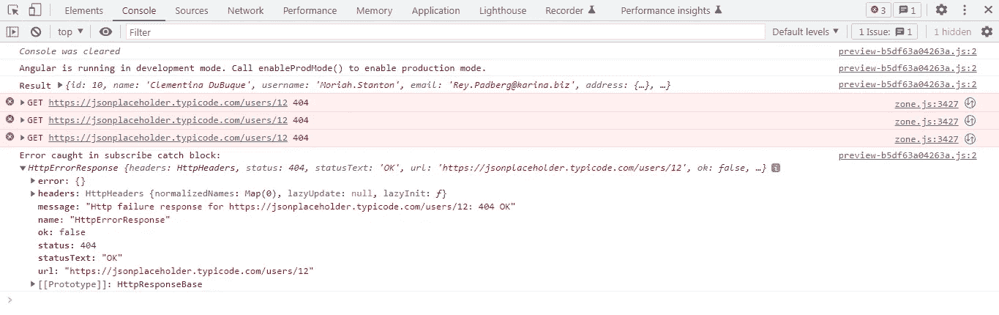

# 重试 HTTP 请求的次数是固定的，有一个角度延迟

> 原文：<https://javascript.plainenglish.io/rxjs-angular-retrying-sequential-or-parallel-http-requests-a-fixed-number-of-times-and-also-with-a-b445e1560f88?source=collection_archive---------0----------------------->

## 关于使用 RXJS，Angular 以固定的延迟次数重试顺序或并行 HTTP 请求的指南。


Photo by [Mitchell Luo](https://unsplash.com/@mitchel3uo?utm_source=medium&utm_medium=referral) on [Unsplash](https://unsplash.com?utm_source=medium&utm_medium=referral)

延迟重试 HTTP 请求或不延迟重试固定次数的 HTTP 请求非常简单，RXJS 为我们提供了 **retryWhen、delay、**和 **retry** 操作符来实现这一点。但是如果我们想要一个结果来处理重试之间的延迟和重试次数呢？

这些是我们的目标:

1.  分别并行和按顺序执行 2 项任务。
2.  如果失败，任务最多重试 2 次，每次重试之间有 2000 毫秒的间隔。

应用程序就像下面的截图一样简单。只需两个按钮就能实现上面列出的两个目标。


angular application

**AppComponent 模板:**这个模板包含了你可以在截图中看到的 2 个按钮。点击它们将并行或顺序执行任务。

**AppComponent 类:**在类中，我们定义了当我们点击 AppComponent 模板中的 2 个按钮时将被调用的 2 个方法。

让我们从**executeinsidenttasksinparallel()**开始。我们使用了 **forkJoin** RXJS 操作符来并行执行这两个任务。

这两个任务，即 task1()和 task2()不过是我们在 **RetryService** 中定义的 **HTTP GET 请求**。我们将很快进入服务。

请注意，我们已经用管道将 **catchError** 操作符连接到从 **task1()** 和 **task2()返回的**内部观察值**。**这样做的原因是，无论哪个任务先执行:task1()或 task2()，如果任务失败， **catchError** 运算符将执行可观测替换的任务。它将使用操作员的**创建的成功可观察值替换错误可观察值。**

如果没有这种替换，在第一个执行的任务失败时，源可观察对象将出错，第二个任务将不会执行。但是我们要求无论成功或错误都执行这两个任务来验证所有场景。

转到**executeinsidenttasksinsequence()**，我们只是使用 **concat** rxjs 操作符按顺序执行 task1()和 task2()。

现在，让我们检查一下 **RetryService** ，看看这些任务做了什么。

task1()正在向[https://jsonplaceholder.typicode.com/users/10](https://jsonplaceholder.typicode.com/users/10)发出 HTTP GET 请求。这是一个有效的请求，预计将发送一个 JSON 对象，其中包含 userId 为 10 的用户的详细信息。

task2()正在向 https://jsonplaceholder.typicode.com/users/12 的[发出一个 HTTP GET 请求。没有 userId 为 12 的用户。因此，我们预计这个请求会失败，并出现 404 错误。](https://jsonplaceholder.typicode.com/users/12)

现在让我们来看看这个方法，在这个方法中，我们配置了一个特定的重试次数，在重试之间有一个延迟。

当请求失败时，触发 **RetryService** 中的 **handleRetryError()** 。我们将“重试之间的延迟”作为该方法的参数传递。在本例中，两个任务的延迟时间相同，均为 2000 毫秒。

```
let retries = 0;
let exceedAttemptLimit = 3;
```

因为我们希望失败的任务最多重试 2 次，所以我们将变量**exceetattemplimit**设置为 3。变量 **retries** 记录任务完成的重试次数。

```
return **retryWhen**((error) => {
return error.pipe(
**delay**(delayTime),
**concatMap**((err) => {
**retries = retries + 1;
if (retries < exceedAttemptLimit) {
return of(err);
} else {
throw err;**
}
})
);
});
```

只有当 2000 ms 的延迟完成并且 **retries** 变量的值小于 3 时， **retryWhen** 操作器才会重试失败的任务。

当**重试**变量等于 3 时，我们使用 **throw** 操作符来防止进一步的重试。

当我点击“**按顺序执行任务**按钮时，正如你在第一张截图中看到的，task1()已经执行并成功返回了一个 200 状态码的响应。

task2()第一次失败，出现 404 错误，然后该任务重试了 2 次，延迟时间为 2000 毫秒

在第二个屏幕截图中，我们记录了来自 task1()的 JSON 对象和来自 task2()的错误响应。


Network response for sequential execution



Console response for sequential execution

为了验证任务是否在 2000 毫秒的延迟后重试，您可以在开发工具中右键单击任何请求，并选择“**将所有内容保存为 HAR**”。


save .har file


.har file

答。har 文件将被下载到您的系统中。您可以通过 URL 在文件中搜索失败的请求，并检查属性 **startedDateTime 的值。**由于该任务已经执行了 3 次，您可以在这里查看所有 3 个实例的请求和响应细节。har 文件。在每个实例中， **startedDateTime** 属性的值将相差 2000 毫秒。

当我点击**执行并行任务**按钮时，结果会如你在下面 2 张截图中看到的那样。


Network Response for parallel execution


Console Response for parallel execution

请注意，在 subscribe catch 块中没有捕获到任何错误。相反，我们可以在 subscribe success 块中看到记录的结果对象。该对象有两个属性: **task1** ，其中包含 userId 为 10 的用户的 JSON 对象， **task2** 包含 404 错误响应。

失败的 task2 以类似的方式重试了 2 次。

这只是两种情况。这里还可以尝试 3 种变化:

1.  两个任务都失败了。
2.  任务 1 失败，任务 2 成功。
3.  两项任务都成功了。

您可以查看下面的完整工作示例:

[](https://stackblitz.com/edit/angular-ivy-ezvzzr?file=src/app/retry.service.ts) [## 角状常春藤(分叉)- StackBlitz

### 基于@angular/animations、@angular/compiler、@angular/core、@angular/common 的 angular-cli 项目…

stackblitz.com](https://stackblitz.com/edit/angular-ivy-ezvzzr?file=src/app/retry.service.ts) 

*更多内容看* [***说白了就是 io***](https://plainenglish.io/) *。报名参加我们的* [***免费周报***](http://newsletter.plainenglish.io/) *。关注我们关于*[***Twitter***](https://twitter.com/inPlainEngHQ)*和*[***LinkedIn***](https://www.linkedin.com/company/inplainenglish/)*。查看我们的* [***社区不和谐***](https://discord.gg/GtDtUAvyhW) *加入我们的* [***人才集体***](https://inplainenglish.pallet.com/talent/welcome) *。*