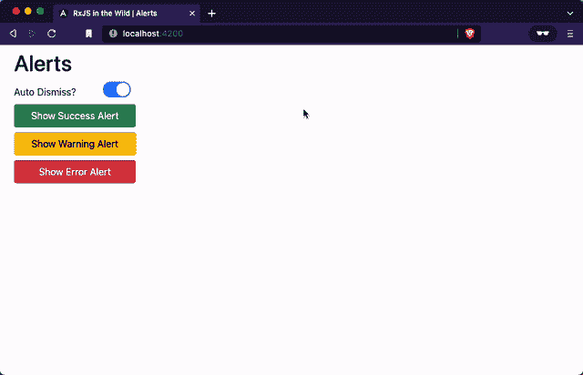

# 野外 RxJS:如何创建弹出警报

> 原文：<https://javascript.plainenglish.io/rxjs-in-the-wild-how-to-create-pop-up-alerts-69134162c8b2?source=collection_archive---------3----------------------->

## 用 RxJS 和 Angular 创建简单、漂亮的弹出警告


RxJS in the Wild: How to Create Pop-up Alerts ([Eric Gevaert](https://www.shutterstock.com/image-photo/cute-siberian-tiger-cub-panthera-tigris-15731107))

# 现代教程🐈

教程是一个惊人的生物，能够跨越海洋、山脉、峡谷和沙漠传递大量信息。遗憾的是，现代教程往往是圈养出生；脱离自然和现实世界应用的无菌环境。然而，偶尔会从野外捕捉到一个教程，并将其转移到媒体中，同时保留其完整的威严。

# 警报📢

向用户提供反馈对于提供良好的用户体验非常重要，显示警告是大多数 web 应用程序不可或缺的一部分。重要的是让用户知道长时间运行的操作何时成功，或者应用程序何时出现故障，以便他们能够做出相应的反应。

这篇文章的灵感来自于我们在 [BugSplat](https://bugsplat.com) 使用的警报控件，当设置更新时，或者当执行网络调用时出现问题时，该控件会显示警报。

RxJS Alerts on Stack Blitz

在本教程中，我们将使用 [Angular](https://angular.io/) 、 [Bootstrap](https://getbootstrap.com/) 和 [RxJS](https://rxjs.dev/) 构建一个非常简单的警报系统。本文的配套回购可以在 [GitHub](https://github.com/bobbyg603/rxjs-in-the-wild-alerts) 和 [StackBlitz](https://stackblitz.com/edit/github-ms1wfi) 上找到。

## 警报服务

我们的警报系统需要一种方法来跟踪显示给用户的所有警报。我们需要允许用户解除警报，我们还希望允许某些警报自动消失。

我们的警报服务是一个有状态的服务，包含一个由警报组件显示的可观察的数组`alerts$`。如果应该自动解除警报，我们需要推送警报、解除警报以及在超时后解除警报的方法:

Alert Service

我们在`_state`中保存了一组警报。我们公开了一个每次`_state`更新时都会发出的`alerts$`可观察对象。我们将`this._alertSubject.asObservable()`的结果保存为私有字段，这样我们就不会直接向消费者公开这个主题，也就不会为每个获取`alerts$`的调用创建一个新的可观察对象。

函数`dismissAlert`、`pushAlert`和`pushErrorAlert`增加和删除`_state`的值，并告诉`_alertSubject`发出一个具有更新状态的新事件。为了自动解除警报，我们使用`firstValueFrom`和`timer`创建一个承诺，在指定时间过后调用`this.removeAlert(alert.id)`。

## 警报组件

我们需要向用户显示警报，以便他们可以很容易地被注意到，并在得到确认后被解除。警告通常显示在屏幕的顶部或底部，并覆盖应用程序的其余内容。

我们的警报组件需要用适当的消息和颜色显示每个警报。这些警告需要用户可以点击，以便他们可以相应地被解雇。

Alert Component

我们的警报组件模板使用`*ngFor`和[异步管道](https://angular.io/api/common/AsyncPipe)来显示一组警报及其相应的消息。我们使用`alertColorClassName`管道将`Alert.color`属性转换成一个引导类名。最后，当用户点击警告时，我们调用`onRemoveAlertClick`。

在警报组件样式中，我们添加了`@media`查询，在大屏幕上显示宽度为`500px`的警报，在小屏幕上显示宽度为`100%`的警报。我们还将光标设为`pointer`,向用户传达可以通过在任何地方点击来解除警告。我们还删除了一些默认的`ul`样式，这样我们就可以整齐地显示警报。

支持警报组件的代码非常简单，它公开了一个从警报服务发出新值的`alerts$` observable。当用户点击提醒时，我们调用`onRemoveAlertClick`处理程序，它调用提醒服务上的`dismissAlert`。

## 应用程序组件

要将警报组件显示为整个应用程序的覆盖图，我们只需将警报组件添加到应用程序组件模板中。我们还希望有几个按钮来测试不同类型的错误，以及一个切换开关，使我们能够确定是否应该自动解除新的警报。

最后但同样重要的是，当调用`onShowAlertClick`时，我们需要使用 App 组件中的代码来调用`pushAlert`以创建警报并向用户显示它们。我们还需要将`autoDismiss`属性暴露给模板，这样它就可以在与 NgxToggle 组件的双向绑定中使用。

App Component

# 恭喜🎉

在本教程中，您学习了如何使用 RxJS、Angular 和 Bootstrap 制作一个简单、优雅的警报组件。如果你做的一切都是正确的，你应该得到类似如下的东西:



Alerts with Angular and RxJS

感谢阅读！如果你觉得这篇文章很有趣，你可能也会喜欢 Angular 开发者的[CI/CD](https://betterprogramming.pub/ci-cd-for-angular-developers-be9a1485d22b)，或者用 Angular 和 RxJS 上传的[文件。](https://betterprogramming.pub/file-uploads-with-angular-and-rxjs-34262b3450ae)

```
**Want to Connect?**If you found the information in this tutorial useful please subscribe on [Medium](http://bobbyg603.medium.com), follow me on [GitHub](https://github.com/bobbyg603), and/or subscribe to my [YouTube](https://www.youtube.com/c/bobbyg603) channel.
```

*更多内容看* [***说白了。报名参加我们的***](https://plainenglish.io/)***[***免费周报***](http://newsletter.plainenglish.io/) *。关注我们关于*[***Twitter***](https://twitter.com/inPlainEngHQ)*和*[***LinkedIn***](https://www.linkedin.com/company/inplainenglish/)*。查看我们的* [***社区不和谐***](https://discord.gg/GtDtUAvyhW) *加入我们的* [***人才集体***](https://inplainenglish.pallet.com/talent/welcome) *。****