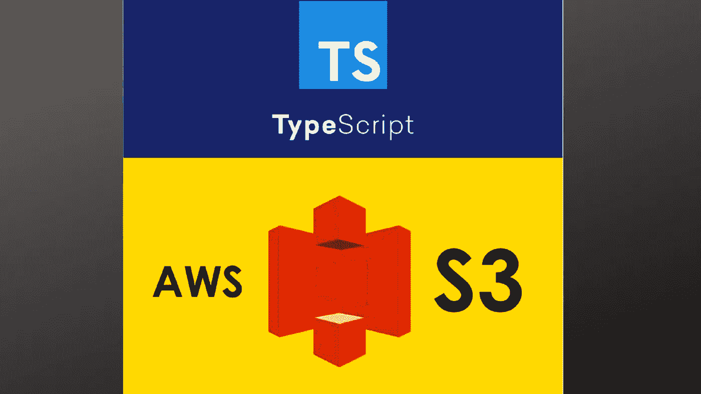

# TypeScript 中的 S3 助手函数

> 原文：<https://javascript.plainenglish.io/s3-helper-functions-in-typescript-8698d08a5c8b?source=collection_archive---------13----------------------->

下面列出了一些最常用的 S3 函数( [aws-sdk](https://github.com/aws/aws-sdk-js) )以及如何在 TypeScript 中使用它们。

*   getObject
*   上传
*   删除对象
*   listObjectsV2
*   头部物体

# getObject

从亚马逊 S3 检索对象。

该函数需要一个`GetObjectRequest`类型的参数，其定义可在此处找到-[https://github . com/AWS/AWS-SDK-js/blob/master/clients/S3 . d . ts](https://github.com/aws/aws-sdk-js/blob/master/clients/s3.d.ts)

您可以像这样调用这个函数:

# 上传

上传对象到亚马逊 S3。

该函数需要一个`PutObjectRequest`类型的参数，其定义可在此处找到-[https://github . com/AWS/AWS-SDK-js/blob/master/clients/S3 . d . ts](https://github.com/aws/aws-sdk-js/blob/master/clients/s3.d.ts)

您可以像这样调用这个函数:

# 删除对象

从亚马逊 S3 删除一个对象。

该函数需要一个`DeleteObjectRequest`类型的参数，其定义可在此处找到-[https://github . com/AWS/AWS-SDK-js/blob/master/clients/S3 . d . ts](https://github.com/aws/aws-sdk-js/blob/master/clients/s3.d.ts)

你可以像这样调用这个函数

# listObjectsV2

在每次请求时返回 bucket 中的部分或全部(最多 1000 个)对象。您可以使用请求参数作为选择标准来返回 bucket 中对象的子集。

该函数需要一个`ListObjectsV2Request`类型的参数，其定义可在此处找到-[https://github . com/AWS/AWS-SDK-js/blob/master/clients/S3 . d . ts](https://github.com/aws/aws-sdk-js/blob/master/clients/s3.d.ts)

您可以像这样调用这个函数:

# 头部物体

HEAD 操作从对象中检索元数据，而不返回对象本身。如果您只对对象的元数据感兴趣，此操作很有用。要使用 HEAD，您必须拥有对象的读取权限。

该函数需要一个`HeadObjectRequest`类型的参数，其定义可在此处找到-[https://github . com/AWS/AWS-SDK-js/blob/master/clients/S3 . d . ts](https://github.com/aws/aws-sdk-js/blob/master/clients/s3.d.ts)

如何调用此函数的示例如下:

你可以在这里看到我如何使用这些包装函数[的例子。](https://github.com/appletreeat56/json-to-xlsx/blob/master/src/utils/awsWrapper.ts)

感谢您的阅读，如果您想支持我，请关注我，成为会员，支持更广泛的社区。

 [## 通过我的推荐链接加入媒体 Meta Collective

### 作为一个媒体会员，你的会员费的一部分会给你阅读的作家，你可以完全接触到每一个故事…

medium.com](https://medium.com/@metacollective/membership) 

*更多内容请看*[***plain English . io***](http://plainenglish.io/)*。报名参加我们的* [***免费周报***](http://newsletter.plainenglish.io/) *。在我们的* [***社区***](https://discord.gg/GtDtUAvyhW) *获得独家获得写作机会和建议。*