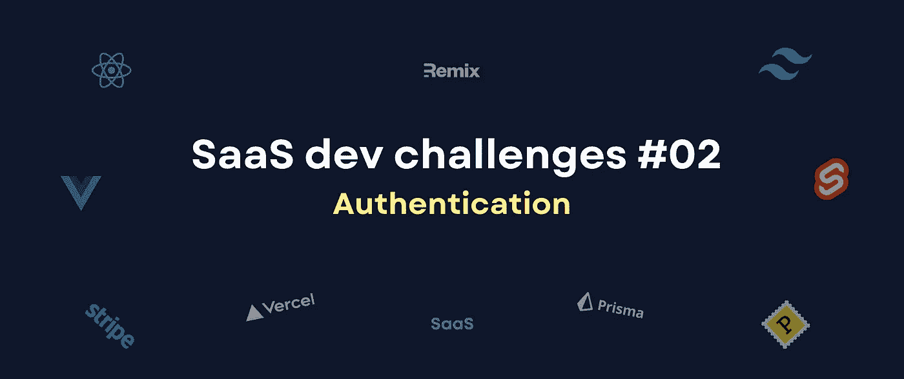
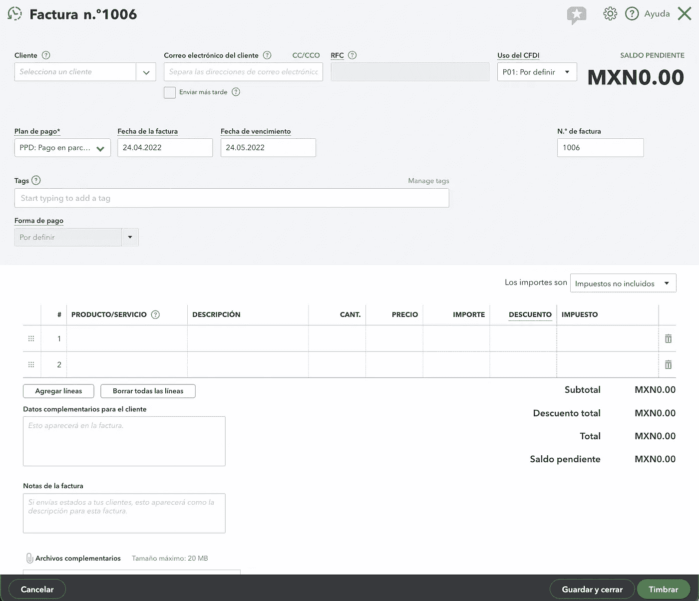
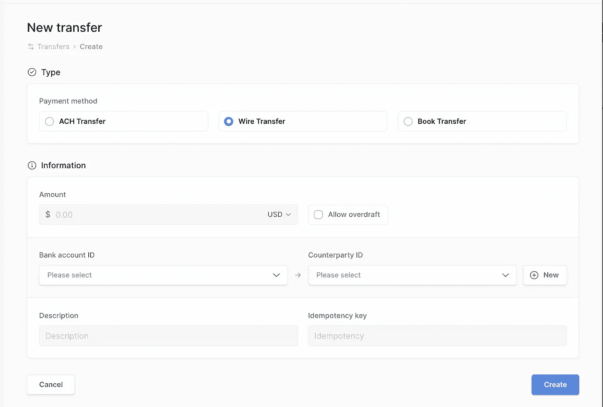
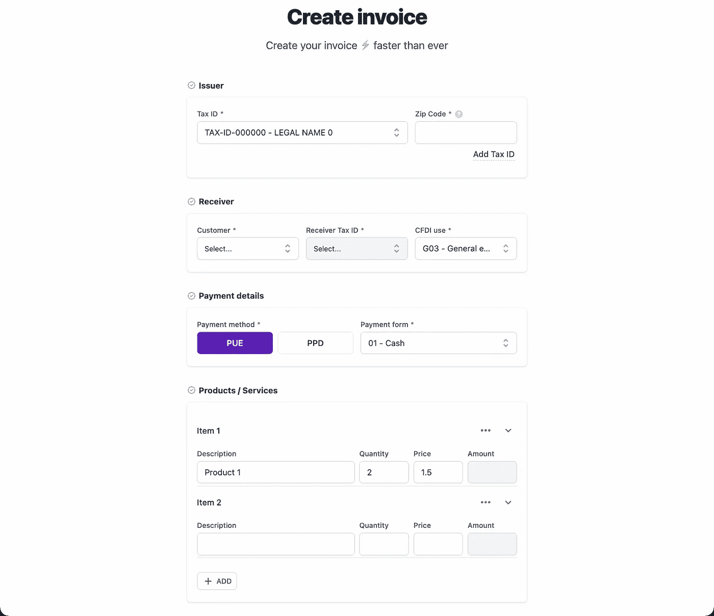

# 🎯SaaS 发展挑战—🎨用户界面/UX 和设计系统

> 原文：<https://javascript.plainenglish.io/saas-dev-challenges-01-ui-ux-design-system-bc16a36490c?source=collection_archive---------12----------------------->

## 01.用户界面/UX 和设计系统

SaaS dev challenges — Edition #01

构建一个 SaaS 应用程序的想法令人望而生畏，因为在内心深处，我们都知道我们需要经历多少事情，并且你知道每天都将是一个决策挑战。尤其是你一个人的时候。

我们都有过那个 ***啊哈！*** SaaS 主意瞬间💡。但并不是所有人都成功申请了 SaaS。对于现代网络用户来说，有太多东西是理所当然的:出色的 **UI** / **UX** 、**授权**页面、符合他们需求的**定价**模型、可定制的**个人资料**等等。不要让我开始谈论我们开发人员知道我们需要的东西:一个 **UI** **库**， **GDPR** ，以及其他一些不重要的东西*(黑暗模式，多语言…)* 。

这🎯 ***SaaS 开发者挑战*** 系列将讲述我在尝试构建一些东西时遇到的挑战。

*   #01 — 🎨 **UI/UX** & **设计系统**(输入、按钮、模态…组件)
*   [#02 — 🗝 ️ **认证**(登录、注册、遗忘、重置、邮件……)](https://alexandromtzg.medium.com/saas-dev-challenges-02-%EF%B8%8Fauthentication-3a2dc8d2855)
*   #03— 💸**定价**(订阅、支付、卡……)
*   #04— 👩‍💼**管理员**(租户、仪表板、帮助台、CRM、API 密钥……)
*   #05— ⚙️ **设置**(个人资料、成员、权限、仪表板、API 密钥……)
*   #06— 🛬 **着陆** (GDPR，多语言，黑暗模式)
*   #07— 🦄实际 SaaS **应用**

# **构思阶段**💡

假设你有一个很棒的发票想法。你知道，它将与大型软件公司竞争。

# **动机阶段**💪

您打开终端，运行您最喜欢的框架 CLI 命令来创建一个启动项目，打开 VS 代码，开始处理一个 *CreateInvoiceForm* 文件，并在 1 小时内完成！

# **挑战**🎯—用户界面库

你会意识到这是表单设计史上最糟糕的表单设计。不完全是，但你需要:

*   一个自定义 ***选择器*** 组件供客户选择。
*   一个自定义 ***单选*** 组件为付款类型。
*   为发票行定制 ***表*** 组件。
*   一个自定义 ***空状态*** 组件为*空状态*状态。
*   诸如此类…

就在你开始你的 SaaS 创意表格后，你意识到你需要后退一步。令人泄气的😔。

你有两个选择:

*   找到一个很棒的 UI 组件库。
*   从头开始构建一个伟大的 UI 组件库。

# 我的拍摄📝

**1)不要从头开始**

除非你的 SaaS 想法是一个用户界面库😅。

**2)记录你的组件**

即使您选择了现有的 UI 库，您也需要自己的设计系统，因此要记录每个新组件。当你需要构建另一个表单时，你会感谢你自己，你想复制粘贴你的组件，无论你需要它们处于什么 ***状态*** 。这就是我试图和 https://saasfrontends.com/components 一起做的事情。

3)复制食谱，但加入你自己的配料

不要总是试图复制大公司如何设计他们的网站。例如，前几天我想制作一个发票表，所以我看了一下 Quickbooks 是如何做的:

Quickbooks Create Invoice Form

看起来棒极了！所以我从哪些领域需要什么来获取灵感。然后我看到[列](https://column.com/)是如何做表格的:

Column.com Forms

这两个表单设计让我开始制作自己的发票表单:

My Create Invoice Form

我喜欢极简主义的结果。

# 我的堆栈选择💿 ⚛️ 🎨

*请注意这是基于我的经验*

## 半铸钢ˌ钢性铸铁(Cast Semi-Steel)🎨

Tailwind CSS 是一个 UI 库，让我觉得我是一个伟大的 UI/UX 设计师。还有，买他们的[重构 UI](https://www.refactoringui.com/) 书，成为更好的 ***开发者*** 。

## JS ⚛️️️️

我在 [Vue2](https://sandbox.vue2.saasfrontends.com/components) 、 [Vue3](https://sandbox.vue3.saasfrontends.com/components) 、[svelete](https://sandbox.svelte.saasfrontends.com/components)、 [React](https://sandbox.react.saasfrontends.com/components) 上做了同样的 UI 组件库，测试他们的优缺点。我发现前端框架/库其实并不重要，它们都很棒，但**很重要**如果你是全栈开发人员，如果是这样，选择 [Remix](https://remix.run/) 或 [Next.js](https://nextjs.org/) 😜。这就是为什么[我会将它们](https://dev.to/alexandromtzg/why-im-open-sourcing-all-my-net-saas-kits-in-april-2022-react-svelte-vue3-vue2-4ki7)开源，并 100%专注于一个 [Remix SaaS 初学者工具包](https://alexandromg.gumroad.com/l/SaasFrontends-Remix) *(临时名称)*。

# 结论🧑‍🔬

UI 对于开发人员来说很难，但是我相信每个全栈开发人员都需要舒适地制作漂亮的现代用户界面。所以你要么与一个伟大的设计师合作，要么开始创建你自己的小*输入*、*按钮*、*模态*、…库在 pro UI 组件框架/库之上，你不希望你的组件看起来像其他的 [Tailwind UI](https://tailwindui.com/) 客户。

敬请关注接下来的 6 个计划职位:

*   [#02 — 🗝 ️ **认证**(登录、注册、忘记、重置、邮件……)](https://alexandromtzg.medium.com/saas-dev-challenges-02-%EF%B8%8Fauthentication-3a2dc8d2855)
*   #03 — 💸**定价**(订阅、支付、卡……)
*   #04 — 👩‍💼**管理员**(租户、仪表板、帮助台、CRM、API 密钥……)
*   #05 — ⚙️ **设置**(个人资料、成员、权限、仪表板、API 密钥……)
*   #06 — 🛬 **着陆** (GDPR，多语言，黑暗模式)
*   #07 — 🦄实际 SaaS **应用**

如果你喜欢这篇文章，请查看[我的博客](https://alexandro.dev/)了解更多类似的内容😃。

*更多内容请看*[***plain English . io***](https://plainenglish.io/)*。报名参加我们的* [***免费周报***](http://newsletter.plainenglish.io/) *。关注我们关于*[***Twitter***](https://twitter.com/inPlainEngHQ)*和*[***LinkedIn***](https://www.linkedin.com/company/inplainenglish/)*。加入我们的* [***社区不和谐***](https://discord.gg/GtDtUAvyhW) *。*