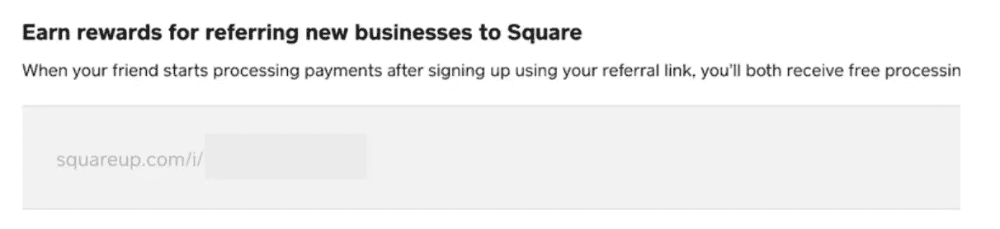

# 🎯SaaS 开发挑战— 🗝 ️Authentication

> 原文：<https://javascript.plainenglish.io/saas-dev-challenges-02-%EF%B8%8Fauthentication-3a2dc8d2855?source=collection_archive---------15----------------------->

## 02.证明

在我之前的一篇文章中，我谈到了在你开始你的 SaaS 后，UI/UX 是一个怎样的挑战。*使用现有的 UI 库比如 Tailwind UI，将你的组件文档化 *(* [*比如这个*](https://www.hyperui.dev/) *)* ，从其他 SaaS 网站获取灵感，但总是添加自己的 UI/UX 风格。*

# *TLDR:*

*   ***1 —我们为什么要对用户进行身份验证？这符合他们的最大利益。***
*   ***2 —强制认证页面** : *登录，注册，忘记。**
*   ***3 —可选认证页面** : *邀请链接、魔法链接…* (更好的 UX😙🤌).*
*   *你应该建立自己的认证系统吗？ *是的*。*
*   ***5 —我应该使用商业授权提供商吗？** *没有*。*
*   ***6 —让你的用户测试应用**，然后要求他们注册😙🤌).*
*   ***7 —我是否应该添加授权逻辑**？*至少识别用户类型*。*

***记住这些外卖都是根据我的经验。***

# *1/7 —我们为什么要对用户进行身份认证？*

*每一个 SaaS 应用的主要目标都是增加它的 MRR，所以简单的答案就是*“向使用我们应用的用户收费”*。*

*但是说真的，我们应该认证用户的真正原因是什么？*

*想象一下我们以前创建的发票表单:*

1.  *我们未经认证的用户👨**创建一个报价***(/quote/cl 2d 1 lgc 4000909)*，**将 PDF** 发送给他们的客户👩。*
2.  *3 天后，客户👩**求报价**修改。*
3.  *我们未经认证的👨用户意识到他关闭了浏览器并且没有记下报价 URL*(/quote/cl 2d 1 lgc 4000909)*。所以他从零开始，又创造了这个报价。*

*当然，您可以在电子邮件中包含报价 URL，但是对于未来的报价来说，这将是一个可怕的用户体验。所以 ***对他们最有利的*** 是在每一页上被识别重载并向他们展示他们所有的数据*(即使他们没有意识到)*。*

*身份验证是每个 SaaS 应用的核心系统，所以我们要么接受它，要么每次构建下一个 SaaS 应用的想法时都受到影响。*

# *7 月 2 日—强制认证页面*

*每个 auth 系统至少需要一个 [**登录**](https://remix.saasfrontends.com/login) 页面，一个 [**注册**](https://remix.saasfrontends.com/login) 页面，一个 [**忘记密码**](https://remix.saasfrontends.com/forgot-password) 页面。*

**

*Login, Register, and Forgot pages*

*由您决定定制什么，例如，您可以:*

*   **登录* —添加 **2FA** 。*
*   **注册* —发送**激活**邮件。*
*   **忘记了* —问一个秘密问题或者**验证码**。*

*但我建议你在注册新用户时遵循以下原则:*

*   *尽可能的索要 ***小信息*** (可能只是邮箱和密码)。*
*   ****不要*** ***要一张*** ***信用卡*** ，你会吓跑很多线索。*
*   *假设你的用户会添加***【sliKE@thisone.com】***。*

# *3/7 —可选的身份验证页面*

*我们正在努力打造出色的用户体验，您可以添加以下两点:*

## *1)让你的房客邀请他们的成员。*

*你的注册页面应该是为租户**管理员**，而不是租户**用户**。*

**

*Add member Form + Invitation/Magic-login-link email*

## *2)制作一个简单的转诊程序系统。*

*你可以给客户什么奖励来邀请其他用户？发挥你的想象力，但它可能是:新客户订阅份额，固定$$$亲功能…*

**

*Square referral program*

*-*

*这将扩展您的客户获取策略，并消除要求每个用户首先访问**/注册**页面的摩擦。*

# *4/7 —您应该构建自己的认证系统吗？*

*让我们现实一点。在你的职业生涯中，你可能会构建不止一个 SaaS 应用程序，所以学习基础知识，保持简单，并构建你自己的认证系统，因为你会在其中的每一个上重用它:*/登录，/注册，/忘记密码，/重置密码，/邀请链接，/魔法链接* …*

# *5/7 —我应该使用商业身份认证提供商吗？*

*当然，你可以使用 [Auth0](https://auth0.com/) ，或者 [Okta](https://www.okta.com/) ，但是 auth design/dev 并不像看起来那么难，尤其是在 2022 年。为什么要把你的数据保存在第三方呢？你不能控制你没有的东西。*

*最好为应用功能添加**社交账户**集成，而不是应用认证*(例如:用户注册后，让他们连接他们的 Instagram 账户以加载他们所有的照片)*。*

## *何时使用第三方认证系统？*

*当出现以下情况时，不要试图从头开始构建您的认证系统:*

*   *你只是在测试一个快速 MVP。*
*   *你正在构建一个 **B2C** 应用，其中你很可能需要许多他们支持的**社交身份提供者** : *Instagram、Twitter* 、 *Gmail、脸书、苹果、微软账户、LinkedIn、GitHub、Dropbox、Paypal、Basecamp、Salesforce、Shopify、Evernote、Discord、Figma、Slack* …你明白了。*

# *6/7 —让你的用户测试应用程序，然后要求他们注册*

*用户在订阅您的 SaaS 之前会考虑很多事情。不要给他们离开的理由。在你要求他们注册之前，让他们测试你的应用程序。*

*要使用发票应用程序作为参考:*

*   *添加一个 */create* URL，让 ***未认证用户*** 创建发票。*
*   ****警告您的用户*** 在导出发票 PDF 时，他们将被要求注册。*
*   *将发票保存到一个 ***【未开票】*** 数据库表中。*
*   *用户是否希望将其导出为 PDF？让他们先 ***注册*** 。*
*   *用户注册了吗？将发票转移到 ***【发票】*** 表中，这里有一个 ***tenantId*** 属性。*

*但是要小心，**我们都很讨厌被一个网站** *(例如:该应用程序让我设计一个东西 1 小时，但我不能下载它，除非我支付 25 美元)*。因此，让你的未经认证的用户，他们将无法做什么，如果他们不注册或支付后，在他们的应用程序使用的某一点。*

# *7/7 —我应该添加授权逻辑吗？*

*从简单的事情开始，比如:*

*   *用户是管理员？重定向至**/管理员***
*   *用户是租户？重定向至**/应用***
*   *用户是租户，想要访问/admin？重定向至 **/401***

*但是要在页面中计划一些授权逻辑:*

*   ****/app/:租户/设置/组织*** 应该只针对 ***租户所有者*** 。*
*   ****/app/:租户/设置/订阅*** 应该只针对 ***TenantAdmins*** 。*
*   ****/app/:租户/合同*** 只适用于 ***租户成员*** 。*
*   ****/app/:租户/公共合同*** 应为 ***非授权用户*** 。*

# *结论🧑‍🔬*

*这就是本节的内容，我希望您发现它在某些方面是有用的。记得对🧂的每一篇文章/提示都要有所保留，尤其是这篇。*

*现在我们已经确定了我们的用户，让我们按月/年向他们收取使用 SaaS 的费用🤑。敬请关注接下来的 5 篇计划帖子:*

*   *#03 — 💸**定价**(订阅、支付、卡……)*
*   *#04 — 👩‍💼**管理员**(租户、仪表板、服务台、CRM、API 密钥……)*
*   *#05 — ⚙️ **设置**(个人资料、成员、权限、仪表板、API 密钥……)*
*   *#06 — 🛬 **着陆** (GDPR，多语言，黑暗模式)*
*   *#07 — 🦄实际 SaaS **应用***

*如果你喜欢这篇文章，可以去我的博客查看更多类似的内容😃。*

**更多内容请看* [***说白了就是***](https://plainenglish.io/) *。报名参加我们的* [***免费每周简讯***](http://newsletter.plainenglish.io/) *。关注我们*[***Twitter***](https://twitter.com/inPlainEngHQ)*和*[***LinkedIn***](https://www.linkedin.com/company/inplainenglish/)*。加入我们的* [***社区不和谐***](https://discord.gg/GtDtUAvyhW) *。**