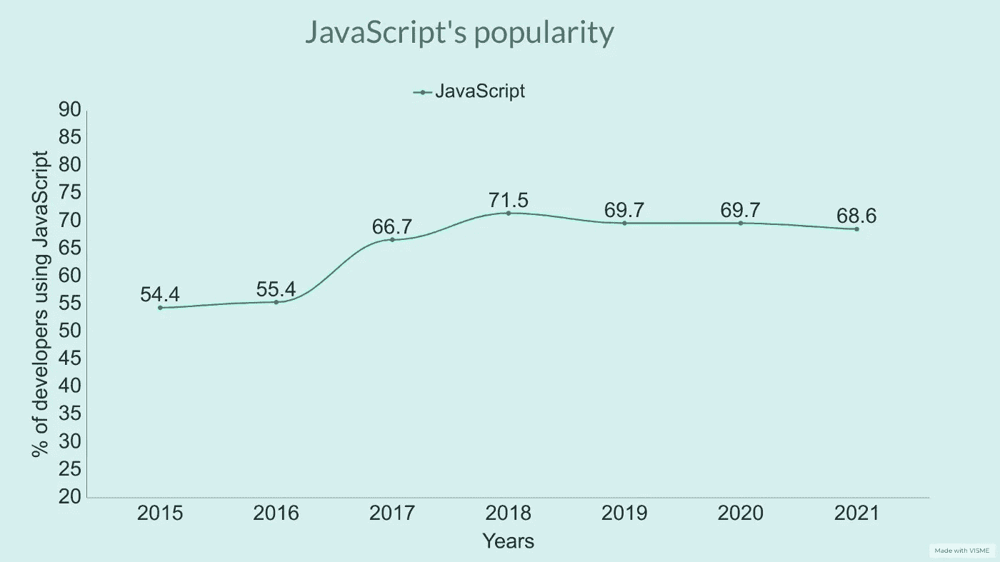

# 前 8 大公司 JavaScript 开发人员的薪资

> 原文：<https://javascript.plainenglish.io/salaries-of-javascript-developers-in-top-8-companies-908d3467e1a9?source=collection_archive---------0----------------------->

## 您还可以了解 Javasctipt 的受欢迎程度以及公司使用它的原因。

Photo by [Tezos](https://unsplash.com/@tezos?utm_source=medium&utm_medium=referral) on [Unsplash](https://unsplash.com?utm_source=medium&utm_medium=referral)

JavaScript 是 2022 年最流行的编程语言。当有人问我他们应该学习什么来开始他们的编程生涯时，我不假思索地回答说他们应该学习 JavaScript。

JavaScript 现在无处不在。无论你想成为一名 web 开发人员还是应用程序开发人员，JavaScript 都是答案。甚至你现在可以用 JavaScript 开发游戏。

它的受欢迎程度与日俱增，因为未来是关于网络浏览器和网页的。JavaScript 是 web 开发的国王和王后。

# JavaScript 到底有多流行？

不管你相不相信，九年来，JavaScript 一直是最常用的编程语言。我们可以在 StackOverflow 的 2021 年开发者调查中看到，68.62%的专业开发者在工作中使用 JavaScript。

以下是一些不同角度的其他统计数据。

*   JavaScript 在 Statista 上把**列为全球开发者使用最多的编程语言的第一名**。
*   在 PYPL(编程语言的普及程度)指数上，它将 T4 排在第三位。
*   它在 TIOBE 指数中排名第七。

这是 JavaScript 在过去几年中受欢迎程度的图表。所以，你可以从下图了解它的受欢迎程度。

Graph: Author Data: StackOverflow

# 使用 JavaScript 的顶级公司

# 谷歌

人人都知道谷歌。谷歌有许多科技产品和服务。JavaScript 是谷歌技术栈的主要语言之一。

我们都知道谷歌负责 V8 的创建。 **V8** 是 Google 开源的基于 C++的高性能 JavaScript 和 WebAssembly **引擎**。V8 是 Node.js 内部的 Javascript 引擎，解析并运行您的 Javascript。

# 这家公司谁使用 Javascript？

*   软件工程师
*   开发者关系工程师
*   应用工程师

# 这家公司用 Javascript 做什么？

*   前端开发
*   后端开发
*   Web 应用程序开发

# 该公司 JavaScript 工程师的平均工资

*   软件工程师:156806 美元
*   开发者关系工程师:154545 美元
*   应用工程师:199805 美元

# 通过易趣网购买

**易贝**是一家美国[跨国](https://en.wikipedia.org/wiki/Multinational_corporation) [电子商务](https://en.wikipedia.org/wiki/E-commerce)公司，通过其平台促进[消费者对消费者](https://en.wikipedia.org/wiki/Consumer_to_consumer)和[企业对消费者](https://en.wikipedia.org/wiki/Business_to_consumer)销售。它在其平台上大量使用 JavaScript。易贝的技术团队长期依赖 Java，但现在他们使用 Node.js。

# 这家公司谁使用 Javascript？

*   高级全栈开发人员
*   软件工程师
*   前端软件工程师

# 这家公司用 Javascript 做什么？

*   前端开发
*   后端开发

# 该公司 JavaScript 工程师的平均工资

*   全栈开发者:175521 美元
*   软件工程师:124398 美元
*   前端软件工程师:124398 美元

# 脸谱网

脸书是世界上最大的社交媒体平台之一。脸书的母公司 Meta 现在和脸书一起生产许多产品。它使用 JavaScript 进行后端和前端开发。

脸书还负责开发 React。多亏了他们。现在它是最流行的 JavaScript 框架之一。

# 这家公司谁使用 Javascript？

*   前端工程师
*   软件工程师
*   全栈生产工程师

# 这家公司用 Javascript 做什么？

*   前端开发
*   后端开发

# 该公司 JavaScript 工程师的平均工资

*   前端工程师:172114 美元
*   软件工程师:187046 美元
*   全栈制作工程师:166290 美元

# Groupon

Groupon 是一个美国在线市场，通过其平台提供慷慨的折扣和优惠券。它几乎在任何地方都使用 JavaScript。下面我们来看看:

# 这家公司谁使用 Javascript？

*   软件工程经理
*   软件开发工程师
*   机动参谋工程师

# 这家公司用 Javascript 做什么？

*   前端开发
*   Web 应用程序开发
*   移动应用程序开发

# 该公司 JavaScript 工程师的平均工资

*   软件工程经理:180，106 美元
*   软件开发工程师:139671 美元
*   移动参谋工程师:165170 美元

# 商务化人际关系网

LinkedIn 是专业人士的社交平台。但远不止如此。它有工作门户和教育部门。微软现在拥有 LinkedIn。

# 这家公司谁使用 Javascript？

*   高级软件工程师
*   员工软件工程师
*   技术服务经理

# 这家公司用 Javascript 做什么？

*   前端开发
*   后端开发
*   移动应用程序开发

# 该公司 JavaScript 工程师的平均工资

*   高级软件工程师:185034 美元
*   软件工程师:222075 美元
*   技术服务经理:126069 美元

# 微软

微软是世界上最大的软件公司之一，拥有许多科技产品。微软因其 Windows 和 Office 套件而广受欢迎。

它使用 JavaScript 构建其网络浏览器 Edge。它是 Node.js 最大的采用者之一。

# 这家公司谁使用 Javascript？

*   软件工程师
*   维护工程师
*   Azure 应用服务支持工程师

# 这家公司用 Javascript 做什么？

*   前端开发
*   后端开发

# 该公司 JavaScript 工程师的平均工资

*   软件工程师:136877 美元
*   服务工程师:140386 美元
*   Azure 应用服务支持工程师:74904 美元

# 网飞

网飞是最受欢迎的电影和电视节目流媒体服务之一。网飞过去经常使用 Java，但现在它是 Node.js 的大采纳者。它使用 Node.js 来减少服务器负载。

# 这家公司谁使用 Javascript？

*   高级 UI 工程师
*   高级前端工程师
*   全栈高级软件工程师

# 这家公司用 Javascript 做什么？

*   前端开发
*   后端开发
*   Web 应用程序开发

# 该公司 JavaScript 工程师的平均工资

*   高级用户界面工程师:276987 美元
*   高级前端工程师:138643 美元
*   全栈高级软件工程师:409202 美元

# 贝宝

Paypal 是通过其在线平台进行在线支付和转账的最受欢迎的公司之一。它使用 JavaScript 进行前端开发，Node.js 进行后端开发。它创建了自己的 Express.js 版本，名为 Kraken.js。

# 这家公司谁使用 Javascript？

*   软件开发人员
*   全栈软件工程师
*   全栈网络工程师

# 这家公司用 Javascript 做什么？

*   前端开发
*   后端开发
*   Web 应用程序开发

# 该公司 JavaScript 工程师的平均工资

*   软件开发商:121652 美元
*   全栈软件工程师:115810 美元
*   全栈网络工程师:132，773 美元

# 优步

优步是一家严重依赖其移动应用的拼车公司。但是它在网站的前端和后端使用 JavaScript。它使用 Node.js 处理大量数据。

# 这家公司谁使用 Javascript？

*   软件工程师
*   高级软件工程师
*   前端工程师

# 这家公司用 Javascript 做什么？

*   前端开发
*   后端开发

# 该公司 JavaScript 工程师的平均工资

*   软件工程师:159263 美元
*   高级软件工程师:184065 美元
*   前端工程师:159263 美元

# 来源:

1.  [卡瑞尔·卡马](https://careerkarma.com/blog/who-uses-javascript/)
2.  [StackOverflow](https://insights.stackoverflow.com/survey/2021#top-paying-technologies-programming-scripting-and-markup-languages)

*更多内容请看*[***plain English . io***](https://plainenglish.io/)*。报名参加我们的* [***免费周报***](http://newsletter.plainenglish.io/) *。关注我们关于*[***Twitter***](https://twitter.com/inPlainEngHQ)*和*[***LinkedIn***](https://www.linkedin.com/company/inplainenglish/)*。查看我们的* [***社区不和谐***](https://discord.gg/GtDtUAvyhW) *加入我们的* [***人才集体***](https://inplainenglish.pallet.com/talent/welcome) *。*