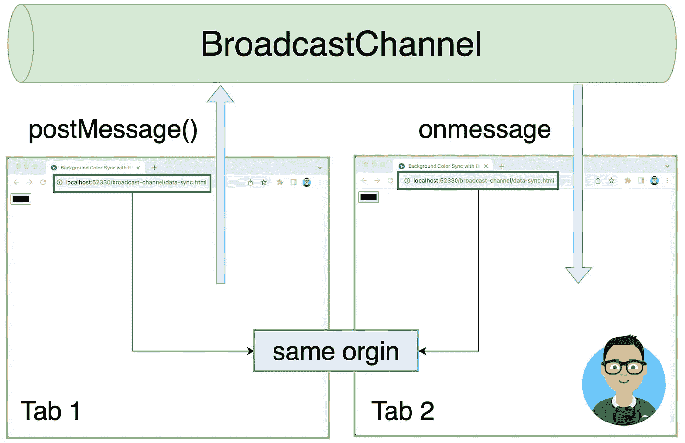
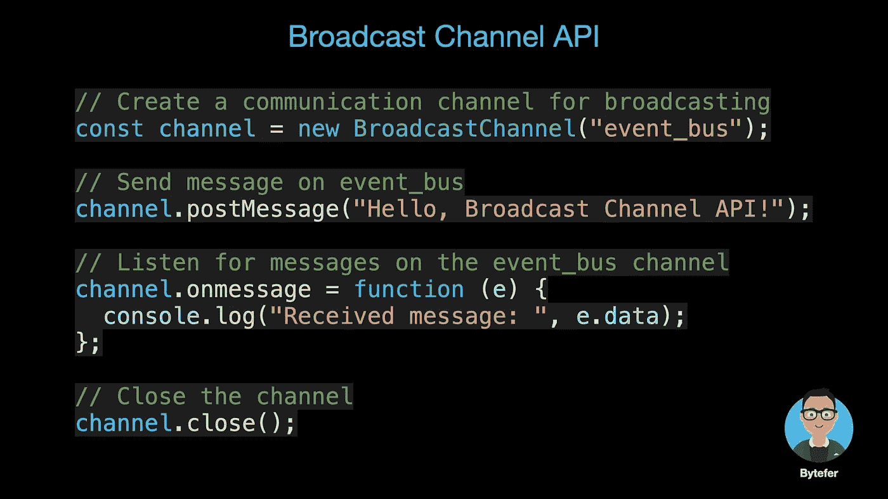
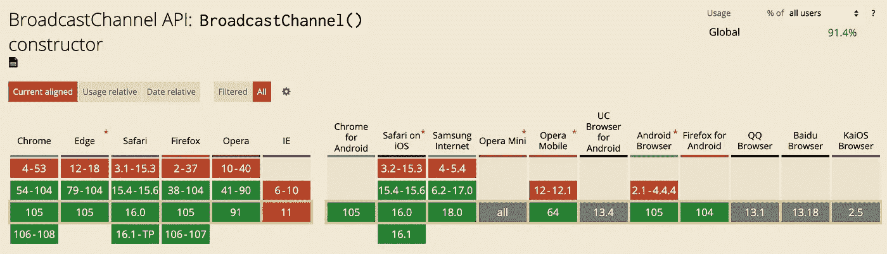
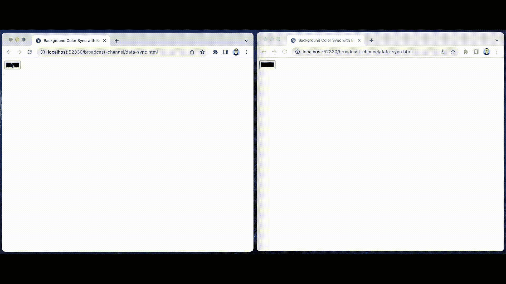
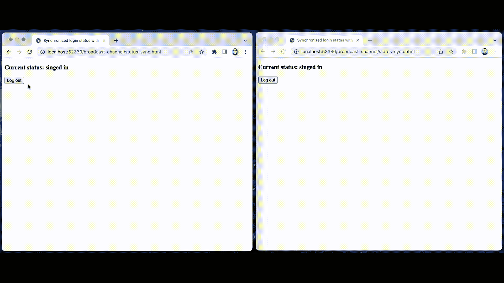

# 跨选项卡的同源页面通信非常容易

> 原文：<https://javascript.plainenglish.io/same-origin-page-communication-across-tabs-is-so-easy-16471a235d6c?source=collection_archive---------6----------------------->

## 使用广播通道 API 轻松处理同源页面之间的通信。

Photo by [Domenico Loia](https://unsplash.com/@domenicoloia?utm_source=medium&utm_medium=referral) on [Unsplash](https://unsplash.com?utm_source=medium&utm_medium=referral)

在开发 web 项目时，您可能会遇到相同来源的页面之间进行通信的情况。对于这个场景，我们可以使用 localStorage 和 Storage 事件来解决同源页面之间的通信问题。另外，我们还可以使用[广播通道 API](https://developer.mozilla.org/en-US/docs/Web/API/Broadcast_Channel_API) 来解决这个问题。也许你对广播频道 API 还比较陌生，没关系，本文将详细介绍 API。

# 1.广播频道 API 简介

[广播通道 API](https://developer.mozilla.org/en-US/docs/Web/API/Broadcast_Channel_API) 可以实现不同浏览器窗口、标签页，或者同一原点下 iframes 下的浏览器上下文之间的简单通信。通过创建侦听通道的 BroadcastChannel 对象，可以接收发送到该通道的所有消息。

现在我们已经了解了广播通道 API 的作用，让我们看看如何使用它:

从上图可以看出，广播通道 API 使用起来非常简单。除了支持发送字符串，**这个 API 还可以发送其他对象，比如 Blob、File、ArrayBuffer、Array 等对象**。但是，需要注意的是，在实际项目中，我们还需要考虑它的兼容性:

Photo from [caniuse.com](https://caniuse.com/?search=Broadcast%20Channel%20API)

在 IE 11 及以下版本中，不支持广播通道 API。在这种情况下，可以考虑使用现成的[broadcast-channel-poly fill](https://github.com/JSmith01/broadcastchannel-polyfill)或者基于 localStorage 和 Storage 事件来实现。

# 2.广播频道 API 使用场景

使用[广播通道 API](https://developer.mozilla.org/en-US/docs/Web/API/Broadcast_Channel_API) ，我们可以轻松实现同源页面之间的一对多通信。此 API 的一些使用场景如下:

*   实现同源页面之间的数据同步；
*   同步其他选项卡页面中的用户操作。

为了让您更好地掌握广播通道 API，我们举两个具体的例子。

## 2.1 背景色与 BroadcastChannel API 同步

在上面的例子中，我们已经在不同的选项卡中打开了**data-sync.html**页面，它有一个颜色选择输入框来设置页面的背景。当我们在任何一个打开的页面中设置新的背景颜色时，其他页面的背景颜色也会自动更新。

使用广播信道 API 可以容易地实现上述功能。对应于此示例的完整代码如下:

## 2.2 同步其他选项卡页面中的用户操作

在上面的例子中，我们已经在不同的标签中打开了**status-sync.html**页面。当通过按钮切换登录状态时，两个不同选项卡中页面的登录状态会自动同步。

对应于此示例的完整代码如下:

# 3.摘要

[广播频道 API](https://developer.mozilla.org/en-US/docs/Web/API/Broadcast_Channel_API) 是一个非常简单的 API，它包含一个用于内部跨上下文通信的接口。在支持此 API 的浏览器中，我们可以使用此 API 轻松地在相同来源的页面之间进行通信。对于不支持此 API 的浏览器，我们可以考虑使用 localStorage 和 Storage 事件来解决同源页面之间的通信问题。

那么[的邮件 API](https://developer.mozilla.org/en-US/docs/Web/API/Window/postMessage) 和[的广播频道 API](https://developer.mozilla.org/en-US/docs/Web/API/Broadcast_Channel_API) 有什么区别呢？一个重要的区别是 postMessage API 可以用来在不同的来源之间传递消息。

关于广播频道 API 的相关内容就介绍到这里。如果你在阅读方面有什么问题，请给我留言。

如果你想学习打字稿，那么就不要错过**掌握打字稿**系列。

*   [**TypeScript 泛型中的 K、T、V 是什么？**](https://medium.com/frontend-canteen/what-are-k-t-and-v-in-typescript-generics-9fabe1d0f0f3)
*   [**使用 TypeScript 像 Pro 一样映射类型**](/using-typescript-mapped-types-like-a-pro-be10aef5511a)
*   [**使用 TypeScript 条件类型像亲**](/use-typescript-conditional-types-like-a-pro-7baea0ad05c5)
*   [**使用 TypeScript 交集类型像亲**](/using-typescript-intersection-types-like-a-pro-a55da6a6a5f7)
*   [**使用打字稿推断像亲**](https://levelup.gitconnected.com/using-typescript-infer-like-a-pro-f30ab8ab41c7)
*   [**使用 TypeScript 模板字面类型像亲**](https://medium.com/javascript-in-plain-english/how-to-use-typescript-template-literal-types-like-a-pro-2e02a7db0bac)
*   [**打字稿可视化:15 种最常用的实用类型**](/15-utility-types-that-every-typescript-developer-should-know-6cf121d4047c)
*   [**关于类型脚本类你需要知道的 10 件事**](https://levelup.gitconnected.com/10-things-you-need-to-know-about-typescript-classes-f58c57869266)
*   **中‘declare’关键字的用途**
*   **[**不再混淆打字稿的“任何”和“未知”**](/no-more-confusion-about-typescripts-any-and-unknown-98c4b53f8924)**

**

拜特弗** 

## **掌握打字稿系列**

**[View list](https://medium.com/@bytefer/list/mastering-typescript-series-688ee7c12807?source=post_page-----16471a235d6c--------------------------------)****47 stories**************

**在 [Medium](https://medium.com/@bytefer) 或 [Twitter](https://twitter.com/Tbytefer) 上关注我，阅读更多关于 TS 和 JS 的内容！**

***更多内容请看*[***plain English . io***](https://plainenglish.io/)*。报名参加我们的* [***免费周报***](http://newsletter.plainenglish.io/) *。关注我们关于*[***Twitter***](https://twitter.com/inPlainEngHQ)[***LinkedIn***](https://www.linkedin.com/company/inplainenglish/)*[***YouTube***](https://www.youtube.com/channel/UCtipWUghju290NWcn8jhyAw)*[***不和***](https://discord.gg/GtDtUAvyhW) *。对增长黑客感兴趣？检查* [***电路***](https://circuit.ooo/) *。*****