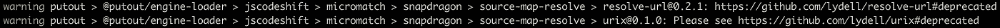

# 告别 JSCodeshift

> 原文：<https://javascript.plainenglish.io/say-good-bye-to-jscodeshift-cfa63898473e?source=collection_archive---------10----------------------->


*In the pasture of the world,
I endlessly push aside the tall
grasses in search of the Ox.
Following unnamed rivers,
lost upon the interpenetrating
paths of distant mountains,
My strength failing and my vitality exhausted, I cannot find the Ox.
© Zen Ten Bulls*

嗨伙计们！

当我开始工作时，JSCodeshift 给了我很多启发🐊`[Putout](https://github.com/coderaiser/putout)`。这是一个伟大的想法:使 *codemods 简单和流行*。但是，在过去的几年里，我没有看到增长。

以下是 JSCodeshift 最显著的缺点:

*   ❌仍然没有插件支持；
*   ❌仍然没有配置支持；
*   ❌纯保养，难得发布；
*   codemods 的❌纯测试文化；
*   ❌纯命令式 jQuery 类 api

所以没错，JSCodeshift 启发了我很多。灵感来自于如何以完全不同的方式制作物品！

每次我安装🐊`Putout`我看到了这个反对通知:



我已经厌倦了，不想再看了。永远不会。现在东西安装得快多了。太棒了，🥳！

关于支持的 JSCodeshift 代码模块。这个功能不是很受欢迎。任何 codemod 都可以连接到🐊`Putout`，但是它工作得更慢，因为`recast`打印应该被完成以区分转换的和原始的源。

非常天真和缓慢的方法。随着`[@putout/recast v1.5.0](https://github.com/coderaiser/recast)`的释放，是时候放下`JSCodeshift`了，因为它开始工作不正确，如果`[recast](https://github.com/benjamn/recast)`是❤️的心脏🐊`Putout`，`JSCodeshift`只是支持的工具之一。

所以是时候说再见了！

不管怎样，我应该提一下🐊输出有一个很大的支持:

*   ✅ [4 类插件](https://github.com/coderaiser/putout/tree/master/packages/engine-runner#supported-plugin-types)
*   ✅ [配置同 **.putout.json**](https://github.com/coderaiser/putout#-configuration)
*   ✅几乎每天发布
*   ✅百分百覆盖率
*   ✅丰富的声明式 API

# 支持的插件类型🐊输出

以下是支持的插件类型列表:

*   `[Replacer](https://github.com/coderaiser/putout/tree/master/packages/engine-runner#replacer)`
*   `[Includer](https://github.com/coderaiser/putout/tree/master/packages/engine-runner#includer)`
*   `[Traverser](https://github.com/coderaiser/putout/tree/master/packages/engine-runner#traverser)`
*   `[Finder](https://github.com/coderaiser/putout/tree/master/packages/engine-runner#finder)`

Replacer 是最简单的一种，几乎总是对你足够好。例如，当您需要代码中的所有**调试器语句**时，只需使用:

```
module.exports.report = () => 'Remove debugger';

module.exports.replace = () => ({
    'debugger': '',
});
```

这就是[@ putout/plugin-remove-debugger](https://github.com/coderaiser/putout/tree/master/packages/plugin-remove-debugger#putoutplugin-remove-debugger-)的实现方式😏。是啊！这太简单了！

# 使用. putout.json 进行配置

默认情况下启用所有规则。但是您可以禁用任何您想禁用的内容:

```
{
    "rules": {
        "remove-debugger": "off"
    }
}
```

是的，它比 ESLint 的简单。只需创建`.putout.json`并按照你喜欢的方式配置[。](https://github.com/coderaiser/putout#-configuration)

你可以阅读一些东西🐊输出帮助你在[中轻松实现🎩**关于覆盖率的几句话**](https://medium.com/@coderaiser/a-couple-words-about-coverage-bb1eee6af9f8) **。**

今天到此为止。玩得开心，伙计们🎈！

*更多内容看* [***说白了就是***](http://plainenglish.io/) *。报名参加我们的* [***免费每周简讯***](http://newsletter.plainenglish.io/) *。在我们的* [***社区不和谐***](https://discord.gg/GtDtUAvyhW) *获得独家获取写作机会和建议。*