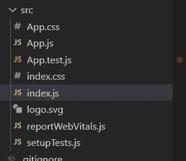

# 开始使用 React —说“你好，世界”

> 原文：<https://javascript.plainenglish.io/say-hello-world-in-reactjs-63018c533d5e?source=collection_archive---------4----------------------->

## 如何开始使用 React 的分步指南


Photo by [Lautaro Andreani](https://unsplash.com/@lautaroandreani)

今天，我们将为这个初学者友好的教程分解 React。您将了解 React 的活动部分，这样您就可以满怀信心地构建您的第一个项目。

# 什么是反应？

React 是由 Meta(原名脸书)开发和维护的前端 JavaScript 框架。它主要用于构建单页应用程序。

## 什么是单页应用程序？

单页应用程序是由单个 HTML 文件组成的 web 应用程序或网站。这与 Medium 等网站明显不同，后者会在用户与网站互动并点击内部链接时加载全新的页面。

有点乏味，对吧？一页？

比那更复杂。React 将动态重写网页的标记以显示新内容，而不是在点击(内部链接)时加载整个新页面。换句话说，它在用户点击时改变 HTML 代码。

需要举例吗？查一下脸书、电子邮件和网飞——仅举几个例子。这样做的话，你会注意到侧边栏、导航条和页脚(举例来说)不会像主要内容那样在点击时重新加载。在这种情况下，React 只是改变了主要内容。它甚至没有触及边栏或导航栏。

如果这些都没有意义，看看这个视频[什么是单页面应用](https://www.youtube.com/watch?v=xfGciVdbktI&t=121s&ab_channel=SourceSeek)？也许他的解释会更有意义。

# 为什么要学习 React？

了解 React 无缝创建单页应用程序。没有 React 框架你肯定可以创建单页面应用，但是会比较困难。

此外，您还可以学习其他框架来创建单页面应用程序。最受欢迎和最受欢迎的前三名是 React、Angular 和 vue . js——按特定顺序排列。如果你想学习一个 JavaScript 框架，这三者之一是一个安全的赌注。绝对不要试图全部学会。

# 我们开始吧

开始之前，我们需要一些东西。

[1] Node.js ( [安装在这里](https://nodejs.org/en/)

Node.js 是一个 JavaScript 运行时环境，也就是说它允许我们编译 JavaScript 指令。Node.js 之所以重要，是因为这个运行时环境有一个名为 npm 的库系统，它提供了大量可以帮助我们编码的包。

在本教程中，我们将使用名为 create-react-app 的 npm 包。

想了解更多关于 Node.js 的信息，请查看[的《Node.js 简介》](https://blog.bitsrc.io/nodejs-learn-nodejs-and-npm-d7ebdc235f?source=user_profile---------4-------------------------------)。否则，我们继续。

[2] VS 代码([此处安装](https://code.visualstudio.com/))

VS Code，不同于 Visual Studios，是微软的文本编辑器。这是目前最受欢迎的文本编辑器之一，原因是这个文本编辑器配备了许多扩展，可以帮助我们更快地编码。

在本教程中，我们将使用名为简单反应片段的扩展。

既然我们已经准备好了工具，让我们开始吧。

## 创建项目


要创建一个项目，打开 VS Code 并转到左上角。点击文件>打开文件夹。然后选择要存放项目的文件夹。如果没有，找到一个空间(比如你的桌面)，右键单击，然后创建一个新文件夹。然后选择该文件夹。

简单。

## 开放终端


我们的下一个重要步骤是打开一个终端。终端是我们安装 npm 包的方式。

在窗口的顶栏，点击终端>新终端。它应该会在窗口底部打开一个终端，如下所示:


在这个终端中，我们将编写以下命令

```
npm init -y
```

然后回车。正如您将看到的，`npm init`只是一个创建`package.json`文件的命令。这个文件将包含我们的项目将使用哪些包的信息。

不要太担心它。在本教程的剩余部分，您不会接触到所有内容。只要知道这个命令是您应该为任何想要使用 npm 包的项目编写的第一个命令。

接下来，编写以下命令并按 enter 键。

```
npm install -g create-react-app
```

让我们来分解这个命令。

`npm install`是安装任何 npm 软件包的命令。跟随`npm install`的是 npm 包`create-react-app`。这就是我们想要安装的软件包。另外，请注意 npm 标志`-g`。我们使用此标志来全局安装 npm 软件包。

继续，输入这个命令并按回车键…

```
create-react-app hello-world
```

注意这不是从`npm`开始的。

在这里，我们正在创建一个新的 react 应用程序。`hello-world`只是 react 应用程序的文件夹名称。你可以给它起任何你想要的名字。如果你的项目文件夹的名字由多个单词组成，确保你使用的是`-`而不是空格。

如果您按照说明操作，您应该会看到如下内容:


如果您展开 src 文件夹，您将看到我们的脚本、HTML 文件和 CSS 样式表，如下所示:


为了编写 hello world，我们将对 JavaScript 文件进行修改。但是现在，让我们启动我们的 React 应用程序，这样我们就可以看到我们在做什么。

在我们的终端中，编写以下命令:

```
cd hello-world
```

`helo world`是我的文件夹的名称。这是之前我们写命令`create-react-app hello-world`时建立的，如果你的文件夹名是别的，写`cd replace-with-folder-name`。

而`cd`基本就是切换我们所在的文件夹。


注意，写完这个命令后，我们现在所在的文件夹就不同了。在发出命令之前，我们在文件夹`React Tutorial`里。发出命令后，我们现在处于`React Tutorial/Hello-World`。

切换文件夹后，我们将使用该命令启动 React 应用程序。在终端中键入它，然后按回车键。

```
npm start
```

一两秒钟后，它应该会在 web 浏览器中启动您的 React 应用程序，如下所示:


如屏幕所示，如果您想要显示我们自己的内容，我们必须操作 App.js 文件。

# 了解文件

所以对于单页应用程序，我们不打算动我们的索引文件。我们将使用 JSX 来编写我们的标记。JSX 是 HTML 的扩展；这就是我们如何编写我们的标记。

我们将动态地(在运行时)编写我们的标记。

现在，我们的源文件夹看起来像这样:



很让人应接不暇。让我们删除一些文件。

我们将删除:

*   setupTests.js
*   reportWebVitals.js
*   徽标. svg
*   应用测试网站
*   App.css
*   App.js

我们这样做是为了让一切都易于查看和理解。我不想让你不知所措。

删除这些文件的结果是，我们必须移除依赖项。如果一个文件试图访问这些被删除的文件，将会出现错误。


在我们的 index.js 文件中，删除除前三行之外的所有内容。我们从零开始。并删除 index.css 文件中的所有 CSS 样式。

# 索引. js

所以 index.js 是我们的主要脚本。对于每个 React 项目，您总是要写:

```
import React from 'react';import ReactDOM from 'react-dom';
```

允许我们编写 JSX——这也是我们编写标记的方式。并且`ReactDOM` 是我们将如何操作我们的 index.html 文件的 DOM。

## 尝试 1

首先，我们将从非常简单的开始。

```
import React from 'react';import ReactDOM from 'react-dom';import './index.css';ReactDOM.render(<h1>Hello World</h1>, document.getElementById("root"));
```

写完代码后点击保存。这将呈现以下内容:


大家说说吧。

ReactDOM.render()是来自`react-dom`包的一个函数。这与我们在第 2 行中导入的包相同。

这个呈现函数有两个参数:第一个是看起来像 HTML 的 JSX，第二个是我们想要在 DOM 中插入标记的位置。在本例中，我们的两个参数是:

*   # 你好世界

*   我们将它插入 document.getElementById("root ")。

# 尝试 2

或者，您也可以执行以下操作:

```
import React from 'react';import ReactDOM from 'react-dom';import './index.css';const example = <h1>Hello World, Again</h1>;ReactDOM.render(example, document.getElementById("root"));
```


这很简单。我们将 JSX 存储到一个常量变量中。然后，我们将该变量作为呈现函数的第一个参数。

## 尝试 3

所以当我们使用 ReactDOM.render()时，第一个参数只能是一个 JSX 元素。

我们不能做:

```
reactDOM.render(<h1>Heading</h1><p>paragraph </p>, <p> paragraph 2>/p> , document.getElementById("root");
```

我们的第一个参数不能是 h1、p 和另一个 p 元素。

为了解决这个问题，我们可以将所有内容存储在一个 div 或 section 中——或者任何您想要的容器单元，比如`nav` 或`main`。只要确保它在语义上有意义。

```
import React from 'react';import ReactDOM from 'react-dom';import './index.css';const example = ( <div> <h1>Hello World</h1> <p> Did you have a great day today?</p> </div>);ReactDOM.render(example, document.getElementById("root"));
```


注意我们做了`const element = ()`。在括号内，我们放入 div。在 React 中，通常的做法是在括号中存储多行 JSX。如果你忘记了括号，就不会有什么不好的事情发生。这样做只是为了可读性。

# 尝试 4

我们也可以使用函数返回 JSX。

```
import React from 'react';import ReactDOM from 'react-dom';import './index.css';function Example(){ return ( <div> <h1>Hello friends:</h1> <ul> <li>Stacey</li> <li>John</li> <li>Carrie</li> </ul> </div> );}ReactDOM.render(<Example/>, document.getElementById("root"));
```


注意一些事情。所以我们有一个名为`Example`的函数，我们返回一个 JSX 元素。注意，返回 JSX 元素的函数应该以大写字母开头。

你应该注意的另一件事是，我们返回的 JSX 元素是多线 JSX。因此，我们用括号将 JSX 括起来。记住，如果你要返回多个标记指令，你要把它保存在一个容器里，比如 div，section 等等。

最后，在 reactDOM.render()函数中，我们没有进行函数调用。我们并没有像你预期的那样写`Example()`。相反，我们写`<Example/>`。注意最后的斜线。这非常重要。

我们还有其他方法来渲染 Hello World。我们可以创建组件和类。但我们会留到下次。

感谢您的阅读。关注更多 React 内容。在遥远的未来还会有更多。

快乐编码。

*更多内容看* [***说白了就是 io***](http://plainenglish.io/) *。报名参加我们的* [***免费周报***](http://newsletter.plainenglish.io/) *。在我们的* [***社区获得独家访问写作机会和建议***](https://discord.gg/GtDtUAvyhW) *。*