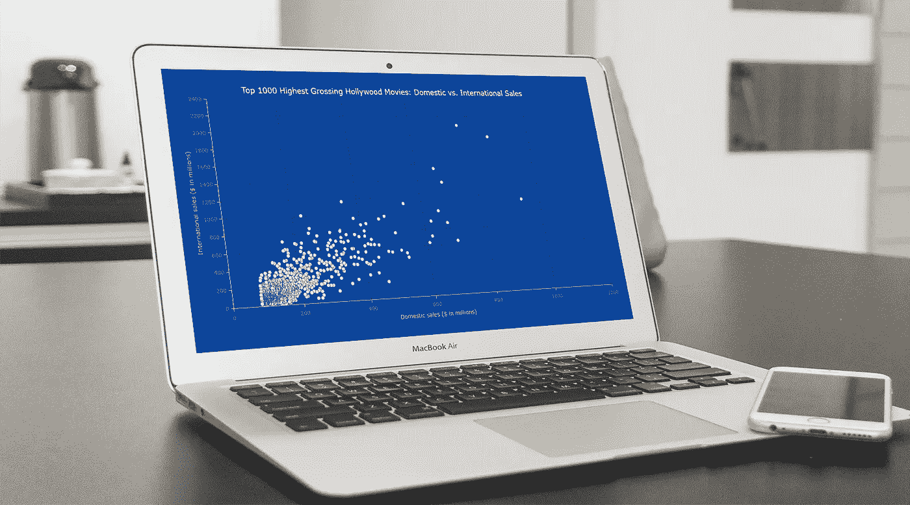

# 带 JavaScript 的散点图

> 原文：<https://javascript.plainenglish.io/scatter-chart-with-javascript-85178cc864aa?source=collection_archive---------12----------------------->



随着数据无处不在，我们必须知道如何快速创建可视化，以帮助揭示其中的趋势和模式。今天，让我们学习如何用几行简单的 JavaScript 代码构建散点图！

散点图或散点图旨在确定两个典型变量之间的相关性。在这样的图形中，数据被可视化为通常显示为标记的一组点。每个标记的位置表示沿水平轴和垂直轴的变量值。

在本教程中，我们将可视化截至 2022 年 1 月票房最高的 1000 部好莱坞电影的国际和国内销售情况。所以，拿起你的爆米花，开始观看 JS 散点图开发吧！

# 用 JavaScript 创建散点图

从头开始构建交互式散点图既困难又耗时。但是如果你正确使用 JavaScript，这根本不是问题。

一般来说，要启动并运行基于 JS 的散点图，需要采取四个基本步骤。他们来了。

## 1.创建一个带有容器的基本 HTML 页面

首先，我们需要一个带有容器的网页，在其中显示我们未来的散点图。

创建一个 HTML 文件(或者随意打开一个现有的文件)。包括一个块级元素，为它提供一个惟一的`id`，稍后将引用它，并设置它的`width`和`height`。这里有一个基本的例子可以说明这一切:

```
<html>
  <head>
    <title>JavaScript Scatter Chart</title>
    <style type="text/css">      
      html, body, #container { 
        width: 100%; height: 100%; margin: 0; padding: 0; 
      } 
    </style>
  </head>
  <body>
    <div id="container"></div>
  </body>
</html>
```

正如你所看到的，我们有一个非常基本的 HTML 页面，它有一个`<div>`元素，其`id`被设置为“容器”,`width`和`height`都是 100%,这样 JavaScript 散点图就可以显示在整个屏幕上(这些值可以根据喜好和要求指定)。

## 2.包括必要的脚本

其次，在 HTML 页面的`<head>`部分包含创建情节所需的所有脚本。

为了构建这个散点图，让我们使用 [AnyChart JS Charts](https://www.anychart.com) 。这是一个非常灵活的 JavaScript 图表库，拥有大量的[文档](https://docs.anychart.com)，大量现成的 [JS 图表示例](https://www.anychart.com/products/anychart/gallery/)，以及用于许多流行技术栈的[集成模板](https://www.anychart.com/technical-integrations/)。

AnyChart JS 制图库是[模块化](https://docs.anychart.com/Quick_Start/Modules)，它的[基](https://docs.anychart.com/Quick_Start/Modules#base)模块在这种情况下会绰绰有余。我们将可视化的数据存储在一个 JSON 文件中，而[数据适配器](https://docs.anychart.com/Working_with_Data/Data_Adapter/Overview)脚本将让我们以一种简单的方式从那里加载它。

所以，我们只需要引用这两个 JS 文件。

```
<html>
  <head>
    <title>JavaScript Scatter Chart</title>
    <script src="https://cdn.anychart.com/releases/8.11.0/js/anychart-base.min.js"></script>
    <script src="https://cdn.anychart.com/releases/8.11.0/js/anychart-data-adapter.min.js"></script>
    <style type="text/css">      
      html, body, #container { 
        width: 100%; height: 100%; margin: 0; padding: 0; 
      } 
    </style>
  </head>
  <body>  
    <div id="container"></div>
    <script>
 ***// This is the place for the entire JS scatter chart code.***    </script>
  </body>
</html>
```

## 3.连接数据

第三，加载想要表示的数据。

在本教程中，我们将使用散点图技术来可视化 Kaggle 上的[前 1000 部票房最高的电影](https://www.kaggle.com/datasets/sanjeetsinghnaik/top-1000-highest-grossing-movies)数据集的数据。我把销售数字和电影名称放在一个 JSON 文件中。

AnyChart 支持多种方式[加载数据](https://docs.anychart.com/Working_with_Data)到图表。例如，当谈到 JSON 文件中的数据时，很容易使用`loadJsonFile()`方法添加它:

```
anychart.data.loadJsonFile("https://gist.githubusercontent.com/shacheeswadia/dceaadd5fb4ea27cd9975ff39e9f98f4/raw/6baac571527d9b13e397cfb3d982d7942246dcc0/scatterPlotData.json", function(data) {
  ***// The main scatter plot visualization code will be here.*** });
```

## 4.编写可视化代码

现在，让我们进入在我们的网页上显示一个交互式 JS 散点图的主要部分。实际上，这只需要几行简单的代码。

添加将包含所有散点图 JavaScript 代码的`anychart.onDocumentReady()`函数，确保在执行可视化之前页面被完全加载。然后按照上一步描述的方式加载数据。

```
anychart.onDocumentReady(function () {anychart.data.loadJsonFile("https://gist.githubusercontent.com/shacheeswadia/dceaadd5fb4ea27cd9975ff39e9f98f4/raw/6baac571527d9b13e397cfb3d982d7942246dcc0/scatterPlotData.json", function (data) { ***// The following JS code comes here.***});
});
```

接下来，创建一个散点图实例(使用内置的`scatter()`函数)并定义标记(标记类型有多种选项，但让我们坚持传统的圆形)。

```
let chart = anychart.scatter();let marker = chart.marker(data);
marker.type("circle").size(2);
```

指定沿着每个轴绘制哪种类型的值是很重要的。所以，让我们为两者设置标题:

```
chart.yAxis().title("International sales ($ in millions)");
chart.xAxis().title("Domestic sales ($ in millions)");
```

同样，让我们也为整个数据可视化命名:

```
chart.title("Top 1000 Highest Grossing Hollywood Movies: Domestic vs. International Sales");
```

现在，只需引用容器的`id`和命令来绘制图表。

```
chart.container("container");
chart.draw();
```

就是这样！只用这几行 JavaScript 代码就可以创建一个漂亮的、功能齐全的交互式散点图，并且可以直接嵌入到任何网页或应用程序中！


初始版本可在 [AnyChart 游乐场](https://playground.anychart.com/WJsbbXQi)上获得。我们可以看到，国内和国际销售之间有一定的相关性，但也有一些异常值。

# JS 散点图定制

一个基本的散点图就做好了。现在，让我们来看看如何让它更具知识性和美感。

## A.改进工具提示

每个点代表一部电影，当前的散点图看起来足够好，可以照亮总趋势。但是，如果我们想更深入一点，看看哪部电影用一个或另一个单独的点来表示呢？

让我们将电影标题添加到工具提示中，这样当鼠标悬停在这些点上时，我们就可以看到它们。

```
marker.tooltip().titleFormat(function () {
  return this.getData("title");
});
```

澄清显示值的含义也是一个好主意。

```
marker
.tooltip()
.format(function () {
  return (
    "\nTOTAL SALES: " +
    "$" +
    this.getData("totalSales") +
    "M" +
    "\nDomestic sales: " +
    "$" +
    this.x +
    "M" +
    "\nInternational sales: " +
    "$" +
    this.value +
    "M"
  );
});
```

## B.修改比例

默认情况下，轴上的最大值和最小值是根据数据中的值自动计算的。现在，Y 轴上的最大值是 2400，而 X 轴上的最大值只有 1200。让我们使两个最大值相同(2200)，并且通过将它们之间的间隔设置为 200 来增加沿轴的刻度数。

```
chart.xScale().minimum(0).maximum(2200).ticks({ interval: 200 });
chart.yScale().minimum(0).maximum(2200).ticks({ interval: 200 });
```


这个版本的 JS 散点图的完整代码可以在 [AnyChart 游乐场](https://playground.anychart.com/w1foHv5a)找到。

在接下来的步骤中，让我们保留这些更频繁的分笔成交点，但恢复到最大刻度值的自动计算，因为它显然提供了数据点的更好视图。

## C.添加网格线

散点图表示定量数据，添加网格应该会更容易理解这些值。让我们为两个轴启用网格线，并设置笔划外观的样式。

```
***// enable the grid lines*** chart.yGrid(true);
chart.xGrid(true);

***// customize the grid stroke*** chart.yGrid().stroke({ color: "#071d58", dash: "4 5" });
chart.xGrid().stroke({ color: "#071d58", dash: "4 5" });
```

## D.审美变化

最后，是时候做一些简单而有效的修改来增强散点图的外观了。让我们设置一个自定义背景颜色:

```
chart.background().fill("#0d468f");
```

为了增加视觉对比度，最好通过编辑代码中的初始标记配置行来自定义标记:

```
marker.type("circle").size(4).fill("#c6e3f9").stroke("#3e5ca6");
```

由于背景现在变暗了，让我们也使用 HTML 修改散点图和轴标题的颜色。

```
***// set the chart title*** chart
  .title()
   .enabled(true)
  .useHtml(true)
  .text(
    '<span style = "color: #c6e3f9; font-size:18px;">Top 1000 Highest Grossing Hollywood Movies: Domestic vs. International Sales</span>'
  );***// set the titles of the axes*** chart
  .yAxis()
  .title()
  .enabled(true)
  .useHtml(true)
  .text(
    '<span style = "color: #b3b3b3;">International sales ($ in millions)</span>'
  );
chart
  .xAxis()
  .title()
  .enabled(true)
  .useHtml(true)
  .text(
    '<span style = "color: #b3b3b3;">Domestic sales ($ in millions)</span>'
  );
```

瞧啊。我们现在有了一个可爱的、有见地的、基于 JavaScript 的散点图来让我们的数据说话！


看看散点图可视化现在看起来有多迷人！在 [AnyChart 游乐场](https://playground.anychart.com/Mv1iS0Ii)查看。

# 结论

现在你可以看到用 JavaScript (HTML5)创建散点图既简单又有趣。看[散点文档](https://docs.anychart.com/Basic_Charts/Scatter_Plot/Overview)继续学习。

有大量不同的其他[图表类型](https://docs.anychart.com/Quick_Start/Supported_Charts_Types)可用。因此，尝试散点图，然后不要错过您的数据可视化的其他选项。请提出任何问题，并随时为下一个教程建议另一种图表类型。

***AnyChart 感谢自由数据可视化开发人员 Shachee Swadia 制作了这篇精彩的客座博文。***

***不要错过另一个伟大的*** [***散点图教程***](https://www.anychart.com/blog/2020/05/27/scatter-plot-js-tutorial/) ***在我们的博客上，数据分析师 Wayde Herman 可视化了美国各州猫与狗的流行程度。***

***查看我们博客上更多***[***JavaScript 制图教程***](https://www.anychart.com/blog/category/javascript-chart-tutorials/) ***。***

你愿意为我们创建一些很酷的客座博文吗？ [***告诉我们吧！***](https://www.anychart.com/support/)

*最初发表于 2022 年 6 月 17 日 https://www.anychart.com*[](https://www.anychart.com/blog/2022/06/17/scatter-chart-js/)**。**

**更多内容请看*[***plain English . io***](https://plainenglish.io/)*。报名参加我们的* [***免费周报***](http://newsletter.plainenglish.io/) *。关注我们关于*[***Twitter***](https://twitter.com/inPlainEngHQ)*和*[***LinkedIn***](https://www.linkedin.com/company/inplainenglish/)*。查看我们的* [***社区不和谐***](https://discord.gg/GtDtUAvyhW) *加入我们的* [***人才集体***](https://inplainenglish.pallet.com/talent/welcome) *。**