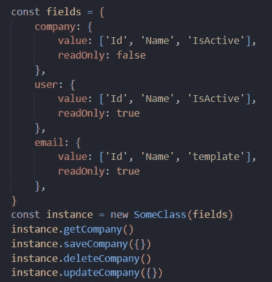
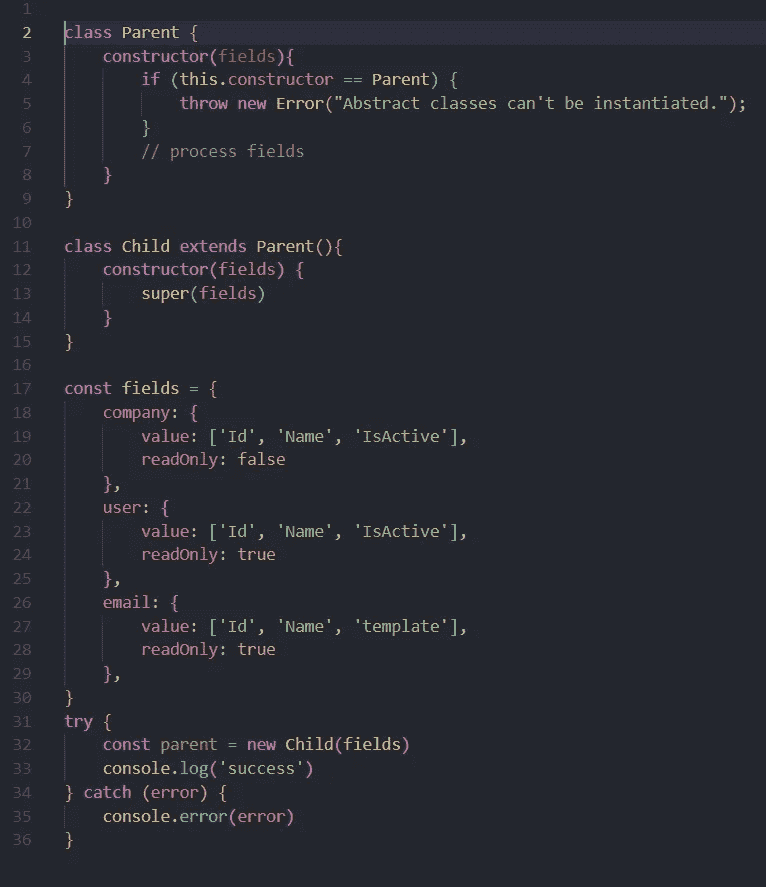
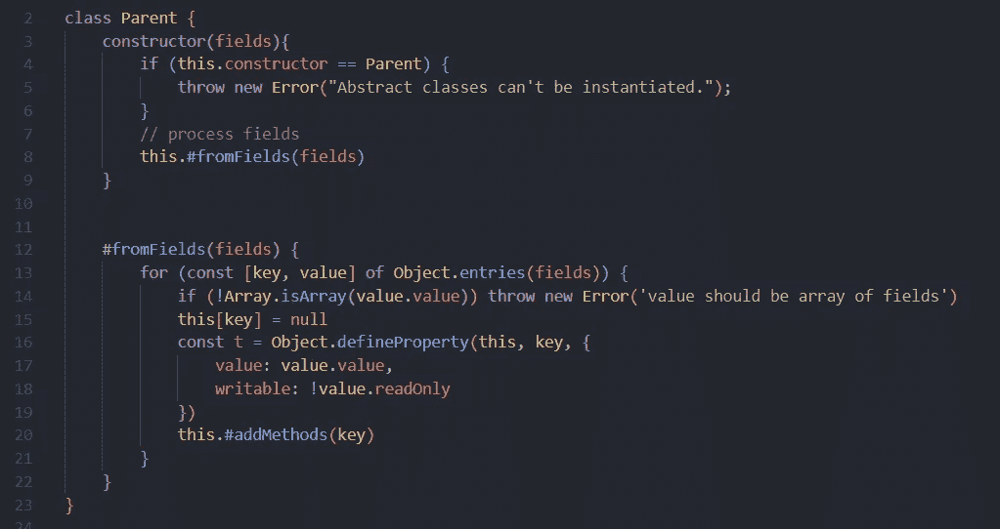
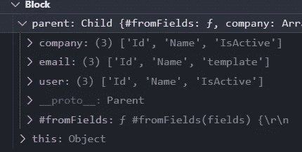
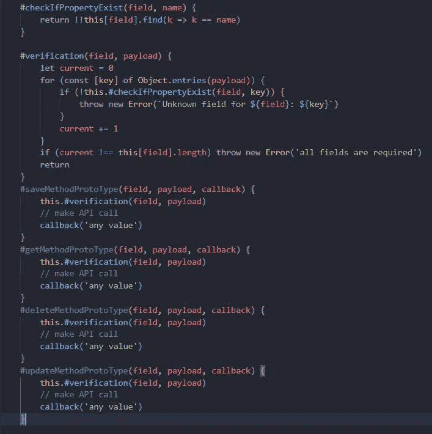
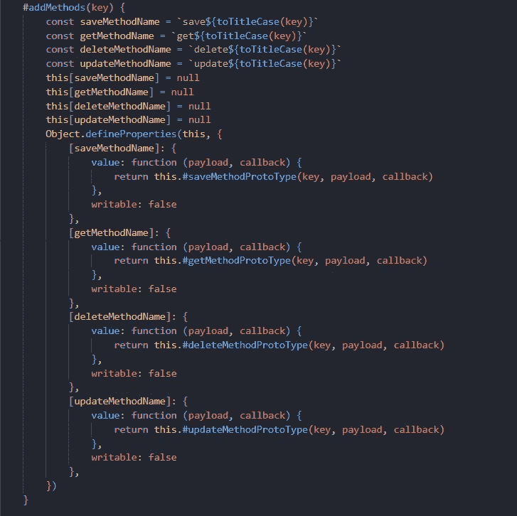
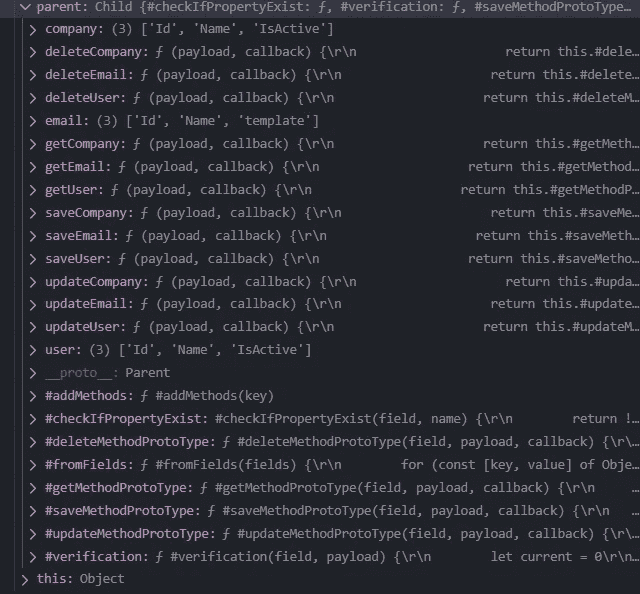

# JavaScript 中的模式创建设计模式

> 原文：<https://javascript.plainenglish.io/schema-creation-design-pattern-in-javascript-a1493e0fb5b?source=collection_archive---------2----------------------->

## 使用模式创建设计模式，通过 JavaScript 中的抽象方法创建一个类实例


Photo by [WrongTog](https://unsplash.com/@wrongtog?utm_source=medium&utm_medium=referral) on [Unsplash](https://unsplash.com?utm_source=medium&utm_medium=referral)

## 用例

当你谈论设计模式时，用例是一个重要的约束。这里的基本用例是 sequel ize——一个非常流行的基于 Node.js 的 ORM。另一个例子是任何需要为不同类型的属性更新和获取一组逻辑的应用程序。

今天，我将谈论设计模式，并具体到 Sequelize 使用什么设计模式。

## 为什么要序列化？

不，在阅读这篇文章的时候，没有必要在头脑中有一个顺序，但是它的概念和它如何实例化模型。我想谈谈它的结构是如何设计的

此外，这也是我们在这里要做的一个很好的例子。

举个例子，

```
Sequelize.model('name', { company: { type: string, readOnly: false }, user: { type: string, readOnly: true }, email: { type: string, readOnly: true }})
```

这是一个伪代码，而不是一个实际的 Sequelize 模型，所以不要对语法感到恼火，但我想展示的是基于字段，并包括一个将创建其属性和方法的模型

> 在严格模式下使用时抛出只读错误，否则值不会在不抛出错误的情况下得到更新

当暴露时，序列化项目将具有许多动态创建的属性

## 介绍

现在，我们为这篇文章准备了基本的思想体系，所以让我们来讨论一下输出会是什么样子



output

完成本文后，我们将拥有一个包含一组新变量和方法的类来操作其中的数据，并公开一些输出，就像这里一样

## 抽象类

在继续之前，我们需要理解抽象类。你可能想知道“为什么我们这里需要这个？”但是我们需要这样做，因为我们不希望我们的核心逻辑暴露在外部世界，也不希望我们把整个逻辑放在一起

> 一个类可以模拟功能，但永远不能创建自己的实例，而是继承给子类，这就是所谓的抽象类

## 开始

让我们开始，首先，我们将创建一个基本的布局结构是必要的。我创建了一个抽象类，它检查实例是否有相同的构造函数，如果有，它会抛出一个错误，说“抽象类不能被实例化”

剩下的代码继承了输出的父文件和样板文件。好消息是我们现在根本不会更新子类，它会告诉用户他/她想更新什么

**错别字**:LN:11 上的语法应该是`class Child extends Parent{`



boilerplate

## 向抽象类添加属性

下一步是根据我们获取的 fields 对象向类中动态添加属性。如果你仔细观察字段模式，你会发现我们只需要两个字段值，readOnly 你可以编辑或添加更多的值。记住要修改这个方法，因为它在这里保存了模式的关键部分

在私有方法`fromFields`的第一条语句中，我们寻找传递的 Object 字段的条目，并在`this`上创建一个 null 属性。当使用 JavaScript 时，这一步是最关键和最必要的，因为它是一种基于原型的语言，不能添加只读和只写属性

如果我们想在这里检查类型或其他验证，我们将单独访问`Object.defineProperty`，否则我们可以使用`Object.defineProperties`将它们全部添加到一起。这里还有一个我们称之为`addMethods`的方法，将在后面的讨论中添加。



add properties to the class

现在，如果我们看到输出，它看起来会像这样:



output for adding properties

## 向抽象类添加方法

在类中添加自定义方法之前，我们需要更好的内部方法，比如 prototype。

*   检查属性是否存在—查看属性是否存在，并根据键返回值
*   验证-查看输入值是否与之前提供的模式兼容
*   原型方法——我们希望所有的类都有一些通用的 CRUD 功能。也将回拨作为输入，但如果需要，更新为承诺

更新你喜欢的逻辑，为了这篇文章，我只添加了基本的东西。



prototype methods

现在让我们添加 addMethods 函数的实现，我们将为方法类创建新的属性，并恢复其布局。



Add custom methods

在这个方法中，我们首先使用标题 case 函数创建固定的 CRUD 键，然后为每个函数定义空属性，然后为它分配原型方法，但在内部传递键名并返回一个新方法。下面是我使用的`toTitleCase`方法:

```
function toTitleCase(str) { return str.replace( /\w\S*/g, function (txt) {      return txt.charAt(0).toUpperCase() +       txt.substr(1).toLowerCase(); } );}
```

## 结果

让我们看看我们是否能实现输出。如果我们现在运行这个程序，并检查我们的实例具有的属性，它应该是这样的:



output

这里，我们将所有方法都附加到它的这个实例上。您可以尝试这种创建实例的方法，并创建自己独特的处理属性的方式。

我希望你喜欢这篇文章。完整的源代码在这个 [Github 页面](https://github.com/Piyush-Use-Personal/schema-pattern/blob/main/practice.js)上。

谢了。

*更多内容请看*[***plain English . io***](https://plainenglish.io/)*。报名参加我们的* [***免费周报***](http://newsletter.plainenglish.io/) *。关注我们关于*[***Twitter***](https://twitter.com/inPlainEngHQ)*和*[***LinkedIn***](https://www.linkedin.com/company/inplainenglish/)*。查看我们的* [***社区不和谐***](https://discord.gg/GtDtUAvyhW) *加入我们的* [***人才集体***](https://inplainenglish.pallet.com/talent/welcome) *。*