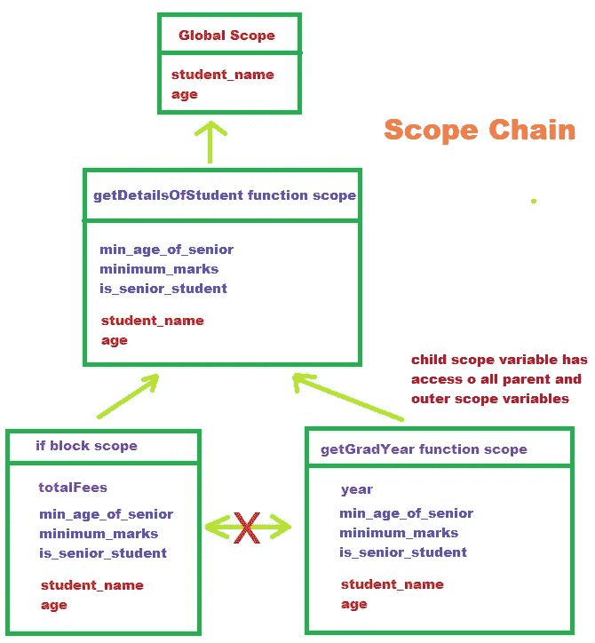

# 没人告诉我 JavaScript 中的作用域和作用域链这么容易理解吗

> 原文：<https://javascript.plainenglish.io/scope-and-scope-chain-in-javascript-a92dbdb1452f?source=collection_archive---------10----------------------->

The above image is created by Divyojyoti Ghosh(me) on [www.canva.com](http://www.canva.com/) using different elements available for making designs.

在计算机编程中，作用域处理变量的组织(变量在哪里？)和它们的**入口**(从哪里可以访问变量？).

JavaScript 有**词法作用域**，这意味着代码中块和函数的位置控制作用域。

# 范围

在开始范围和范围链之前，我们需要理解在 JavaScript 中变量的范围和作用域是不同的东西。那么，到底有什么区别呢？**范围**是代码中声明了特定变量的空间或环境。相反，变量的**范围是代码中可以访问特定变量的区域。**

不同范围的知识将帮助我们更好地理解范围本身。有三种类型的示波器—

1.  全球范围
2.  功能范围
3.  块范围

## 全球范围

在任何函数或块之外声明的变量的范围是全局的，即它们可以在代码中的任何地方被访问。

所有三个变量 **student_name** 、 **age** 和 **minimum_marks** 都具有全局范围，可以在代码中的任何地方访问，因为它们都在任何函数或块之外声明。

## 功能范围

函数中声明的所有变量都有一个函数作用域，也就是说，它们不能在函数之外的任何地方被访问。函数中定义的所有变量无论是用 **var** 、 **const** 还是**声明，都让**有函数作用域。

在上面的代码片段中，变量 **minimum_marks** 、 **min_age_of_senior** 和 **maximum_marks** 都有函数作用域，即只能在函数内部访问。

## 块范围

在花括号{ }(除了 function 之外)中使用 let 或 const 声明的变量具有块范围，即这些变量不能在块之外访问。花括号内用 var 声明的变量不能是块范围的，也就是说，它们也可以在块外被访问。

在上面的代码片段中，在 if 块中使用 var 定义的 **minimum_marks** 可以从代码中的任何地方访问，但是使用 let 定义的 **maximum_marks** 是 blocked 范围的，因此当它在块外被调用时会抛出 ReferenceError。

在严格模式下，在块中用 let 或 const 声明的函数也是阻塞范围，甚至命名函数(没有用 var、let 或 const 声明)也是阻塞范围。

# 范围链

在 Javascript 中，每个作用域都可以访问所有祖先/父作用域的变量和函数。在执行过程中，如果 JS 引擎遇到一个变量，为了访问该变量及其值，它首先在局部范围内搜索，如果在局部范围内没有找到该变量，它就在它的父范围内搜索该变量。

搜索从一个范围到其父范围再到其父的父范围，直到找到该变量。从内部作用域到外部作用域定位变量的整个概念被称为作用域链。最后也是最外层的作用域是全局作用域，它是最终的父作用域。

如果在整个作用域链中没有找到某个变量，JS 引擎将抛出一个引用错误，并声明该变量未定义。

在上面的代码片段中，`getGradYear()`函数的最后一行抛出了一个引用错误，因为该函数没有访问变量`totalFees`的权限。`totalfees`变量不在函数的局部范围内，也不在`getGradYear()`函数的任何父函数中，该变量是在 if 块中使用 let 定义的，因此它的范围是 blocked。

`if` 块范围和`getGradYear`功能范围是`getDetailsOfStudent()`功能范围的子范围。`if` 块和`getGradYear`函数都可以访问其父作用域的变量，即`getDetailsOfStudent()`函数作用域和全局作用域。

Understanding Scope Chain

# 参考

[https://www.udemy.com/course/the-complete-javascript-course](https://www.udemy.com/course/the-complete-javascript-course)

 [## 发现要点

### 使用 Kali Linux (PWK)课程和进攻性安全认证专家(OSCP)备忘单进行渗透测试…

gist.github.com](https://gist.github.com/) 

*更多内容请看*[***plain English . io***](https://plainenglish.io/)*。报名参加我们的* [***免费周报***](http://newsletter.plainenglish.io/) *。关注我们上*[***Twitter***](https://twitter.com/inPlainEngHQ)[***LinkedIn***](https://www.linkedin.com/company/inplainenglish/)*[***YouTube***](https://www.youtube.com/channel/UCtipWUghju290NWcn8jhyAw)**和* [***不和***](https://discord.gg/GtDtUAvyhW) *对成长黑客感兴趣？检查* [***电路***](https://circuit.ooo/) ***。*****