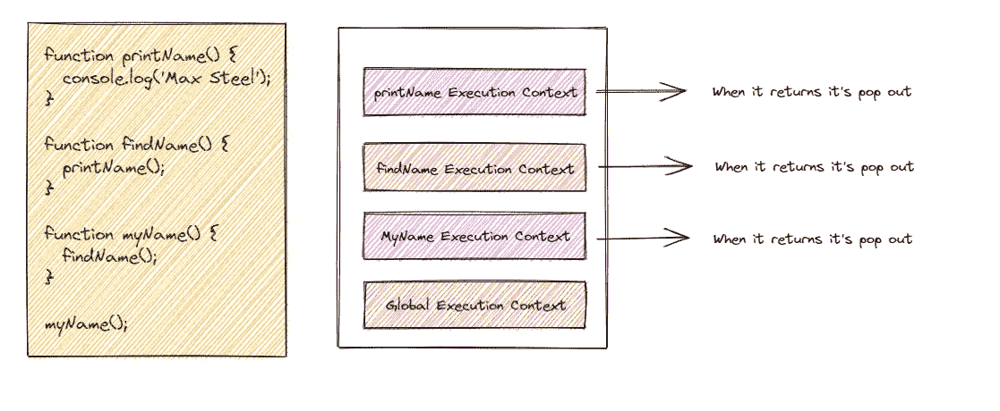
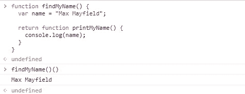

# JavaScript 中的作用域链和词汇环境

> 原文：<https://javascript.plainenglish.io/scope-chain-and-lexical-environment-in-javascript-eb1f6e60997e?source=collection_archive---------9----------------------->

## 理解 JavaScript 中的作用域链和词法环境。


当执行一个函数或脚本时，JavaScript 解释器创建一个新的上下文。每个脚本/函数都有一个称为全局执行上下文的基本上下文。每当我们调用一个函数时，一个新的执行上下文就会被创建，并被放在*执行堆栈的顶部。当到达调用另一个嵌套函数的嵌套函数时，遵循相同的模式。JavaScript 中有两个作用域。*

1.  全球范围
2.  局部范围

## 全球范围

整个 JavaScript 文档中只有一个全局范围。我们可以在全局范围内访问和更改变量。

## 局部范围

函数内部定义的变量在局部范围内。并且它们对该函数的每次调用都有不同的作用域。这意味着相同的变量名也可以存在于其他函数中。这是因为这些变量被绑定到该范围。

*举例:*



## 范围链


范围链有助于解析变量。当一个变量需要解析时，JavaScript 从代码的最内层开始，不断跳回父作用域，直到找到它所寻找的变量。

## 词汇范围

当我们有一组嵌套的函数时，内部函数可以访问父函数的变量和其他资源。这意味着子函数在词汇上与其父函数的执行上下文绑定在一起。



printMyName()函数可以访问 findMyName()函数的名称变量。这只在一个方向有效，你不能从父函数中访问内部函数中的变量和其他资源。

## 词汇环境

当 JavaScript 引擎为一个函数创建新的执行上下文时，它会创建一个新的词法环境来存储在执行阶段在该函数中定义的变量。

一个**词汇环境**是一个数据结构，它保存了一个*标识符-变量*的映射。(这里的标识符指的是变量/函数的名称，变量是对实际对象[包括函数类型对象]或原语值的引用)。

词汇环境包含两个部分:

1.  环境记录:它是存储变量和函数声明的实际位置。
2.  对外部环境的引用:这意味着它可以访问其外部(父)词汇环境。

```
let language = 'JavaScript';
function a() {
  const b = "Dart";
  console.log("Inside function a");
}a();
console.log("Global execution context")
```

当 JavaScript 引擎为 global 创建一个新的执行上下文时，它会创建一个新的词法环境来存储作用域中定义的变量和函数。看起来是这样的:

```
globalLexicalEnvironment = {
  environmentRecord: {
      language    : 'JavaScript',
      a : < reference to function object >
  }
  outer: null
}
```

当 JavaScript 引擎为函数 a()创建新的执行上下文时，它会创建一个新的词法环境来存储在作用域中定义的变量和函数。看起来是这样的:

```
functionLexicalEnvironment = {
  environmentRecord: {
      b    : 'Dart',
  }
  outer: <globalLexicalEnvironment>
}
```

当函数完成执行时，它可能会也可能不会从堆栈中删除，这取决于该词法环境是否被其外部词法环境属性中的任何其他词法环境引用。

## *结束*

所以这就是这篇文章。我知道这在一篇文章中要消耗很多。我希望它在某种程度上有所帮助。让我们在另一篇文章中相遇。

*更多内容看* [***说白了。报名参加我们的***](https://plainenglish.io/) **[***免费周报***](http://newsletter.plainenglish.io/) *。关注我们关于* [***推特***](https://twitter.com/inPlainEngHQ)[***LinkedIn***](https://www.linkedin.com/company/inplainenglish/)*[***YouTube***](https://www.youtube.com/channel/UCtipWUghju290NWcn8jhyAw)*[***不和***](https://discord.gg/GtDtUAvyhW) *。*****