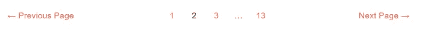
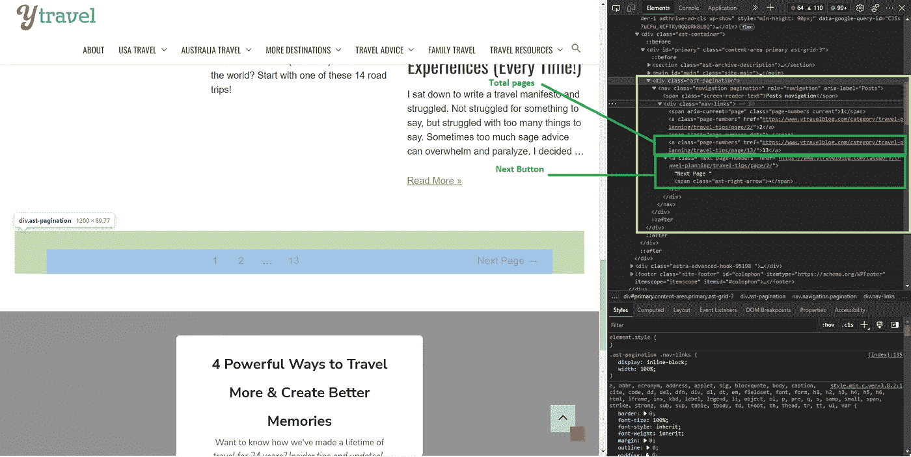
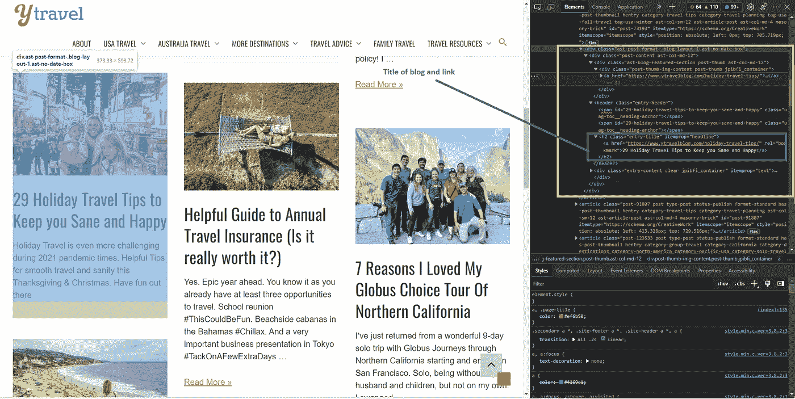
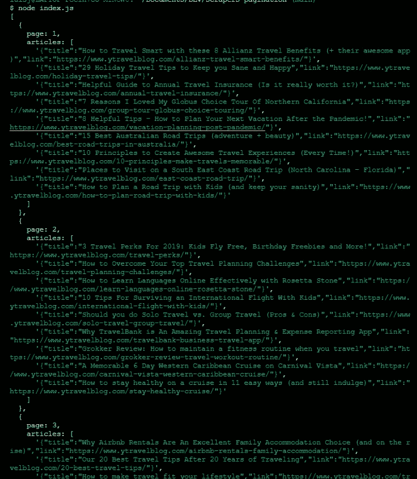

# 使用 JavaScript 和剧作家从带有分页的网站中抓取数据

> 原文：<https://javascript.plainenglish.io/scrape-data-from-a-website-with-pagination-using-javascript-playwright-14c46d9148dd?source=collection_archive---------5----------------------->

## 用传统分页解释

Photo by [Amari James](https://unsplash.com/@greaterbythehour2020?utm_source=medium&utm_medium=referral) on [Unsplash](https://unsplash.com/?utm_source=medium&utm_medium=referral)

分页内容无处不在。例如，如果你去一个电子商务网站，不是所有的产品都在同一个页面上，它们很可能分布在几个页面上。

分页是 web 开发中广泛使用的一种技术，它通过固定的空间大小或元素数量来组织内容。这是为了让用户的导航更加人性化。

有很多方法可以对网站的内容进行分页，这些方法对用户来说都是完美的。主要的方式有传统的上下一页按钮，无限滚动，和加载更多的按钮。

然而，网页抓取在一些网站上比其他网站更困难，这取决于它们的结构。

让我们来看一个带有分页的 web 抓取网站的例子。我们将使用剧作家[**开发我们的脚本，这是一种测试现代 web 应用程序的新技术。**](https://playwright.dev/)

# 传统分页

传统的分页将内容分成 10 个、25 个、100 个或其他任意数量的结果。在清单的最后，它包含了一页一页向前和向后移动的链接。用户既可以使用这些链接，也可以使用 web 浏览器上的前进和后退按钮。

大多数网站，如报纸、在线商店、搜索引擎和论坛，都使用传统的分页系统。

# 刮削[y 行程](https://www.ytravelblog.com/)

假设在这个练习中，我们需要检索网站上发布的博客(标题和链接)。因此，我们必须通过分页来获取所有信息。

我们将处理这类帖子[旅游贴士——y 旅游博客](https://www.ytravelblog.com/category/travel-planning/travel-tips/)

我们要做的第一步是:

1-手动浏览网站，并确定使用了哪种类型的分页，以了解我们将如何进行练习。

2-找到分页元素并使用浏览器检查它。为了与分页进行交互，我们需要定位下一个按钮元素和总页数。

Step 2

3-我们定位想要从每个页面中提取的元素。在这种情况下，我们需要博客标题和链接。

Step 3

4 —是时候编码了

如果你仍然对网络抓取或者它是如何工作的有疑问，我推荐你看一看我的文章，在那里我解释了更多。

 [## 用 JavaScript 开发第一个 Web Scraper 需要知道什么

### 网页抓取快速入门指南

medium.com](https://medium.com/geekculture/what-you-need-to-know-to-develop-your-first-web-scraper-with-javascript-b3296b758258) 

在下面的脚本中，我们获取在每个页面上找到的每个博客的标题和链接，并将其作为 JSON 返回。对于分页，我们开发了两种简单的方法来实现。

首先，我们需要知道需要点击和浏览的页面总数，或者，如果需要，根据总数只抓取一定数量的页面。

下面是练习的代码。我简要地评论了每个代码块的作用。执行代码只需要安装 [**剧作家**](https://playwright.dev/) 和`node fileName.js`。

如果我们需要的只是抓取我们找到的所有页面，在第二种形式中，我们不需要知道页面的总数，所以我们只循环，直到我们不再找到页面上可见的“Next”按钮元素，这意味着没有更多的页面。

# 最终输出

Output JSON object

# 结论

我们已经看到了网站通过分页显示内容的最广为人知的方式。

在这种情况下，在分页中导航并不困难，但是我们可能会遇到其他类型的导航，我们需要做更多的工作来实现它。回顾 HTML 结构和内容加载是如何工作的是很重要的。

我希望这个练习能帮助你更好地了解如何抓取你的目标网站。

刮的开心！

**阅读更多关于网页抓取的信息:**

 [## 网页抓取:它是什么，它是用来做什么的？

### 了解网络搜集如何帮助您完成日常任务

medium.com](https://medium.com/codex/web-scraping-what-is-it-and-what-is-it-used-for-e5c04ac8191) 

请记住，在抓取之前，您必须考虑网站的服务条款和隐私政策。所以你要为此负责。

***想联系作者？*** *喜欢在* [*推特*](https://twitter.com/ljaviertovar) *上与世界各地的朋友联系。*

## 进一步阅读

 [## 克服开发者面临的 3 大网络抓取挑战

### 如何克服 3 个主要的网络抓取限制—动态网站、网站交互和指纹管理…

javascript.plainenglish.io](/overcoming-3-major-web-scraping-challenges-that-developers-face-1e664ffe4783)  [## 使用易于使用的浏览器扩展自动抓取网页

### 如何使用 Listly，一个初学者友好的无代码工具，轻松实现 web 抓取过程的自动化。

javascript.plainenglish.io](/automate-web-scraping-with-an-easy-to-use-browser-extension-cb6073f1e61d) 

*更多内容请看*[***plain English . io***](https://plainenglish.io/)*。报名参加我们的* [***免费周报***](http://newsletter.plainenglish.io/) *。关注我们关于*[***Twitter***](https://twitter.com/inPlainEngHQ)[***LinkedIn***](https://www.linkedin.com/company/inplainenglish/)*[***YouTube***](https://www.youtube.com/channel/UCtipWUghju290NWcn8jhyAw)*[***不和***](https://discord.gg/GtDtUAvyhW) *。***