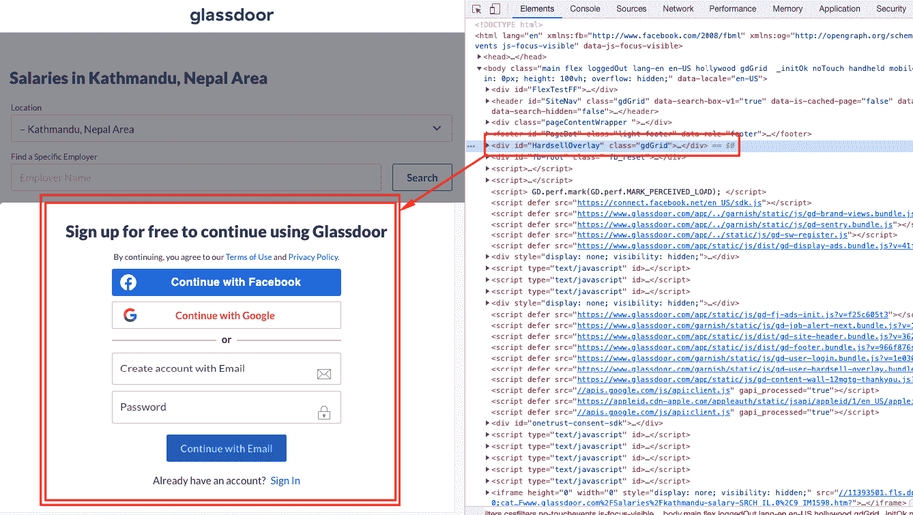
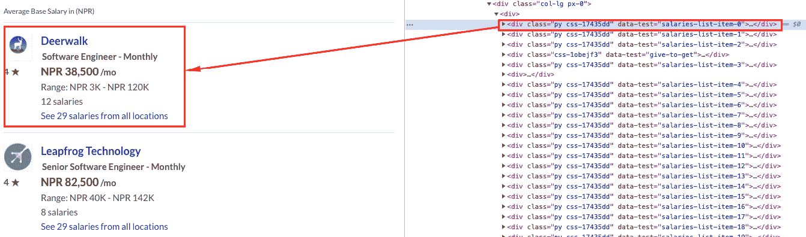
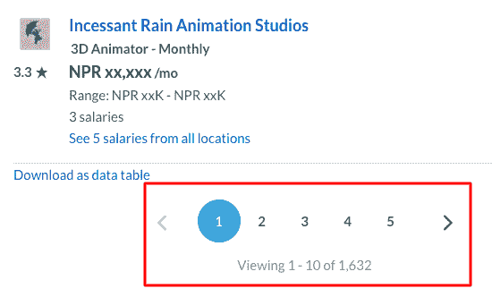
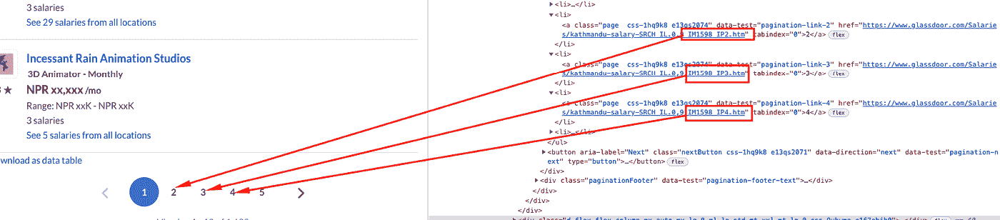

# 如何用 Node.js 抓取 Glassdoor 数据

> 原文：<https://javascript.plainenglish.io/scrape-glassdoor-data-with-nodejs-a16daa6fa3e9?source=collection_archive---------8----------------------->


Photo by [Markus Spiske](https://unsplash.com/@markusspiske?utm_source=unsplash&utm_medium=referral&utm_content=creditCopyText) on [Unsplash](https://unsplash.com/s/photos/database?utm_source=unsplash&utm_medium=referral&utm_content=creditCopyText)

有多种方法可以从网页上抓取数据。本文解释了一种使用 NodeJS 脚本从 Glassdoor 获取加德满都市工资数据的更智能的方法。首先，让我们看看我们将使用的工具。

[JSDOM](https://github.com/jsdom/jsdom)

*   它是 web 标准的 JavaScript 实现，用于 NodeJS。特别使用这个工具的原因是:同样的逻辑在浏览器的控制台和 NodeJS 上工作。没有必要学习额外的东西刮。就我个人而言，我尝试先从浏览器的控制台抓取数据，然后在 scraper 脚本中使用相同的代码。其他工具如 [cheer.io](https://cheerio.js.org/) 也可以作为替代。

[Axios](https://github.com/axios/axios)

*   它是 NodeJS 的 HTTP 客户端；用于获取网页的源(HTML)。

# 聪明的方法

在运行任何抓取任务之前，有必要分析页面的源代码；寻找让你的工作更容易的模式。抓取分页数据比抓取常规数据更麻烦。

在我们的例子中，我将使用这个([https://www . glass door . com/Salaries/Kathmandu-salary-SRCH _ il . 0，9_IM1598.htm](https://www.glassdoor.com/Salaries/kathmandu-salary-SRCH_IL.0,9_IM1598.htm) ) URL 来收集加德满都市的工资数据。

## 我们开始吧

浏览网址，你得到的第一件事是一个愚蠢的“注册”对话框覆盖所有数据。快速旋转开发者工具，转到 inspector，识别元素(`div#HardsellOverlay`)并将其移除。



Sign-up dialog covering data

现在数据是可见的，寻找有助于识别工资数据列表的模式。幸运的是我们有一个。所有数据都有属性`data-test=”salaries-list-item-XXX”`。



Pattern for salary data

进一步探索，我们可以看到每个数据项都有一个相似的模式，我们可以从浏览器控制台使用查询选择器简单地抓取它。将给定的代码复制粘贴到浏览器的控制台中。稍后在构建脚本时，我们将使用相同的代码。

```
// A page has 20 data
for (let i = 0; i <= 19; i++) {
	// all salary data are prefixed with 
	let attrPrefix = `salaries-list-item-${i}`; console.log("company name", document.querySelector(`[data-test='${attrPrefix}-employer-name'] a`).textContent); console.log("company logo", document.querySelector(`[data-test='${attrPrefix}-employer-url'] img`).src); console.log("job title", document.querySelector(`[data-test='${attrPrefix}-job-title']`).textContent); console.log("salary", document.querySelector(`[data-test='${attrPrefix}-salary-info'] h3`).textContent);
}
```

好了，现在我们有了数据，我们知道如何从 HTML 中抓取数据。我们接下来需要的是更多的数据。

当我们滚动到底部，我们看到一个分页。接下来要做的事情是:分页，然后从每个页面抓取数据。您可能已经注意到，每页有 20 个数据项。



Pagination. Also, note the total no. of items.

等等！也许有另一种模式可以让我们的任务更容易。随着我们深入研究，分页也有了一种模式。

从第二页开始，URL 的页码中混合了一些奇怪的值。此外，正如我们前面看到的，总共有 1632 个数据，每页 20 个。总共是 1632/20 = 82 页。



pattern in pagination

# NodeJS 脚本

既然我们已经找到了收集所有这些数据的方法，那么是时候编写一个 NodeJS 脚本来收集 Glassdoor 工资数据并将其保存到一个 JSON 文件中了。我们将在每页抓取完成后将数据写入文件`data.json`。原因:您可以在任何页面暂停和继续+您可以使用不同的页码范围并行运行脚本多次。

为了简单起见，我将脚本直接粘贴在这里，并附上解释性注释。

运行该脚本后，您将得到一个 data.json 文件，其中包含 Glassdoor 的加德满都市工资数据。类似地，你可以抓取任何其他城市的数据或工作列表上的数据。

> 重要信息:刮不一定是蛮力，总有聪明的方法来最小化工作量。

希望你喜欢这些内容。如果有任何问题，请随时指出。

*更多内容尽在* [***说白了. io***](https://plainenglish.io/) *。报名参加我们的* [***免费周报***](http://newsletter.plainenglish.io/) *。关注我们关于* [***推特***](https://twitter.com/inPlainEngHQ) *和*[***LinkedIn***](https://www.linkedin.com/company/inplainenglish/)*。加入我们的* [***社区不和谐***](https://discord.gg/GtDtUAvyhW) *。*