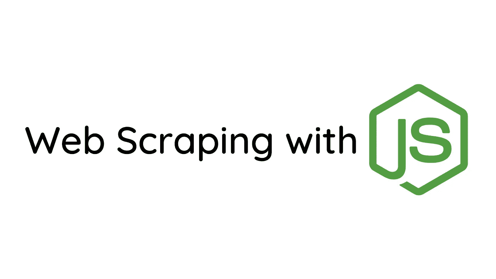
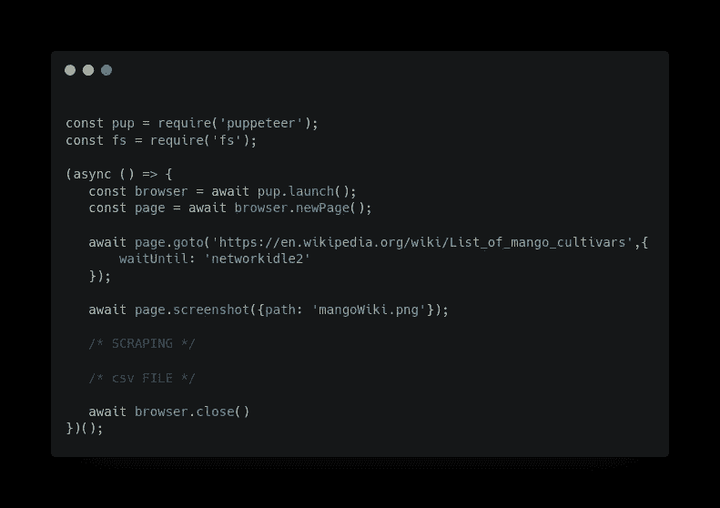
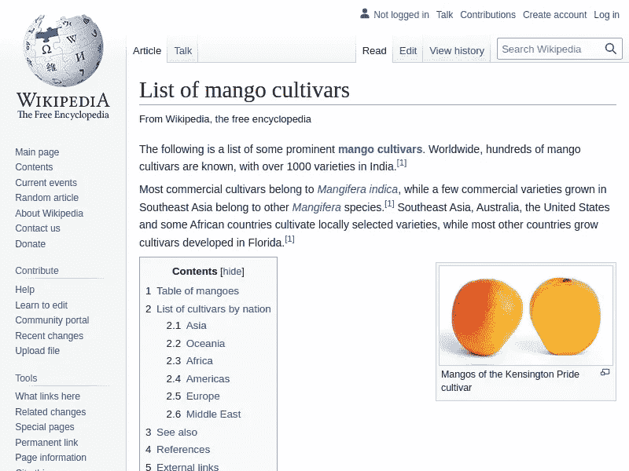
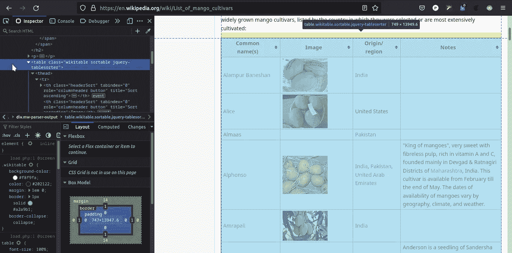
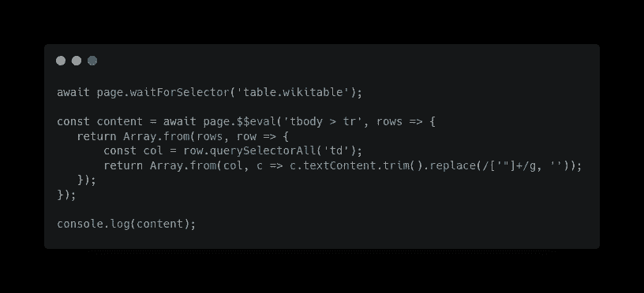
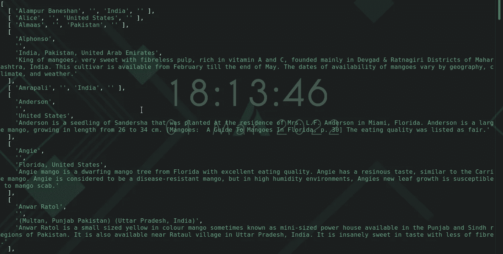
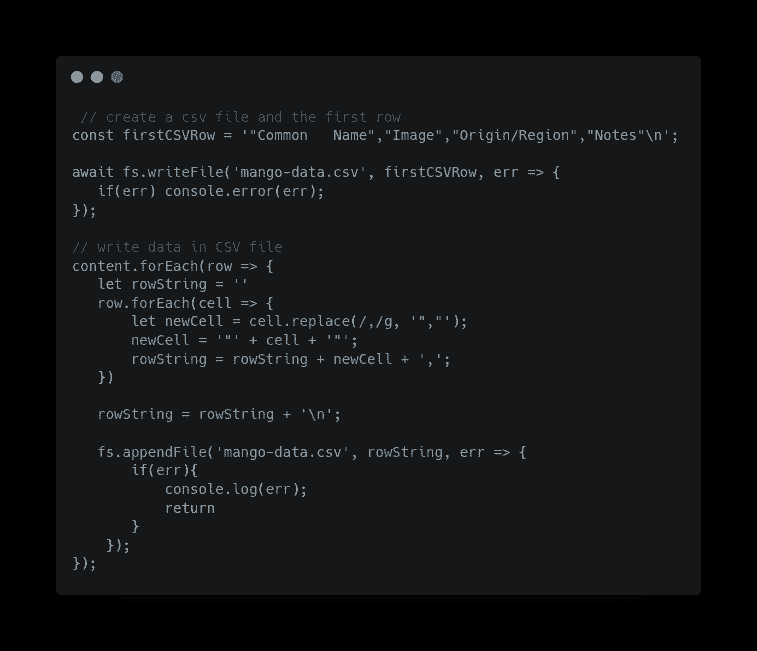

# 使用 Puppeteer 使用 Node.js 抓取维基百科页面

> 原文：<https://javascript.plainenglish.io/scraping-a-wikipedia-page-with-nodejs-261655790882?source=collection_archive---------2----------------------->

## 用 Node.js 废弃网页，并将废弃的数据导出到 CSV 文件中



网络抓取是一种从网站中提取数据的方法。网络抓取一般用于价格监测、市场调研、新闻监测等。

在本文中，我们将抓取维基百科页面中的一个表格，并生成一个包含该数据的 CSV 文件。

我喜欢芒果，我想知道并在 CSV 文件中记录所有不同种类的芒果。我们将使用`[puppeteer](https://www.npmjs.com/package/puppeteer)`来抓取维基页面。

`Puppeteer`是一个节点库，它提供了一个高级 API 来控制 Chrome 或 DevTools 协议上的 Chrome。

# 用 Node.js 抓取维基百科页面:

*确保您已经安装了节点和 NPM*

创建一个文件夹并初始化`npm`。

```
mkdir wiki-scrapernpm init -y
```

安装`puppeteer`

```
cd wiki-scrapernpm i puppeteer
```

创造`index.js`

```
Touch index.js
```

在您选择的代码编辑器中打开该文件夹。

## 使用 Puppeteer 开始使用 Node.js 进行 Web 抓取:

在`index.js`中，



index.js

这是`puppeteer`的基本设置。在这里，我们按顺序做以下事情:

*   创建浏览器实例
*   创建/打开新标签
*   导航到该 URL
*   捕获页面的屏幕截图
*   关闭浏览器。

它保存了我们提供的页面截图。



captured screenshot with puppeteer

# 从维基百科页面抓取芒果数据

为了抓取 mangoes 表，我们将找到特定表的 CSS 选择器。

为此，打开 Inspect developer 工具并查找表格。



Inspecting the wiki page of mangoes

然后在`index.js`，



index.js

在这里，我们是:

*   等待选择器`table.wikitable`加载。
*   创建一个包含所有行和列的 2D 数组。



scraping result

现在我们有了表格数据，让我们将 2D 数组转换成 CSV 文件。

# 使用抓取的数据生成 CSV 文件

CSV 文件有许多约定，但我们将使用以下约定:

1.  逗号`(,)`代表一个新列
2.  新行`(\n)`代表新的一行
3.  双引号`( “ ”)`代表一个单元格

有了这个，在`index.js`



creating a csv file of the scrapped content

我们到了:

*   创建 CSV 文件的第一行。
*   创建一个文件并将第一行写入文件。
*   迭代内容并根据上面提到的规则生成一个字符串。
*   迭代后，将生成的字符串追加到 CSV 文件中。

因此，我们在 CSV 文件中有芒果的类型！

本文中的代码可以在 [Github](https://github.com/S0npaRi11/wiki-scraper) 上获得。

链接到我的其他文章:

[](https://paragwebdev.medium.com/restful-api-with-express-and-nodejs-3aa2f2ab1d33) [## 带有 Express 和 NodeJS 的 RESTful API

### 使用 Express 和 NodeJS 构建 REST API。Nodejs 是一个 javascript 运行时，运行在 chrome 的 V8 引擎上，执行…

paragwebdev.medium.com](https://paragwebdev.medium.com/restful-api-with-express-and-nodejs-3aa2f2ab1d33) [](https://paragwebdev.medium.com/what-is-fetch-api-in-javascript-and-how-it-works-50ff57ca1240) [## JavaScript 中的 Fetch API 是什么，它是如何工作的

### JavaScript 的 Fetch API 是旧的 ajax 和 jQuery 的强大且易于使用的替代品。让我们看看如何使用它…

paragwebdev.medium.com](https://paragwebdev.medium.com/what-is-fetch-api-in-javascript-and-how-it-works-50ff57ca1240) 

## 进一步阅读

[](/automate-web-scraping-with-an-easy-to-use-browser-extension-cb6073f1e61d) [## 使用易于使用的浏览器扩展自动抓取网页

### 如何使用 Listly，一个初学者友好的无代码工具，轻松实现 web 抓取过程的自动化。

javascript.plainenglish.io](/automate-web-scraping-with-an-easy-to-use-browser-extension-cb6073f1e61d) 

*更多内容请看*[***plain English . io***](https://plainenglish.io/)*。报名参加我们的* [***免费周报***](http://newsletter.plainenglish.io/) *。关注我们关于*[***Twitter***](https://twitter.com/inPlainEngHQ)[***LinkedIn***](https://www.linkedin.com/company/inplainenglish/)*[***YouTube***](https://www.youtube.com/channel/UCtipWUghju290NWcn8jhyAw)*[***不和***](https://discord.gg/GtDtUAvyhW) *。***