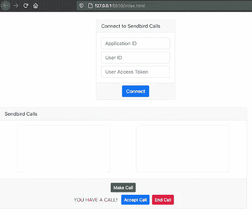
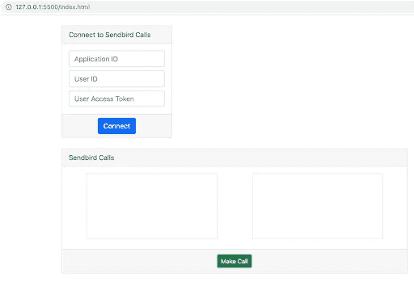
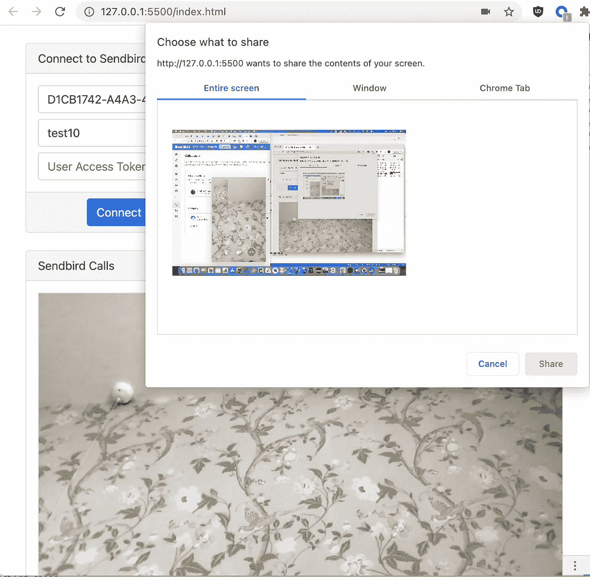

# 如何通过 Sendbird 呼叫将屏幕共享添加到您的 Web 应用程序

> 原文：<https://javascript.plainenglish.io/screen-sharing-javascript-b6339e9663c5?source=collection_archive---------10----------------------->

## 如何在您的 JavaScript 应用程序中实现屏幕共享功能的指南

由沃尔特·罗德里格斯
解决方案工程师| [Sendbird](https://www.sendbird.com)

*你可能想看看屏幕共享* [*样本代码*](https://github.com/sendbird/examples-calls-javascript) *。如果您需要更多指导，请查看我们的* [*文档*](https://sendbird.com/docs/calls/v1/javascript/guides/direct-call#2-screen-share) *。要了解更多关于 Sendbird 调用的信息，请参见* [*本页*](https://sendbird.com/features/voice-and-video) *。*

# 介绍

本教程假设您已经完成了本指南的第 1 部分[**。在第 2 部分中，我们将向您展示如何实现一个简单的屏幕共享功能。查看官方 Github 库**](https://sendbird.com/developer/tutorials/video-chat-javascript-app)中的 JavaScript Sendbird 调用屏幕共享示例。

# 第一步。修改用户界面

在这一步，我们将添加开始/停止屏幕共享按钮。

在您的 index.html 文件中，添加一个屏幕共享和停止共享按钮，与第 1 部分中的拨打电话按钮在同一个`div`中。

如果您在浏览器中运行该程序，您应该会看到如下内容:

Figure 1.1\. Video area with call buttons

现在让我们将额外的样式`style=”display:none”`应用到我们的共享屏幕，并停止共享按钮。我们只会在接通电话时显示这些内容。

如果刷新浏览器，您应该会看到类似这样的内容:

Figure 1.2\. Video area with a make call button

# 第二步。修改实现

让我们更新 index.js 文件中的`call.onEstablished`方法，以便在呼叫接通时显示屏幕共享按钮。

让我们也更新 index.js 文件中的`call.onEnded`方法，以便在呼叫断开时隐藏屏幕共享按钮。

# 第三步。共享您的屏幕

一旦您有正在进行的通话，您就可以开始共享您的屏幕。为此，让我们在 index.js 中实现一个新函数。

# 第四步。检查有效的当前呼叫

可选地，我们放大我们的视频元素。我们将它的宽度从 300 像素增加到 800 像素。
`await currentCall.startScreenShare()`替我们做所有的内部工作。这是一个 Sendbird 函数。

一旦我们从 Sendbird 调用了屏幕共享函数，我们就为远程用户何时停止它设置了一个监听器。这个函数的逻辑是缩小视频元素的尺寸(回到 300 像素)并隐藏停止共享屏幕按钮。

Figure 2\. Browsers internally will ask for which monitor you want to share.

让我们应用停止屏幕共享的逻辑:

# 结论

祝贺您完成本教程！在第 1 部分中，我们实现了打电话的功能，现在在第 2 部分中，我们添加了共享屏幕的功能。

现在，您已经准备好让用户在您的 web 应用程序中进行更高效的一对一交流了！

继续在你的应用中建立美好的联系！✌️

*更多内容请看*[***plain English . io***](https://plainenglish.io/)*。报名参加我们的* [***免费周报***](http://newsletter.plainenglish.io/) *。关注我们关于*[***Twitter***](https://twitter.com/inPlainEngHQ)*和*[***LinkedIn***](https://www.linkedin.com/company/inplainenglish/)*。加入我们的* [***社区不和谐***](https://discord.gg/GtDtUAvyhW) *。*