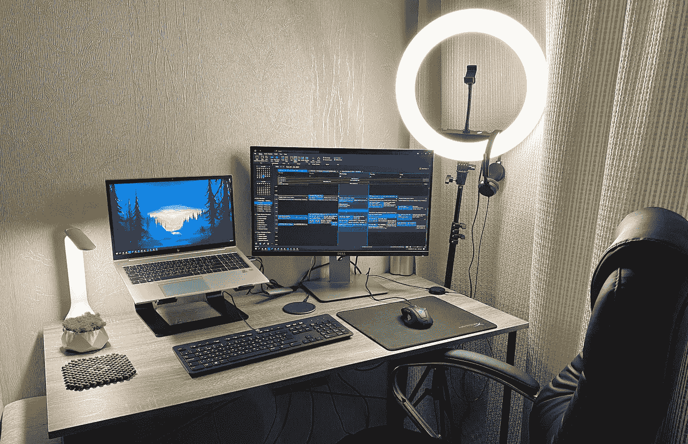

# 安全高效的编程和写作环境

> 原文：<https://javascript.plainenglish.io/secure-and-productive-environment-for-programming-and-writing-2dbb182e8603?source=collection_archive---------8----------------------->

## 日常生活中我最喜欢在 Windows 和 Mac 上运行的应用程序

One of my laptops 👨‍💻

白天，我在一家外包公司做软件工程师，在一台企业 Windows 机器上工作。然而，到了晚上，我就变成了一个单独的开发者，用一台个人的 M1 MacBook Pro 在媒体上做我的 methodist.io 和写作。这是我在日常生活中使用的操作系统的软件环境。

让我们从基本应用程序开始。

# 浏览器——谷歌浏览器

是啊，我知道。你会说是间谍利用我的个人数据做广告和谷歌产品。但是与替代品相比，Chrome 将它们远远甩在后面。

Brave browser 速度很快，但我的设备之间的同步一直存在问题。它没有自己的密码管理器。在 iPhone 上，它使用 Apple 钥匙圈)。我不会说我喜欢那个不能从工具栏中移除的橙色按钮。

Safari 有很多浏览器特有的问题，对我这个程序员来说，在这个浏览器中调试简直是地狱。我甚至写了一篇文章说 [Safari 是第二个 IE](/safari-has-become-the-second-internet-explorer-e2c2dd114837) 。

 [## Safari 已经成为第二个互联网浏览器

### 最快浏览器的缺陷

javascript.plainenglish.io](/safari-has-become-the-second-internet-explorer-e2c2dd114837) 

Firefox 是安全的、稳定的，并且有一个优秀的设计！我甚至想用它。但是太慢了。Chrome 的 V8 (JavaScript 引擎)棒极了。这是一个跨越技术的蒙娜丽莎！搭载 V8 引擎的 Chrome 比 Firefox 快 35%。所以对我来说，这是有价值的。

**谷歌浏览器是当今程序员和普通用户的最佳浏览器。**不过，如果你这么在意自己的隐私，可以尝试构建 Chromium。这是一个开源版本的 Chrome 浏览器，没有谷歌服务。

# 密码管理器— Bitwarden

谷歌 Chrome 有一个集成的密码管理器，但它很少向我建议在注册时生成随机密码。我希望你知道你必须在不同的网站上使用不同的密码。

但是用 Chrome 的密码管理器做这件事需要太多的动作，尤其是你在 Chrome 之外做注册的话。要解决密码的所有问题，你需要一个密码管理器。而且 Bitwarden 很棒！

它是免费的，支持所有流行的操作系统。在 iPhone 上，用 Bitwarden 替换默认的钥匙串是如此容易，所以它会像原生管理器一样提议粘贴你的凭据。

1password 或 LastPass 可能也不错，但我没试过。

# 笔记应用——苹果笔记

苹果笔记在苹果设备上运行速度非常快，拥有满足我需求的所有必要功能。如果它能在 Windows 上工作，我会完全切换到苹果笔记应用程序。但是现在，除了我朝九晚五的工作，我用它做任何事情。在公司的机器上，我使用微软的 OneNote。对我来说，拥有快速笔记应用程序至关重要。因为通常，我会打开一会儿，添加或编辑一些信息，然后关闭。
我尝试了一下 ideal，但是发布时间对我来说太慢了。即使你在某个笔记上打开了应用程序，5-6 小时后当你迫切需要这个笔记时，你会看到一个空白屏幕，并且需要一段时间来重新加载。
OneNote 至少可以快速打开，并且不会出现任何问题。

如果你能推荐类似 Apple Note 的东西，可以在 Windows，Mac 和 iOS 上工作，具有原生性能，我将不胜感激。大概苹果以后会做一个 Windows 的原生 app。

# 文本编辑器—升华文本+ VS 代码

关于什么是最好的代码编辑器/IDE 的讨论永无止境。我在公司笔记本电脑上使用 JetBrains WebStorm，在个人电脑上使用 VS Code。对我来说，VS 代码足以处理任何复杂的项目。我也有一个关于[我的 VS 代码](/how-to-switch-from-webstorm-to-vs-code-4e70c3025135)的插件和设置的故事。

 [## 如何从 WebStorm 切换到 VS 代码

### 提示、设置、插件、差异/合并工具等

javascript.plainenglish.io](/how-to-switch-from-webstorm-to-vs-code-4e70c3025135) 

令人惊讶的是， **VS 代码不仅是开发者的好选择，对于技术写作者**也是不错的选择。例如，我最近开始写我的第一本电子书。并发现这可能是一个单一的选择，在这里用 markdown 编写文本并突出代码块和语法是很舒服的。所以，我会单独写一个关于如何用 VS 代码写技术类电子书的故事。

但是为什么我需要崇高的文本？

因为 Sublime Text 是最快的代码编辑器，有大量插件可以让它做你需要的任何事情。比 VS 代码快多了。这就是为什么我用它来查看和编辑单独的文件。

为了获得最佳体验，我创建了一个键盘快捷键来启动 Sublime，并在 Finder 中选择了一个文件。

**在 Mac OS 的 Sublime Text Automator 操作中打开:**

*   开放式自动机
*   快动的
*   在任何应用程序中将“服务接收选定内容”设定为文件或文件夹
*   添加运行外壳脚本操作
*   将脚本操作设定为/Applications/Sublime \ Text.app/Contents/SharedSupport/bin/subl-n“$ @”
*   将“传递输入”设置为参数
*   另存为“在崇高文本中打开”

**自动机操作的键盘快捷键**

您可以分配一个全局快捷方式来运行我们刚刚创建的服务

*   打开“系统偏好设置”
*   选择“键盘”,然后选择“快捷键”选项卡
*   在左侧窗格中，单击“服务”
*   在右窗格中，滚动到“文件和文件夹”
*   选择“在崇高文本中打开”，然后单击“添加快捷方式”
*   选择快捷方式

在 Windows 上，我右击上下文菜单打开 Sublime。

# 窗口管理器—矩形(仅限 Mac OS)

窗口管理器是一个帮助你管理窗口的程序。它提供了一种控制它们如何显示和行为的方法。

从零开始的 Windows 可以高效的处理 windows，但是 Mac OS 因为某些原因，错过了这个功能。所以你需要一个单独的 app，我推荐——Rectangle。

Rectangle 是一个窗口管理器，我已经用了几年了。它简单、轻量、快速。此外，我发现它非常稳定可靠。

我最喜欢矩形的一点是它的简约风格。没有花哨的图形或动画，只有简单明了的功能。它非常适合那些想要一个没有花里胡哨的实用窗口管理器的人。

# 我其余的日常应用

*   截图工具:Windows —默认，Mac OS — Monosnap
*   电子邮件客户端——MS Outlook(根据规定，我曾经使用它)
*   API 测试—邮递员
*   图片编辑—Pixlr.com
*   语法检查器—语法上
*   音乐— Spotify😊

就是这样。如果你有任何问题或建议，欢迎评论区。感谢您的阅读！

*更多内容看* [***说白了。报名参加我们的***](https://plainenglish.io/) **[***免费周报***](http://newsletter.plainenglish.io/) *。关注我们关于*[***Twitter***](https://twitter.com/inPlainEngHQ)*和*[***LinkedIn***](https://www.linkedin.com/company/inplainenglish/)*。加入我们的* [***社区***](https://discord.gg/GtDtUAvyhW) *。***