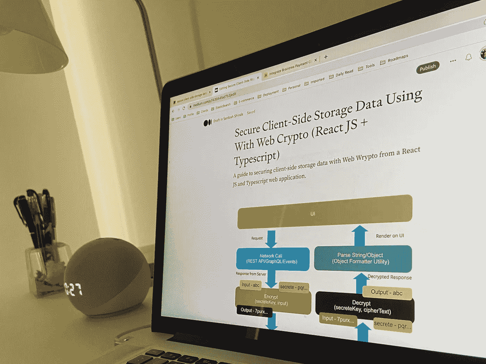

# 使用 Web Crypto 保护客户端存储数据(React + TypeScript)

> 原文：<https://javascript.plainenglish.io/secure-client-side-storage-data-using-with-web-crypto-react-js-typescript-f43944fad7b3?source=collection_archive---------4----------------------->

## 使用 React 和 TypeScript web 应用程序中的 Web Crypto 保护客户端存储数据的指南。

Secure Client-Side Storage

# 介绍

我正在处理一个需求，客户希望我创建一个可以长时间脱机工作的 web 应用程序。所以在本地存储/会话存储中存储这些敏感数据会让我的客户端面临风险，所以我决定使用 Web Crypto API。众所周知，浏览器存储多少才算安全？当然，在本地存储中存储数据有优点也有缺点，但是满足客户机的要求是很重要的。

如果您正在寻找客户端存储的介绍，请参见下面的文章。

 [## 面向初学者的客户端存储介绍

### 什么是客户端存储？客户端存储允许用户在客户端存储数据，并在需要时检索数据

javascript.plainenglish.io](/introduction-to-client-side-storage-31b103909fb9) 

## 什么是 Web 加密 API？

该规范概述了一个 JavaScript API，用于在 web 应用程序中执行基本的加密操作，如散列、签名生成、验证、加密和解密。

它还描述了应用程序生成和/或管理执行这些操作所需的密钥数据的 API。

[这个 API](https://www.w3.org/TR/WebCryptoAPI/) 可以用于各种目的，包括用户或服务认证、文档或代码签名，以及通信的机密性和完整性。

## **这个实现将如何工作？**

请参见附图，了解我们实现该功能的计划方法的可视化表示，并查看我已经编写的代码，请访问下面的 GitHub 库。

 [## GitHub-Santosh shinde 2012/React-Redux-typescript-boilerplate:React & Redux 应用程序的框架…

### 用 TypeScript 编写的 React & Redux 应用程序的框架(集成了 SASS、ESLint、Prettier 和 Husky) - GitHub …

github.com](https://github.com/santoshshinde2012/react-redux-typescript-boilerplate) 

Secure Client-Side Storage Workflow

## 加密步骤

> [什么是加密？](https://www.cloudflare.com/learning/ssl/what-is-encryption/)
> 加密是一种扰乱数据的方式，只有授权方才能理解信息。

1.  创造静脉注射和盐
2.  使用 PBKDF2 创建基于密码的密钥
3.  使用 PBKDF2 密钥和随机 salt 值创建 AES-GCM 密钥
4.  使用 AES-GCM 密钥和随机初始化向量(iv)加密输入数据。
5.  将加密字符串转换为缓冲区
6.  将随机 salt、随机化初始化向量(iv)和加密的字符串缓冲区连接起来
7.  对合并的缓冲区进行编码

Steps To Encrypt

## 解密的步骤

> 什么是解密？加密是一种扰乱数据的方法，只有被允许的人才能理解它。

1.  将输入密文转换到缓冲区
2.  从转换后的密文缓冲区中提取 IV、salt 和加密的缓冲区
3.  使用 PBKDF2 创建基于密码的密钥
4.  使用 PBKDF2 密钥和随机 salt 值创建 AES-GCM 密钥
5.  使用 AES-GCM 密钥和 ArrayBuffer 中的 iv 对输入数据进行解密。
6.  使用文本解码器解码解密的响应

Steps To Decrypt

## 实时场景

如果您浏览我们的[样板库](https://github.com/santoshshinde2012/react-redux-typescript-boilerplate)，您会看到我们有多种环境处理能力，允许我们在适当的环境文件中包含基于环境的配置。

对我们来说，我们需要下面的变量在我们的`[.](https://www.npmjs.com/package/braintree)env` 文件中

*   `REACT_APP_IS_OFFLINE` —我们可以用这个来决定是否需要使用离线存储。
*   `REACT_APP_APPLY_ENCRYPTION` —我们可以用这个来决定我们是否需要应用加密。
*   `REACT_APP_APPLY_SECRETE_KEY` —考虑加密和解密时，需要一个秘密密钥来生成基于密码的密钥派生密钥(PBKDF2)。

**场景 1**

让我们假设我们不想使用加密，但仍然希望将数据存储在本地。在这种情况下，数据将以键和值的格式存储，值以纯文本格式存储。

你可以在下图中清楚地看到这个场景，它可能会使我们的 web 应用程序变得脆弱。

**Scenario 1**

**场景 2**

为了避免上述情况，让我们假设我们将使用 web crypto 来加密和解密数据。这将使我们能够以密钥和值的格式存储数据，并以加密的格式存储值。

**Scenario 2**

## 源代码

Source Code

感谢阅读，请分享你的评论，如果这个博客增加了你的学习价值，请鼓掌。

*关注我上*[***Twitter***](https://twitter.com/shindesan2012)*和*[***LinkedIn***](https://www.linkedin.com/in/shindesantosh/)*。*

*更多内容请看*[***plain English . io***](https://plainenglish.io/)*。报名参加我们的* [***免费周报***](http://newsletter.plainenglish.io/) *。关注我们关于*[***Twitter***](https://twitter.com/inPlainEngHQ)[***LinkedIn***](https://www.linkedin.com/company/inplainenglish/)*[***YouTube***](https://www.youtube.com/channel/UCtipWUghju290NWcn8jhyAw)*[***不和***](https://discord.gg/GtDtUAvyhW) *。对增长黑客感兴趣？检查* [***电路***](https://circuit.ooo/) *。***