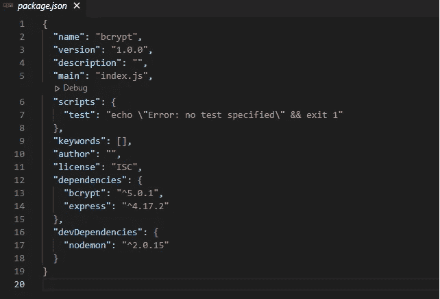

# 如何使用 Bcrypt 散列密码

> 原文：<https://javascript.plainenglish.io/securely-storing-passwords-using-bcrypt-30efea785728?source=collection_archive---------7----------------------->

## 使用 bcrypt 散列密码的教程。


用户认证可能是互联网上几乎所有网站和 web 应用程序中最关键的部分。对于许多开发人员来说，这也是应用程序开发中非常棘手和困难的部分——尤其是那些刚刚开始职业生涯的人。

它如此棘手的一个主要原因是密码需要正确处理和存储。在本文中，我将讨论一种相对简单的方法，使用名为 Bcrypt 的加密哈希库来加密密码。

本文是讨论用户认证的系列文章的第一部分。在下一篇文章中，我们将讨论如何生成一个访问令牌，它将允许用户进行身份验证，而不必在每次请求时使用用户名和密码登录。一定要在这篇文章之后找那篇文章。

## **什么是认证？**

在 web 开发中，身份验证是验证 web 用户身份的过程。通常，用户会使用他们的用户名或电子邮件地址和密码登录网站或 web 应用程序。这些信息被提交到后端服务器，如果用户提供的信息与数据库中存储的信息相匹配，那么用户就通过了身份验证，并被允许访问他们试图访问的内容。

重要的是要知道认证不同于授权。授权是在确定用户有权访问哪些资源(如网站上的特定文件或页面或数据库中的数据)的身份验证之后发生的过程。本文不关注授权，给出的例子将只关注身份验证。

就身份认证而言，有三种类型的信息可以用来验证用户的身份:

*   *您所知道的* —这是用于网站和应用程序的更传统的身份验证形式，通常由用户名和密码组合组成，必须正确提供这些信息才能验证用户的身份。如果用户知道正确的用户名和密码组合，他们将通过身份验证并被授予访问权限。这是本文将关注的认证形式。
*   *您拥有的东西* —可以是智能手机和/或移动应用程序、门禁卡、安全令牌或数字身份证。这种类型的身份验证稍微安全一点，尤其是当它与您所知道的信息相结合时(例如，在双因素身份验证中，用户必须提供用户名和密码，并提供一次性 pin 或通过智能手机上的应用程序授予访问权限)。
*   *你是谁* —这通常是最安全的身份认证类型，因为它依赖于生物数据，如指纹、视网膜扫描或面部识别。因为用户必须亲自到场才能验证他们的生物特征信息，所以这是最安全的验证形式。

现在我们对什么是身份验证以及应用程序中使用的不同类型的身份验证信息有了更好的了解，我们可以看看如何在 NodeJS 应用程序中实现一个简单的身份验证系统。如前所述，本文将关注*您所知道的*信息——在本例中，是用户名和密码。

## **哈希密码**

当用户在网站或应用程序上注册帐户时，他们的信息被存储在服务器上的数据库中，以便用户可以在将来返回并登录，并使用这些信息来访问网站或应用程序上受保护和安全的内容。因为信息存储在数据库中，所以我们要确保它不会被黑客攻击。

我们不想以明文字符串格式存储用户的密码，因为这样不太安全。如果有人恶意访问数据库，用户的密码就会泄露。此外，由于如此多的人在许多不同的服务和应用程序中使用相同的密码或相同密码的某种变体，如果密码落入黑客手中，它可能会使黑客能够访问用户在互联网上使用该密码的任何内容。

在构建我们的身份验证系统时，我们希望确保用户的密码在存储到数据库之前是加密的，并且我们不希望将用户密码的纯文本版本存储在我们的服务器或数据库中的任何地方，这样恶意的人就很难获得用户的密码。

确保用户密码安全地存储在我们的数据库中的最好方法是将其转换成一个不能转换回原始密码的字符串。这是一种被称为*哈希*的机制。

**什么是哈希？**

根据字典的解释，哈希的意思是把某物切成小块，然后把它弄乱，看起来像一团混乱。用计算机术语来说，散列数据本质上意味着将数据分割成小块，混在一起，并以随机顺序排列，使其不像原始数据。

哈希函数是一种数学加密算法，它接受任意大小的数据，并将其转换为固定大小的位串。最常见的用户密码哈希算法包括消息摘要(MDx)算法(如 MD5)和安全哈希算法(SHA )(包括广泛使用的 SHA-256 算法),尽管 SHA 算法不再被认为是安全的。

对密码进行哈希处理的主要好处是，哈希函数使得基于文本字符串计算哈希变得容易，但是几乎不可能反转哈希字符串或重新生成原始密码字符串。这意味着哈希函数倾向于单向加密，不能被“破解”或解密。此外，哈希函数还使得创建与输出的哈希字符串相匹配的初始输入值变得几乎不可能。这使得散列函数成为在我们的数据库中安全存储密码的非常实用和非常安全的方法。一旦字符串被散列，原始密码在服务器上就被完全忘记了，也不会存储在用户数据库的任何地方。

## **小变化产生大影响**

哈希函数是一种安全实用的密码存储方式的另一个原因是，输出的哈希字符串几乎是不可预测的。让我们看一个例子:

假设一个用户选择了*密码 123* 作为他们账户的密码。MD5 生成的散列字符串应该是这样的:*482 c 811 da 5d 5 B4 BC 6d 497 FFA 98491 e 38*。另一个用户选择 *password124* 作为他们的密码。如果运行同一个散列函数，这个字符串看起来会像这样:*e 28 a 09 Fe 9d 8 ded 87 ea 3a 909 FCC 35 cc 45。*

正如您所看到的，两个散列密码字符串非常不同，尽管明文密码字符串只有一个字符不同。安全哈希函数将用户的纯文本密码字符串与唯一的 *salt* 字符串结合起来，然后通过加密算法多次运行密码，以生成唯一的哈希。这意味着，即使 10 个用户拥有完全相同的密码，所有 10 个哈希看起来也会非常不同，因为每个哈希字符串都有一个唯一的 salt 字符串。这使得黑客更难破解，因为简单地破解一个密码不会让他们获得多个用户的信息，即使用户有相同的密码。

当在数据库中存储用户的散列时，我们将散列和 salt 字符串存储在一起，以便当用户稍后再次登录时，他们提供的密码可以与 salt 字符串结合，然后通过用户创建其帐户时使用的相同确定性散列函数来比较输入密码和存储散列的散列版本是否相同。

## **bcrypt 是什么？**

当谈到散列密码时，有许多不同的选项。您可以编写自己的依赖于加密算法的哈希函数，也可以选择使用第三方库来为您哈希密码。在本例中，我们将使用一个名为 bcrypt 的第三方库。bcrypt NPM 库是一个密码散列库，它具有生成 salt、散列密码和比较密码的所有必要步骤，以确保用户输入正确的凭证，所有这些都在一个包中。它非常常用，根据 NPM 的数据，每周有 10 万次下载。

## **让我们开始编码吧！**

为了更好地解释和演示 bcrypt 哈希库的概念和实现，让我们创建一个新的 Node/Express 服务器，并将 bcrypt 实现到一个实际用例中。

*本教程的所有最终代码都可以在我的 Github 上的* [*这个链接*](https://github.com/pjmcdermott92/bcrypt-tutorial-medium) *找到。*

*请注意:*为了跟随本教程，您需要在您的机器上安装并运行 npm，并且您需要了解如何使用 NodeJS 和 Express 创建 web 服务器。为了简化起见，在这种情况下，我们不打算连接数据库，而是将用户数据作为对象存储在常规的 JavaScript 数组中。

**步骤 1:初始化您的项目**

让我们用 NPM 初始化一个新项目。在您的终端中，导航到您想要用来构建这个项目的目录。在终端中键入以下命令，然后按 enter 键:

```
npm init -y
```

这个命令将使用所有默认选项初始化一个新的 npm 项目，并为您创建一个 *package.json* 文件。

**步骤 2:安装依赖关系**

为了快速构建我们的服务器，我们需要在项目中安装一些依赖库。我们将需要的库是 *express* 和 *bcrypt* 。我们可以在终端中使用以下命令安装这些库:

```
npm i --save express bcrypt
```

这些库可能需要一些时间来安装。一旦这些都完成了，我们还需要安装一个库来简化开发。这并不是项目运行的必要条件，但我更喜欢使用它，因为它会监视更改并自动为我们重启服务器，而不是每次更改后我们都必须停止并重启。我们将安装 *nodemon* 包作为开发依赖。我们可以使用以下命令来实现这一点:

```
npm i --D nodemon
```

**第三步:创建我们的脚本**

一旦 nodemon 完成安装，让我们在 IDE 编辑器中打开我们的项目。我更喜欢使用 VSCode，但是您可以使用任何您想使用的 IDE。项目打开后，让我们导航到 package.json 文件。该文件的内容应该如下所示:



Initial package.json file

在“脚本”部分，我们将删除测试脚本，因为我们不会使用它，并创建两个新脚本—一个用于在开发模式下运行我们的服务器，另一个用于在生产模式下运行我们的服务器。我们还将把脚本的主入口点改为 *server.js* ，而不是 *index.js* 。进行必要的编辑，确保您的 *package.json* 文件看起来像这样:


Updated package.json file

**第四步:创建我们的 server.js 文件**

接下来，我们将创建我们的 *server.js* 文件，并设置我们的基本 express 服务器。如果您以前使用过 Node 和 Express，您应该对此很熟悉。在项目的根目录下，创建一个名为 *server.js* 的新文件。在 IDE 中打开该文件，并键入以下内容来设置您的初始服务器:


Basic server.js setup

这段代码允许我们设置基本的 express 服务器，并告诉我们的机器在哪个端口上运行服务器。现在，如果您回到您的终端并键入以下命令，nodemon 应该会为您启动您的服务器:

```
npm run devStart
```

在您的终端中，您现在应该看到服务器正在运行，nodemon 正在观察变化。您还应该看到消息*“服务器在端口 3000 上运行…”*被注销:


如果您的控制台出现任何错误，请返回并确保您的 server.js 文件设置正确。

**步骤 5:创建用户数组和注册路径**

接下来，我们将创建一个允许我们创建新用户的路由。通常，我们会希望将这些信息存储在数据库中，以便在用户每次尝试登录时数据都可以持久化。然而，出于本教程的考虑，我们将使用一个变量来保存我们的用户数组。为了使用它，我们还需要将 bcrypt 库导入到我们的 *server.js* 文件中。更新您的 *server.js* 文件，如下所示:


Updated server.js file to include bcrypt and register route

为了总结这段代码做了什么，下面是一个分类:

*   我们将 bcrypt 库引入到服务器文件中。
*   我们创建了一个名为 Users 的空数组，用于存储新用户的凭证。
*   我们已经创建了一个 POST route，允许我们注册一个用户。我们从请求体中获取名称、用户名和密码。
*   在该路由内部，在我们创建新用户之后，我们将他们的信息推送到 Users 数组，并将状态发送回 201 的客户端，这意味着条目已成功创建。我们还以 json 格式将新的用户数据返回给客户机。

如果我们只是简单地运行我们的服务器，并试图传入用户的数据，我们将会遇到一个问题。为了解析来自请求体的名称、用户名和密码，我们需要告诉 express 使用内置的 json 解析器。为了更好地衡量，我们还将告诉 express 使用 *urlencoded* ()方法，并将*扩展*设置为*真*。除了 json 之外，这允许客户机将表单字段作为请求体的一部分提交。

将以下代码添加到您的 *server.js* 文件中，就在 Users 数组的下面:

```
app.use(express.json());
app.use(express.urlencoded({ extended: true });
```

新的 server.js 文件应该如下所示:


**第六步:测试我们的路线**

为了测试对新服务器的 HTTP 请求，我们需要某种 REST 客户机。因为我们所触及的端点是 POST 请求，所以我们不能简单地使用浏览器。有几个选项可以使用，但是最简单的是使用 Postman。如果您还没有它，请在此处[下载 Postman](https://www.postman.com/downloads/) [，然后继续本教程。](https://www.postman.com/downloads/)

要在 Postman 中发出请求，让我们创建一个新的 POST 请求，并在地址栏中键入*http://localhost:3000/register*。我们还需要导航到 *Headers* 选项卡并输入*Content-Type:application/JSON*header:


接下来，我们需要导航到 Body 选项卡，选择“raw”作为数据类型，并使用 json 添加我们的用户信息:


提交信息后，我们应该会在 Postman 应用程序的底部面板看到回复:


The response that is sent back from our sever

我们的请求得到了回应，这意味着到目前为止一切正常。但是，您会注意到返回的密码是我们在注册用户时提供的明文字符串。

这显然不是我们想要的，因为这不是非常安全的，并且使得任何能够访问数据库的人都很容易猜出用户的密码。

让我们通过在路由中实现 *bcrypt* 库来解决这个问题。

**步骤 7:用 bcrypt 散列用户密码**

Bcrypt 同步和异步工作。但是，由于密码散列是一项 CPU 密集型任务，因此异步使用 bcrypt 通常更好。为此，我们需要将 async 标志添加到路由回调函数的前面，并确保我们在存储用户数据之前等待来自哈希函数的响应。下面是我们的 server.js 文件中的 register route 的外观:


Updated ‘/register’ route in server.js

现在，如果我们再次运行注册用户函数，我们应该看到密码不再作为明文密码返回，而是一个随机的字符串。我们已经成功地对密码进行了哈希处理，并使用此哈希而不是密码将用户数据存储在 Users 变量中:


We now see the password returned as a hash string

**步骤 8:当用户登录时验证散列密码**

在最后一步中，我们成功地散列了用户的密码。在这一步中，我们将演示如何将纯文本密码与存储的密码哈希进行比较，以便对用户进行身份验证并确保他们输入了正确的信息。

这条路径编写起来稍微复杂一点，因为我们首先需要检查用户名是否存在于我们的数据库中(或者——在本例中——我们的 Users 数组中),然后我们需要将用户输入的密码与数组中存储的散列字符串进行比较。让我们写出 route 函数，然后我们将详细介绍函数中发生的情况:

将这个函数添加到您的 *server.js* 文件中，就在注册用户的 POST 函数下面:


Our new ‘/login’ route

以下是这条路线的详细情况:

*   客户端正在使用用户提供的用户名和密码发送 POST 请求。
*   Users.find()方法检查 Users 数组中指定的用户名。如果用户名在阵列中不存在，则返回状态 403: Forbidden，同时向客户端发送一条消息，表明凭据无效。
*   如果用户名确实存在于数组中，则调用 bcrypt 库中的 compare()方法。这个方法从 Users 数组中获取明文密码和散列密码字符串，bcrypt 将使用存储的散列中的 salt 字符串散列明文密码，以确保密码匹配。
*   如果密码不匹配，将向客户端返回一个 403 错误代码和一条消息，指示凭据无效。
*   如果用户提供了正确的用户名和密码组合，则向用户返回状态 200，以及用户信息和成功消息。

*请注意，无论用户输入的用户名或密码无效，我们都会返回相同的错误消息。我们没有指出哪个值是不正确的。这是在应用程序的身份验证过程中保护用户信息安全的另一种方式。如果恶意用户试图用彩虹表或其他暴力手段破解用户信息，我们不会给他们任何提示，告诉他们是否有任何正确的信息。*

**我们来测试一下吧！**

在向新创建的登录路由发送请求之前，我们首先必须重新注册用户。这是因为我们没有使用数据库，而是在内存中为我们的用户数组创建一个临时变量。在生产应用程序中，我们会希望使用某种数据库来保存用户数据，但是对于本例来说，这只是一个简单的解决方案。

回到 Postman，再次发送您的注册用户请求。确保返回状态代码 201 以及用户数据。

现在我们的数组中有了一个用户，让我们在 Postman 中创建新的请求。这一次，我们将为 [http://localhost:3000/login，](http://localhost:3000/login,)创建一个 POST 请求，我们只需要在请求体中提供用户名和密码。确保您在“raw”选项卡上，并从内容类型的下拉菜单中选择 JSON。

发送请求，您应该会看到响应代码 200，以及一条成功消息和用户信息:


We have successfully authenticated a user!

现在，尝试使用不同的密码和用户名再次发送请求。您应该会看到以下响应:


Incorrect passwords and invalid usernames return the same error.

使用 bcrypt 库，散列用户密码并将其安全地存储在数据库中确实非常简单。

## **结论**

在本文中，我们讨论了什么是密码哈希以及它为什么重要。我们还讨论了如何使用 bcrypt npm 包在将用户数据存储到服务器上的用户数据库之前对其进行哈希处理。本教程的最终代码可以在我的 Github [这里](https://github.com/pjmcdermott92/bcrypt-tutorial-medium)找到。

请务必订阅，以免错过任何帖子！在下一篇文章中，我们将看看另一个名为 jsonwebtoken 的 npm 包。Jsonwebtoken 是一个库，它允许我们向已经在我们的服务器上通过身份验证的客户机发出一个经过签名和验证的访问令牌。这个令牌允许用户访问服务器上的资源，而不需要为每个请求提供用户名和密码。一定要检查一下！

*更多内容看* [***说白了就是 io***](http://plainenglish.io/) *。报名参加我们的**[***免费周报***](http://newsletter.plainenglish.io/) *。在我们的* [***社区不和谐***](https://discord.gg/GtDtUAvyhW) *获得独家获取写作机会和建议。**