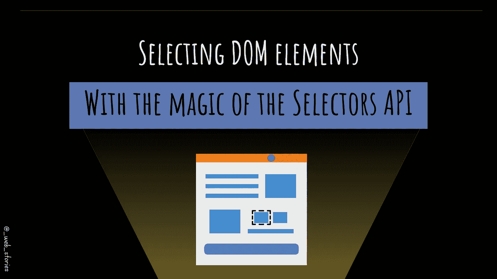

# 如何选择 DOM 元素

> 原文：<https://javascript.plainenglish.io/selecting-dom-elements-e33fb235e81d?source=collection_archive---------12----------------------->

## 借助选择器 API 的魔力



By FAM

## 你好👋

一旦加载到浏览器上，我们的 HTML 代码就变成了一个 DOM 对象。DOM 对象允许我们通过 JS 脚本选择网页内容。

DOM 非常有趣，因为你可以做一些神奇的事情，比如根据条件、点击或者任何你想做的事情来显示或者隐藏网页的一部分。

多亏了选择器 API，操纵 DOM(网页内容)的能力才成为可能。如果没有这些选择器，我们将使用 DOM `***document***` 对象来获取根节点并遍历整个树。想象一下，每次需要访问一个元素时都这样做。

令人欣慰的是，有选择器 API 使得检索 HTML 元素像小孩子的游戏。

使用最多的选择器有`***querySelectorAll***` 和`***querySelector***`。所以让我们把注意力集中在他们身上。

# 例子

假设我们想要选择 DOM 中的所有警告段落。假设每个警告段落都有一个类别**警告**。这里我们要使用`***querySelectorAll***`*`***document***`*对象。**

```
**const warningParagraph= document.***querySelectorAll***("p.warning");**
```

**如果您只想选择一个特定的元素呢？在这种情况下，我们需要用一个惟一的 ID 来标识这个元素。元素必须有一个`id`值，并使用它在 JS 脚本中用`***querySelector***` 选择它，如下所示:标识符**

```
**const identifierEl= document.***querySelector***("#identifier");**
```

*   ****如果没有元素与我们的选择器(** `**p.warning, #identifier**` **)对应，会发生什么？****

**在这种情况下，结果是`***null***`。**

## **💡其他非常公知的方法有:**

**`document.**getElementById**("idhere")`和`document.**getElementsByTagName**('div')`。请注意这些方法之间的差异。您不需要像添加`**querySelector**`那样添加标识符`#`的符号。**

**如你所见，你唯一需要的是知道如何选择 **HTML 元素。如果有 id，就在 id 后面加上`#`。如果是 CSS 类，那么后缀是`.`。在此了解更多关于 HTML 选择器的信息:****

**[](/selectors-from-basic-to-complex-4f4f48316731) [## 从基本到复杂的 HTML 选择器

### 选择 HTML 元素并设置样式

javascript.plainenglish.io](/selectors-from-basic-to-complex-4f4f48316731) 

下一篇文章将介绍如何使用这些选择器来操作 DOM😉！** 

**今天就到这里，看阿雅🙋**

**如果你有任何问题或反馈，请点击评论或通过 LinkedIn 联系我— **我洗耳恭听！****

**[**想请我喝杯咖啡吗？☕️**](https://www.buymeacoffee.com/fatimaamzil)**

> **让我们为 2022 年打造一个更好的‘我们’！**

## **了解有关 2022 年网络快车计划的更多信息:**

**I- [网络常识](https://medium.com/geekculture/2022-web-program-chapter-n-1-is-done-499fb0707220?source=your_stories_page----------------------------------------)**

**[II-网页框架:HTML](https://famzil.medium.com/your-html-essentials-69d9b2349355?source=your_stories_page----------------------------------------)**

**[III-网页样式:CSS](https://medium.com/geekculture/recap-of-the-css-chapter-ae388d51e564?source=your_stories_page----------------------------------------)**

**[IV-网络互动:JavaScript](https://levelup.gitconnected.com/congrats-to-js-chapter-finishers-e38a3ca1612c)**

## **虚拟物料清单和 DOM**

*   **[什么是 BOM 和 DOM](https://medium.com/geekculture/what-are-the-dom-and-bom-9fb1a3ed736f?source=your_stories_page-------------------------------------) ？**

> ****元素选择器****

*   **操纵 DOM**
*   **迭代节点列表**
*   **属性和样式操作**
*   **Ajax & Fetch**
*   **事件冒泡和委托**
*   **事件循环**
*   **阴影 DOM**
*   **蜜蜂**

**[](https://medium.com/geekculture/2022-web-program-is-launched-f38a3280af1a) [## 2022 网络计划启动！

### 改变来自心态和习惯

medium.com](https://medium.com/geekculture/2022-web-program-is-launched-f38a3280af1a) 

与想成为 web 开发人员的人分享该程序！这将有助于保持进步，并在旅途中互相帮助。

> 如果你喜欢我的文章， [**订阅**](https://famzil.medium.com/subscribe) 获取我的最新。如果你自己喜欢体验媒介，可以考虑通过[**注册会员**](https://famzil.medium.com/membership) 来支持我和其他成千上万的作家。它只需要每月 5 美元，它支持我们，作家，你也有机会用你的作品赚钱。当然，你可以随时取消会员资格。通过注册[这个链接](https://famzil.medium.com/membership)，你将直接用你的一部分费用来支持我，不会花你更多的钱。如果你这样做了，万分感谢！

让我们**联系上** [**中**](https://medium.com/@famzil/)**[**Linkedin**](https://www.linkedin.com/in/fatima-amzil-9031ba95/)**[**脸书**](https://www.facebook.com/The-Front-End-World)**[**insta gram**](https://www.instagram.com/the_frontend_world/)**[**YouTube**](https://www.youtube.com/channel/UCaxr-f9r6P1u7Y7SKFHi12g)**或**********

****[](https://famzil.medium.com/membership) [## 通过我的推荐链接——FAM 加入 Medium

### 作为一个媒体会员，你的会员费的一部分会给你阅读的作家，你可以完全接触到每一个故事…

famzil.medium.com](https://famzil.medium.com/membership) 

*更多内容请看*[***plain English . io***](https://plainenglish.io/)*。报名参加我们的* [***免费周报***](http://newsletter.plainenglish.io/) *。关注我们关于*[***Twitter***](https://twitter.com/inPlainEngHQ)*和*[***LinkedIn***](https://www.linkedin.com/company/inplainenglish/)*。查看我们的* [***社区不和谐***](https://discord.gg/GtDtUAvyhW) *加入我们的* [***人才集体***](https://inplainenglish.pallet.com/talent/welcome) *。*******