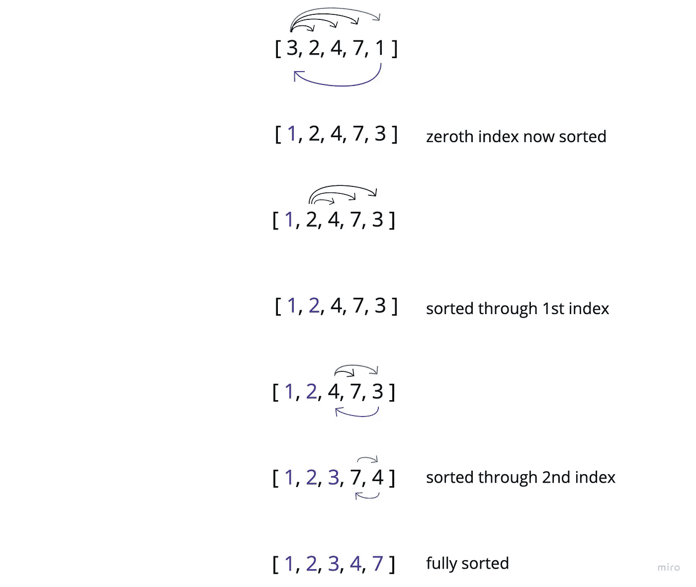

# 使用 JavaScript 进行选择排序

> 原文：<https://javascript.plainenglish.io/selection-sort-939850e195c8?source=collection_archive---------12----------------------->

## 如何用 JavaScript 执行选择排序

Photo by [Kelly Sikkema](https://unsplash.com/@kellysikkema?utm_source=medium&utm_medium=referral) on [Unsplash](https://unsplash.com?utm_source=medium&utm_medium=referral)

没错。

是时候使用另一种排序算法了。

这次让我们进行选择排序。

简而言之，选择排序是我们将访问每个值，然后将其与所有后续值进行比较，以找到最小的值。找到最小值后，我们就用当前值交换它。

如果我们对输入数组中的每个值重复这个过程，我们将得到一个排序的输出(升序)。

# 图示:

我将从插入排序的相同输入开始:

并从第零个索引开始。

这里有一个完整的演练:

这是一个简单的过程，实现起来很有趣。

# 代码

到目前为止，我已经发布了冒泡，插入和选择排序。我们将会看到我多快能开发出更令人兴奋/复杂的排序算法(归并排序、基数排序等等)。).

*更多内容请看*[***plain English . io***](https://plainenglish.io/)*。报名参加我们的* [***免费周报***](http://newsletter.plainenglish.io/) *。关注我们关于*[***Twitter***](https://twitter.com/inPlainEngHQ)[***LinkedIn***](https://www.linkedin.com/company/inplainenglish/)*[***YouTube***](https://www.youtube.com/channel/UCtipWUghju290NWcn8jhyAw)*[***不和***](https://discord.gg/GtDtUAvyhW) *。***