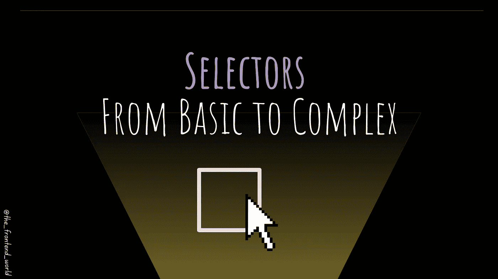
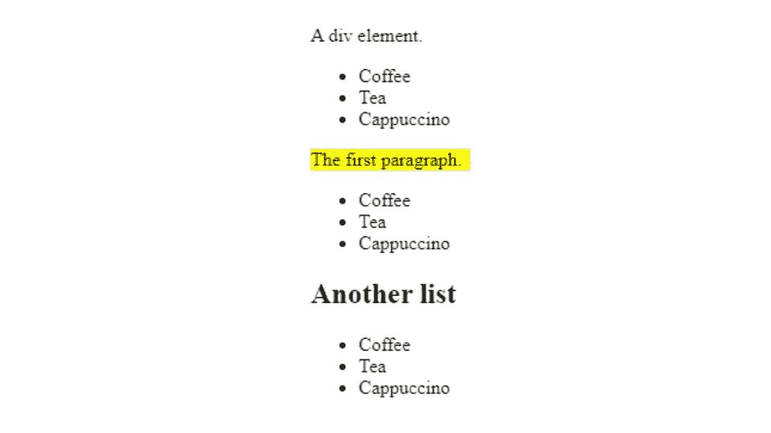
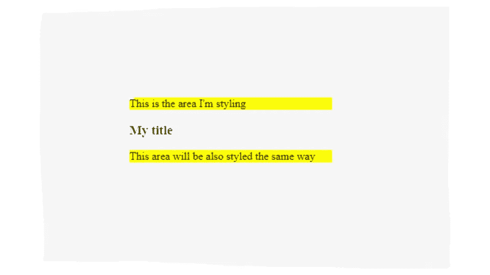
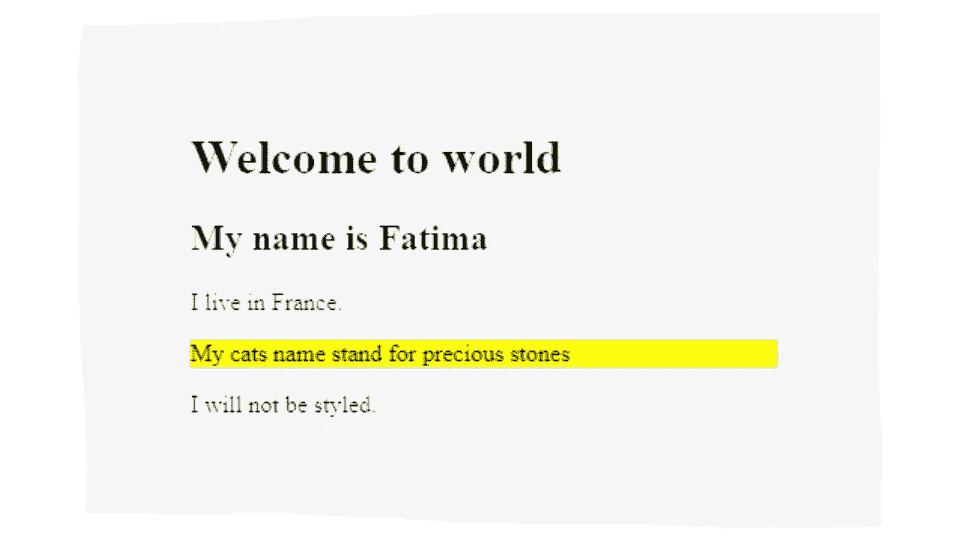

# 从基本到复杂的 HTML 选择器

> 原文：<https://javascript.plainenglish.io/selectors-from-basic-to-complex-4f4f48316731?source=collection_archive---------18----------------------->

## 选择 HTML 元素并设置样式

By FAM

你好。👋

上次你学习了 CSS 及其工作原理。现在，是采取行动的时候了。今天的商店是关于选择 HTML 元素和样式。

# 大局

首先，您需要知道选择器只是一个元素、id 或类，用于在 HTML 文档中选择元素。没什么复杂的。以下是一些例子:

`body`选择 HTML `body`元素

`.className`用`"className"`类(`class="className"`)选择所有元素

`#idName`选择带有`idName` id ( `id="idName"``)的元素

`*`选择所有 DOM 元素

现实生活中的用例并不总是简单的。有些时候，我们需要用许多标准和特征来选择一个特定的事物。这时我们就需要使用 CSS 组合子了。

# CSS 组合子

为了让你终身难忘，你可以把我看作是一个让你找到一个戴着黑色帽子、蓝色眼睛、红色夹克、黑色机器人的人的组合。

这正是 HTML 文档的情况。有时，我们希望根据状态、职位或其他基于客户需求的标准，给副标题涂上不同的颜色。

组合子帮助你在 CSS 简单选择器之间创建一个关系，这样你就可以在你的 HTML 文档中定位一个特定的元素。CSS 组合子主要有 4 种类型:

## 1.通用同级选择器(~)

常规同级选择器选择指定元素的所有后续同级。

以下示例选择作为`***
***`元素的下一个同级元素的所有`***
***`元素:

*   **结果**

## *2。子选择器(****>****)*

子选择器选择作为指定元素的子元素的所有元素。比如:

以下示例选择作为`***
***`元素子元素的所有`***
***`元素:

*   **结果**

## 3.后代选择器(空格)

后代选择器匹配作为指定元素后代的所有元素。比如:

以下 CSS 示例选择了`***
***`元素中的所有`***
***`元素:

## *4。相邻兄弟选择器(****+****)*

相邻同级选择器用于直接选择另一个特定元素之后的元素。

兄弟元素必须有相同的父元素，“相邻”意味着“紧随其后”

以下示例选择紧接在`***
***`元素之后的第一个`***
***`元素:

# 源代码

您可以在此找到所有代码示例:

 [## 2022-网络计划/第三章在主 fam zila/2022-网络计划

### 在 GitHub 上创建一个帐户，为 famzila/2022-WEB 程序开发做出贡献。

github.com](https://github.com/famzila/2022-WEB-PROGRAM/tree/main/Chapter3) 

玩弄它，试验它，打破它。😄我们都是这样开始的！

# 🛄外卖

*   主要有 4 种不同的关系可以链接两个 HTML 选择:*`**>**``**+**`和`**~**`。*
*   *你越需要在 HTML 文档中定位特定的元素，就越需要使用这些组合子。*

*今天就到这里，看阿雅🙋*

*如果你有任何问题或反馈，请点击评论或通过[LinkedIn](https://www.linkedin.com/in/fatima-amzil-9031ba95/)——**联系我，我洗耳恭听！***

*[**想给我买杯咖啡吗？☕️**](https://www.buymeacoffee.com/fatimaamzil)*

> *让我们为 2022 年打造一个更好的‘我们’！*

## *了解有关 2022 年网络快车计划的更多信息:*

*I- [通用网络知识](https://medium.com/geekculture/2022-web-program-chapter-n-1-is-done-499fb0707220?source=your_stories_page----------------------------------------)*

*[II-网页框架:HTML](https://famzil.medium.com/your-html-essentials-69d9b2349355?source=your_stories_page----------------------------------------)*

## *网页风格:CSS(当前章节)*

> ***选择器(从基本到复杂)***

*   *箱状模式*
*   *排印*
*   *….*

* [## 2022 网络计划启动！

### 改变来自心态和习惯

medium.com](https://medium.com/geekculture/2022-web-program-is-launched-f38a3280af1a) 

与想成为 web 开发人员的人分享该程序！这将有助于保持进步，并在旅途中互相帮助。

> 如果你喜欢我的文章， [**订阅**](https://famzil.medium.com/subscribe) 获取我的最新。如果你自己喜欢体验媒介，可以考虑通过[**注册会员**](https://famzil.medium.com/membership) 来支持我和其他成千上万的作家。它只需要每月 5 美元，它支持我们，作家，你也有机会用你的作品赚钱。当然，你可以随时取消会员资格。通过注册[这个链接](https://famzil.medium.com/membership)，你将直接用你的一部分费用来支持我，不会花你更多的钱。如果你这样做了，万分感谢！

让我们**联系上** [**中**](https://medium.com/@famzil/)**[**Linkedin**](https://www.linkedin.com/in/fatima-amzil-9031ba95/)**[**脸书**](https://www.facebook.com/The-Front-End-World)**[**insta gram**](https://www.instagram.com/the_frontend_world/)**[**YouTube**](https://www.youtube.com/channel/UCaxr-f9r6P1u7Y7SKFHi12g)**或**********

**** [## 通过我的推荐链接——FAM 加入 Medium

### 作为一个媒体会员，你的会员费的一部分会给你阅读的作家，你可以完全接触到每一个故事…

famzil.medium.com](https://famzil.medium.com/membership) 

*更多内容请看*[***plain English . io***](https://plainenglish.io/)*。报名参加我们的* [***免费周报***](http://newsletter.plainenglish.io/) *。关注我们关于*[***Twitter***](https://twitter.com/inPlainEngHQ)*和*[***LinkedIn***](https://www.linkedin.com/company/inplainenglish/)*。加入我们的* [***社区不和谐***](https://discord.gg/GtDtUAvyhW) *。******